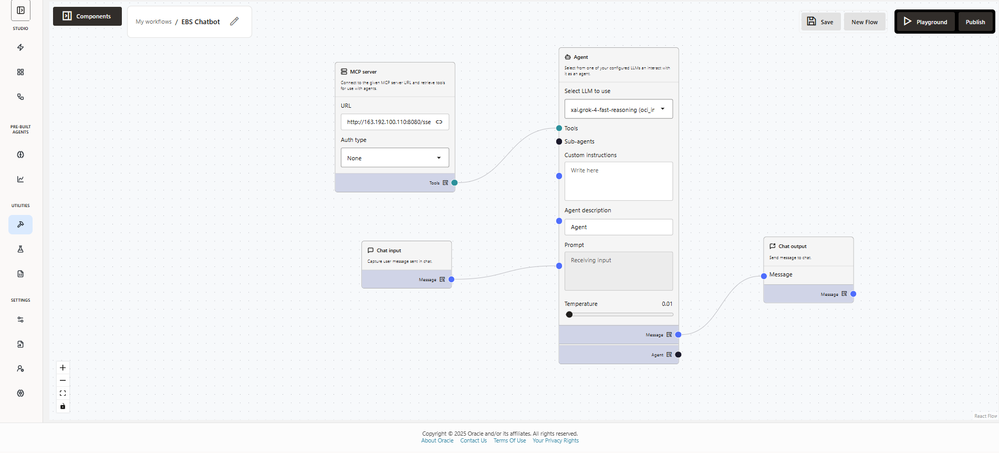
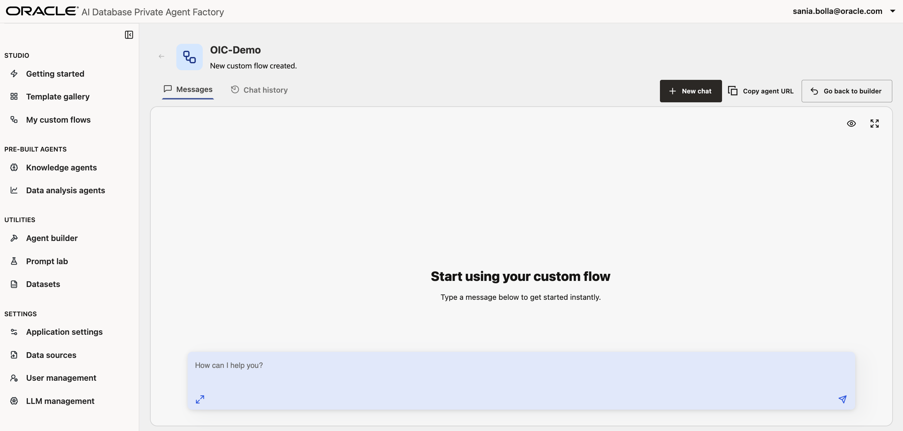

# EBS Database Agent: Analyze Business Data and AWR Reports

## Introduction

In this lab session, you will learn how to use the Agent Builder in Oracle AI Database Private Agent Factory to leverage SQLcl MCP server connected to an E-Business Suite Oracle Database to analyze business data and AWR Reports.

**Estimated time:** 10 minutes.

### Objectives

- Learn how to use Agent Builder to create custom agents
- Configure and use MCP node with SQLcl MCP server
- Customize agent system prompts for specific tasks
- Use Agent Factory Playground to test agent
- Publish custom agents for other users

### Prerequisites

* Oracle AI Database Private Agent Factory instance
* Basic familiarity with AI Agents
* Basic understanding of E-Business Suite Database and AWR Reports

## Task 1: Create a new agent in Agent Builder

** TAKE OUT LATER: Steps - assemble nodes, configure sqlcl mcp server, leave agent prompt empty, give it a title, save, playground, test by asking what tools are available

Navigate to the **Agent Builder** tab on the left-hand menu. <span style="color:red;">If there is already an agent configuration present from a previous lab, click **New Flow**.</span>


## Task 2: Customize agent for business questions

** TAKE OUT LATER: Steps - update agent prompt so it responds to business specific questions, try 2-3 sample questions

To assemble this custom agent in Private Agent Factory we will need our MCP server URL. This will be provided to you by instructors for the purpose of this lab.

#### Step 1. Add components to the canvas

1. To begin, find the **Chat input** node from the Components tool bar. Drag it onto the canvas, or simply click the + button.

2. Next, find the **Agent** component near the top of the menu. Drag that onto the canvas.

3. Find the **MCP Server** component. Drag that onto the canvas.

4. Find the **Chat output** node near the bottom of the menu, and drag it onto the canvas.


#### Step 2. Connect components

Drag the blue dot from the Chat input component to the Prompt field of the agent.

Then drag the Message blue dot on the Agent component to the Message dot on the Chat output component.

Lastly, drag the Tools light blue dot on the MCP Server component to the Tools dot on the Agent component.


#### Step 3. Fill out details on components

**3.1 MCP Server Component**

In the MCP Server component you will need to:
1. Paste in the provided MCP URL
2. Select Auth type to be **None**

**3.2 Agent Component**

1. In the Agent, for the "Select LLM to use" field select **xai.grok-4.reasoning**.


<span style="color:red;">Confirm that your agent looks like this:</span>




#### Step 4: Save the flow and test!
1. Click **Save** on the top right hand corner of your page.

2. **Then**, click **Playground**. You should see the following:



3. Add the following prompt:

    ```
    <copy>
    TODO
    </copy>
    ```


## Task 3: Customize agent for AWR Reports

** Steps - update agent prompt to analyze AWR reports, try 2-3 sample questions

Congratulations! You are ready to building agents of your own.

## Acknowledgements

**Authors** 

* Kumar Varun, Senior Principal Product Manager, Database Applied AI

**Last Updated Date** - March, 2026
