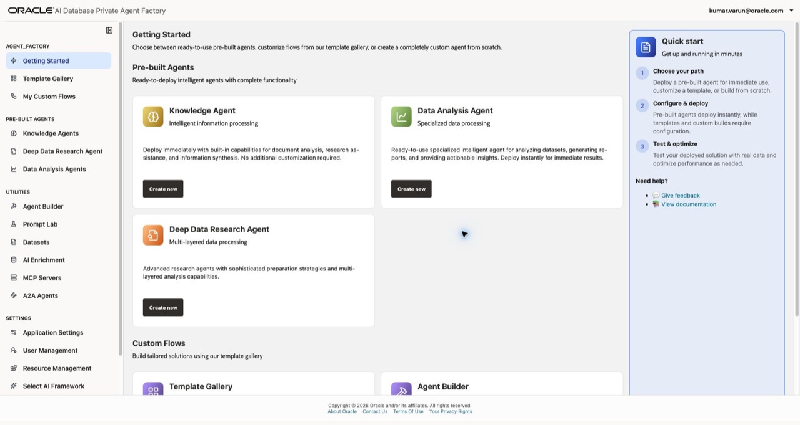
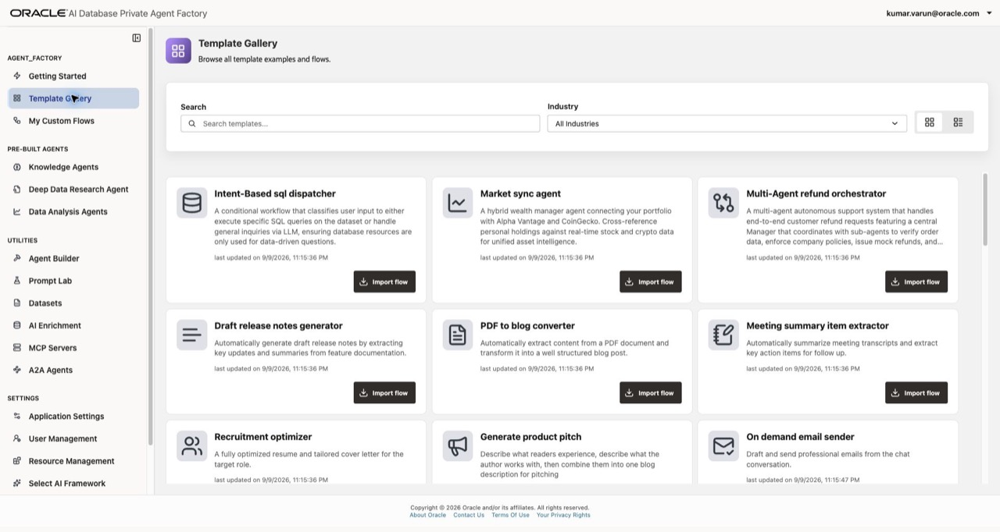
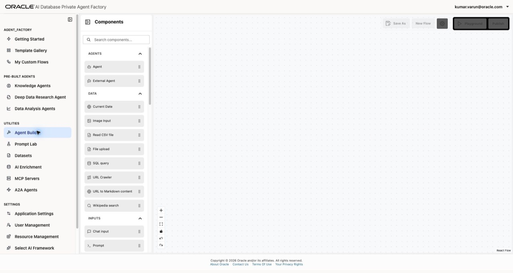
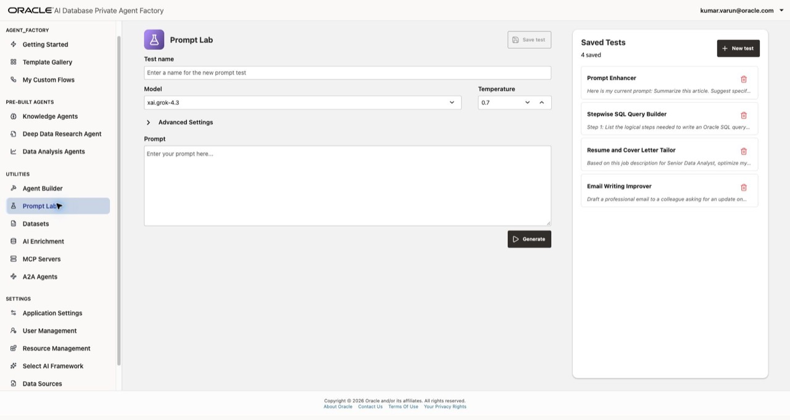
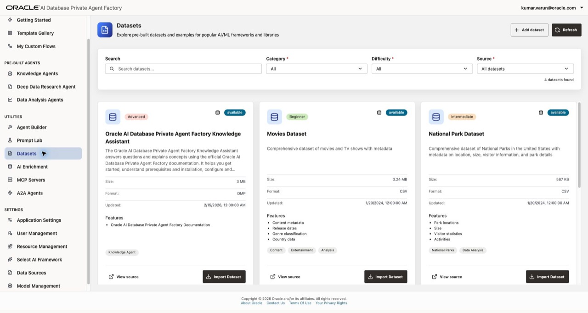
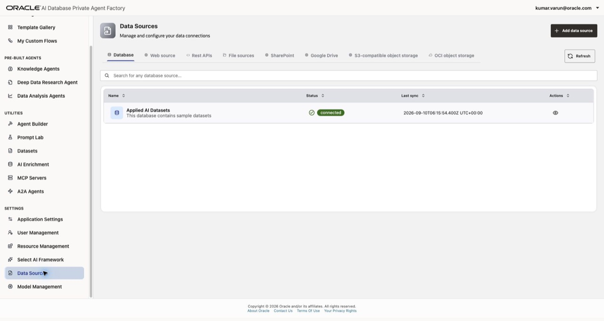
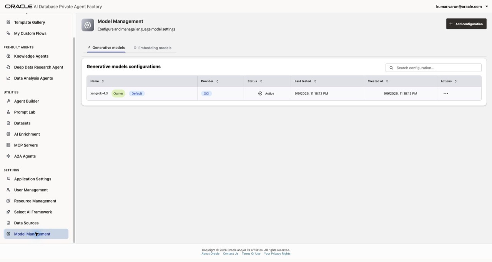

# Overview of Oracle AI Database Private Agent Factory

## Introduction

Oracle AI Database Private Agent Factory (Agent Factory) is a no-code platform for building, testing, and deploying AI agents and workflows. It brings together enterprise data, language models, and tools in a visual application. You can start with a specialized pre-built agent, adapt a reusable template, or design a custom flow with Agent Builder.

In this lab, you will explore the product using the workshop environment provided by your instructor. You will learn where to find the features used in the next labs and how data sources, models, and access controls support an agent.

Estimated Time: 15 minutes

### Objectives

In this lab, you will:

- Explain the purpose of Agent Factory and its three agent-building paths.
- Compare Knowledge, Data Analysis, and Deep Data Research agents.
- Explore the Template Gallery, My Custom Flows, and the visual Agent Builder.
- Locate utilities for prompts, datasets, data enrichment, and external tools and agents.
- Identify the pages for data sources, models, and access management.

### Prerequisites

- Access to the workshop's existing Agent Factory environment.
- The application URL and sign-in details supplied by your instructor.
- A learner account with permission to view the workshop features.

> **Note:** Menu visibility and available resources depend on your account's permissions. If a page is unavailable, review its description and screenshot with your instructor. This tour uses page navigation and inspection; agent creation begins in Lab 2.

## Task 1: Explore Getting Started

1. Open the Agent Factory URL supplied by your instructor and sign in with your workshop account.

2. Select **Getting Started** in the left navigation menu.

    

3. Review the three ways to build an agent. Scroll down to see the **Custom Flows** cards.

    | Path | Starting point | Typical use |
    | --- | --- | --- |
    | Pre-built agents | A specialized agent and your data | Answer document questions, analyze structured data, or research file content. |
    | Template Gallery | A reusable workflow | Adapt an existing pattern to your use case. |
    | Agent Builder | A visual canvas and reusable components | Design the steps, tools, and logic of your own workflow. |

4. Locate the four navigation groups: **AGENT_FACTORY**, **PRE-BUILT AGENTS**, **UTILITIES**, and **SETTINGS**. The first two groups help you find agents and flows. Utilities support building and testing. Settings contain shared data, models, and administration features.

5. Consider a document assistant: its data source supplies the reference material, a model interprets the question, and the agent retrieves relevant content to produce an answer. A custom workflow can add tools and routing when the task requires more steps.

## Task 2: Compare the pre-built agents

1. Under **PRE-BUILT AGENTS**, select **Knowledge Agents**. Locate **Create agent** and the agent search field. Your available agents appear here.

    A Knowledge Agent uses retrieval-augmented generation (RAG) to answer questions from selected knowledge sources. Its answers include citations so you can inspect the supporting content. In Lab 2, you will create one using a PDF.

2. Select **Data Analysis Agents**. This is the starting point for agents that answer questions about database tables and views. In Lab 2, you will use a sample dataset and examine generated SQL, tables, and visualizations.

3. Select **Deep Data Research Agents**. This agent type prepares a searchable knowledge base from file data sources and answers research questions with citations to retrieved documents.

4. Compare the agent types against these example questions.

    | Example question | Starting agent |
    | --- | --- |
    | What does this policy document say about eligibility? | Knowledge Agent |
    | How many titles were released each year in this dataset? | Data Analysis Agent |
    | What findings in this collection of research files address my question? | Deep Data Research Agent |

    An empty agent list is expected in a new learner account. You will create the Knowledge and Data Analysis agents in the next lab.

## Task 3: Explore templates and saved flows

1. Select **Template Gallery**. Review the template cards, search field, and **Industry** filter.

    

2. Locate **Market sync agent** and read its description. It combines portfolio questions with stock and cryptocurrency data tools. Lab 3 uses this template to introduce tool-connected custom flows. Leave the template in the gallery for now.

3. Review another template and identify its business task. Notice that **Import flow** is the entry point for adapting a template in Agent Builder.

4. Select **My Custom Flows**. This page lists flows you own and flows shared with you. Locate **Create flow**, **Agent Spec**, and **Import/Export**. These controls provide entry points for new flows and workflow exchange. Your list may be empty before you complete Lab 3.

## Task 4: Tour the visual Agent Builder

1. Select **Agent Builder** under **UTILITIES**. Locate the **Components** panel and the canvas. If the panel is collapsed, select **Components** to open it.

    

2. Review the component groups. Components provide different parts of a workflow:

    | Group | Examples | Purpose |
    | --- | --- | --- |
    | Agents | Agent, External Agent | Reason about a task or delegate work. |
    | Data | SQL query, File upload, URL Crawler | Bring data into a flow. |
    | Inputs | Chat input, Prompt | Accept a request and provide instructions. |
    | Language Model | LLM, Vision-language model (VLM) | Use text or image understanding. |
    | Outputs | Chat output | Return a result to the user. |
    | Processing | Condition, Parser, Text combiner | Route requests and transform intermediate results. |
    | Tools | Knowledge Agent, Data Analysis Agent, MCP server, REST API tools | Reuse specialized agents and callable tools. |

3. Use **Search components** to find **Prompt**, then clear the search. Inspect the component list without adding nodes to the canvas.

4. Locate **Save As**, **Playground**, and **Publish**. **Playground** is where you test a flow; **Publish** makes a completed flow available for use. Controls can be disabled on an empty canvas. Lab 3 walks through the components, testing, and publishing of an imported flow.

## Task 5: Review the supporting utilities

1. Select **Prompt Lab**. Locate the model selector, temperature, prompt field, **Generate**, and **Saved Tests**. This page lets you experiment with a prompt and inspect model responses before using the prompt in a workflow.

    

2. Select **Datasets**. Review the sample dataset cards, filters, and **Import Dataset** buttons. Each card describes its content and format. You will work with sample data in Lab 2.

    

3. Select **AI Enrichment**. This utility uses annotations to make database sources more understandable for AI. When database objects are available, you can select an object to inspect its details.

4. Select **MCP Servers**. Model Context Protocol (MCP) servers expose tools that agents can call. This page manages the server connections used by agents and flows. An empty list means no servers have been added for your account.

5. Select **A2A Agents**. Agent2Agent (A2A) supports collaboration with other agents. Review the **Agent Factory agents** and **External agents** tabs. The first lets you review which published agents are enabled for A2A clients; the second manages trusted remote agents.

## Task 6: Locate data, models, and access controls

Review these pages as a product tour. Use the workshop's supplied resources in the later labs.

1. Select **Data Sources** under **SETTINGS**. Review the source tabs, including **Database**, **Web source**, **Rest APIs**, and **File sources**. Additional tabs provide connectors for SharePoint, Google Drive, and object storage. The **Database** tab in the example contains **Applied AI Datasets**, the sample database used by Lab 2.

    

2. Select **Model Management**. Review the **Generative models** and **Embedding models** tabs. Generative models produce responses; embedding models represent content as vectors for retrieval. Model names and providers may differ in your workshop environment.

    

3. Locate the remaining settings pages and review their roles. Open pages that your learner account can view.

    | Page | Purpose |
    | --- | --- |
    | Application Settings | Application-wide preferences and controls. |
    | User Management | Administration of users, groups, and roles. |
    | Resource Management | Access levels for individual resources and shared resources. |
    | Select AI Framework | Management of Select AI components for a selected database. |

4. Return to **Getting Started**. Locate **View documentation** in the **Quick start** panel for the product guide.

## Summary

You have explored the main Agent Factory features and identified the pages used to build agents, reuse templates, test prompts, connect data and tools, and manage access.

Before continuing, confirm that you can locate:

- **Knowledge Agents** and **Data Analysis Agents** for Lab 2.
- **Template Gallery**, **Agent Builder**, and **Playground** for Lab 3.
- **Data Sources** and **Model Management** for the resources an agent uses.

You may now **proceed to Lab 2: Create Knowledge Agent (KA) and Data Analysis (DA) Agents**.

## Learn More

- [Introduction to Agent Factory](https://docs.oracle.com/en/database/oracle/agent-factory/26.7/paias/introduction.html)
- [Agent Factory User's Guide](https://docs.oracle.com/en/database/oracle/agent-factory/26.7/paias/)

## Acknowledgements

- **Author** - Kumar G. Varun, Lead PM, Oracle Database Applied AI
- **Last Updated By/Date** - Kumar G. Varun, October 7, 2026
