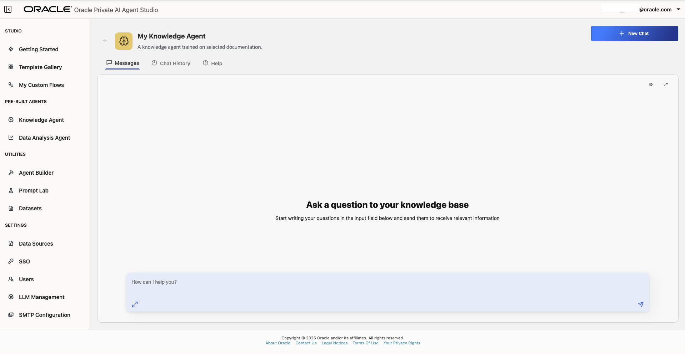

# Knowledge Agent: A Pre-Built RAG Agent

## Introduction

Agent Factory comes with ready-to-use agents called Pre-Built Agents: Knowledge Agent and Data Analytics Agent. <blurb about how they work>. You can quickly build your data specific agents by attaching relevant data in Agent Factory. Agent Factory also comes with pre-installed data sources for getting started quickly. In this lab, you'll learn how to create your custom agent using pre-built agents and data.

**Estimated time:** 10 minutes.

### Objectives

- Build and talk to Knowledge Agent using demo-dataset
- Build and talk to Data Analysis Agent using demo-dataset
- Build a custom knowledge agent using a new File Data Source

### Prerequisites

* You are logged-in to Agent Factory installed in previous lab as Admin or Editor
* Creativity

## Task 1: Understand Pre-Built Knowledge and Data Analysis Agents in Agent Factory

1. Knowledge Agents
A **Knowledge Agent** is an AI agent that augments Vector Search & LLM capabilities with enterprise data, enabling accurate, context-rich responses by retrieving relevant information from internal knowledge bases, documents, or web-sources. It is capable of contextual retrieval from unstructured sources and provides grounded responses traceable to enterprise-approved sources. The Knowledge Agent is integration-ready, allowing connections to internal sites, file systems, and more. It also supports un-authenticated web sources for broader knowledge retrieval.

2. Data Analysis Agent
A **Data Analysis Agent** is an AI agent that augments Vector Search & LLM capabilities with enterprise data, enabling accurate, context-rich responses by retrieving relevant information from internal knowledge bases, documents, or web-sources.

## Task 2: Create and talk to a Data Analysis Agent using Netflix dataset

1. use Netflix data 
2. Auto-analysis, few verified interesting prompts for users to try out

## Task 3: Create and talk to a Knowledge Agent for your own data

1. Add Data for your Knowledge Agent
2. Create Knowlege Agent for your Data

1. Open Oracle AI Database Private Agent Factory and log in. In the sidebar, click the **Knowledge Agent** section.

    

    

2. Click **Blank Knowledge Agent**.

    You will be prompted to select a data source. You can either choose to add a Web Source or a File System. For this tutorial we will use the Web Source one created on Lab 4. This data source will be knowledge base for this agent. Click **Next** to continue.

    

3. The Knowledge Base Configuration setup form will be displayed. Assign an agent name and description to easily identify the agent you are creating. Click **Next**, then **Publish Agent** to continue.

    

4. Wait a few moments while the agent is being published. After that you will be able to see it on the Knowledge Agent gallery.

Continuing from where the last task left off, click the recently created Knowledge Agent.

Here, you will be able to interact with the agent by asking questions and receiving grounded answers based on the ingested data from its knowledge base.

## Summary

This concludes the current module. You now know how to create Knowledge Agents with custom knowledge bases and interact with them to get grounded, specific information in an air-gapped environment. The next module will further explore other features of Oracle AI Database Private Agent Factory. Continue with them so you don't miss out on new discoveries and learning opportunities. You may now **proceed to the next lab**.

## Acknowledgements

- **Author** - Emilio Perez, Member of Technical Staff, Database Applied AI
- **Last Updated By/Date** - Emilio Perez - August 2025
