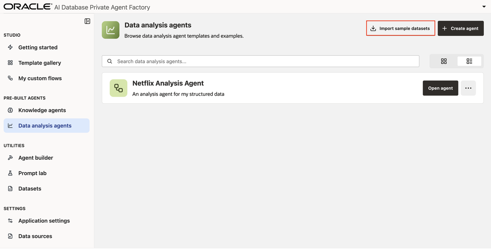
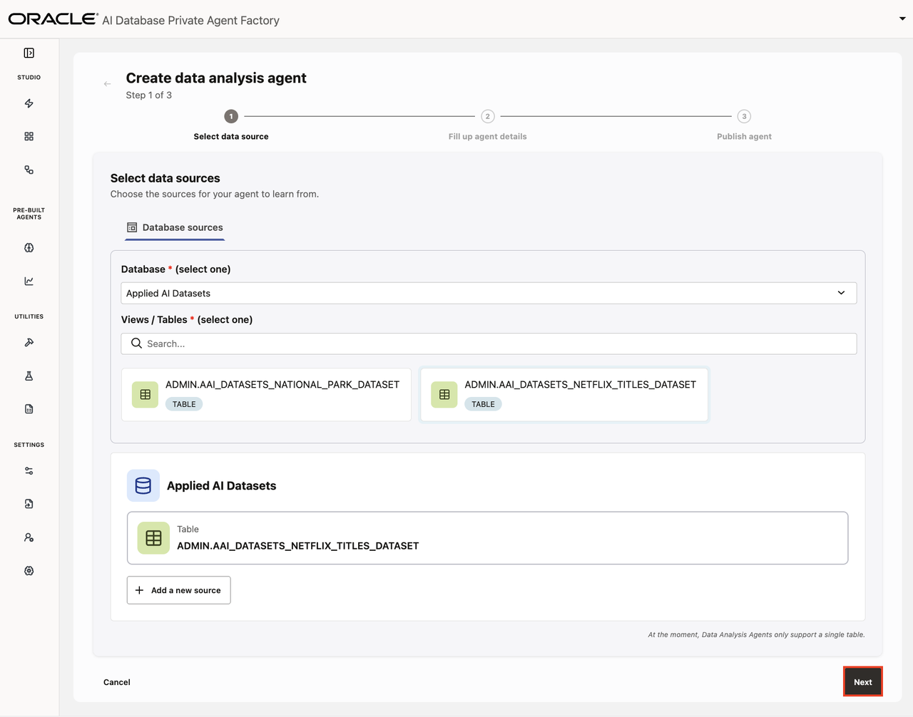
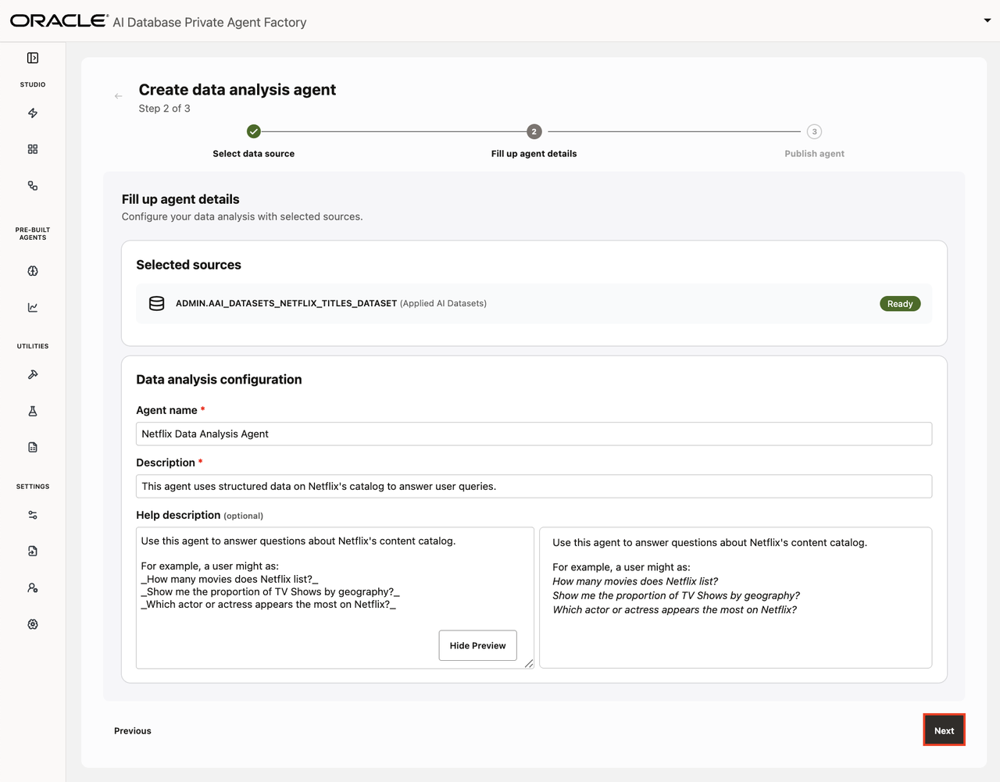
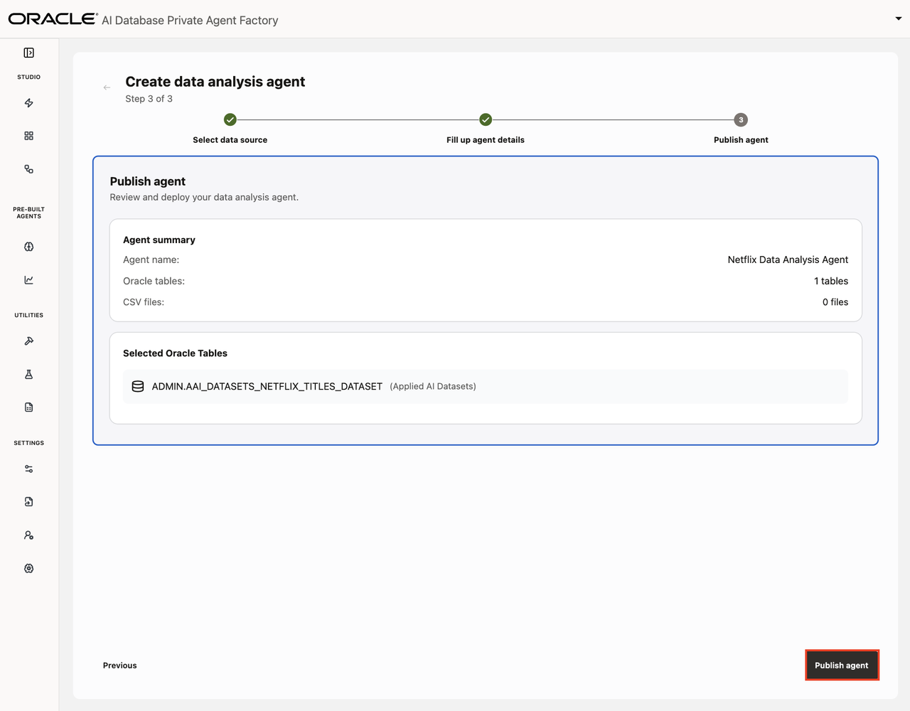
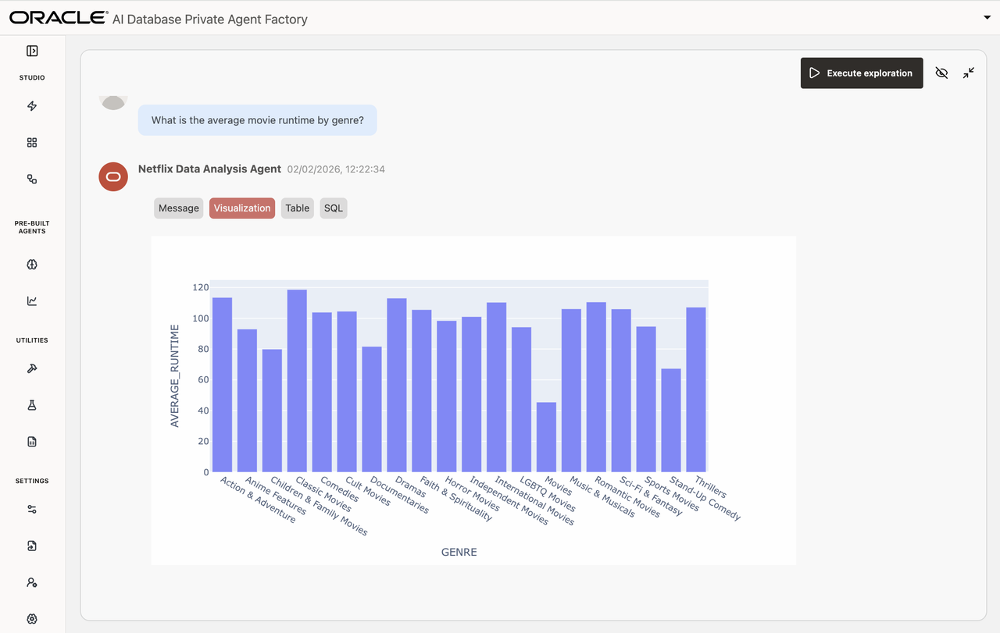
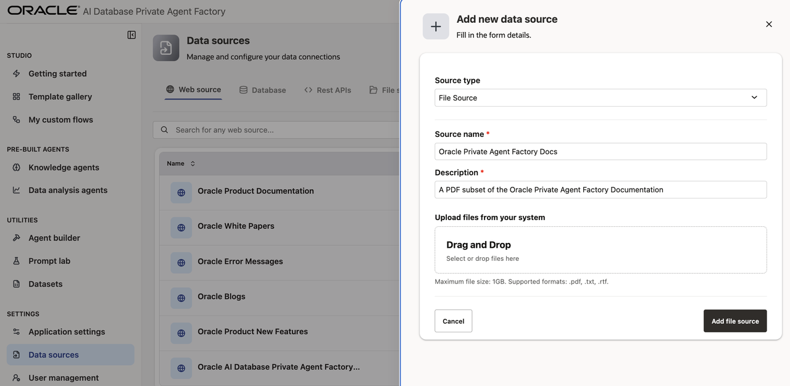
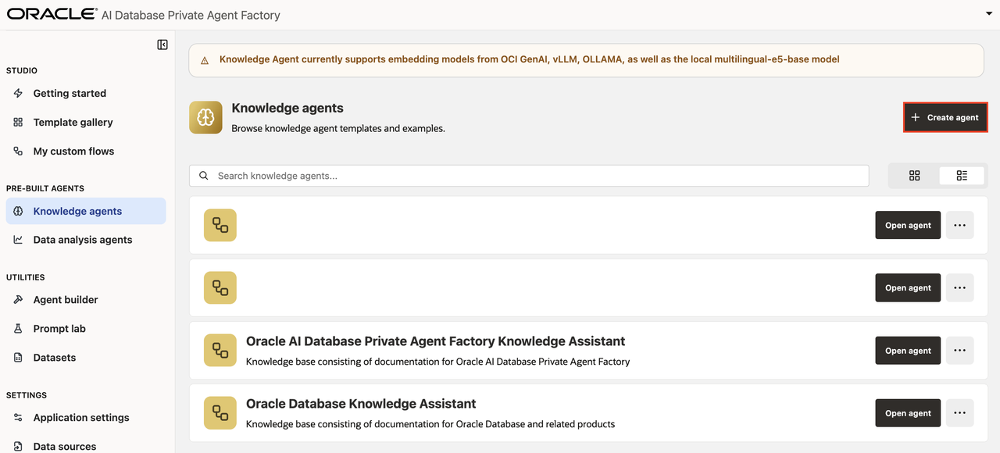
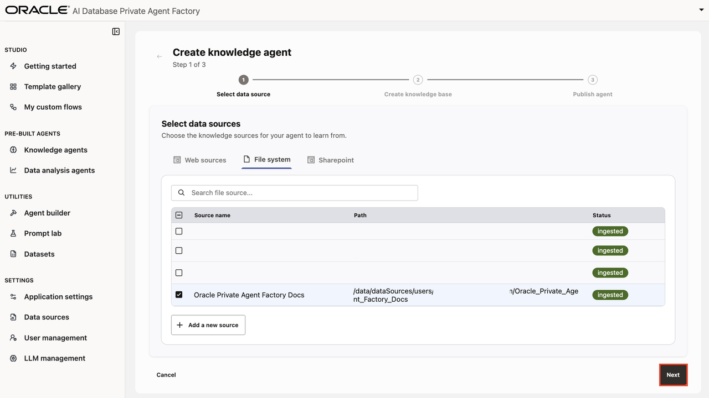
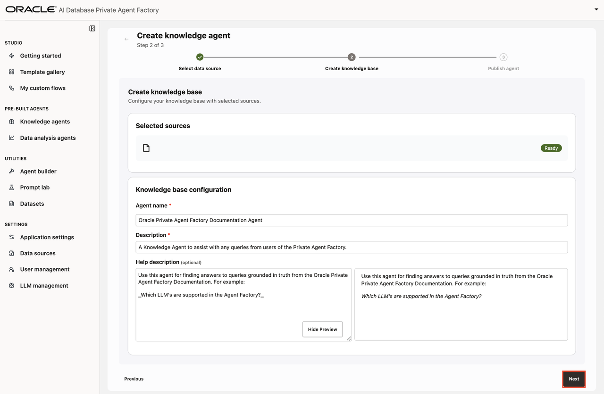
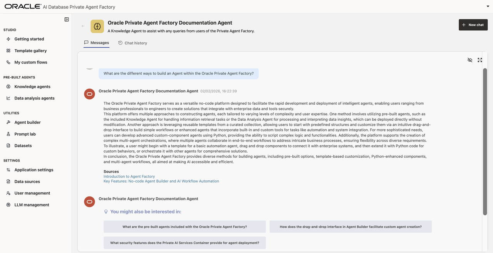

# Knowledge Agent: A Pre-Built RAG Agent

## Introduction

The Private Agent Factory comes with ready-to-use agents called Pre-Built Agents. This lab will explore two pre-built agents: the Knowledge Agent and the Data Analysis Agent. 

The Knowledge Agent is a super-powered RAG system that allows you to ask questions across your unstructured data (file systems, websites, internal documents). The Knowledge Agent will respond with a synthesized answer and citations pointing to relevant sections of your documents.

The Data Analysis Agent allows you to speak to your structured data. This agent will generate SQL queries, plots, tables, and natural language summaries of your data. It also offers an "exploration" mode, which will generate questions and answers on your data.

You can quickly build your data-defined agents by connecting your data to the Agent Factory. The Agent Factory comes with pre-installed data sources for getting started quickly. In this lab, you'll learn how to create your own custom agent using pre-built agents and data.

**Estimated time:** 15 minutes.

### Objectives

- Build and talk to Data Analysis Agent using the (provided) Netflix dataset
- Build and talk to a Knowledge Agent on your own PDF

### Prerequisites

* You are logged-in to the Agent Factory (installed in Lab 1: Install and Configure) as Admin or Editor
* (optional) A PDF to use with the Knowledge Agent

## Task 1: Create and talk to a Data Analysis Agent using Netflix dataset

1. Navigate to the **Data Analysis Agent** tab.
2. Click on **Import sample datasets** in the top right.

    

3. Find the dataset card titled **Netflix Titles Dataset** and click **import**.

4. Navigate back to the **Data Analysis Agent** tab. Then select **+ Create Agent** in the top right.

5. Select your preferred database and table. For this example, use the *Applied AI Datasets* database and the *ADMIN.AAI_DATASETS_NETFLIX_TITLES_DATASET* table. Then select **Next**.

    

6. Next configure your agent by providing a Name, Description, and a Help Description. *Note: the Help Description can be used for multi-agent orchestration at a later time.*

    

7. Publish your agent.

    

8. Navigate back the **Data Analysis Agent** tab, and select **Open Agent**. By default, this will launch an *Exploration*, wherein the agent explores the attached dataset, generates sample questions, and answers those questions with texts, visuals, and SQL queries.

    

9. You can also ask any question you like about the data. The agent will repsond with text, plots, and SQL.

    

10. Now you are ready to use the Data Analysis agent to speak with your structured data and automatically visualize insights. Continue on the Task 2 to learn how the Knowledge Agent can help you analyze unstructured data like PDFs.

## Task 2: Create and talk to a Knowledge Agent for your own data

1. Grab your favorite PDF. If you don't have one, you can go to the [Private Agent Factory Documentation](https://docs.oracle.com/en/database/oracle/agent-factory/25.3/paias/introduction.html), right-click on the page, select print, and then for *Destination* choose *Save to PDF*.

2. Navigate to the **Data sources** tab and click the **+ Add data source** button. For **Source type** select *File Source*. Set your title **Title**, e.g. *Oracle Private Agent Factory Docs*. Set your **Description**, e.g. *A PDF subset of the Oracle Private Agent Factory Documentation*. Finally, drag and drop the PDF from step 1.

    

3. Navigate to the **Knowledge agents** tab. Select **+ Create Agent** in the top right.

    

4. Select your data sources by navigating to **File system** and selecting the PDF you uploaded in step 2 (e.g. Oracle Private Agent Factory Docs). Then select **Next**.
    > Note: It may take a couple of minutes for the PDF to be fully vectorized and ready to use.

    

5. Give your agent a *Name* and *Description* (e.g. "Oracle Private Agent Factory Documentation Agent", and "A Knowledge Agent to assist with any queries from users of the Private Agent Factory.") Optionally you can provide a *Help Description* which informs other agents on how to collaborate with this agent. Finally, select **Next**.

    

6. Select **Publish Agent**.

7. Open the agent you just created by clicking **Open agent**.

8. Ask your agent a question based on the PDF you uploaded. For example, "What are the different ways to build an Agent within the Oracle Private Agent Factory?"

    

Note how the Knowledge Agent answers your question, and provides citations into the original document for you to audit if need be. Clicking on the blue links will take you to the exact page being referenced. Finally, notice that the agent generates follow-up questions that you might be interested in.

## Summary

This concludes the current module. You now know how to create Pre-Built Agents with custom knowledge bases and interact with them to get grounded, specific information in an air-gapped environment. The next module will further explore other features of Oracle AI Database Private Agent Factory. Continue with them so you don't miss out on new discoveries and learning opportunities. You may now **proceed to the next lab**.

## Acknowledgements

- **Authors** 
* Emilio Perez, Member of Technical Staff, Database Applied AI
* Allen Hosler, Principal Product Manager, Database Applied AI
* Kumar Varun, Senior Principal Product Manager, Database Applied AI

- **Last Updated Date** - February, 2026
