# Create Knowledge and Data Analysis Agents

## Introduction

Oracle AI Database Private Agent Factory provides pre-built agents for common tasks. In this lab, you will create a Data Analysis Agent over a sample movie dataset and a Knowledge Agent over a PDF.

The Data Analysis Agent answers questions about structured data using generated SQL, query results, and natural language explanations. Its initial exploration suggests questions about the selected table. Depending on the question, the response can also include a chart.

The Knowledge Agent uses retrieval-augmented generation (RAG) to answer questions from unstructured content. Citations let you inspect the source passages supporting an answer.

**Estimated time:** 30 minutes.

### Objectives

- Create a Data Analysis Agent using the provided Movies Dataset
- Ask a question and inspect the generated SQL and results
- Create a Knowledge Agent using a PDF and review its answer citations

### Prerequisites

* You have completed the Agent Factory overview lab and are signed in to the workshop environment as an Admin or Editor
* The workshop environment has the **Applied AI Datasets** database source and working models provided by your instructor
* You have a PDF to upload, or can save the documentation page in Task 2 as a PDF

## Task 1: Create and talk to a Data Analysis Agent using the Movies Dataset

1. In the sidebar, select **Data Analysis Agents**.

2. Click **Import sample datasets**.

    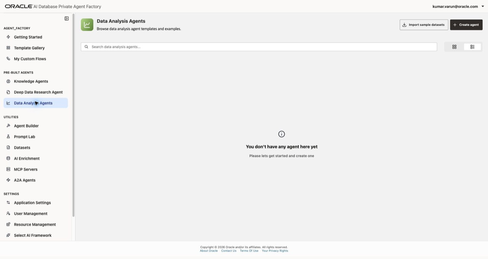

3. On the **Datasets** page, search for **Movies**. Find **Movies Dataset**, click **Import Dataset**, and wait until the card shows **Imported**. If it already shows **Imported**, continue to the next step.

    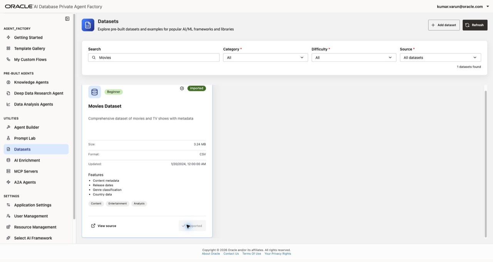

4. Return to **Data Analysis Agents** and click **Create agent**.

5. In **Select data sources**, choose **Applied AI Datasets** from the **Database** list. Select the **Movies Dataset** table card, then click **Next**. A Data Analysis Agent uses one table in this flow.

    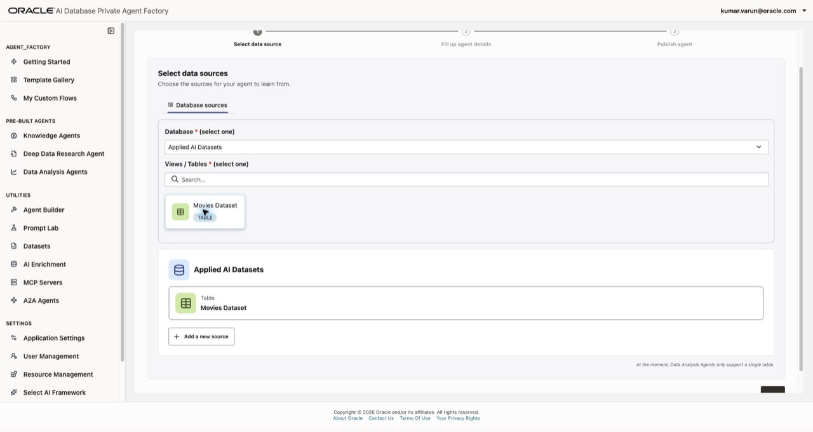

6. In **Fill up agent details**, enter an **Agent name** and **Description**. For example:

    * **Agent name:** Movies Data Analysis Agent
    * **Description:** Explore movie titles, release years, genres, and ratings in the Movies Dataset.

    **Help description** is optional and can provide instructions or tips for using the agent. If your workshop uses a shared account, add a unique suffix to your agent name. Click **Next**.

    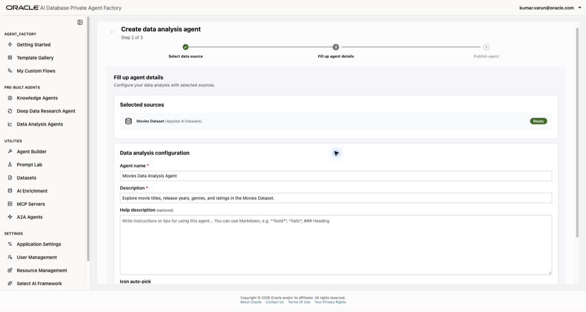

7. Review the agent name and selected table, then click **Publish agent**. Wait for publication to finish.

    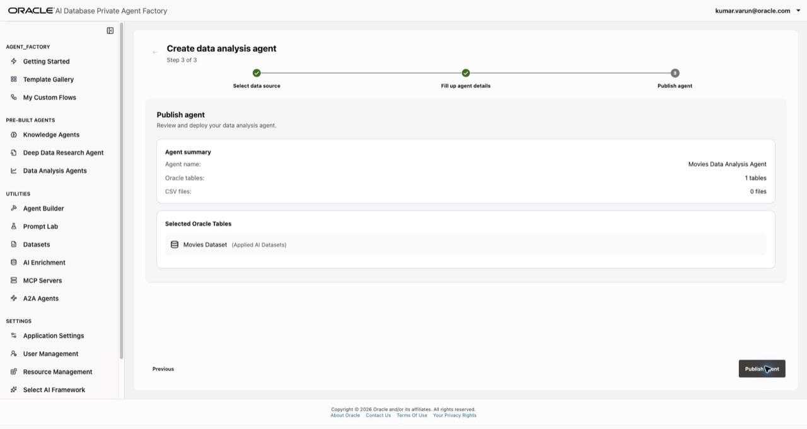

8. On the **Data Analysis Agents** page, find your agent and click **Open agent**. In **Messages**, allow the initial exploration to finish and review the suggested questions. If exploration does not start automatically, click **Execute exploration** when available.

    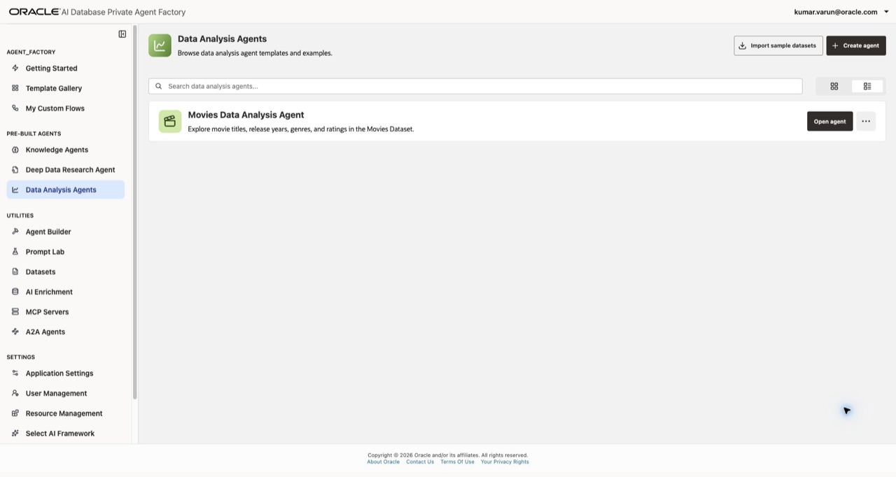

9. Select the **Data** tab to inspect the table and its columns, including **TYPE**, **TITLE**, and **RELEASE_YEAR**. Scroll horizontally to see additional columns. The example environment shows the underlying table as `PAF.AAI_DATASETS_MOVIES_DATASET`; the schema prefix can differ in your workshop environment.

    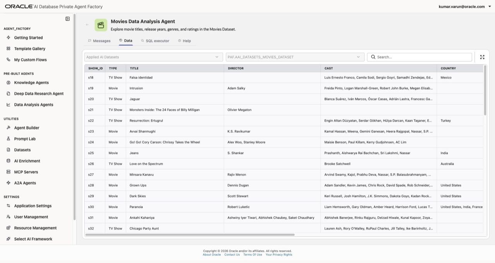

10. Return to **Messages** and ask **How many titles are movies and how many are TV shows?** Review the answer, generated SQL, and query results. Answers and available visualizations can vary with the model and question.

11. Continue to Task 2 to create an agent that answers questions from a PDF.

## Task 2: Create and talk to a Knowledge Agent for your own data

1. Choose a PDF for this task. For the example used below, open the [Private Agent Factory 26.7 introduction](https://docs.oracle.com/en/database/oracle/agent-factory/26.7/paias/introduction.html) in Chrome. Select **Print**, choose **Save as PDF** as the destination, and save the file locally.

2. In the sidebar, select **Data Sources** and click **Add data source**. Choose **File Source** for **Source type**. Enter a **Source name** and **Description**, for example:

    * **Source name:** Oracle Private Agent Factory Docs
    * **Description:** Introduction to Oracle AI Database Private Agent Factory release 26.7.

    Drag the PDF into the upload area or use the file picker. Verify that the filename appears, then click **Add file source** to submit it.

    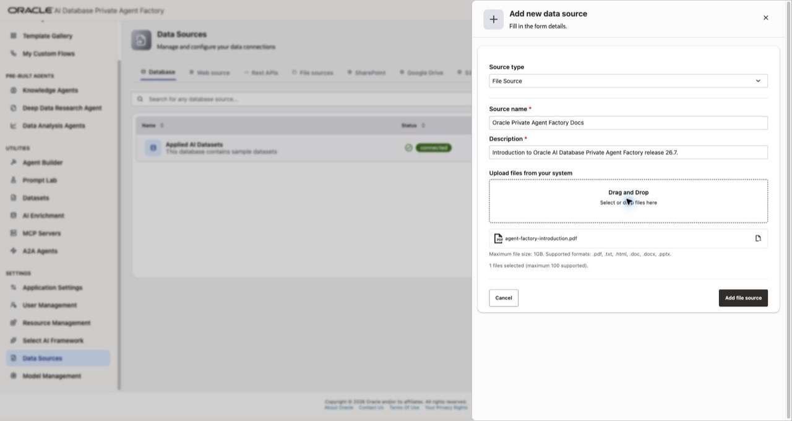

3. Wait for the upload panel to show that your file upload is **Completed**. Upload completion alone does not mean ingestion has finished; you will check ingestion status in the agent creation wizard below.

4. In the sidebar, select **Knowledge Agents**, then click **Create agent**.

    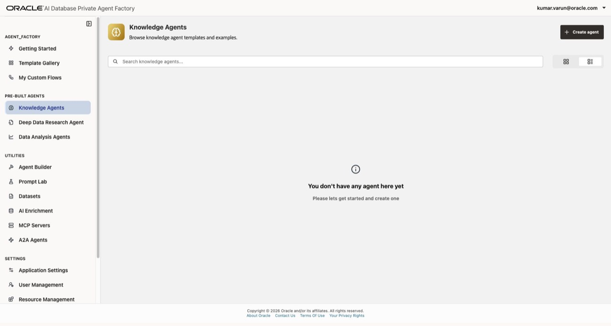

5. In **Select data sources**, choose **File system**. Find your source, such as **Oracle Private Agent Factory Docs**, and wait until its **Ingestion status** is **ingested**. Use the refresh button beside the search field if needed. Then select its checkbox and click **Next**. If processing fails, inspect the source status details and ask your instructor for help before repeating the upload.

    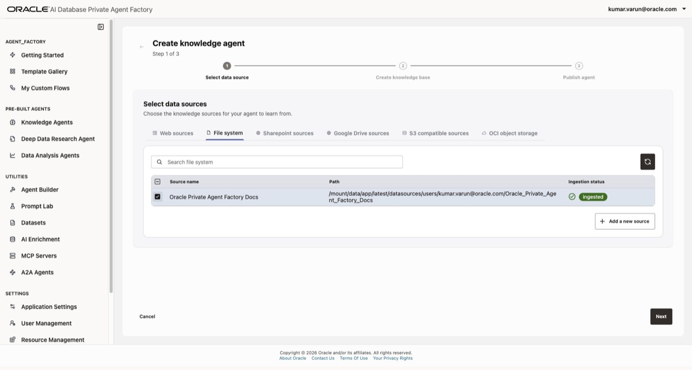

6. In **Create knowledge base**, enter an **Agent name** and **Description**, for example:

    * **Agent name:** Oracle Private Agent Factory Documentation Agent
    * **Description:** Answer questions about Private Agent Factory using the uploaded introduction.

    Select the instructor-provided model in the required **Generative Model** list. Model names can differ between workshop environments. **Help description** is optional. If your workshop uses a shared account, add a unique suffix to your agent name. Click **Next**.

    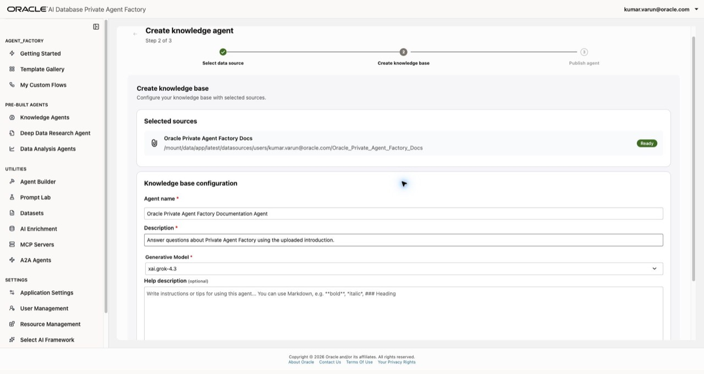

7. Review the selected source and agent details, then click **Publish agent**. Wait for publication to finish.

    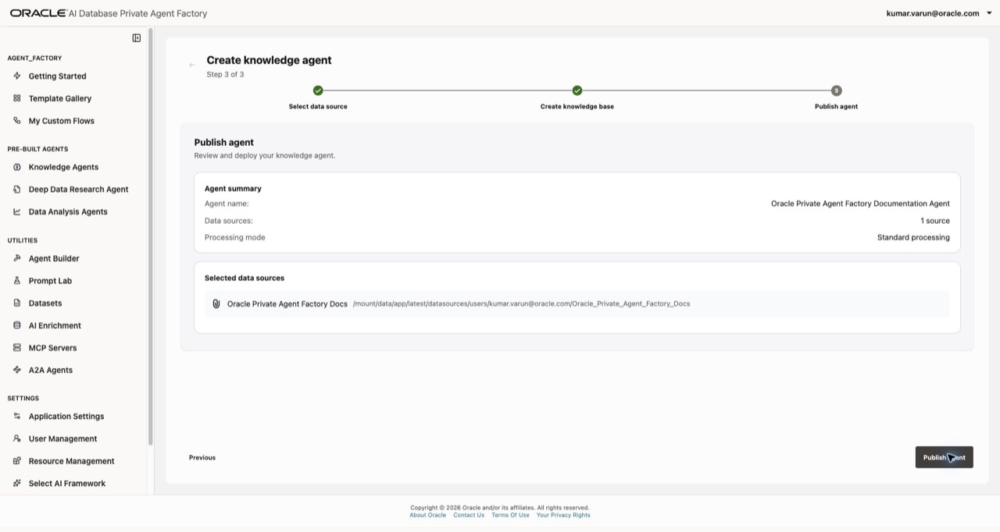

8. On the **Knowledge Agents** page, find your agent and click **Open agent**.

    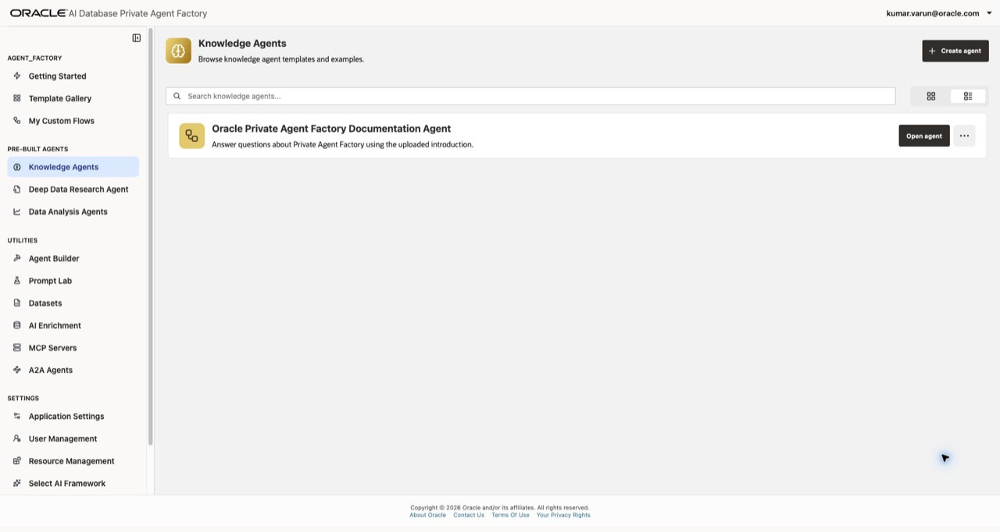

9. Ask a question supported by your PDF. For the documentation example, ask **What are the different ways to build an agent in Oracle Private Agent Factory?**

10. Open a citation to inspect the supporting passage in your source document. Compare it with the answer, then try a follow-up question. If you uploaded a different PDF, use questions appropriate to that document.

    If either agent's chat input does not appear or a response remains at **Loading chat**, return to the agent list and reopen the agent once. If the issue persists, ask your instructor to check the workshop environment before creating another agent.

## Summary

You created a Data Analysis Agent over a sample table and a Knowledge Agent over a PDF. You used natural language to explore structured data and inspected document citations for a grounded answer. You may now **proceed to the next lab** to explore custom flows.

## Learn More

* [Create a Data Analysis Agent](https://docs.oracle.com/en/database/oracle/agent-factory/26.7/paias/create-data-analysis-agent.html)
* [Create a Knowledge Agent](https://docs.oracle.com/en/database/oracle/agent-factory/26.7/paias/create-knowledge-agent.html)
* [File Source](https://docs.oracle.com/en/database/oracle/agent-factory/26.7/paias/file-source.html)

## Acknowledgements

**Authors**

* Database Applied AI Technical Staff
* Allen Hosler, Principal Product Manager, Database Applied AI
* Kumar G. Varun, Lead PM, Oracle Database Applied AI

**Last Updated Date** - October 7, 2026
