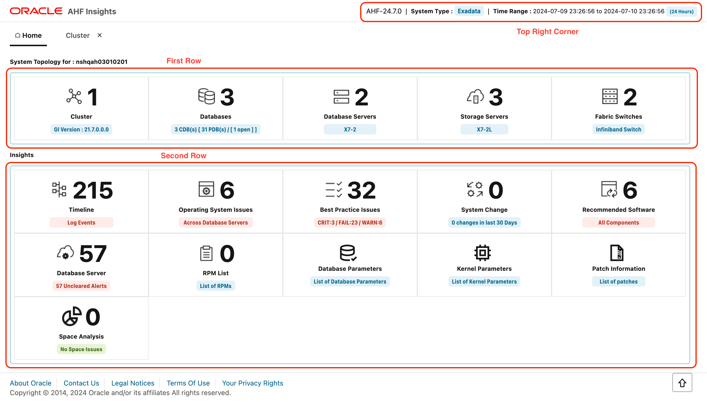

# AHF Insights Review

## Introduction

This lab will show you how to use AHF Insights reports to help diagnose problems.

Estimated Lab Time: 20 Minutes

### Objectives
- Get a bird's eye view of your database system from diagnostic perspective
- Troubleshoot problems on your database system
- Leverage AHF Insights to resolve identified problems

### Prerequisites
- System which allows downloading file using *wget* command
- Browser which can render html and javascript


### About AHF Insights

AHF Insights provides a bird's eye view of the entire database system from a diagnostic perspective.
It provides users ability to capture relevant diagnostic dimensions which are critical while troubleshooting an issue, identifying root cause and resolving them. 

Diagnostic dimensions include : 
- Database system configurations
- Variety of events observed throughout the system
- Oracle best practices violations
- Past system changes
- Software recommendations
- Management Server metrics and alerts
- Observed operating system issues
- Database issues
- Space Usage
- Patch Information
- Problems that have been detected on the system

## Task 1:  Download AHF Insights report to review System Topology
1.  Download AHF Insights report zip file

    ```
    wget https://objectstorage.us-ashburn-1.oraclecloud.com/p/sO6Bn1uNTY_zfuv7a8D_ydrmTxKueUkifDPiua2w0S1N0hr9K1ALNEshbcK3rp16/n/idhbogog2wy7/b/ocw24-livelabs/o/2_node_database_anomalies.zip
    ```

2.  Extract AHF Insights report zip file - IMAGE
3.  Open index.html file on a browser - IMAGE

## Task 2:  Review parts of AHF Insights report



1.  Top right corner (*highlighted*) indicates AHF Version, System Type and Time Range of AHF Insights report collection. - IMAGE
2.  First row (*highlighted*) shows topology of the system from where AHF Insights report was generated. - IMAGE
3.  Second row (*highlighted*) shows insights available from the system from various dimensions of diagnostics. - IMAGE

## Task 3:  Review *Cluster Section* in System Topology

1.  On Home tab click on the *Cluster Section* - IMAGE
2.  *Cluster Summary* sub tab gives you high level details regarding the cluster. - IMAGE
3.  Click copy icon (*highlighted*) to copy the panel data in text format to your clipboard. - IMAGE
4.  You can post it in your notepad / any other application. - IMAGE
5.  *Cluster Resources* sub tab gives you details of clusterware managed resources and their state. - IMAGE
6.  *ASM Details* sub tab gives you ASM Instance and Disk group details. - IMAGE

    Note : You can *Expand* each resource to check details and can also make use of *Expand All* switch to view/hide them all

## Task 4:  Review *Database Section* in System Topology

1.  Click on Home tab (*highlighted*) and open database section (*highlighted*). - IMAGE
    - Note : Provides you high level details regarding databases.
2.  Click copy icon (*highlighted*) to copy the panel data in text format to your clipboard. - IMAGE
3.  You can post it in your notepad / any other application. - IMAGE
4.  Click on Show button (*highlighted*) to get additional Instance, Tablespace and PDB  details. - IMAGE
5.  Observe : The timestamp at which snapshot was taken is available at the bottom right corner (*highlighted*).

## Task 5:  Review *Database Servers Section* in System Topology

1.  Click on Home tab (*highlighted*) and open Database Servers section (*highlighted*). - IMAGE
    - Note : Provides you high level configuration details regarding database servers.
2.  Click copy icon (*highlighted*) to copy the panel data in text format to your clipboard. - IMAGE
3.  You can post it in your notepad / any other application. - IMAGE

## Task 6:  Review *Storage Servers Section* in System Topology

1.  Click on Home tab (*highlighted*) and open Storage Servers section (*highlighted*). - IMAGE
    - Note : Provides you high level configuration details regarding storage servers.
2.  Click copy icon (*highlighted*) to copy the panel data in text format to your clipboard. - IMAGE
3.  You can post it in your notepad / any other application. - IMAGE

## Task 7:  Review *Fabric Switches Section* in System Topology

1.  Click on Home tab (*highlighted*) and open Fabric Switches section (*highlighted*). - IMAGE
    - Note : Provides you high level configuration details regarding fabric switches.

## Task 8:  Download AHF Insights report to review Insights

1.  TODO
2.  TODO

## Task 9:  Download AHF Insights report to review Detected Problems

1.  TODO
2.  TODO


```
wget https://objectstorage.us-ashburn-1.oraclecloud.com/p/sO6Bn1uNTY_zfuv7a8D_ydrmTxKueUkifDPiua2w0S1N0hr9K1ALNEshbcK3rp16/n/idhbogog2wy7/b/ocw24-livelabs/o/2_node_database_anomalies.zip
```

```
wget https://objectstorage.us-ashburn-1.oraclecloud.com/p/prOzBTYBnuuqgzr8Vtimkok6gdruMRbAJcGbwULurrL5VqeUB_GSEAwv3UyFIP_x/n/idhbogog2wy7/b/ocw24-livelabs/o/2_node_space_usage.zip
```
```
wget https://objectstorage.us-ashburn-1.oraclecloud.com/p/163cLvTyGHDkr3WuHhw9eAYfAKDYSRaXLELFfbht6syQO_5bfniYYfYIY3-qo42e/n/idhbogog2wy7/b/ocw24-livelabs/o/2_node_with_event_timeline.zip
```
```
wget https://objectstorage.us-ashburn-1.oraclecloud.com/p/-1Rev5YesCjolSIva291SB6r9HDl6LDPHiQHAIclsQ99-Ebc9KeTK-Jm0JOwFP3n/n/idhbogog2wy7/b/ocw24-livelabs/o/2_node_with_node_eviction.zip
```

```
wget https://objectstorage.us-ashburn-1.oraclecloud.com/p/IpJkXiZtW35Od2ECPpKgjzCd_mUEwhYKpfw-8dNH2Y2WlCnBC4K3Z5ZhCwI4oXIH/n/idhbogog2wy7/b/ocw24-livelabs/o/8_node_configuration_and_best_practice.zip
```

```
wget https://objectstorage.us-ashburn-1.oraclecloud.com/p/qd-ZOeKs0EMpBCWK5MMmx41NOyH7bxOyx1vBGOZGnlIL_7u66blEMwNOzQvk8g_U/n/idhbogog2wy7/b/ocw24-livelabs/o/insights_with_os_issues.zip
```

You may now *proceed to the next lab*.  

## Acknowledgements
* **Authors** - Troy Anthony, Bill Burton
* **Contributors** - 
* **Last Updated By/Date** - Bill Burton, July  2024
