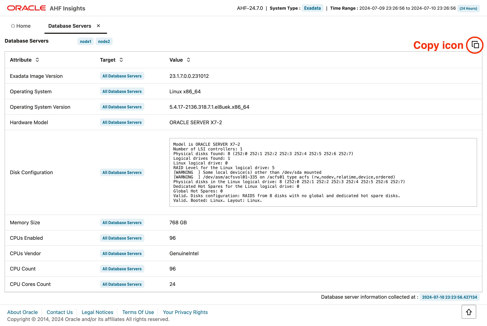

# AHF Insights Review

## Introduction

This lab will show you how to use AHF Insights reports to help diagnose problems.

Estimated Lab Time: 20 Minutes

### Objectives
- Get a bird's eye view of your database system from diagnostic perspective
- Troubleshoot problems on your database system
- Leverage AHF Insights to resolve identified problems

### Prerequisites
- System which allows downloading file using *wget* command
- Browser which can render html and javascript


### About AHF Insights

AHF Insights provides a bird's eye view of the entire database system from a diagnostic perspective.
It provides users ability to capture relevant diagnostic dimensions which are critical while troubleshooting an issue, identifying root cause and resolving them. 

Diagnostic dimensions include : 
- Database system configurations
- Variety of events observed throughout the system
- Oracle best practices violations
- Past system changes
- Software recommendations
- Management Server metrics and alerts
- Observed operating system issues
- Database issues
- Space Usage
- Patch Information
- Problems that have been detected on the system

## Task 1:  Download AHF Insights report to review System Topology
1.  Download AHF Insights report zip file

    ```
    wget https://objectstorage.us-ashburn-1.oraclecloud.com/p/1fl26UQZiAjg7vCEP9K0kMJ3bhpdc-cQTWKYl9g08VJMCXZr0pi46xQgUxfe2VBx/n/idhbogog2wy7/b/ocw24-livelabs/o/node1_insights_2024_07_10_23_30_54_system_topology.zip
    ```

2.  Extract AHF Insights report zip file - IMAGE
3.  Open index.html file on a browser - IMAGE

## Task 2:  Review parts of AHF Insights report


1.  Top right corner (*highlighted*) indicates AHF Version, System Type and Time Range of AHF Insights report collection.
2.  First row (*highlighted*) shows topology of the system from where AHF Insights report was generated.
3.  Second row (*highlighted*) shows insights available from the system from various dimensions of diagnostics.

## Task 3:  Review *Cluster Section* in System Topology

1.  On Home tab click on the *Cluster Section*


2.  *Cluster Summary* sub tab gives you high level details regarding the cluster.


3.  Click copy icon (*highlighted above*) to copy the panel data in text format to your clipboard.
4.  You can post it in your notepad / any other application.


5.  *Cluster Resources* sub tab gives you details of clusterware managed resources and their state.
    - Note : You can *Expand* each resource to check details and can also make use of *Expand All* switch to view/hide them all


6.  *ASM Details* sub tab gives you ASM Instance and Disk group details.


    

## Task 4:  Review *Database Section* in System Topology

1.  Click on Home tab (*highlighted*) and open database section (*highlighted*).
    - Note : Provides you high level details regarding databases.


2.  Click copy icon (*highlighted*) to copy the panel data in text format to your clipboard.


3.  You can post it in your notepad / any other application.
4.  Click on Show button (*highlighted above*) to get additional Instance, Tablespace and PDB  details.
5.  Observe : The timestamp at which snapshot was taken is available at the bottom right corner (*highlighted above*).

## Task 5:  Review *Database Servers Section* in System Topology

1.  Click on Home tab (*highlighted*) and open Database Servers section (*highlighted*).
    - Note : Provides you high level configuration details regarding database servers.


2.  Click copy icon (*highlighted*) to copy the panel data in text format to your clipboard.



3.  You can post it in your notepad / any other application.


## Task 6:  Review *Storage Servers Section* in System Topology

1.  Click on Home tab (*highlighted*) and open Storage Servers section (*highlighted*).
    - Note : Provides you high level configuration details regarding storage servers.


2.  Click copy icon (*highlighted*) to copy the panel data in text format to your clipboard.


3.  You can post it in your notepad / any other application.


## Task 7:  Review *Fabric Switches Section* in System Topology

1.  Click on Home tab (*highlighted*) and open Fabric Switches section (*highlighted*). - IMAGE
    - Note : Provides you high level configuration details regarding fabric switches.


## Task 8:  Download AHF Insights report to review Insights

1.  Download AHF Insights report zip file

    ```
    wget https://objectstorage.us-ashburn-1.oraclecloud.com/p/JHSkKXru-WkrhAJj668oXGDLHGncTtuK1_EF40kilttwxMPHg6pDuGXe1CPujYDe/n/idhbogog2wy7/b/ocw24-livelabs/o/node1_insights_2024_05_02_20_44_11_insights.zip
    ```

2.  Extract AHF Insights report zip file - IMAGE
3.  Open index.html file on a browser - IMAGE

## Task 9:  Review *Timeline Section* in Insights

1.  Click on Home tab (*highlighted*) and open timeline section (*highlighted*). - IMAGE
    - Note : Provides you distribution of events that happened across the nodes at different levels of the stack. Moreover these events are also categorized by event type, host and databases.


2.  Click and drag a section on the chart to zoom into the selected timeframe. - IMAGE
3.  Double click on the chart to reset the zoom to default period. - IMAGE
4.  Click on the legend *ERROR* item to disable / enable the events beloning to *ERROR* category. - IMAGE
5.  Select different timeline views from top right corner of the tab (*highlighted*). - IMAGE
6.  Scroll down to view the events hapenning in the cluster in a chronological fashion. - IMAGE
7.  Change the filters to slice and dice the event information. - IMAGE
    - Note : When you change the time selection by clicking and dragging the chart the start and end time in filters change and vice versa.
8.  Expand the event row by clicking on the arrow (*highlighted*) before the timestamp, to view additional details regarding the event. - IMAGE
9.  Click copy icon (*highlighted*) to copy the panel data in text format to your clipboard. - IMAGE
10.  You can post it in your notepad / any other application. - IMAGE
11.  Click on Show button (*highlighted*) to get additional Instance, Tablespace and PDB  details. - IMAGE
12.  Observe : The timestamp at which snapshot was taken is available at the bottom right corner (*highlighted*).

## Task 10:  Review *Operating System Issues Section* in Insights

1.  TODO
2.  TODO

## Task 11:  Review *Best Practice Issues Section* in Insights

1.  Click on Home tab (*highlighted*) and open Best Practice Issues section (*highlighted*). - IMAGE
    - Note : Provides you information regarding best practice (compliance) violations on your system.
2.  Observe : High level information regarding the best practice data collection. - IMAGE
3.  Observe : Chart showcasing health score and check status distribution (*highlighted*). - IMAGE
4.  Observe : Chart showcasing check status distribution across components and various sections (*highlighted*). - IMAGE
5.  Click on the legend *PASS* item to disable / enable the checks beloning to *PASS* category. - IMAGE
    - Note : You will observe the difference in the chart and at the bottom you will see PASS checks will appear when the PASS legend is enabled and will disappear when the PASS legend is disabled.
6.  Change the filters to slice and dice the best practice check information. - IMAGE
7.  Click on Jump To Section (*highlighted*) to move to a specific cateogry. - IMAGE
8.  Expand the check row by clicking on the arrow (*highlighted*) before the check status, to view additional what are the benifit / impact of the check on your system and details regarding the target and their corresponding status. - IMAGE
9.  Expand the target row by clicking on the arrow (*highlighted*) before the target name, to view additionaloutput of the check execution on the system for the given node. - IMAGE

## Task 12:  Review *System Change Section* in Insights

1.  Click on Home tab (*highlighted*) and open System Change section (*highlighted*). - IMAGE
    - Note : Provides you a timeline regarding changes observed on your system in the last 30 days from the following areas : Database Parameter, ASM Parameter, OS Packages, Oracle Software.
2.  Change the time filters to narrow down changes from the time period of interest. - IMAGE
3.  Select the change categories of interest by select values in System Change Type dropdown (*highlighted*). - IMAGE
4.  Observe : Every change entry gives information regarding targets on which the change was observed. - IMAGE

## Task 13:  Review *Recommended Software Section* in Insights

1.  Click on Home tab (*highlighted*) and open Recommended Software section (*highlighted*). - IMAGE
    - Note : Provides you details regarding oracle software found on the system and whether there is a recommendation to move to a higher version.
2.  Found Versions marked in RED color indicate there is a need to move to higher version as suggested in the Recommended Version column. - IMAGE
3.  Observe : Exadata Database Machine and Exadata Storage Server Supported Versions (Doc ID 888828.1) link provides details on the benifits of moving to the higher versions and the fixes that are available in them. - IMAGE

## Task 14:  Review *Database Server Section* in Insights

1.  Click on Home tab (*highlighted*) and open Database Server section (*highlighted*). - IMAGE
    - Note : Provides you metrics and alerts coming from Management Server, which includes Hardware , Software and ADR alerts.
2.  Observe : By default you land on the metrics sub tab. - IMAGE
3.  Select the node of choice from the drop down (*highlighted*) to view relevant metrics. - IMAGE
4.  Click on the Alerts sub tab to view various stateless alerts coming from management server and their corresponding action. - IMAGE
5.  Click on the the graph tab (*highlighted*) to view those alerts in graphical fashion. - IMAGE
6.  Disable switch for show open alerts (*highlighted*) to view cleared alerts as well. - IMAGE

## Task 15:  Review *RPM List Section* in Insights

1.  Click on Home tab (*highlighted*) and open RPM List section (*highlighted*). - IMAGE
    - Note : Provides you list of RPMs present on nodes of the cluster along with their version release and arch details.
2.  Search box at the top (*highlighted*) allows you to filter the table deatils based on your input. - IMAGE
3.  Enable switch Show RPM differences (*highlighted*) to quickly fiure out which rpms are inconsistent across nodes. - IMAGE

## Task 16:  Review *Database Parameters Section* in Insights

1.  Click on Home tab (*highlighted*) and open Database Parameters section (*highlighted*). - IMAGE
    - Note : Provides you list of database parameters along with their values.
2.  By default you will land into Normal sub tab which provides details regarding regular database parameters. - IMAGE
3.  Search box at the top (*highlighted*) allows you to filter the table deatils based on your input. - IMAGE
4.  Click on Hidden sub tab (*highlighted*) to view list of hidden / underscore database parameters. - IMAGE

## Task 17:  Review *Kernel Parameters Section* in Insights

1.  Click on Home tab (*highlighted*) and open Kernel Parameters section (*highlighted*). - IMAGE
    - Note : Provides you list of kernel parameters along with their values.
2.  Search box at the top (*highlighted*) allows you to filter the table deatils based on your input. - IMAGE

## Task 18:  Review *Patch Information Section* in Insights

1.  Click on Home tab (*highlighted*) and open Patch Information section (*highlighted*). - IMAGE
    - Note : Provides you details of patches applied on each node for a given home along with their constituent contents.
2.  Observe: Home dropdown (*highlighted*) will allow you to select a given home for exploring patch information. - IMAGE
3.  Observe: Host dropdown (*highlighted*) will allow you to select a given host for exploring patch information. - IMAGE
4.  By default Patches sub tab (*highlighted*) is selected which allows you to view the patch timeline in graphical and tabular format. - IMAGE
    - Note : Hovering on the graph data points shows you what patch was applied at a given time.
5.  Exapnd patch row by clicking arrow (*highlighted*) infornt of the applied date to view the constituent of the patch. - IMAGE
6.  Search box at the top (*highlighted*) allows you to filter the table deatils based on your input once clicked outside the search box. - IMAGE
    - Note : Helps you to search whether a given patch is applied on the system or not.
7.  Click on Components sub tab to view all the components and their respective version details. - IMAGE
8.  Search box at the top (*highlighted*) allows you to filter the table deatils based on your input once clicked outside the search box. - IMAGE

## Task 19:  Review *Space Analysis Section* in Insights

1.  Click on Home tab (*highlighted*) and open Space Analysis section (*highlighted*). - IMAGE
    - Note : Provides you details of disk space utilization and diagnostic space utilization on the system.
2.  By default Disk Utilization sub tab (*highlighted*) is selected which allows you to view the file system utilization across all nodes of the cluster for an easy comparitive view. - IMAGE
3.  Observe: Table at the bottom (*highlighted*) provides additional information regarding which mount has Grid Home or Database Homes. - IMAGE
4.  Observe: The usage column is color coded, green indicating normal usage, orange cautioning warning level usage and red cautioning danger level usage. - IMAGE
5.  Click on Diagnostic Space Usage sub tab to view space usage under the diagnostic destination on each node. - IMAGE
    - Note : Helps in identifying which directory is consuming lot of space under diag destination.
6.  By hovering over the graph you would be able to observe space usage over a given directory. - IMAGE
7.  Table at the bottom allows you to explore the directories in a hierarchial fashion. - IMAGE
8.  Enable switch for Expand All (*highlighted*) to view the expanded form of the hierarchial directory structure. - IMAGE

## Task 20:  Review *Database Anomalies Advisor Section* in Insights

1.  Click on Home tab (*highlighted*) and open Database Anomalies Advisor section (*highlighted*). - IMAGE
    - Note : Provides you details of database & clusterware performance anomalies identified by Cluster Health Advisor.
2.  Observe : Left hand side navigation allows you view summary of performance issues observed during the period of Insights collection. Moreover it also provides you a mechanism to slice and dice performance anomaly information by hosts, databases, instances and individual performance problems. - IMAGE
3.  Observe : The graph provides you a view of events hapenning across the nodes of the cluster, along with a gantt chart of performance issues observed. There are different targets for which anomalies are observed that are showcased o the legend. - IMAGE
4.  Double clicking on range issue over gantt chart allows you to drill down into the specific problem and provides you details regarding corresponding metrics that were oberved with anomalous readings. - IMAGE
5. The table at the bottom indicates the description of the problem, it's cause and corresponding action to be taken. - IMAGE

## Acknowledgements
* **Authors** - Troy Anthony, Bill Burton
* **Contributors** - 
* **Last Updated By/Date** - Bill Burton, July  2024
