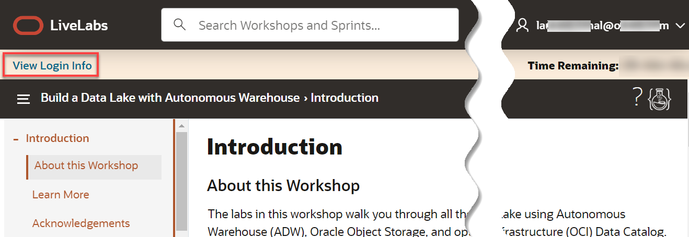

# Get Started with Livelabs

## Introduction

Welcome to your LiveLabs Sandbox environment. In order to start your workshop, you need to login to our LiveLabs Sandbox.

In this lab, we are going to show you where you can find the login information and how to log in to the LiveLabs Sandbox.

Estimated Time: 5 minutes

### Objectives

-   View login information to LiveLabs Sandbox
-   Identify DB Server Public IP Addresses
-   Connect to the each RAC instance:  Node 1 and Node 2

### Prerequisites

* Requested a Green Button environment with:-
  - An assigned Oracle LiveLabs Cloud account
  - An assigned compartment
  - An assigned Database Cluster Password
  - Lab: Download SSH Keys

## Task 1: Log in to the Oracle Cloud Console

1. Click the **View Login Info** link in the banner.

    

     This panel displays important information that you will need throughout this workshop.

    

2. Click **Copy Password** to copy your initial password, and then click **Launch OCI**.

3. On the Sign In page, in the **Oracle Cloud Infrastructure Direct Sign-In** section, your assigned username is already displayed in the **User Name** field. Paste your password in the **Password** field, and then click **Sign In**.

    

4. The **Change Password** dialog box is displayed. Paste your assigned password that you copied in the **Current Password**. Enter a new password in the **New Password** and **Confirm New Password** fields, and then click **Save New Password**. Make a note of your new password as you will need it in this workshop.

    

    The **Oracle Cloud Console** Home page is displayed. Make sure that the displayed region is the same that was assigned to you in the **Reservation Information** panel of the **Run Workshop *workshop-name*** page, **Canada Southeast (Toronto)** in this example.

    

    >**Note:** Bookmark the workshop page for quicker access.

## Task 2: Determine the IP addresses of your two Sandbox Nodes

You should already be logged in to the OCI console from Task 1.

1.  Open up the hamburger menu in the left hand corner.  

2.  From the hamburger menu, select **Oracle Database, and then Oracle Base Database** in the Oracle Database category.

  

3.  Select the compartment you were assigned in LiveLabs and identify your database system from your My Reservations page. Click on the database system name to see the details.

  

4. Explore the DB Systems home page.  On the left hand side, scroll down to view the Resources section.  Click Nodes.

  

5. Locate your two nodes and jot down their public IP addresses.

  

6. Now that you have your IP address select the method of connecting. Choose the environment where you created your ssh-key in the previous lab (Generate SSH Keys) and select one of the following steps. If you choose to use Oracle Cloud Shell, you will need to copy your SSH Private to the cloud shell and set the proper permissions, otherwise, choose the platform that matches your local environment.

## Task 3: Connect using Oracle Cloud Shell

1.  To start the Oracle Cloud Shell, go to your Cloud console and click the Cloud Shell icon at the top right of the page.

    

    

2.  Click on the Cloud Shell hamburger icon and select **Upload** to upload your private key

    

3.  To connect to the compute instance that was created for you, you will need to load your private key.  This is the key that does *not* have a .pub file at the end.  Locate that file on your machine and click **Upload** to process it.

    

4. Be patient while the key file uploads to your Cloud Shell directory
    

    

5. Once finished run the command below to check to see if your ssh key was uploaded.  Move it into your .ssh directory, and change the permissions on the file.

    ```nohighlight
    <copy>
    ls
    </copy>
    ```
    ```nohighlight
    <copy>
    mkdir ~/.ssh
    mv id_rsa ~/.ssh
    chmod 600 ~/.ssh/id_rsa
    ls ~/.ssh
    cd ~
    </copy>
    ```

    

6.  Using one of the Public IP addresses, enter the command below to login as the *opc* user and verify connection to your nodes.

    ```nohighlight
    <copy>
    ssh -i ~/.ssh/id_rsa opc@<Your Node Public IP Address>
    </copy>
    ```
    

   When prompted, answer **yes** to continue connecting.

>Note: You only need to connect to one Node for Labs 1 to 5 in this workshop

8.  Change to the **root** user from the **opc** user
     
     ```
     <copy>
      sudo su - 
      </copy>
     ```


You may now [proceed to the next lab](#next).


## Acknowledgements

* **Author** - Rene Fontcha, Master Principal Platform Specialist, NA Technology
* **Contributors** - Kay Malcolm, Product Manager, Database Product Management
* **Last Updated By/Date** - Bill Burton, August 2024
