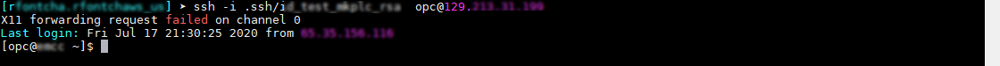
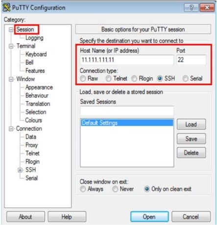
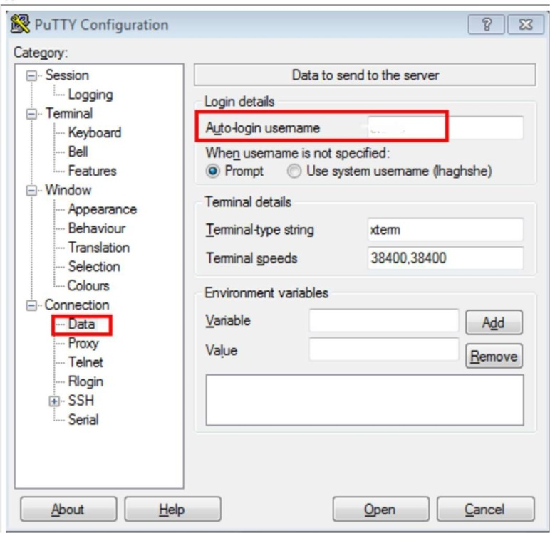
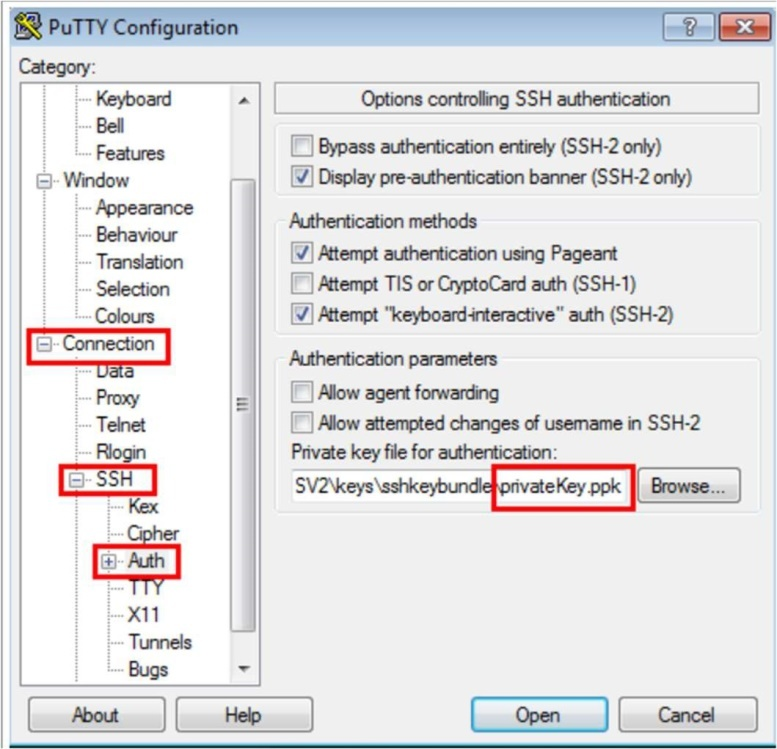

# Connect to your DB System

## Introduction
This lab will show you how to connect to your DB System.  

Estimated Lab Time:  5 minutes

Watch the video below for an overview of connecting to your DB System lab
[](videohub:1_tbdkdjr1)

### Objectives
-   Identify DB Instance Public IP Addresses
-   Connect to the each RAC instance:  Node 1 and Node 2

### Prerequisites
- An assigned Oracle LiveLabs Cloud account
- An assigned compartment
- An assigned Database Cluster Password
- Lab: Download SSH Keys

## Task 1: Login to Oracle Cloud

1.  Login to Oracle Cloud
2.  Click on the down arrow next to Oracle Cloud Infrastructure Direct Sign in
3.  Enter your username and password you were provided
4.  Change the password if prompted
5.  In the upper right corner select the region you were assigned
6.  Open up the hamburger menu in the left hand corner.  

7.  From the hamburger menu, select **Bare Metal, VM, and Exadata** in the Oracle Database category.

  

8.  Select the compartment you were assigned in LiveLabs and identify your database system from your My Reservations page. Click on the database system name to see the details.

  

9. Explore the DB Systems home page.  On the left hand side, scroll down to view the Resources section.  Click Nodes.

  

10. Locate your two nodes and jot down their public IP addresses.

  

11. Now that you have your IP address select the method of connecting. Choose the environment where you created your ssh-key in the previous lab (Generate SSH Keys) and select one of the following steps. If you choose to use Oracle Cloud Shell, you will need to copy your SSH Private to the cloud shell and set the proper permissions, otherwise, choose the platform that matches your local environment.

## Task 2: Choose a path to connect
Now it's time to choose a path. You can connect by one of 3 methods.  If you are doing a LiveLab that can be done within a terminal completely, we recommend you choose Oracle Cloud Shell (Step 2A).

Your options are:
1. Task 2A: Connect using Cloud Shell *(recommended)*
2. Task 2B: Connect using MAC or a Windows CYGWIN Emulator
3. Task 2C: Connect using Putty *(Requires you to install applications on your machine)*


## Task 2A: Connect using Oracle Cloud Shell

1.  To start the Oracle Cloud Shell, go to your Cloud console and click the Cloud Shell icon at the top right of the page.

    

    

2.  Click on the Cloud Shell hamburger icon and select **Upload** to upload your private key

    

3.  To connect to the compute instance that was created for you, you will need to load your private key.  This is the key that does *not* have a .pub file at the end.  Locate that file on your machine and click **Upload** to process it.

    

4. Be patient while the key file uploads to your Cloud Shell directory
    

    

5. Once finished run the command below to check to see if your ssh key was uploaded.  Move it into your .ssh directory, and change the permissions on the file.

    ```nohighlight
    <copy>
    ls
    </copy>
    ```
    ```nohighlight
    <copy>
    mkdir ~/.ssh
    mv <<keyname>> ~/.ssh
    chmod 600 ~/.ssh/<<keyname>>
    ls ~/.ssh
    cd ~
    </copy>
    ```

    

6.  Using one of the Public IP addresses, enter the command below to login as the *opc* user and verify connection to your nodes.

    ```nohighlight
    <copy>
    ssh -i ~/.ssh/<sshkeyname> opc@<Your Node Public IP Address>
    </copy>
    ```
    

3.  When prompted, answer **yes** to continue connecting.
4.  Repeat step 2 for your 2nd node.
5.  You may now [proceed to the next lab](#next).  


## Task 2B: Connect using MAC terminal or Windows CYGWIN Emulator
*NOTE:  If you have trouble connecting and are using your work laptop to connect, your corporate VPN may prevent you from logging in. Log out of your VPN before connecting. *
1.  Using one of the Public IP addresses, open up a terminal (MAC) or cygwin emulator as the opc user.  Enter yes when prompted.

    ```
    <copy>
    ssh -i ~/.ssh/<sshkeyname> opc@<Your Public IP Address - node1>
    </copy>
    ```
    

2. You can also log in to the **Public IP Address of node2**

    ```
    <copy>
    ssh -i ~/.ssh/<sshkeyname> opc@<Your Public IP Address - node2>
    </copy>
    ```
    

3. After successfully logging in, you may [proceed to the next lab](#next).

## Task 2C: Connect using Putty on Windows
*NOTE:  If you have trouble connecting and are using your work laptop to connect, your corporate VPN may prevent you from logging in. Log out of your VPN before connecting. *

On Windows, you can use PuTTY as an SSH client. PuTTY enables Windows users to connect to remote systems over the internet using SSH and Telnet. SSH is supported in PuTTY, provides for a secure shell, and encrypts information before it's transferred.

1.  Download and install PuTTY. [http://www.putty.org](http://www.putty.org)
2.  Run the PuTTY program. On your computer, go to **All Programs > PuTTY > PuTTY**
3.  Select or enter the following information:
    - Category: _Session_
    - IP address: _Your service instance’s (node1) public IP address_
    - Port: _22_
    - Connection type: _SSH_

  

### **Configuring Automatic Login**

1.  In the category section, **Click** Connection and then **Select** Data.

2.  Enter your auto-login username. Enter **opc**.

  

### **Adding Your Private Key**

1.  In the category section, **Click** Auth.
2.  **Click** browse and find the private key file that matches your VM’s public key. This private key should have a .ppk extension for PuTTy to work.

  

3.  To save all your settings, in the category section, **Click** session.
4.  In the saved sessions section, name your session, for example ( EM13C-ABC ) and **Click** Save.

### **Repeat Putty setup for the second node**

1. Repeat the steps above to create a login window for the second node - use the Public IP address of node2
3.  Select or enter the following information:
    - Category: _Session_
    - IP address: _Your service instance’s (node2) public IP address_
    - Port: _22_
    - Connection type: _SSH_

  

You may now [proceed to the next lab](#next).

## Appendix: Troubleshooting Tips

If you encountered any issues during the lab, follow the steps below to resolve them.  If you are unable to resolve, please skip to the **Need Help** section to submit your issue via our support forum.

### Issue 1: Can't login to instance
Participant is unable to login to instance

#### Tips for fixing Issue #1
There may be several reasons why you can't login to the instance.  Here are some common ones we've seen from workshop participants
- Permissions are too open for the private key - be sure to chmod the file using `chmod 600 ~/.ssh/<yourprivatekeyname>`
- Incorrectly formatted ssh key (see above for fix)
- User chose to login from MAC Terminal, Putty, etc and the instance is being blocked by company VPN (shut down VPNs and try to access or use Cloud Shell)
- Incorrect name supplied for ssh key (Do not use sshkeyname, use the key name you provided)
- @ placed before opc user (Remove @ sign and login using the format above)
- Make sure you are the oracle user (type the command *whoami* to check, if not type *sudo su - oracle* to switch to the oracle user)
- Make sure the instance is running (type the command *ps -ef | grep oracle* to see if the oracle processes are running)

### Issue 2: Need a ppk key
Participant is unable to login to instance

#### Tips for fixing Issue #1
If you want to use Putty to connect to your server, you must convert your SSH key into a format compatible with Putty. To convert your key into the required .ppk format, you can use PuTTYgen.

[Download PuTTYgen](https://www.google.com/url?sa=t&rct=j&q=&esrc=s&source=web&cd=&cad=rja&uact=8&ved=2ahUKEwigtZLx47DwAhUYKFkFHf99BmAQFjAAegQIAxAD&url=https%3A%2F%2Fwww.puttygen.com%2F&usg=AOvVaw1fagG6hM51oZWfQB_rqn2t)

To use PuTTYgen to convert a key into .ppk format, complete the following steps:

1. Open PuTTYgen, go to **Conversions**, and then click **Import key**. PuTTYgen will display a window to load your key.
2. Browse to your **SSH private key**, select the file, and then click **Open**. Your SSH private key may be in the Users\[user_name]\.ssh directory.
3. Enter the passphrase associated with the private key, or leave blank if none and then click **OK**. *Note the key fingerprint confirms the number of bits is 4096.*
4. Go to **File**, and then click **Save private key** to save the key in .ppk format.


## Acknowledgements

* **Author** - Rene Fontcha, Master Principal Platform Specialist, NA Technology
* **Contributors** - Kay Malcolm, Product Manager, Database Product Management
* **Last Updated By/Date** - Troy Anthony, August 2022
