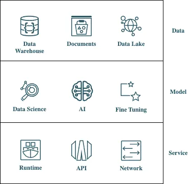

# Introduction

## About this Workshop

The main purpose of this workshop is to teach you how you can implement a **RAG** (Retrieval Augmented Generation) chatbot using **vector similarity search** and **Generative AI / LLMs**. 

In today’s data-driven world, effectively managing and utilizing information is crucial for any organization. Whether dealing with customer support data, product documentation, or internal knowledge bases, organizing and retrieving relevant information from vast collections can be challenging. This tutorial demonstrates a comprehensive approach to processing, storing, and leveraging textual data using vectorization and retrieval techniques. By the end of this tutorial, you’ll understand how to transform raw documents into structured data, store them efficiently, and utilize advanced AI models to generate contextual responses.

We will guide you through the process of loading and parsing various types of documents, integrating them with an Oracle database, and employing Oracle’s Generative AI inference capabilities to enhance information retrieval. This method ensures that data is clean, accessible, and contextually relevant. Additionally, we will discuss the importance of data source parsing and context attachment, as well as potential expansions for handling more complex data sources.

We aim to demystify the process of creating a chatbot that is powered by your proprietary data, leveraging the robust capabilities of Oracle Cloud as the foundational infrastructure. Our goal is to guide you through each step, ensuring that even those with minimal experience in chatbot development can follow along and achieve a functional and intelligent chatbot by the end of this series.

Estimated Time: 120 minutes

### The Data-Model-Service (DMS) Architecture

The architecture of the LLM-based application is composed of three integral layers, each serving a distinct but interconnected function:

1. **Data Layer**: The Data Layer serves as the cornerstone of the assistant's architecture, storing and managing diverse data vital for functionality. Data quality, structure, and availability shape design and development strategies for subsequent layers.
	
1. **Model Layer**: At the heart lies the advanced AI models, trained on textual documents, code repos & visual images.

1. **Service Layer**: The interface between the assistant and external applications. Offers APIs for communication with the assistant, facilitating queries, content generation, and task execution. Crucial for integrating the assistant into broader systems and workflows.

### Advantages
The *Data-Model-Service architecture* introduces a holistic approach to LLM-based applications. Modularity is key, with distinct layers providing clear separation of concerns, enabling efficient development, maintenance, and scalability.

The **Data Layer** ensures a robust foundation for the assistant by managing diverse data types, influencing subsequent layers' strategies, with a modular design facilitating flexibility and adaptability.

Furthermore, the **Model Layer** introduces a powerful capability by incorporating advanced AI models. This flexibility in training allows the assistant to cater to a wide range of user needs. The parsing and segmentation of data contribute to the model's efficiency, making it adept at generating accurate outputs.

The **Service Layer**, acting as the interface to external applications through a suite of APIs, further extends the utility of the DMS architecture.

As a result, the *DMS architecture* provides a comprehensive and efficient framework for developing language-based applications, opening up new possibilities for collaboration and integration in AI and information systems.

### Objectives

In this workshop, you will learn how to:

* Split a folder of text FAQs into chunks and store them as vectors in a vector database (Oracle Database  23ai).
* Configure access to Oracle Generative AI Service.
* Given a user question, retrieve the relevant chunks from the vector database
* Use an LLM to create a relevant response based on text chunks.

### Prerequisites

* You have an Oracle Cloud account with access to the OCI Generative AI service
* You have enough privileges to use OCI
* You have basic knowledge of Python and Jupyter Labs
* Basic Linux knowledge

You may now **proceed to the next lab**

## Learn More
* [Oracle Generative AI Service](https://www.oracle.com/artificial-intelligence/generative-ai/generative-ai-service/)
* [Oracle Database Free](https://www.oracle.com/database/free/)
* [Get Started with Oracle Database 23ai](https://www.oracle.com/ro/database/free/get-started/)

## Acknowledgements
* **Author** - Bogdan Farca, Customer Strategy Programs Leader, Digital Customer Experience (DCX), EMEA
* **Contributors** 
   - Wojciech Pluta, Director, Technical Product Marketing
   - Liana Lixandru, Senior Digital Adoption Manager, Digital Customer Experience (DCX), EMEA
   - Kevin Lazarz, Senior Manager, Product Management, Database
* **Last Updated By/Date** -  Bogdan Farca, Sep 2024
