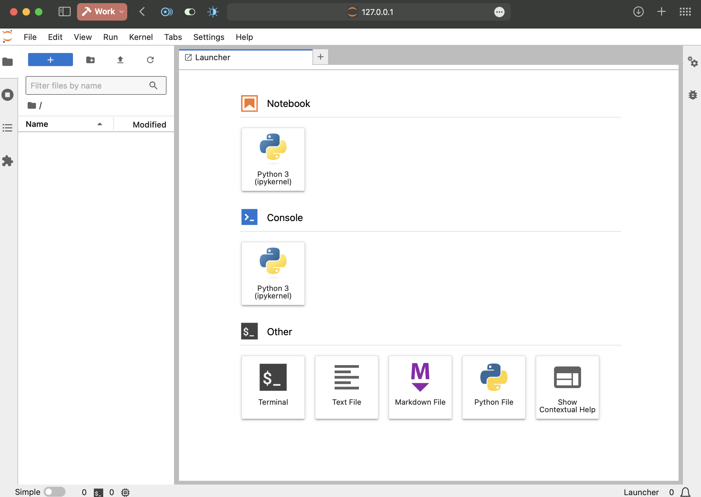

# Setup the Python Environment

## Introduction

This lab guide will walk you through setting up Python and Jupyter Lab, which is the development environment we will use to write our RAG chatbot.

Estimated Time: 15 minutes

### Objectives

* Start the Jupyter Lab server and open the development environment.

### Prerequisites

* Access to the NoVNC image specific to this lab
* Basic Linux knowledge

## Task 0: Start the Linux terminal
To access the Linux terminal in the VM, click `Activities` in the top-left corner and then click the Terminal icon in the left drawer.


## Task 1: Setup the 23ai database
> Note: Before we do anything, it would be better to open this lab in a Chrome window on the remote noVNC machine. Copying and pasting is way easier to perform this way.

1. The latest Oracle Database 23ai is already installed in the Lab image, but we need to do a few things first.

```bash
<copy>sqlplus sys/freepdb1 as sysdba</copy>
```

2. Paste the following command inside the SQL*Plus session.

   ```sql
   <copy>alter session set container = freepdb1;</copy>
   ```
   ```sql
   <copy>
   Create bigfile tablespace tbs2  
   Datafile 'bigtbs_f2.dbf'  
   SIZE 1G AUTOEXTEND ON  
   next 32m maxsize unlimited
   extent management local segment space management auto;
   </copy>
   ``` 
   ```sql
   <copy>
   CREATE UNDO TABLESPACE undots2 DATAFILE 'undotbs_2a.dbf' SIZE 1G AUTOEXTEND ON RETENTION GUARANTEE;
   </copy>
   ```
   ```sql
   <copy>
   CREATE TEMPORARY TABLESPACE temp_demo  
   TEMPFILE 'temp02.dbf' SIZE 1G reuse AUTOEXTEND ON  
   next 32m maxsize unlimited extent management local uniform size 1m;
   </copy>
   ```

   We create now a new user for our vector operations:
   ```sql
   <copy>
   create user vector identified by vector default tablespace tbs2  
   quota unlimited on tbs2;
   </copy>
   ```
   ```sql
   <copy>
   grant DB_DEVELOPER_ROLE to vector;
   </copy>
   ```

3. Exiting the sqlplus session:
   ```sql
   <copy>
   exit
   </copy>
   ```

4. We have now to allocate memory for the in-memory vector index.
   ```bash
   <copy>
   sqlplus / as sysdba
   </copy>
   ```
   ```sql
   <copy>
   create pfile from spfile;
   </copy>
   ```
   ```sql
   <copy>
   ALTER SYSTEM SET vector_memory_size = 512M SCOPE=SPFILE;
   </copy>
   ```
   ```sql
   <copy>
   shutdown
   </copy>
   ```
   ```sql
   <copy>
   startup
   </copy>
   ```
   
   Check if the vector memory size parameter is there after the restart.
   ```sql
   <copy>
   show parameter vector_memory_size;
   </copy>
   ```
   It should show `512M`.


5. We now exit the sqlplus session:
   ```
   <copy>
   exit
   </copy>
   ```
6. We need a listener to connect to our database from Python.

   ```bash
   <copy>nano $ORACLE_HOME/network/admin/tnsnames.ora</copy>
   ```

   Now copy the existing entry that already exists in there and looks similar to:

   ```sql
   FREE =
   (DESCRIPTION =
    (ADDRESS = (PROTOCOL = TCP)(HOST = holserv1.livelabs.oraclevcn.com)(PORT = 1521))
    (CONNECT_DATA =
      (SERVER = DEDICATED)
      (SERVICE_NAME = FREE)
    )
  )
   ```

   And paste it just below, while renaming `FREE` to `FREEPDB1` to look like:
   ```sql
      FREEPDB1 =
      (DESCRIPTION =
         (ADDRESS = (PROTOCOL = TCP)(HOST = holserv1.livelabs.oraclevcn.com)(PORT = 1521))
         (CONNECT_DATA =
            (SERVER = DEDICATED)
            (SERVICE_NAME = FREEPDB1)
         )
      )
   ```
   The final step is to re-start the listener:
   ```bash
   <copy>lsnrctl start</copy>
   ```

## Task 2: Prepare your Python environment
We need to ensure that we are using the desired Python version. Python 3.12 is preinstalled in our lab image, but we need to set up a bit to make sure Jupyter is using it. To do that, we will create a virtual environment named `vectorsenv`.

In the terminal window already open on your NoVNC window in the browser, type:

   ```bash
   <copy>python3.12 -m venv vectorsenv</copy>
   ```
   ```bash
   <copy>source vectorsenv/bin/activate</copy>
   ```

## Task 2: Start Jupyter Lab
Now, type:

```bash
jupyter-lab
```

A Chrome window will open, showing our jupyter launcher.




You may now **proceed to the next lab**

## Learn More
* [Oracle Generative AI Service](https://www.oracle.com/artificial-intelligence/generative-ai/generative-ai-service/)
* [Oracle Database Free](https://www.oracle.com/database/free/)
* [Get Started with Oracle Database 23ai](https://www.oracle.com/ro/database/free/get-started/)

## Acknowledgements
* **Author** - Bogdan Farca, Customer Strategy Programs Leader, Digital Customer Experience (DCX), EMEA
* **Contributors** 
   - Liana Lixandru, Senior Digital Adoption Manager, Digital Customer Experience (DCX), EMEA
   - Kevin Lazarz, Senior Manager, Product Management, Database
   - Wojciech Pluta, Director, Technical Product Marketing
* **Last Updated By/Date** -  Bogdan Farca, Jul 2024