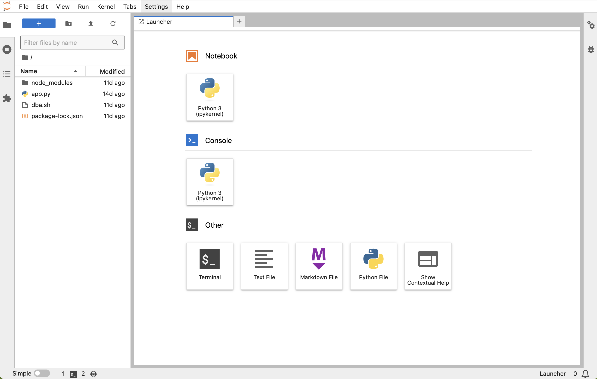

# Setup the Python Environment

## Introduction

This lab guide will walk you through setting up Python and Jupyter Lab, which is the development environment we will use to write our RAG chatbot.

Estimated Time: 15 minutes

### Objectives

* Start the Jupyter Lab server and open the development environment.

### Prerequisites

* Access to the virtual environment generated for this lab
* Basic Linux knowledge

## Task 1: Open the remote Jupyter Lab environment
Click the `View Login Info` link in the uper left side of your lab window:


To access the Jupyter Lab environment we will use to write and test our code, click the JupyterLab link in the resulting popup. 
The password is listed in the same popup as well.

The Jupyter Lab launcher should open.


## Task 1: Setup the 23ai database

1. Open a terminal from the Jupyter Launcher by clicking on the `Terminal` button.
   

   Now enter the DB environment with :

   ```bash
   <copy>./dba.sh</copy> 
   ```

2. The latest Oracle Database 23ai is already installed in the Lab image, but we need to do a few things first.

```bash
<copy>sqlplus sys/freepdb1 as sysdba</copy>
```

3. Paste the following command inside the SQL*Plus session.

   ```sql
   <copy>alter session set container = freepdb1;</copy>
   ```
   ```sql
   <copy>
   Create bigfile tablespace tbs2  
   Datafile 'bigtbs_f2.dbf'  
   SIZE 1G AUTOEXTEND ON  
   next 32m maxsize unlimited
   extent management local segment space management auto;
   </copy>
   ``` 
   ```sql
   <copy>
   CREATE UNDO TABLESPACE undots2 DATAFILE 'undotbs_2a.dbf' SIZE 1G AUTOEXTEND ON RETENTION GUARANTEE;
   </copy>
   ```
   ```sql
   <copy>
   CREATE TEMPORARY TABLESPACE temp_demo  
   TEMPFILE 'temp02.dbf' SIZE 1G reuse AUTOEXTEND ON  
   next 32m maxsize unlimited extent management local uniform size 1m;
   </copy>
   ```

   We create now a new user for our vector operations:
   ```sql
   <copy>
   create user vector identified by vector default tablespace tbs2  
   quota unlimited on tbs2;
   </copy>
   ```
   ```sql
   <copy>
   grant DB_DEVELOPER_ROLE to vector;
   </copy>
   ```

4. Exiting the sqlplus session:
   ```sql
   <copy>
   exit
   </copy>
   ```

5. We have now to allocate memory for the in-memory vector index.
   ```bash
   <copy>
   sqlplus / as sysdba
   </copy>
   ```
   ```sql
   <copy>
   create pfile from spfile;
   </copy>
   ```
   ```sql
   <copy>
   ALTER SYSTEM SET vector_memory_size = 512M SCOPE=SPFILE;
   </copy>
   ```
   ```sql
   <copy>
   SHUTDOWN IMMEDIATE
   </copy>
   ```
   ```sql
   <copy>
   startup
   </copy>
   ```
   
   Check if the vector memory size parameter is there after the restart.
   ```sql
   <copy>
   show parameter vector_memory_size;
   </copy>
   ```
   It should show `512M`.


6. We now exit the sqlplus session:
   ```
   <copy>
   exit
   </copy>
   ```
You may now **proceed to the next lab**

## Learn More
* [Oracle Generative AI Service](https://www.oracle.com/artificial-intelligence/generative-ai/generative-ai-service/)
* [Oracle Database Free](https://www.oracle.com/database/free/)
* [Get Started with Oracle Database 23ai](https://www.oracle.com/ro/database/free/get-started/)

## Acknowledgements
* **Author** - Bogdan Farca, Customer Strategy Programs Leader, Digital Customer Experience (DCX), EMEA
* **Contributors** 
   - Liana Lixandru, Principal Digital Adoption Manager, Digital Customer Experience (DCX), EMEA
   - Kevin Lazarz, Senior Manager, Product Management, Database
   - Wojciech Pluta, Director, Technical Product Marketing
* **Last Updated By/Date** -  Bogdan Farca, Sep 2024