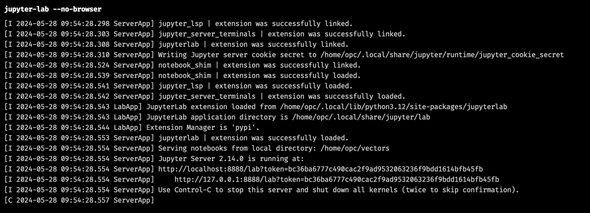
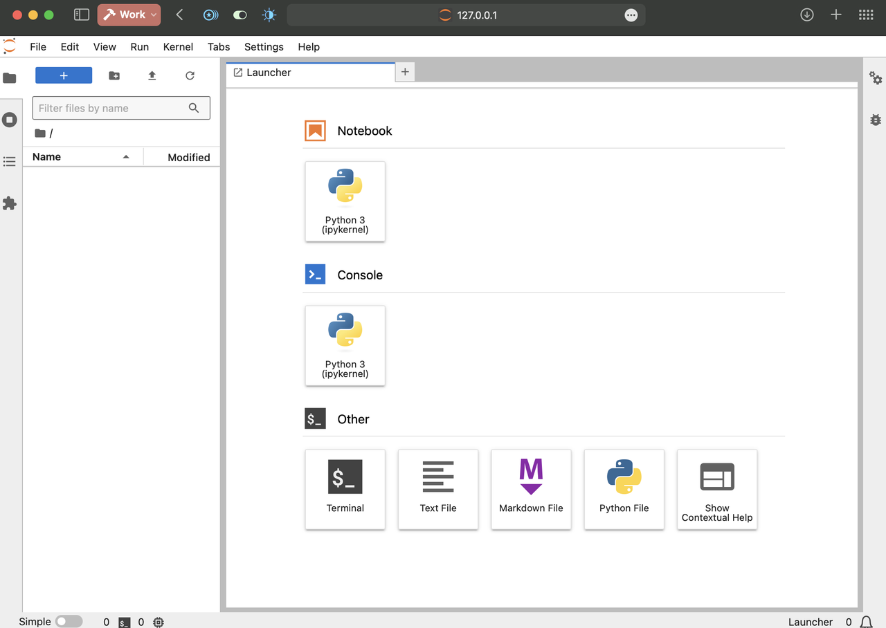

# Setup the Python Environment

## Introduction

This lab guide will walk you through setting up Python, Jupyter Lab, and the frameworks and dependencies needed to write our RAG chatbot.

Estimated Time: 15 minutes

### Objectives

* Instal the desired version of Python
* Install Jupyter Lab and setup the access to it
* Install dependencies

### Prerequisites

* Basic knowledge of Oracle Cloud Infrastructure (OCI) concepts and consoles
* Basic Linux knowledge

## Task 1: Install Python

> Note: First, log in to your remote instance via SSH, as described in the previous lab.

### Step 1: Prerequisites.

   ```bash
   <copy>
   sudo dnf install git
   sudo dnf install sqlite-devel
   sudo dnf install libffi-devel
   </copy>
   ```
### Step 2: We need "pyenv" in order to manage our Python environment.

   ```bash
   <copy>
   curl https://pyenv.run | bash
   </copy>
   ```
   Then add pyen load code like this :
   ```
   <copy>
   nano  ~/.bashrc
   </copy>
   ```
   and paste this code at the end :
   ```
   <copy>
   export PYENV_ROOT="$HOME/.pyenv"
   [[ -d $PYENV_ROOT/bin ]] && export PATH="$PYENV_ROOT/bin:$PATH"
   eval "$(pyenv init -)"

   eval "$(pyenv virtualenv-init -)"
   </copy>
   ```

   Close and save with `control-x`, `y`, and `Enter`

   Make sure the new lines in our `bashrc` are run before going further: 

   ```bash
   <copy>
   source ~/.bashrc
   </copy>
   ```

### Step 3: Once we have `pyenv` up and running, let's install Python 3.12.
```
<copy>pyenv install 3.12</copy>
```
Creating the working folder:
```
<copy>mkdir vectors</copy>
```
```
<copy>cd vectors</copy>
```

### Step 4: Assign the Python version we just downloaded to our working directory:
```
<copy>pyenv local 3.12</copy>
```

Now check if it succeeded :
```
<copy>python --version</copy>
```
## Task 2: Install the required frameworks

```bash
<copy>
pip install oracledb
pip install sentence-transformers
pip install oci
</copy>
```

## Task 3: Install and configure Jupyter Lab

### Step 1: Install the Jupyter server
```
<copy>pip install --user jupyterlab</copy>
```
Now let's see if it works:
```
<copy>jupyter-lab --no-browser --ip 0.0.0.0 --port 8888</copy>
```
If you see an output like this one, it worked. 



Leave it running, but write down the `token` listed in the command output.  

### Step 2: Open an SSH tunnel to allow access to the Jupyter Lab server.

Instead of exposing Jupyter Lab directly to the internet, you can use SSH tunneling for a more secure connection.

> Note: Any method of connecting to your remote Jupyter server is valid; however, we are using SSH tunneling here for simplicity and security reasons.

In your local terminal, not within the SSH session with your remote instance, run this:

```bash
<copy>ssh -L 8888:localhost:8888 -i <private_ssh_key> opc@<public_ip_address></copy>
```
> Note: The exact connection details depend on how you configured remote access when creating the instance.

Now, open the Jupyter URL http://127.0.0.1:8888/lab?token=[`the token listed by your jupyter command output`] in a browser on your local machine.



You may now **proceed to the next lab**

## Learn More
* [Oracle Generative AI Service](https://www.oracle.com/artificial-intelligence/generative-ai/generative-ai-service/)
* [Oracle Database Free](https://www.oracle.com/database/free/)
* [Get Started with Oracle Database 23ai](https://www.oracle.com/ro/database/free/get-started/)

## Acknowledgements
* **Author** - Bogdan Farca, Customer Strategy Programs Leader, Digital Customer Experience (DCX), EMEA
* **Contributors** 
   - Liana Lixandru, Senior Digital Adoption Manager, Digital Customer Experience (DCX), EMEA
   - Wojciech Pluta, Director, Technical Product Marketing
   - Kevin Lazarz, Senior Manager, Product Management, Database
* **Last Updated By/Date** -  Bogdan Farca, Sep 2024