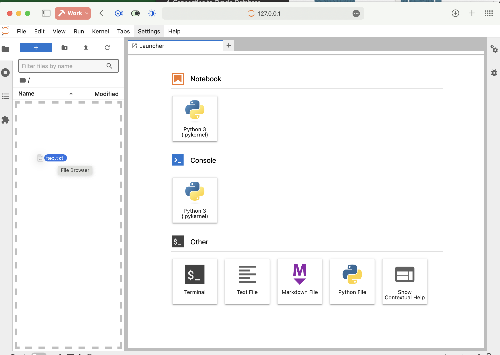
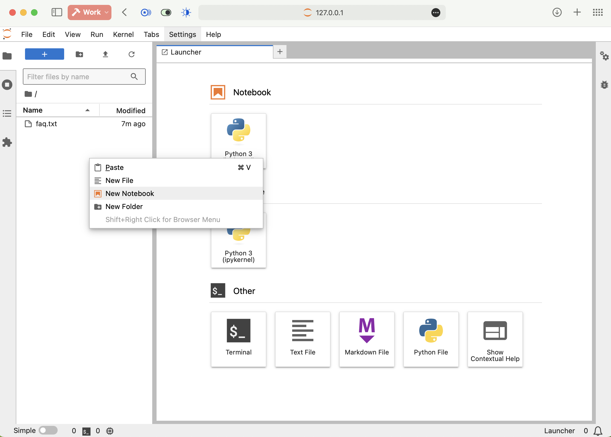
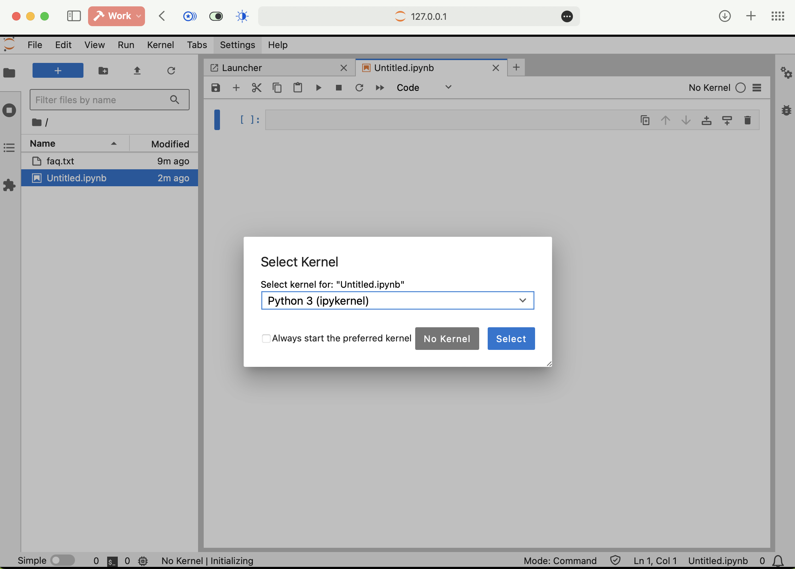
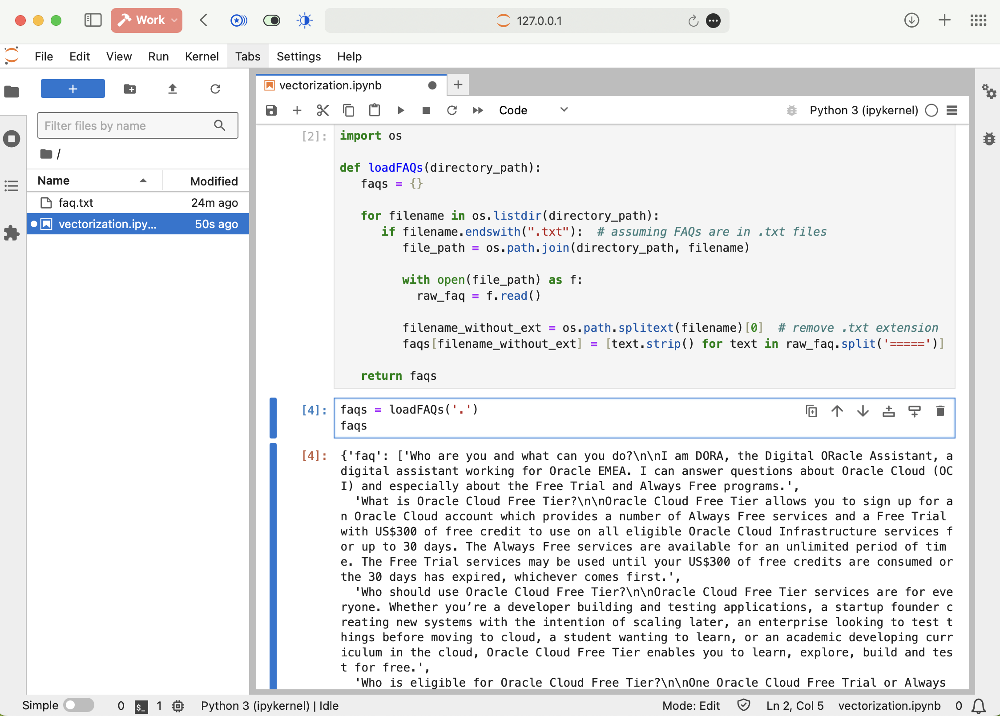

# Generate vector embeddings

## Introduction

This lab guides you through the code required to load text files from a local folder, split them into segments, and then create embeddings and ingest them into the Oracle 23ai vector database.

We utilize a traditional RAG approach, loading and parsing a text FAQ from a file, segmenting it, generating embeddings, and calculating chunk-question similarities. We will subsequently feed the top segments to an LLM prompt with the user's question, crafting a response.

Estimated Time: 40 minutes

### Objectives

* Write code to load a number of text files from a local folder
* Chunk the files into logical parts
* Create vector embeddings for the chunks and upload them to the vector database

### Prerequisites

* Basic knowledge of Oracle Cloud Infrastructure (OCI) concepts and consoles
* Working knowledge of Python and Jupyter Lab
* The virtual machine and Oracle Database 23Aai setup from the previous lab.

### Concepts
#### What is a Vector?
A vector is like a fingerprint for information. Just like every person’s fingerprint is unique and gives us lots of details about them, a vector in AI is a unique set of numbers representing the important semantic features of a piece of information, like a block of text, an image, a sound, or a video.

#### What is Similarity Search and Outlier Search?
A similarity search helps you find semantically similar things, like Google or Bing does. But imagine being able to do that in the database, with text, audio, image, and video files and the full power of SQL and PL/SQL at your disposal. An outlier search does the opposite: it retrieves the most dissimilar results.

#### What is a LLM?
LLMs, or Large Language Models, are AI algorithms that use deep learning techniques and large data sets to understand, summarize, generate, and predict new content. Oracle AI Vector Search works well with any Large Language Model [LLM] and vector embedding model.

#### What is RAG?
Retrieval Augmented Generation (RAG) is a technique that enhances LLMs by integrating Similarity Search. This enables use cases such as a corporate chatbot responding with private company knowledge to make sure it’s giving answers that are up-to-date and tailored to your business.

## Task 1: Loading the text sources from a file.

Let's work with our source files, which contain the knowledge we want to use as the foundation for our chatbot's responses.

### Source files format
FAQs are loaded from a file, encoded, and stored. For this example, we will use a properly formatted plain text FAQ, following the pattern:
```
What is Oracle Cloud Free Tier?

Oracle Cloud Free Tier allows you to sign up for an Oracle Cloud account which provides a number of Always Free services and a Free Trial with US$300 of free credit to use on all eligible Oracle Cloud Infrastructure services for up to 30 days. The Always Free services are available for an unlimited period of time. The Free Trial services may be used until your US$300 of free credits are consumed or the 30 days has expired, whichever comes first.

=====

Who should use Oracle Cloud Free Tier?

Oracle Cloud Free Tier services are for everyone. Whether you’re a developer building and testing applications, a startup founder creating new systems with the intention of scaling later, an enterprise looking to test things before moving to cloud, a student wanting to learn, or an academic developing curriculum in the cloud, Oracle Cloud Free Tier enables you to learn, explore, build and test for free.

=====

Why do I need to provide credit or debit card information when I sign up for Oracle Cloud Free Tier?

To provide free Oracle Cloud accounts to our valued customers, we need to ensure that you are who you say you are. We use your contact information and credit/debit card information for account setup and identity verification. Oracle may periodically check the validity of your card, resulting in a temporary “authorization” hold. These holds are removed by your bank, typically within three to five days, and do not result in actual charges to your account.

=====
```

So, we have the question, an empty line, the answer, and then a separator denoted by `=====`. For this simple example, we load the whole thing into memory. For a small FAQ file, there is no need for a proper vector database; however, if your knowledge base grows, you will want one.

### Step 1: Dowload the sample FAQ file
Download the sample file from [this link](files/faq.txt?download=1).
   
Now, drag and drop the downloaded file into the Jupyter window to upload it to your remote instance.


### Step 2: Create a new notebook to host our code.
Right-click into the left navigation pane in the Jupyter window and select "New notebook".



Select the `Python 3` kernel and click `Select`.


Now right-click the file name and rename it to something more descriptive, like `vectorization.ipynb`.


### Step 3: Load the source FAQ
Finally, let's start to code.

1. Enter this code into the first cell in our notebook:

   ```python
   <copy>
   import os

   def loadFAQs(directory_path):
      faqs = {}

      for filename in os.listdir(directory_path):
         if filename.endswith(".txt"):  # assuming FAQs are in .txt files
            file_path = os.path.join(directory_path, filename)
            
            with open(file_path) as f:
               raw_faq = f.read()
            
            filename_without_ext = os.path.splitext(filename)[0]  # remove .txt extension
            faqs[filename_without_ext] = [text.strip() for text in raw_faq.split('=====')]

      return faqs
      </copy>
   ```

   The function will open all the .txt files in a specified folder, read them, split the content using the `========` separator. It will then put all the resulting chunks in an array.

   The array is stored inside a dictionary with the file name used as the key. This will be useful later if many other FAQ files are available inside the folder, helping to differentiate between the sources.

   To execute it, click inside it and press Shift + Enter.

2. Now, let's call the function above with our data.

      Enter this code into a new cell :

      ```
      <copy>
      faqs = loadFAQs('.')
      faqs
      </copy>
      ```

      Press `shift + Enter` to run it: 

      


3. The final step in preparing the source data is to arrange the above dictionary in a way that is easy to ingest in the vector database. Enter this code into a new cell.

   ```python
   <copy>
   docs = [{'text': filename + ' | ' + section, 'path': filename} for filename, sections in faqs.items() for section in sections]

   # Sample the resulting data
   docs[:2]
   </copy>
   ```

   

   As you can see, for each chunk, we prepend the name of the source file to the text content, in our case, "faq |". This is a very simple way to ensure that some context is preserved with each chunk and vectorized later. It will help tremendously in the retrieval stage, when vector distances will be calculated between the question and each chunk.

   Also, we state the name of the source file in the path component. It will be useful later if we want to display a link back to the source when using the bot.  

## Task 2: Loading the FAQ chunks into the vector database

It is now time to insert the prepared chunks into the vector database.

### Step 1: Create a database connection
<if type="freetier">1. Drag and drop the wallet file you downloaded previosly into the Jupyter file pane. Unzip it in folder named "wallet".</if>
1. The connection details should be pinned down in a cell.
   ```python
   <copy>
   un = "<your database username>"
   pw = "<your database password>"
   <if type="livelabs">cs = "host.containers.internal/FREEPDB1"</if>
   <if type="ocw24">cs = "host.containers.internal/FREEPDB1"</if>
   </copy>
   ```
   > Note: Use the exact username and password you set up for the database in the previous lab.

2. And now we connect to the database.
   ```python
   <copy>
   import oracledb
   <if type="freetier">
   dsn = '<NAME OF THE DATABASE>_high' 

   connection = oracledb.connect(
      config_dir='../Graphs/wallet',
      user=un,
      password=pw,
      dsn=dsn,
      wallet_location='./wallet',
      wallet_password=<your wallet password>)
   </if><if type="livelabs">connection = oracledb.connect(user=un, password=pw, dsn=cs)</if><if type="ocw24">connection = oracledb.connect(user=un, password=pw, dsn=cs)</if>
   </copy>
   ```

### Step 2: Create the `faqs` table
We need a table inside our database to store our vectors and metadata.

```python
<copy>
table_name = 'faqs'

with connection.cursor() as cursor:
    # Create the table
    create_table_sql = f"""
        CREATE TABLE IF NOT EXISTS {table_name} (
            id NUMBER PRIMARY KEY,
            payload CLOB CHECK (payload IS JSON),
            vector VECTOR
        )"""
    try:
        cursor.execute(create_table_sql)
    except oracledb.DatabaseError as e:
        raise
    
    connection.autocommit = True
    </copy>
```

### Step 3: Vectorize the text chunks
1. We need an encoder to handle the vectorization for us.

   ```python
   <copy>
   from sentence_transformers import SentenceTransformer
   <if type="freetier">encoder = SentenceTransformer('all-MiniLM-L12-v2')</if>
   <if type="livelabs">encoder = SentenceTransformer('./transformers/all-MiniLM-L12-v2', local_files_only=True)</if>
   <if type="ocw24">encoder = SentenceTransformer('./transformers/all-MiniLM-L12-v2', local_files_only=True)</if>
   </copy>
   ```
   Ignore the warning saying `IProgress not found.`, among others.

2. We go through all our chunks (stored in the `docs` dictionary) and encode the text content.
   ```python
   <copy>
   import array

   # Define a list to store the data
   data = [
      {"id": idx, "vector_source": row['text'], "payload": row} 
      for idx, row in enumerate(docs)
   ]

   # Collect all texts for batch encoding
   texts = [f"{row['vector_source']}" for row in data]

   # Encode all texts in a batch
   embeddings = encoder.encode(texts, batch_size=32, show_progress_bar=True)

   # Assign the embeddings back to your data structure
   for row, embedding in zip(data, embeddings):
      row['vector'] = array.array("f", embedding)
   </copy>
   ```

That's it, now we have a structure with all our chunks, including its context—the source file name, in this simple example—and the vector representation for each of them.

### Step 4: Insert the chunks + vectors in the database
Initially, we use a cursor object from the established database connection to execute a command that truncates the specified table. This operation ensures that all existing rows are removed, effectively resetting the table to an empty state and preparing it for fresh data insertion.

Subsequently, the code prepares a list of tuples containing the new data. Each tuple includes an id, a JSON-encoded payload, and a vector. 

The `json.dumps` function is used to convert the payload into a JSON string format, ensuring that complex data structures are properly serialized for database storage. 

We then utilize the `cursor.executemany` method to insert all prepared tuples into the table in a single batch operation. This method is highly efficient for handling bulk inserts, significantly reducing the number of database transactions and improving performance. Finally, the `connection.commit` method is called to commit the transaction, ensuring that all changes are saved and made permanent in the database. 

```python
<copy>
import json

with connection.cursor() as cursor:
    # Truncate the table
    cursor.execute(f"truncate table {table_name}")

    prepared_data = [(row['id'], json.dumps(row['payload']), row['vector']) for row in data]

    # Insert the data
    cursor.executemany(
        f"""INSERT INTO {table_name} (id, payload, vector)
        VALUES (:1, :2, :3)""",
        prepared_data
    )

    connection.commit()
</copy>
```

Just to confirm, let's examine what is currently stored in our table.

```python
<copy>
with connection.cursor() as cursor:
    # Define the query to select all rows from a table
    query = f"SELECT * FROM {table_name}"
    
    # Execute the query
    cursor.execute(query)
    
    # Fetch all rows
    rows = cursor.fetchall()
    
    # Print the rows
    for row in rows[:5]:
        print(row)
</copy>
```

The output should look like this: 


At this point, our database contains all our knowledge base, so we are ready to proceed to the next step, basing it on users' questions.

You may now **proceed to the next lab**

## Learn More
* [Oracle Generative AI Service](https://www.oracle.com/artificial-intelligence/generative-ai/generative-ai-service/)
* [Oracle Database Free](https://www.oracle.com/database/free/)
* [Oracle Autonomous Database](https://www.oracle.com/autonomous-database/)
* [Get Started with Oracle Database 23ai](https://www.oracle.com/ro/database/free/get-started/)

## Acknowledgements
* **Author** - Bogdan Farca, Customer Strategy Programs Leader, Digital Customer Experience (DCX), EMEA
* **Contributors** 
   - Liana Lixandru, Principal Digital Adoption Manager, Digital Customer Experience (DCX), EMEA
   - Wojciech Pluta, Director, Technical Product Marketing
   - Kevin Lazarz, Senior Manager, Product Management, Database
* **Last Updated By/Date** -  Bogdan Farca, January 2025
