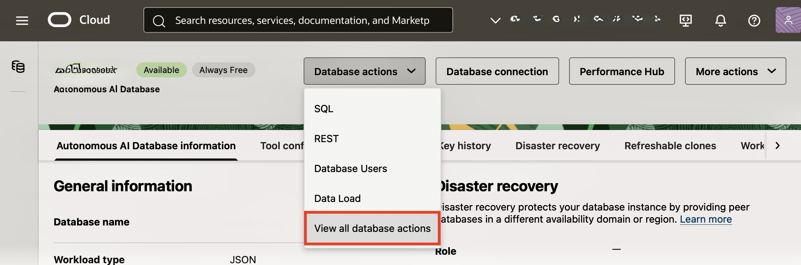

# Start the Machine Learning Notebook Environment

## Introduction

This lab guide will walk you through starting up Machine Learning Notebook environment in your own tenancy.  We will explore Oracle AI Database AI capabilities.

Estimated Time: 15 minutes

### Objectives

* Set-up the Machine Learning Notebook in your Oracle OCI tenancy

### Prerequisites

* Access to your Oracle OCI tenancy and Oracle AI Database
* Running Oracle AI Database
* Basic Linux, Python and SQL knowledge

## Task 1: Start the Oracle AI Database
On your Autonomous AI Database dashboard click on **`Database Actions`** drop down menu and choose **`View all database actions`**:


## Task 2: Open a Machine Learning Notebook

You may need to use your username and password to enter the **`Database Actions`** interface

1. Go to the hamburger menu in the upper left and clock on **`Machine Learning`**:


2. Under **`Quick Actions`** choose **`Notebooks`**:


3. Create a Notebook:


4. Name the Notebook:
```
ai-notebook
```


## Task 3:

Connect the Notebook to your database:

````python
import pandas as pd

def say_hello(name):
    print(f"Hello, {name}!")

say_hello("World")
````


