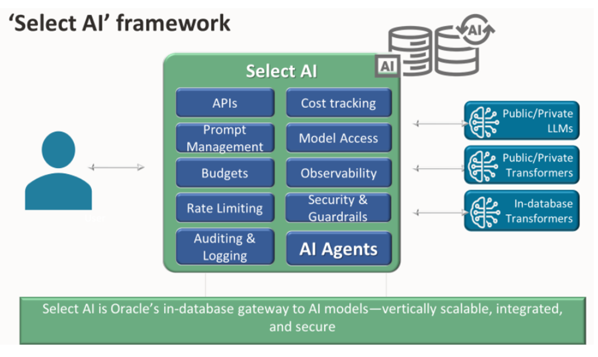

# Lab 5 - Select AI 

**( Refer to 'Lab 5' of the Jupyter notebook as go through this lab )** 

## Introduction

**Select AI** enables SQL access to generative AI using Large Language Models (LLMs) and embedding models. This includes support for natural language to SQL query generation and retrieval augmented generation, among other features.

Select AI generates, runs, and explains SQL queries from user-provided natural language prompts. It automates tasks that users would otherwise perform manually using their schema metadata and a large language model (LLM) of their choice. Additionally, it facilitates retrieval augmented generation with vector stores and enables chatting with the LLM.

### Objectives

Here are the steps we will cover in this lab:

1. Create an **AI Profile**.
2. Generate summaries for each of your documents.
3. Use the Select AI **'narrate'** function to **generate SQL from a natural language prompt, execute the SQL and pass the results to an LLM** to present a well-formed response.
4. Use the **showsql** function to show the generated SQL from 'narrate'.
5. Use Select AI as a **chatbot**.

### **Prerequisites**

This lab assumes you have:

- All previous labs successfully completed

## Task 1: Create an AI Profile

**Oracle AI Database 26ai**  **AI profiles**  are used to facilitate and **configure access to an LLM** and to setup for generating, running, and explaining SQL based on natural language prompts. It also facilitates retrieval augmented generation using embedding models and vector indexes and allows for chatting with the LLM.

AI profiles include **database objects that are the target for natural language queries**. Metadata used from these targets can include database table names, column names, column data types, and comments.

You create and configure AI profiles using the **DBMS\_CLOUD\_AI.CREATE\_PROFILE** and **DBMS\_CLOUD\_AI.SET\_PROFILE** procedures.

In addition to specifying tables and views in the AI profile, you can also specify tables mapped with external tables, including those described in Query External Data with Data Catalog. This enables you to query data not just inside the database, but also data stored in a data lake's object store.

**(jupyter notebook) -->**  [Lab5 Task1:]&nbsp;&nbsp;&nbsp;When you have finished reviewing this code and are ready to continue, press **Shift+Enter** twice, or click the **Run Cell** icon twice to **create the AI profile** and move to the next task.

## Task 2: Create Document Summaries

Select AI enables you to **generate a summary of your text**, especially large texts, generally supporting up to 1 GB using AI providers. You can extract key insights from texts or large files as per your specific needs. This feature uses the LLM specified in your AI profile to generate a summary for a given text.

Select AI offers summarization of your content in the following ways:

- Use **summarize** as the Select AI action.
- Use the **DBMS\_CLOUD\_AI.SUMMARIZE** function to specify customizations such as summary length, format, extraction level for a summary and so on with summarization parameters. DBMS\_CLOUD\_AI.SUMMARIZE takes as input text **content** and the **AI profile**. **Parameters** can be passed to customize the summary.  Most importantly, a **natural language request** can be passed for a user to exactly describe the nature of the summary that is desired.

**(jupyter notebook) -->**  [Lab5 Task2:]&nbsp;&nbsp;&nbsp;When you have finished reviewing this code and are ready to continue, press **Shift+Enter** twice, or click the **Run Cell** icon twice to **create summaries of each document** and move to the next task.

## Task 3: Select AI narrate

The **narrate** action supports both natural language to SQL (NL2SQL) and RAG.

For **NL2SQL**, narrate sends the result of a SQL query run by the database to the **LLM**, which generates a natural language description of that result.

For **RAG**, when the AI profile includes a vector index, the system uses the specified **embedding model (or default transformer)** to create a vector embedding from the prompt for semantic similarity search against the vector store. The system then adds the retrieved content from the vector store to the user prompt and sends it to the LLM to generate a response based on this information.

**(jupyter notebook) -->**  [Lab5 Task3:]&nbsp;&nbsp;&nbsp;When you have finished reviewing this code and are ready to continue, navigate to the next cell and press **Shift+Enter** twice, or click the **Run Cell** icon twice to **run the Select AI 'narrate' function**, navigate to the next code block and press **Shift+Enter** twice, or click the **Run Cell** icon twice to **run the Select AI 'showsql' function** and move to the next task.

## Task 4: Select AI chat

Select AI **chat** passes a user prompt **directly to the LLM** specified in the AI profile to generate a response, which is presented to the end user.

For current session-based, short-term **conversations**, if 'conversation' in the DBMS\_CLOUD_AI.CREATE\_PROFILE function is set to 'true', this option includes content from prior interactions or prompts, potentially including schema metadata. For multiple named conversations, only the chat-related prompt histories are sent to the LLM.

**Conversations** in Select AI refer to the **interactive dialogue between the user and the system**, where a sequence of user-provided natural language prompts are stored and managed to support long-term memory for LLM interactions.

Select AI supports **short-term, session-based conversations**, which are enabled in the AI profile, as well as **long-term, named conversations**, which are enabled using specific procedures or functions and conversation IDs.

**(jupyter notebook) -->**  [Lab5 Task4:]&nbsp;&nbsp;&nbsp;When you have finished reviewing this code and are ready to continue, navigate to the next cell and press **Shift+Enter** twice, or click the **Run Cell** icon twice to **run the Select AI 'chat' function.**

You have **successfully completed the workshop**

## Acknowledgements

**Author** - Gary McKoy, Master Principal Solution Architect, Data Platform Infrastructure, NACI

**Contributors** -

* Eileen Beck, Cloud Solution Engineer, Data Platform Infrastructure, NACI
* Sania Bolla, Cloud Solution Engineer, Data Platform Infrastructure, NACI
* Abby Mulry, Cloud Solution Engineer, Data Platform Infrastructure, NACI
* Richard Piantini Cid, Cloud Solution Engineer, Data Platform Infrastructure, NACI

**Last Updated By/Date** -  Gary McKoy, March 2026