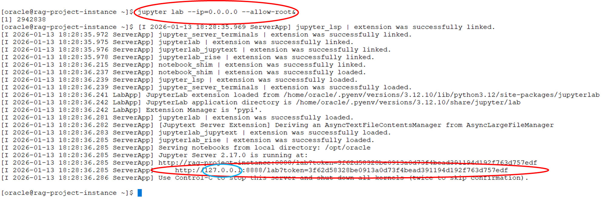
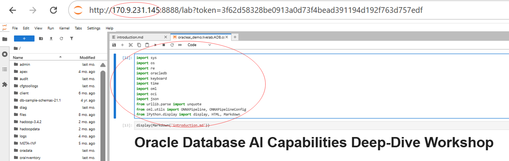
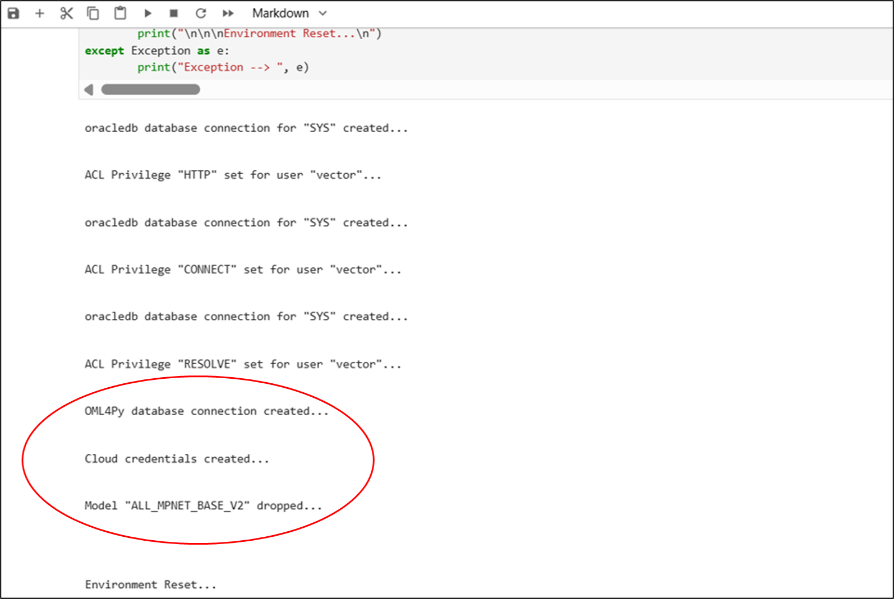

# Start the Jupyter Lab Environment

## Introduction

This lab guide will walk you through starting up Jupyter Lab notebook, which is the development environment we will explore Oracle AI Database AI capabilities.

Estimated Time: 15 minutes

### Objectives

* Start the Jupyter Lab server and open the development notebook.

### Prerequisites

* Access to the virtual environment generated for this lab
* Basic Linux, Python and SQL knowledge

## Task 1: Open the remote Jupyter Lab environment
On your bash shell command line, enter the following:
```
<copy>
jupyter lab --ip=0.0.0.0 --allow-root&
</copy>
```



Copy the highlighted URL and paste it into your browser.  Substitute your IP address in place of the localhost IP address (127.0.0.1) (see below)

Press 'enter' to execute the URL.
You are now in the lab notebook. Press 'Shift-Enter' or Click the 'Run Cell' icon(  ) to import the required python modules.



## Task 2: Verify the valid setup of the workshop environment

 The next two notebook cells introduce the workshop and provide an overview of the goals and expectations.  When ready, press 'Shift-Enter' or click the 'Run Cell' icon(  ) in each cell to continue.
 


The next cell verifies and resets the workshop environment. These tasks include:
- Setting fine-grained network access control entries (ACEs) for Access Control Lists (ACLs)
- Creating OCI credentials
- Granting access to the database data pump directory
- Removing previously deployed sentence transformer models

When ready, press 'Shift-Enter' or click the 'Run Cell' icon(  ) to reset the workshop.

When the following output is successfully displayed, the workshop has been reset and you may move on to the next Lab
NOTE: This cell may be rerun until all output is displayed
 



