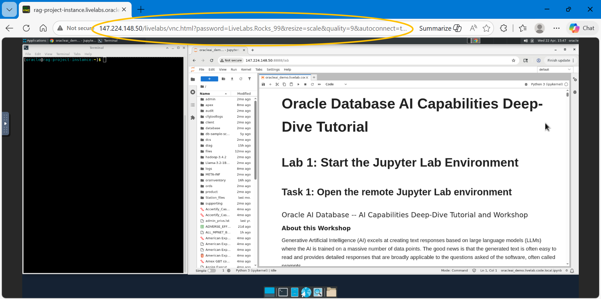
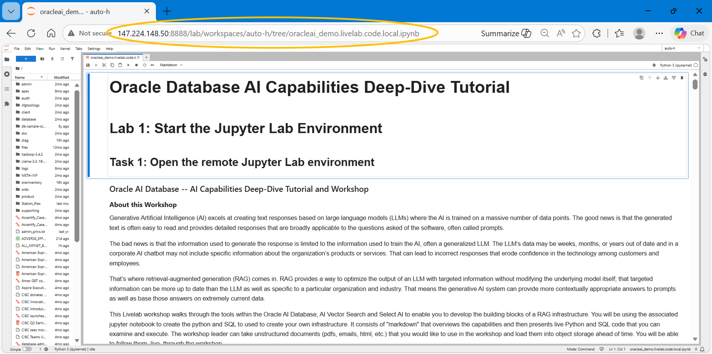
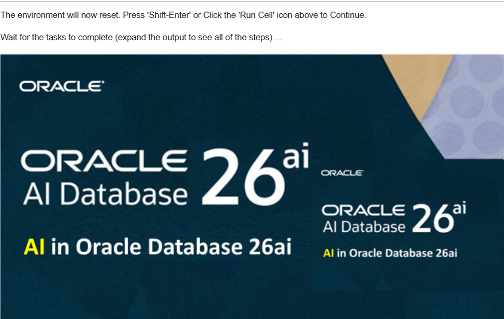

# Lab 1: Start the Jupyter Lab Environment

## Introduction

**(Refer to 'Lab 1' of the Jupyter notebook as go through this lab)** 

This lab guide will walk you through starting up Jupyter Lab notebook, which is the development environment we will explore Oracle AI Database AI capabilities.

Estimated Time: 10 minutes

### Objectives

* Start the Jupyter Lab server and open the development notebook.

### Prerequisites

* Access to the virtual environment generated for this lab
* Basic Linux, Python and SQL knowledge

## Task 1: Open the remote Jupyter Lab environment

On your bash shell command line, enter the following:

```python
<copy>
jupyter lab --ip=0.0.0.0 --allow-root&
</copy>
```



**(jupyter notebook) -->**  [Lab1 Task1:]&nbsp;&nbsp;&nbsp;Copy the highlighted URL and paste it into your browser.  Substitute your IP address in place of the localhost IP address (127.0.0.1)** (see below)

**(jupyter notebook) -->**  Press 'enter' to execute the URL.
You are now in the lab notebook. Press 'Shift-Enter' or Click the 'Run Cell' icon(  ) to import the required python modules.



## Task 2: Verify the valid setup of the workshop environment

 (switch to browser) [Lab1 Task2:]&nbsp;&nbsp;&nbsp;The next two notebook cells introduce the workshop and provide an overview of the goals and expectations.  When ready, press 'Shift-Enter' or click the 'Run Cell' icon(  ) in each cell to continue.
 


The next cell verifies and resets the workshop environment. These tasks include:

* Setting fine-grained network access control entries (ACEs) for Access Control Lists (ACLs)
* Creating OCI credentials
* Granting access to the database data pump directory
* Removing previously deployed sentence transformer models

**(jupyter notebook) -->**  [Lab1 Task2:]&nbsp;&nbsp;&nbsp;When ready, press 'Shift-Enter' or click the 'Run Cell' icon(  ) to reset the workshop.

When the following output is successfully displayed, the workshop has been reset and you may move on to the next Lab.
NOTE: This cell may be rerun until all output is displayed


You may now **proceed to the next lab**

## Acknowledgements

**Author** - Gary McKoy, Master Principal Solution Architect, Data Platform Infrastructure, NACI

**Contributors** -

* Eileen Beck, Cloud Solution Engineer, Data Platform Infrastructure, NACI
* Sania Bolla, Cloud Solution Engineer, Data Platform Infrastructure, NACI
* Abby Mulry, Cloud Solution Engineer, Data Platform Infrastructure, NACI
* Richard Piantini Cid, Cloud Solution Engineer, Data Platform Infrastructure, NACI

**Last Updated By/Date** -  Gary McKoy, March 2026