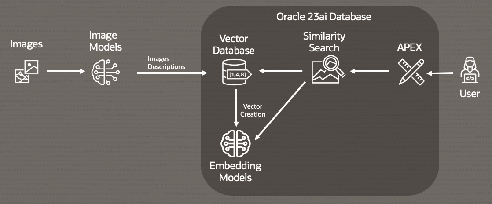

# Introduction

## About this Workshop

Large Language Models (LLMs) have transformed artificial intelligence by enabling computers to understand and generate human-like text. These models rely on vectors—mathematical representations of words, phrases, and sentences—to process and create language. Vectors allow LLMs to capture the meaning of words and the relationships between them, making it possible for the models to perform tasks like text generation, translation, and question-answering with impressive accuracy. However, as we push LLMs to handle more complex tasks, such as integrating text with other types of data like images, new challenges arise. Combining these different kinds of vectors—those representing text and those representing images—requires advanced techniques to ensure the model can effectively understand and generate multimodal information.

This workshop outlines a two-step approach to tackle a problem by leveraging two different models. The first model generates descriptions for images, while the second model creates vectors for these textual descriptions. The second model is loaded in the database allowing for both vector generation and AI Vector Search without leaving the database. By separating the tasks, the complexity is reduced, making it easier to use existing models, as very few can handle both images and text simultaneously. This approach not only simplifies the problem but also broadens the range of available large language models (LLMs) since each task is more straightforward on its own.

The workflow diagram illustrates the following steps:

- Image Input: Start with an image that needs to be described.
- Description Generation: Use a model to generate a textual description or caption for the image.
- Text Vectorization: Pass the generated description through a second model (embedded in the database) that creates vectors from the text.
- APEX Application: Create a quick application leveraging an embedded text model and AI Vector Search

This method makes the solution more versatile since the text embeddings and search occur within the database allowing any application to be developed.

  

Estimated Workshop Time: 70 Minutes

### Objectives

In this workshop, you will learn how to:
* Work with Large Language Models (LLMs)
* Create and Load Vectors
* Create an APEX application using AI Vector Search

### Prerequisites

This lab assumes you have:
* An Oracle account

## Learn More

* [Oracle AI Vector Search Users Guide](https://docs.oracle.com/en/database/oracle/oracle-database/23/vecse/whats-new-oracle-ai-vector-search.html)
* [AI Vector Search Blog](https://blogs.oracle.com/database/post/oracle-announces-general-availability-of-ai-vector-search-in-oracle-database-23ai)

## Acknowledgements
* **Author** - David Start, Product Management
* **Contributors** -  David Start, Product Management, Francis Regalado, Product Management
* **Last Updated By/Date** - David Start, Sept 2024
