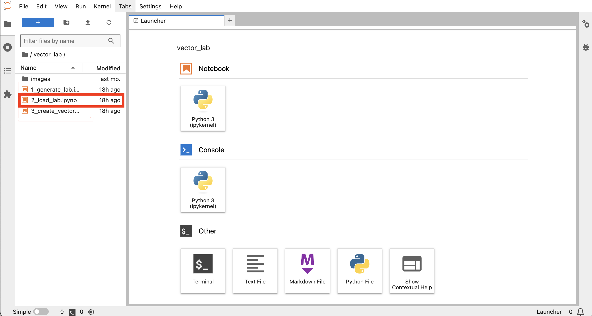

# Create and Load Image Descriptions

## Introduction

This lab will walk you through generating descriptions for all of the images and loading them into the database.

Estimated Lab Time: 15 minutes

### Objectives

In this lab, you will:
* Use two models to generate descriptions for each image
* Load the descriptions and images into a databse

### Prerequisites

This lab assumes you have:
* All previous labs successfully completed

## Task 1: Open Notebook

This task will have you login to the Jupyter Notebook environment and run the specific notebook for this lab.

1. **If you are already logged into the Jupyter Notebook environment skip to step 5 otherwise** open the "View Login Info" section of your workshop.

	

2. Copy the Jupyter Notebook Password and Click the Jupyter Notebook URL

    

3. Paste the Jupyter Notebook Password you copied in the previous step into the Notebook
    

4. You should now be on the Jupyter Notebook landing screen.Open the folder named `vector lab` on the left hand side of the screen located in the file explorer
    

5. In the left File Explorer panel open the vector\_lab folder and open the **2\_load\_lab.ipynb** notebook
    
    

6. Follow the steps in the notebook. A few things to remember:
    - There are markdown blocks and code blocks mixed together
    - The run button can be used on both code and markdown blocks (markdown just advances you to the next block)
    - When you run a code block there are [ ] next to the code block. If it changes to a [\*] that means it running. If it has a number like [1] then its done running.
    - Passwords and additional information you may need will be found in the "View Login Info" where the Jupyter Notebook link was

**Note: The notebooks can be downloaded in the learn more section for your viewing**

Once you have completed the steps in the notebook please return to the workshop so you can continue to the next lab.

## Learn More

* [Oracle AI Vector Search Users Guide](https://docs.oracle.com/en/database/oracle/oracle-database/23/vecse/whats-new-oracle-ai-vector-search.html)
* [AI Vector Search Blog](https://blogs.oracle.com/database/post/oracle-announces-general-availability-of-ai-vector-search-in-oracle-database-23ai)
* [Workshop Notebook Download](https://c4u04.objectstorage.us-ashburn-1.oci.customer-oci.com/p/EcTjWk2IuZPZeNnD_fYMcgUhdNDIDA6rt9gaFj_WZMiL7VvxPBNMY60837hu5hga/n/c4u04/b/livelabsfiles/o/labfiles/ocw_image_vector_lab.zip)

## Acknowledgements
* **Author** - David Start, Product Management
* **Contributors** -  David Start, Product Management,  Francis Regalado, Product Management
* **Last Updated By/Date** - David Start, Sept 2024
