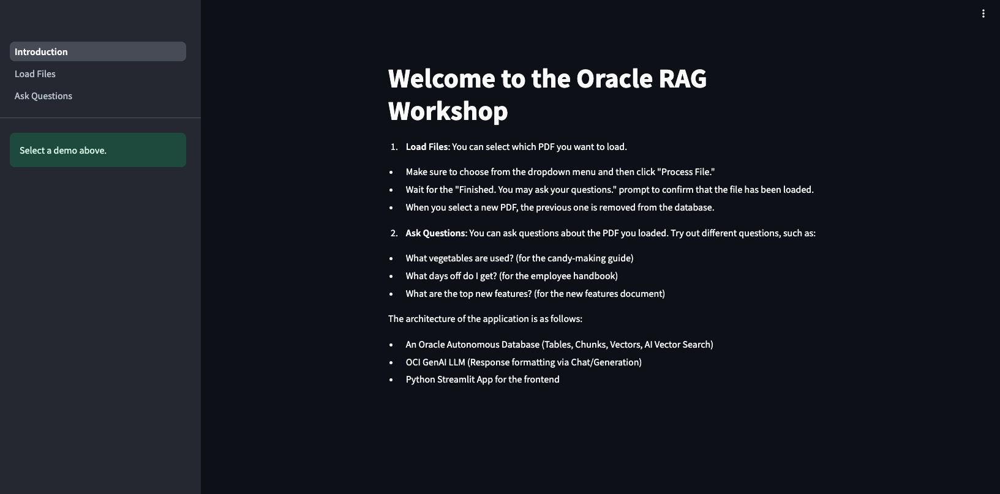

# Lab 1: Running a RAG Application

## Introduction 
Estimated Time: 10 Minutes

### Objectives

In this lab, you will run a RAG application interactively using a user-friendly interface. You’ll be able to choose and load several PDF documents and ask your own questions using a prompt. This setup will allow you to easily interact with the RAG system and observe how it processes and generates responses in real time.

### Prerequisites
This lab assumes you have:
- All previous labs successfully completed

## Task 1: Open the Notebook Environment
This task will have you login to the Jupyter environment and run specific notebooks for this lab.

1. **If you have already logged into the Jupyter environment skip to step 5, otherwise** open "**View Login Info**" section of your workshop.

   

2. Copy the Jupyter Notebook Password and click the Jupyter Notebook URL.

   

3. Paste the Jupyter Notebook password you copied in the previous step into the password field.

   

4. You should now see the Jupyter Notebook's landing page. 
   

5. In the menu at the top click on **File** >> **New** >> **Terminal**.
   

6. In the terminal, copy and paste the code below.
      ````
      <copy>
      cd /home/oracle
      /home/oracle/run.sh
      </copy>
      ````
      

7. The above commands will start a streamlit application running your Chatbot. Three URLs will appear. The last URL is the one that will allow you to connect from your browser. Click on the last URL labeled **External URL.**
   

## Task 2: Run the Application

1. Once your application is running, simply follow the steps in the user interface.

   

   Feel free to explore the documents with your own questions and discover how the RAG application can retrieve and provide accurate responses based on the document’s content.


You may now **proceed to the next lab**.

## Learn More

- [Oracle Database 23ai Documentation](https://docs.oracle.com/en/database/oracle/oracle-database/index.html)

- [Oracle AI Vector Search User's Guide](https://docs.oracle.com/en/database/oracle/oracle-database/23/vecse/whats-new-oracle-ai-vector-search.html)

- [Oracle AI Vector Search Blog](https://blogs.oracle.com/database/post/oracle-announces-general-availability-of-ai-vector-search-in-oracle-database-23ai)


## Acknowledgements
* **Author** - Francis Regalado, Database Product Management; David Start, Database Product Management
* **Contributors** -
* **Last Updated By/Date** - Francis Regalado, Database Product Manager October 2024
