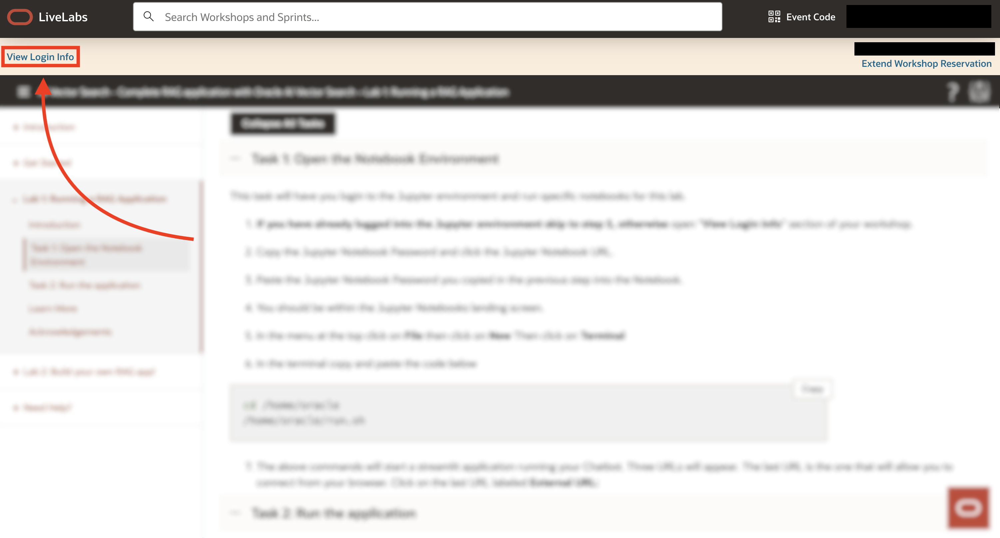
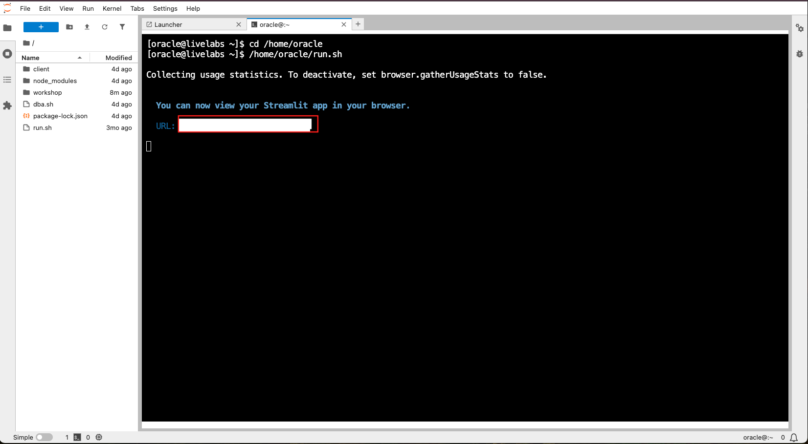

# Running a RAG Application

## Introduction 

Watch the following video for a brief walkthrough of the lab:

 [](videohub:1_ldgknjmv)
</br>

**_Estimated Time: 10 Minutes_**

### **Objectives**

In this lab, you will run a RAG application interactively using a user-friendly interface. You’ll be able to choose and load several PDF documents and ask your own questions using a prompt. This setup will allow you to easily interact with the RAG system and observe how it processes and generates responses in real time.

### **Prerequisites**
This lab assumes you have:
- All previous labs successfully completed

## Task 1: Open the Jupyter Notebook Interface

1. In the upper-left corner, select **View Login Info**. 

   

2. You can now see all reservation details relevant to completing this workshop. Copy the Jupyter Notebook password and open the Jupyter Notebook URL.

   

3. Paste the Jupyter Notebook password into the password field, as shown below.

   

4. After a successfull login, you will see the Jupyter Notebook's landing page. 
   

## Task 2: Run the RAG Application

1. In the top navigation bar, open the terminal by clicking **File** >> **New** >> **Terminal**.
   

2. In the terminal, copy and paste the code below.
      ````
      <copy>
      cd /home/oracle
      /home/oracle/run.sh
      </copy>
      ````
      

3. The above commands will start a streamlit application running your Chatbot. A URL will appear. Click on the URL to interact with the application from your browser. 
   

4. You should now see the landing page of the application you'll be building shortly. Explore the application by following the instructions on the landing page. Feel free to explore the documents with your own questions and discover how the RAG application can retrieve and provide accurate responses based on the document’s content.

   Once finished you can return to these instructions.

   

You may now **proceed to the next lab**.

## Learn More

- [Oracle Database 23ai Documentation](https://docs.oracle.com/en/database/oracle/oracle-database/index.html)

- [Oracle AI Vector Search User's Guide](https://docs.oracle.com/en/database/oracle/oracle-database/23/vecse/whats-new-oracle-ai-vector-search.html)

- [Oracle AI Vector Search Blog](https://blogs.oracle.com/database/post/oracle-announces-general-availability-of-ai-vector-search-in-oracle-database-23ai)


## Acknowledgements
* **Author** - Francis Regalado, Database Product Management; David Start, Database Product Management
* **Contributors** - Brianna Ambler, Kaylien Phan, Database Product Management
* **Last Updated By/Date** - Francis Regalado, February 2025
