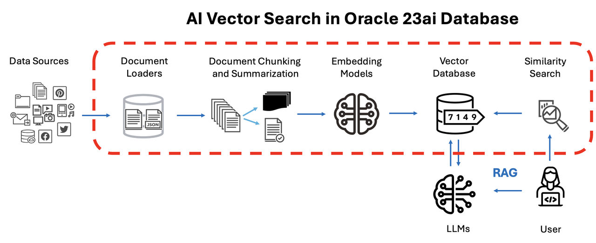

# AI Vector Search - Rag applications with Oracle AI Vector Search

### **About this Workshop**

Generative artificial intelligence (AI) excels at creating text responses based on large language models (LLMs) where the AI is trained on a massive number of data points. The good news is that the generated text is often easy to read and provides detailed responses that are broadly applicable to the questions asked of the software, often called prompts.

The bad news is that the information used to generate the response is limited to the information used to train the AI, often a generalized LLM. The LLM’s data may be weeks, months, or years out of date and in a corporate AI chatbot may not include specific information about the organization’s products or services. That can lead to incorrect responses that erode confidence in the technology among customers and employees.

That’s where retrieval-augmented generation (RAG) comes in. RAG provides a way to optimize the output of an LLM with targeted information without modifying the underlying model itself; that targeted information can be more up-to-date than the LLM as well as specific to a particular organization and industry. That means the generative AI system can provide more contextually appropriate answers to prompts as well as base those answers on extremely current data.

This lab will guide you through the process of building a Retrieval Augmented Generation (RAG) application using Oracle AI Vector Search and a Generative AI model. This application will act as a flexible template that can be adapted to a wide range of use cases. Oracle Database 23AI will function as the vector data, where you'll store important context for the model to use when generating responses. This approach allows you to create a robust system that retrieves relevant data and combines it with the power of generative AI to deliver accurate, up-to-date answers based on your specific business needs. By the end of this lab, you will have:
- Stored, chunked, and vectorized data from a PDF document.
- Used a Large Language Model (LLM) to generate a precise answer to a user’s query based on relevant context stored in Oracle Database 23AI.
- See the diagram below what you will be learning.
 
 

**_Estimated Time: 30 Minutes_**

## About Oracle AI Vector Search

Oracle AI Vector Search is a feature of Oracle Database 23ai that enables efficient searching of AI-generated vectors stored in the database. It supports fast search using various indexing strategies and can handle massive amounts of vector data. This makes it possible for Large Language Models (LLMs) to query private business data using a natural language interface, helping them provide more accurate and relevant results. Additionally, AI Vector Search allows developers to easily add semantic search capabilities to both new and existing applications.

### **Objectives**
The labs in this workshop will guide you through the following tasks:

- Getting familiar with the new Vector Datatype and PL/SQL packages for managing vector data and performing vector operations.
- Using PL/SQL to develop applications that work with Large Language Models (LLMs).
- Implementing Oracle AI Vector Search to store and search vectors within Oracle Database 23ai.
- Accessing popular LLMs and generating responses based on relevant data.
- Running a complete sample application that integrates all these concepts and showcases how to build a practical RAG solution.

By the end of the workshop, you’ll have hands-on experience working with Oracle’s AI-powered tools to build a scalable, efficient retrieval augmented generation (RAG) application.

## Learn More
- [What Is Retrieval-Augmented Generation](https://www.oracle.com/artificial-intelligence/generative-ai/retrieval-augmented-generation-rag/)

- [Oracle Database 23ai Documentation](https://docs.oracle.com/en/database/oracle/oracle-database/index.html)

- [Oracle AI Vector Search User's Guide](https://docs.oracle.com/en/database/oracle/oracle-database/23/vecse/whats-new-oracle-ai-vector-search.html)

- [Oracle AI Vector Search Blog](https://blogs.oracle.com/database/post/oracle-announces-general-availability-of-ai-vector-search-in-oracle-database-23ai)

- [Oracle AI Vector Embeddings](https://docs.oracle.com/en/database/oracle/oracle-database/23/vecse/store-vector-embeddings.html)

- [Oracle AI Vector Distance](https://docs.oracle.com/en/database/oracle/oracle-database/23/sqlrf/vector_distance.html)

## Acknowledgements
* **Author** - Francis Regalado, Database Product Management; David Start, Database Product Management
* **Contributors** - Brianna Ambler, Kaylien Phan, Database Product Management
* **Last Updated By/Date** - Francis Regalado, February 2025
