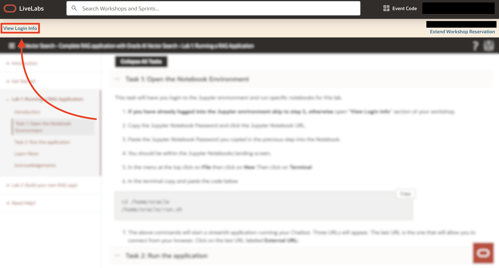
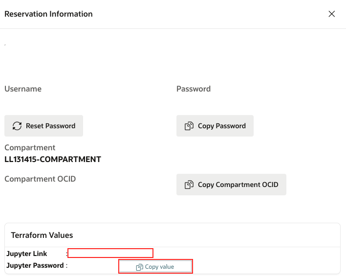
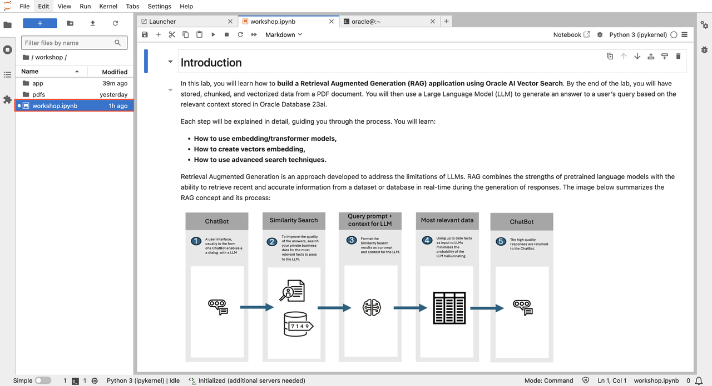
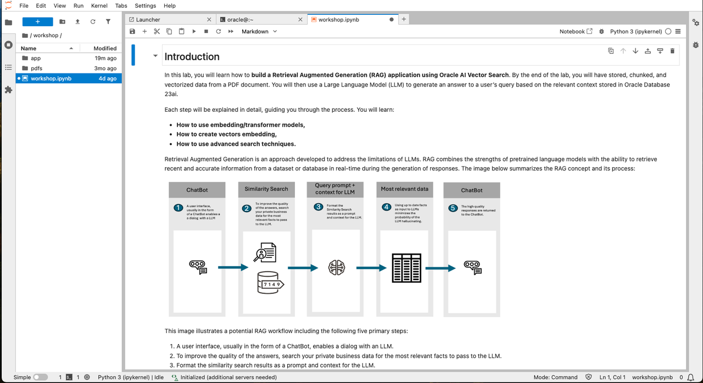

# Build Your Own RAG App!   

## Introduction

Watch the following video for a brief walkthrough of the lab:

A typical RAG (Retrieval Augmented Generation) application follows 7 key steps and requires a vector store. In this lab, you will learn how to build a RAG application using Oracle AI Vector Search. By the end of the lab, you will have stored, chunked, and vectorized data from a PDF document. You will then use a Large Language Model (LLM) to generate an answer to a user’s query based on the relevant context stored in Oracle Database 23ai. We’ll be working with documents (PDF) as the source data, but the same process can be applied to other data types like audio and video.

Here are the steps we will cover:

1. Load your document.
2. Convert the document to text.
3. Break the text into smaller chunks.
4. Use an embedding model to turn those chunks into vectors and store them in Oracle Database 23AI.
5. Ask a question in the prompt, and use the same embedding model to vectorize the question.
6. Perform a similarity search in Oracle Database 23ai using the question.
7. The search results and question are passed to the LLM to generate a final response.

Each step will be explained in detail, guiding you through the process of interacting with models, embedding vectors, and using advanced search techniques. In the main workshop, additional information and documentation will be provided for further exploration and deeper understanding of the concepts covered.

Throughout this section we will be leveraging a Jupyter Notebook to explore vectors. If you are unfamiliar with notebooks here are a few tips to get started:
- Instructions and code will be mixed together, each having their own blocks. You can use the run button on the code to see it execute. If you accidently hit run on any instructions it will just move to the next block so don't worry.
- When running a code block it will switch from either a [ ] or a [1] (a number inside) to a [*]. When you see the one with a * that means its running. Wait till it switches to a number before moving on.
- If you see any warnings, don't worry, they are probably just letting you know that things are changing, depreciating and you should look at updating to the latest standards. You don't need to do anything.

### **Prerequisites**
This lab assumes you have:
- All previous labs successfully completed

## Task 1: Open Notebook
This task will have you login to the Jupyter environment and run specific notebooks for this lab.

1. **If you have already logged into the Jupyter environment skip to step 5, otherwise** open "**View Login Info**" section of your workshop.

   

2. Copy the Jupyter Notebook Password and click the Jupyter Notebook URL.

   

3. Paste the Jupyter Notebook password you copied in the previous step into the password field.

   
   
4. After a successfull login, you will see the Jupyter Notebook's landing page. 
   

5. In the left File Explorer panel, open the (**workshop**) and open(**workshop.ipynb**) notebook.

    

6. Follow the steps in the notebook. A few things to remember: 
    - there are markdown blocks and code blocks mixed together
    - The run button can be used on both code and markdown blocks (markdown just advances you to the next block)
    - When you run a code block there are [ ] next to the code block. If it changes to a [*] that means it running. If it has a number like [1] then its done running.
    - Passwords and additional information you may need will be found in the "View Login Info" where the Jupyter Notebook link was

    

## Learn More

- [Oracle Database 23ai Documentation](https://docs.oracle.com/en/database/oracle/oracle-database/index.html)

- [Oracle AI Vector Search User's Guide](https://docs.oracle.com/en/database/oracle/oracle-database/23/vecse/whats-new-oracle-ai-vector-search.html)

- [Oracle AI Vector Search Blog](https://blogs.oracle.com/database/post/oracle-announces-general-availability-of-ai-vector-search-in-oracle-database-23ai)

## Acknowledgements
* **Author** - Francis Regalado, Database Product Management; David Start, Database Product Management
* **Contributors** - Brianna Ambler, Kaylien Phan, Database Product Management
* **Last Updated By/Date** - Francis Regalado, February 2025