# Create and Enable a Database User in Database Actions

## Introduction

This lab walks you through the steps to get started with Database Actions. You will create the NATIONALPARKS and INCIDENT users and provide the users with the access to run the Getting Started with AI Vector Search lab. You will then load the ONNX models, create the schemas, and then setup up the APEX demos.

Estimated Time: X

### Objectives

- Learn how to setup the required database roles in Database Actions.
- Learn how to create database users in Database Actions.
- Load the ONNX embedding models
- Import the the workshop schemas
- Import the APEX workspaces and applications

### Prerequisites

- Oracle Cloud account
- Provisioned Autonomous Database

## Task 1: Login to Database Actions

Although you can connect to your Oracle Autonomous Database using desktop tools like Oracle SQL Developer, you can conveniently access the browser-based SQL Worksheet directly from your Autonomous Database console.

1. If you are not logged in to the Oracle Cloud Console, log in and select **Oracle Database** from the navigation menu and then **Autonomous Database** from the **Overview** column, make sure you are in the right compartment where your ADB is provisioned, and select your database display name, **[](var:db_display_name)** if you used the recommended name in the Create an Autonomous Database lab, in the **Display name** column.

    

    

2. In your ADB database's details page, click the **Database Actions** button and then choose the **View all database actions** option.

    

    Logging in from the OCI service console expects that you are the ADMIN user. Log in as ADMIN, or your admin user, if you are not automatically logged in.

3. The Database Actions page opens. In the **Development** box, click **SQL**.

    

4. The first time you open SQL Worksheet, a series of pop-up informational boxes may appear, providing you a tour that introduces the main features. If not, click the Tour button (labeled with binoculars symbol) in the upper right corner. Click **Next** to take a tour through the informational boxes.

    

## Task 2: Create database users

In this task you will create the **NATIONALPARKS** and **INCIDENT** users and provide Database Actions access for them.

When you create a new Autonomous Database, you automatically get an account called ADMIN that is your administrator user. In this task we will need to create separate new users for the workshop. This section will guide you through this process using the "New User" wizard within the Database Actions set of tools.

1. Navigate to the Details page of the Autonomous Database you previously provisioned. In this example, the database name is **[](var:db_name)**, but yours may be different depending on what name you chose. Click the **Database Actions -> Database Users** button.

    

    You will automatically be logged in as the ADMIN user, or you may be prompted to provide the username and password of the administrator you specified when you created the Autonomous Database instance.

2. You can see that your ADMIN user appears as the current user. And, several other system users may already exist. On the right-hand side, click the **+ Create User** button.

    

3. The **Create User** form will appear on the right-hand side of your browser window. Use the settings below to complete the form for the NATIONALPARKS user:

    - User Name: **NATIONALPARKS**
    - Password:  **Welcome_12345**
    - Quota on tablespace DATA: UNLIMITED

    - Leave the **Password Expired** toggle button as off (Note: this controls whether the user is prompted to change their password when they next log in).
    - Leave the **Account is Locked** toggle button as off. 

    - Leave the **Graph** toggle button as off.
    - Toggle the **Web Access** button to **On**.
    - Leave the **OML** button as off.
    - Toggle the **REST, GraphQL, MondoDB, and Web access** button to **On**.

    Click **Create User** at the bottom of the form.

    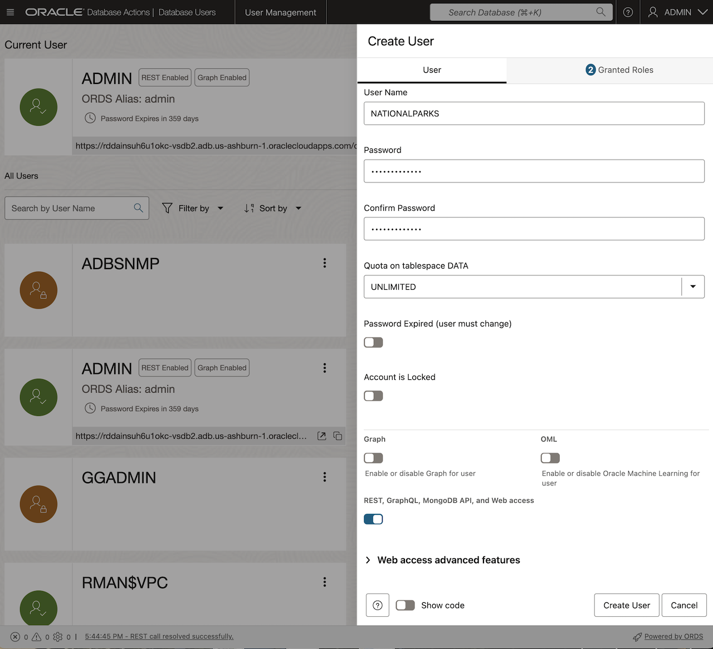

4. Click the **+ Create User** button again and create a second user on the **Create User** form. Use the settings below to complete the form for the INCIDENT user:

    - User Name: **INCIDENT**
    - Password:  **Welcome_12345**
    - Quota on tablespace DATA: UNLIMITED

    - Leave the **Password Expired** toggle button as off (Note: this controls whether the user is prompted to change their password when they next log in).
    - Leave the **Account is Locked** toggle button as off. 

    - Leave the **Graph** toggle button as off.
    - Toggle the **Web Access** button to **On**.
    - Leave the **OML** button as off.
    - Toggle the **REST, GraphQL, MondoDB, and Web access** button to **On**.

    Click **Create User** at the bottom of the form.

    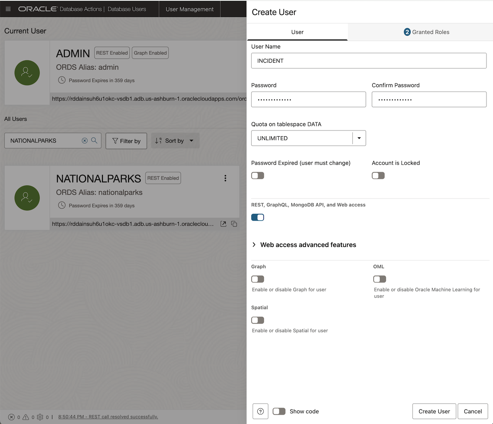

## Task 3: Grant database privileges

1. Switch back to the **SQL | Oracle Database Actions** window.

    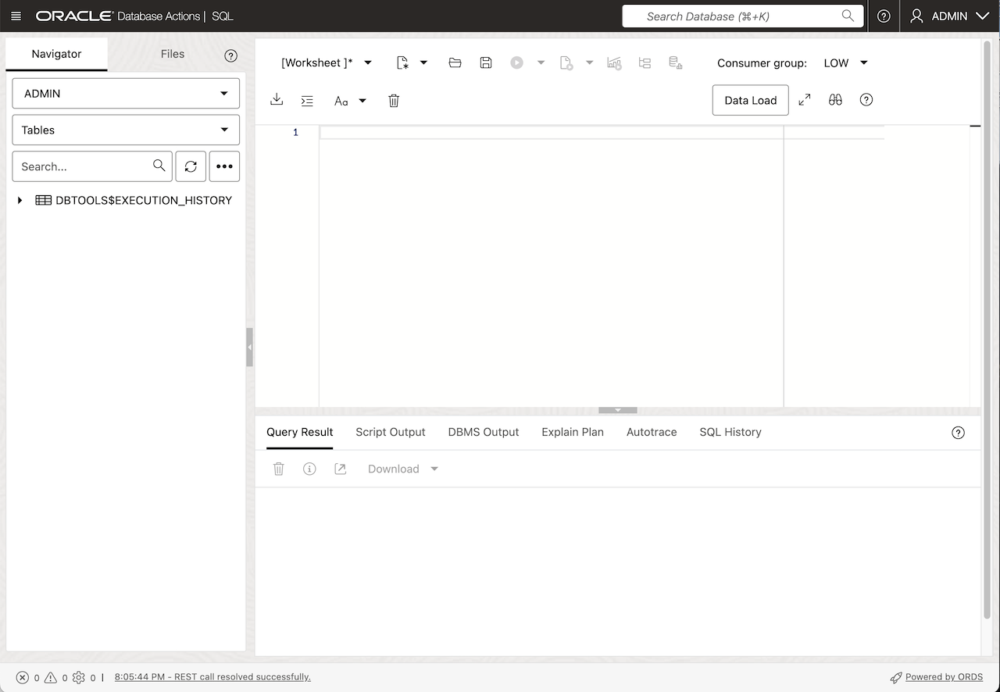

2. If you created the NATIONALPARKS and INCIDENT users in the OCI console as described above then the following roles and REST enable script have already been run. If you created the users with a CREATE USER statement or you are using an existing user then the following should be run for both users.

    For the NATIONALPARKS user:

    ```sql[]
    <copy>
    -- ADD ROLES
    GRANT CONNECT TO NATIONALPARKS;
    GRANT RESOURCE TO NATIONALPARKS;

    -- REST ENABLE
    BEGIN
      ORDS_ADMIN.ENABLE_SCHEMA(
        p_enabled => TRUE,
        p_schema => 'NATIONALPARKS',
        p_url_mapping_type => 'BASE_PATH',
        p_url_mapping_pattern => 'nationalparks',
        p_auto_rest_auth=> TRUE
      );
      -- ENABLE DATA SHARING
      C##ADP$SERVICE.DBMS_SHARE.ENABLE_SCHEMA(
        SCHEMA_NAME => 'NATIONALPARKS',
        ENABLED => TRUE
      );
      commit;
    END;
    /
    </copy>
    ```

    For the INCIDENT user:

    ```sql[]
    <copy>
    -- ADD ROLES
    GRANT CONNECT TO INCIDENT;
    GRANT RESOURCE TO INCIDENT;

    -- REST ENABLE
    BEGIN
      ORDS_ADMIN.ENABLE_SCHEMA(
        p_enabled => TRUE,
        p_schema => 'INCIDENT',
        p_url_mapping_type => 'BASE_PATH',
        p_url_mapping_pattern => 'incident',
        p_auto_rest_auth=> TRUE
      );
      -- ENABLE DATA SHARING
      C##ADP$SERVICE.DBMS_SHARE.ENABLE_SCHEMA(
        SCHEMA_NAME => 'INCIDENT',
        ENABLED => TRUE
      );
      commit;
    END;
    /
    </copy>
    ```

3. Proceed with **Grant privileges** by copying and pasting the following into the Database Actions SQL window for the NATIONALPARKS user:

    ```sql[]
    <copy>
    -- Privileges
    GRANT ORDS_RUNTIME_ROLE TO nationalparks;
    GRANT EXECUTE ON dbms_cloud TO nationalparks;
    GRANT EXECUTE ON dbms_cloud_ai TO nationalparks;
    GRANT EXECUTE ON dbms_vector TO nationalparks;
    GRANT EXECUTE ON DBMS_NETWORK_ACL_ADMIN TO nationalparks;
    GRANT READ,WRITE ON directory data_pump_dir TO nationalparks;
    GRANT CREATE mining model TO nationalparks;
    GRANT SELECT ON sys.v_$vector_memory_pool TO nationalparks;
    GRANT SELECT ON sys.v_$vector_index TO nationalparks;
    </copy>
    ```

    **Note:** Run the entire script by clicking on the "Run Script" button.

    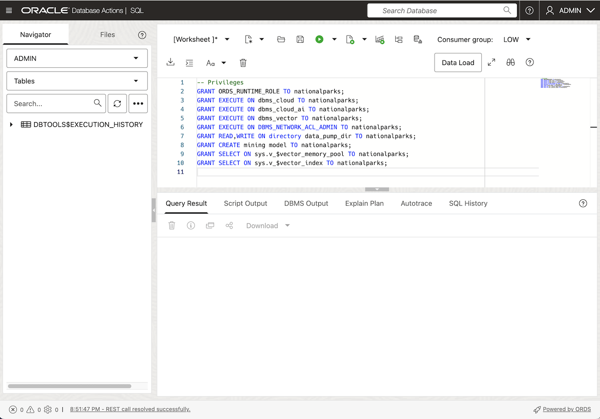

4. Use the following **Grant privileges** for the INCIDENT user:

    ```sql[]
    <copy>
    -- Privileges
    GRANT ORDS_RUNTIME_ROLE TO incident;
    GRANT EXECUTE ON dbms_vector TO incident;
    GRANT EXECUTE ON DBMS_NETWORK_ACL_ADMIN TO incident;
    GRANT CREATE mining model TO incident;
    GRANT SELECT ANY mining model TO incident;
     </copy>
    ```

    **Note:** Run the entire script by clicking on the "Run Script" button.

    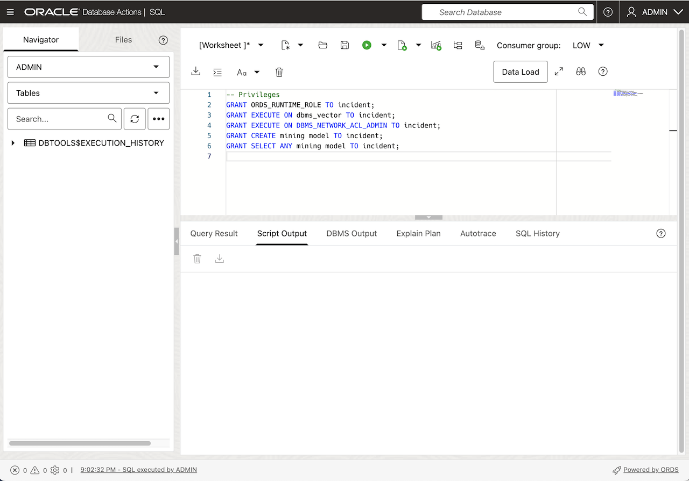

5. Confirm that you can login with the new users.

    This will require that you log out of the ADMIN user, click on the down error next to the ADMIN user name at the top right of the screen and click "Sign Out". After signing in as each user below you should bring up a Database Actions SQL worksheet. You can do this by selecting the **Development** tab and the **SQL** option from the pop-up menu or navigate to the main menu in the upper left corner of the screen and choose **SQL** from the **</> Development** menu.

    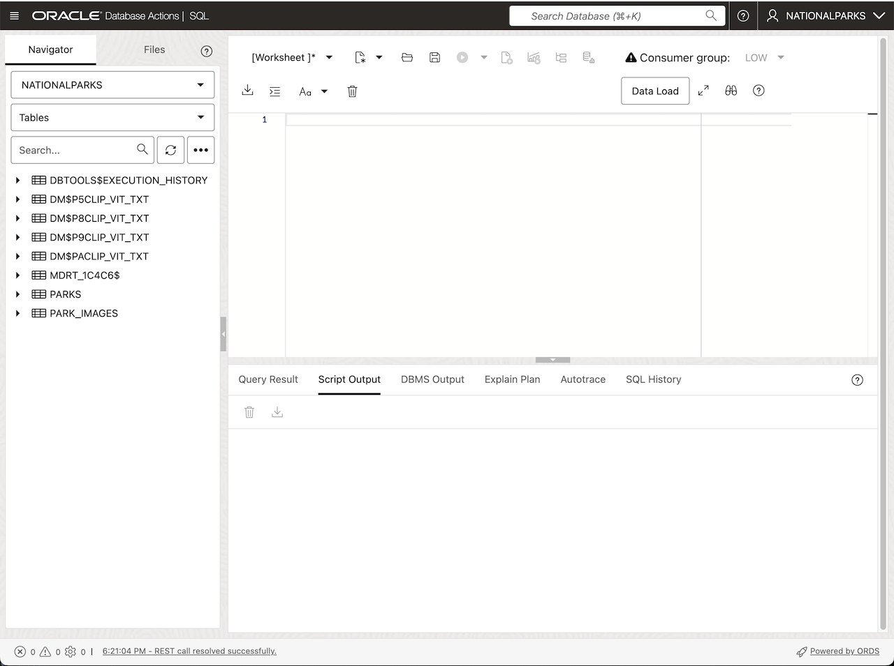

    Sign in as the INCIDENT user with the password of "Welcome_12345".

    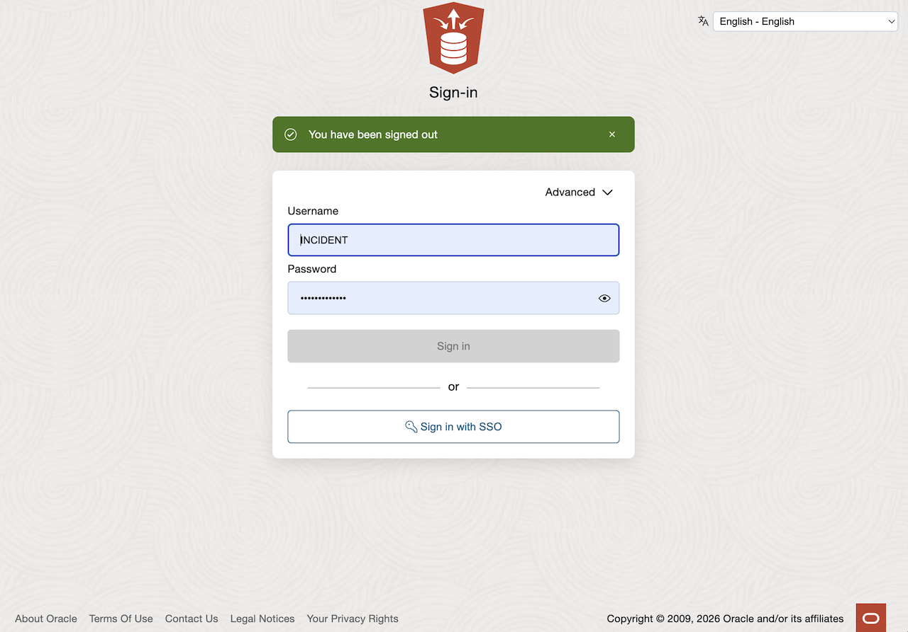

    You should also sign in as the NATIONALPARKS user with the password of "Welcome_12345".

    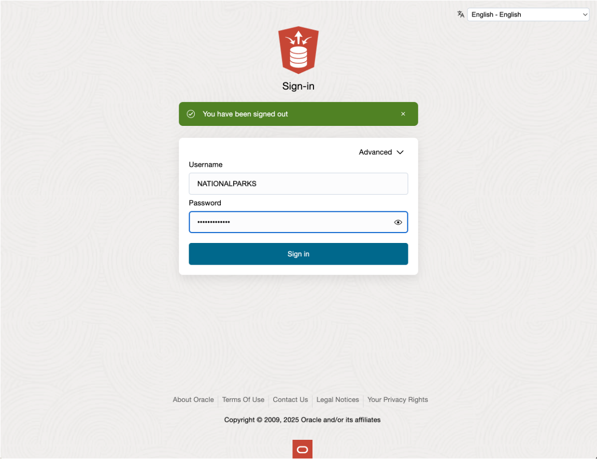

    For details, see the ["Create Users on Autonomous Database with Database Actions"](https://docs.oracle.com/en/cloud/paas/autonomous-database/serverless/adbsb/manage-users-create.html#GUID-DD0D847B-0283-47F5-9EF3-D8252084F0C1) section in the Oracle documentation.

## Task 4: Copy an ONNX Model

As the ADMIN user you will copy an ONNX model to the DATA\_PUMP\_DIR directory.

1. Copy the file below from Object Storage to the DATA\_PUMP\_DIR directory by copying the script below, paste it into the Database Actions SQL window and then click on the "Run Script" button:

    ```sql[]
    <copy>
    BEGIN
      dbms_cloud.get_object(
        object_uri=>'https://c4u04.objectstorage.us-ashburn-1.oci.customer-oci.com/p/EcTjWk2IuZPZeNnD_fYMcgUhdNDIDA6rt9gaFj_WZMiL7VvxPBNMY60837hu5hga/n/c4u04/b/livelabsfiles/o/labfiles/all_MiniLM_L12_v2.onnx',
        directory_name=>'DATA_PUMP_DIR',
        file_name=>'all_MiniLM_L12_v2.onnx'
      );
    END;
    /
    </copy>
    ```

    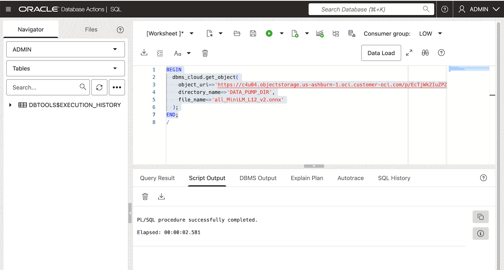

## Task 5: Import Schemas

As the ADMIN user you will import the NATIONALPARKS and INCIDENT schemas in the next step.

1. Import the NATIONALPARKS and INCIDENT schemas by copying the script below and pasting it into the Database Actions SQL window and click run script:

    ```sql[]
    <copy>
    DECLARE
      l_job_state      VARCHAR2(1000);
      l_job_handle     NUMBER;
      dumpFile         VARCHAR2(1024)  := 'https://c4u04.objectstorage.us-ashburn-1.oci.customer-oci.com/p/EcTjWk2IuZPZeNnD_fYMcgUhdNDIDA6rt9gaFj_WZMiL7VvxPBNMY60837hu5hga/n/c4u04/b/livelabsfiles/o/labfiles/natparks3.dmp';
      logFile          VARCHAR2(1024)  := 'natparks3_imp.log';
      logDir           VARCHAR2(20)     := 'DATA_PUMP_DIR';
      logType          NUMBER          := dbms_datapump.ku$_file_type_log_file;
    BEGIN
      l_job_handle := DBMS_DATAPUMP.OPEN(OPERATION=>'IMPORT', JOB_MODE=>'FULL', JOB_NAME=>'IMP_DP_1', VERSION => 'LATEST');
      DBMS_DATAPUMP.ADD_FILE(HANDLE => l_job_handle, FILENAME => dumpFile, DIRECTORY => logDir);
      DBMS_DATAPUMP.ADD_FILE(HANDLE => l_job_handle, FILENAME => logFile, DIRECTORY => logDir, FILETYPE => logType);
      DBMS_DATAPUMP.START_JOB(HANDLE => l_job_handle, SKIP_CURRENT => 0, ABORT_STEP => 0);
      DBMS_DATAPUMP.WAIT_FOR_JOB(HANDLE => l_job_handle, JOB_STATE => l_job_state);
      DBMS_DATAPUMP.DETACH(HANDLE => l_job_handle);
    END;
    /
    </copy>
    ```

## Task 6: Create a Network ACL for the NATIONALPARKS Schema

As the ADMIN user you will create an ACL for the NATIONALPARKS schema to allow access to image URLs.

1. Run the following script by copying the script below and pasting it into the Database Actions SQL window and click run script:

    ```sql[]
    <copy>
    -- Granting network access to the NATIONALPARKS user
    BEGIN
      DBMS_NETWORK_ACL_ADMIN.APPEND_HOST_ACE(
        host => '*',
        ace => xs$ace_type(privilege_list => xs$name_list('http'),
                           principal_name => 'NATIONALPARKS',
                           principal_type => xs_acl.ptype_db));
    END;
    /
    </copy>
    ```

## Task 7: Import APEX Demo Workspace and Application

In this task you will import the workshop's APEX workspaces and applications:

1. Go to the ADB page and click on the Developers Tools icon at the top of the page and select "Cloud Shell" to create a cloud shell environment.

    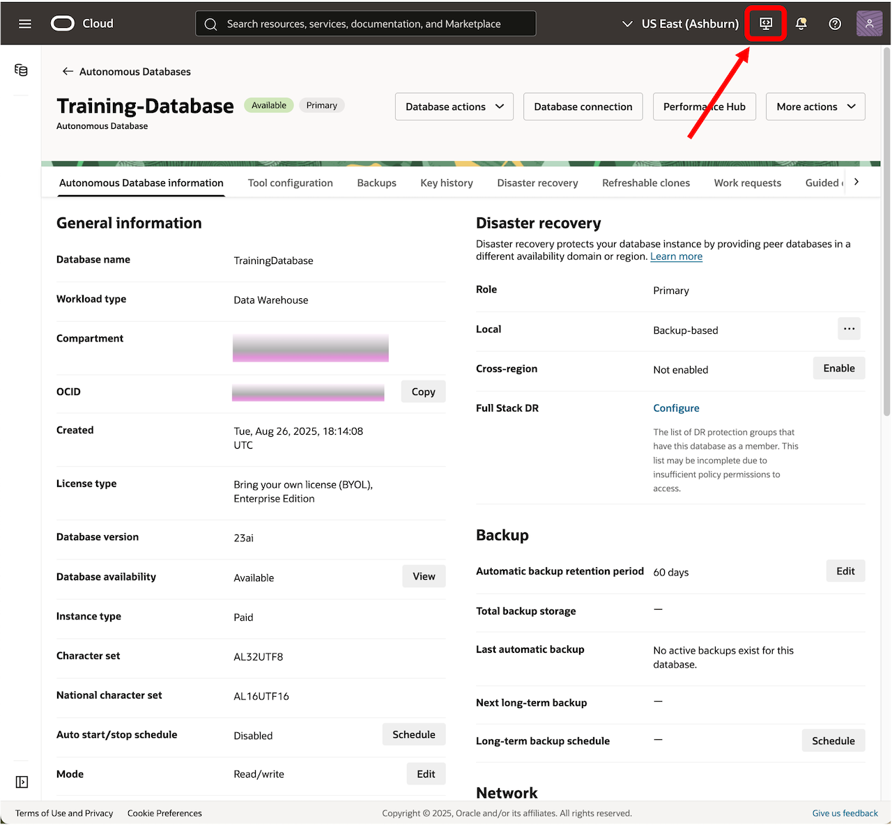

    You can expand the cloudshell window by clicking on the slanted double arrows if you want to make the window bigger.

    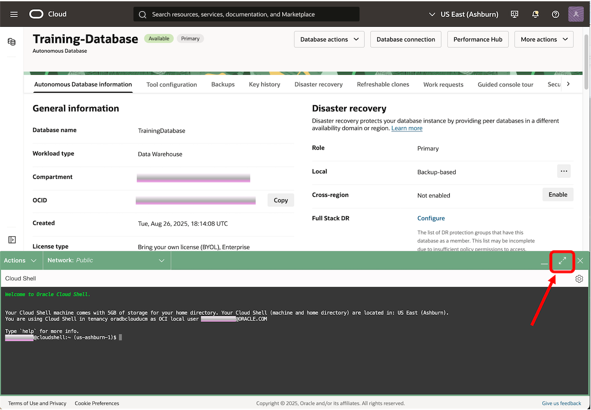

2. Copy the APEX workspace and application files from object storage to the local directory:

    ```[]
    <copy>
    wget https://objectstorage.us-ashburn-1.oraclecloud.com/p/LRZbkPLpnHd4zLZLo5xHS0xTwGXWLFaFyPD-6CkABY_QHvJOPkIyZrHlrB2gFT08/n/c4u04/b/livelabsfiles/o/apex_natparks_workspace.sql

    wget https://objectstorage.us-ashburn-1.oraclecloud.com/p/tPJpzAsya_op_ROTWARlTILuGYHXCN95QJrzwV8gAMXqx8FNnOU8y8Rb1FwoWWCn/n/c4u04/b/livelabsfiles/o/apex_natparks_f108.sql

    wget https://objectstorage.us-ashburn-1.oraclecloud.com/p/JS5lvyF8XTN6VLRL-1rlATyfXCYWEWJJU98vIR0OqiVTgGS7aYwk6qcjXVdqqzwP/n/c4u04/b/livelabsfiles/o/apex_incident_workspace.sql

    wget https://objectstorage.us-ashburn-1.oraclecloud.com/p/pNd8hlqGW6gLM4y-Cd-LzAYZdwLnpZodrVQQwgVswcp_xAs9zMPwCaSSlkA_9sZL/n/c4u04/b/livelabsfiles/o/apex_incident_f101.sql
    </copy>
    ```

    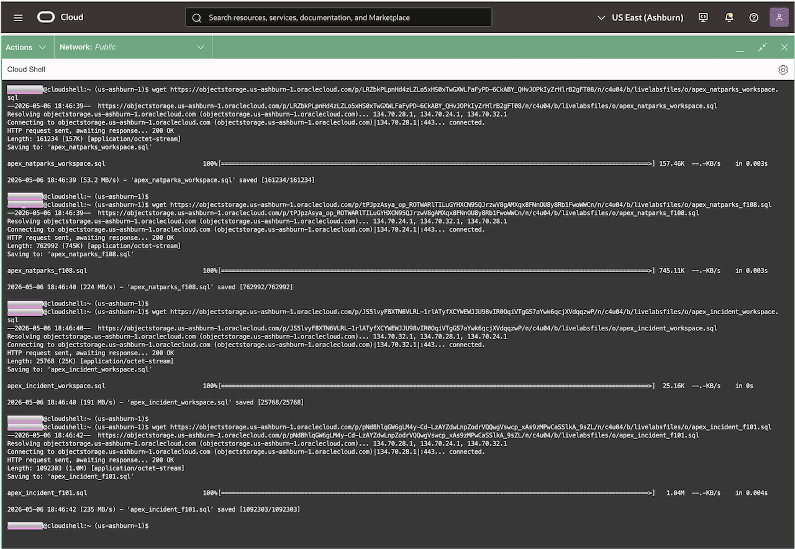

3. Create a wallet zip file and unzip for TNS connection to the database:

    ```[]
    oci db autonomous-database generate-wallet --autonomous-database-id <Insert your OCID here> --file adb.zip --password  Welcome_12345
    ```

    Don't forget that you have to insert your OCID for the autonomous-database-id above.
    The OCID can be obtained from the ADB General Information section in the ADB page:

    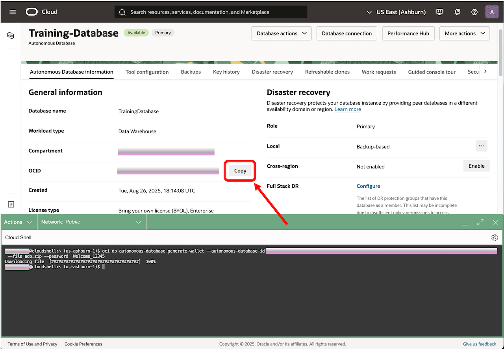

    You can then unzip your zip file to get the tnsnames.ora file.

    ```[]
    <copy>
    unzip adb.zip
    </copy>
    ```

    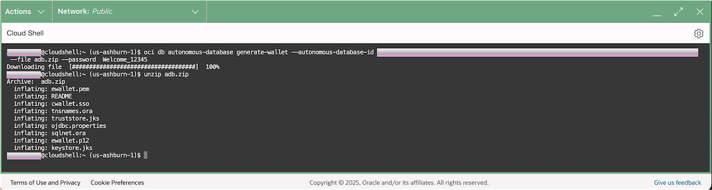

    You can list the tnsnames.ora file for the TNS alias' available. You should be able to use the "**trainingdatabase**\_low" TNS alias to connect to the database with SQLcl in the next step if you followed our naming guidelines. Otherwise use the one that fits the name you chose.

    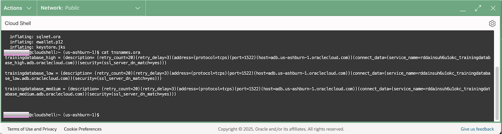

4. Copy the following code to an editor and save the file with a name like **apex\_natparks\_setup.sql**. You will run this script in a following step.

    ```[]
    <copy>
    BEGIN
      -- first set the workspace
      APEX_UTIL.SET_WORKSPACE(P_WORKSPACE => 'NATIONALPARKS');
      COMMIT;
    END;
    /
    @apex_natparks_workspace.sql
    @apex_natparks_f108.sql
    BEGIN
      APEX_INSTANCE_ADMIN.SET_PARAMETER('ALLOW_PUBLIC_FILE_UPLOAD','Y');
      COMMIT;
    END;
    /
    </copy>
    ```

5. Copy the following code to an editor and make the appropriate changes for the credential parameters. Save the file with a name like **apex\_incident\_setup.sql**. You will run this script in a following step.

    ```[]
    <copy>
    BEGIN
      -- first set the workspace
      APEX_UTIL.SET_WORKSPACE(P_WORKSPACE => 'INCIDENT');
      -- Use this to prevent getting a remote server error message.
      APEX_APPLICATION_INSTALL.SET_REMOTE_SERVER(
        P_STATIC_ID => 'oci_gen_ai',
        P_BASE_URL => 'https://inference.generativeai.us-chicago-1.oci.oraclecloud.com');
      COMMIT;
    END;
    /
    @apex_incident_workspace.sql
    @apex_incident_f101.sql
    BEGIN
      -- This is required to set the OCIDs for the new environment
      -- so that the GenAI access will work
      --
      -- first set the workspace
      apex_util.set_workspace(p_workspace => 'INCIDENT');
      --
      -- set_persistent_credentials for "credentials_for_oci_gen_ai"
      -- p_credential_static_id = Static ID
      -- p_client_id = OCI User ID
      -- p_client_secret = OCI Private Key
      -- p_namespace = OCI Tenancy OCID
      -- p_fingerprint = OCI Public Key Fingerprint
      apex_credential.set_persistent_credentials (
        p_credential_static_id => 'credentials_for_oci_gen_ai',
        p_client_id => 'ocid1.user.oc1..  ',
        p_client_secret => '  ',
        p_namespace => 'ocid1.tenancy.oc1..  ',
        p_fingerprint => '  ' );
      COMMIT;
    END;
    /
    </copy>
    ```

6. Connect to SQLcl with the ADMIN user using the TNS string from the tnsnames.ora file created in  step 3 and run both of the scripts you created in the steps 4 and 5:

    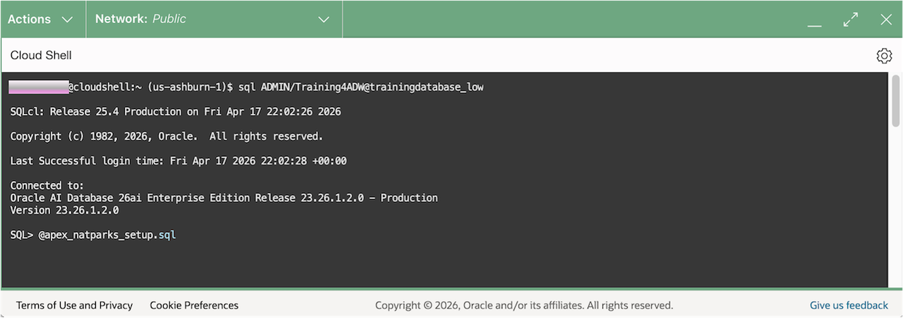

## Acknowledgements

- **Author** - Andy Rivenes, Product Manager, AI Vector Search
- **Contributors** - David Start
- **Last Updated By/Date** - Andy Rivenes, Product Manager, AI Vector Search, April 2026
