# Why Agents Beat Zero Shot Prompts

## Introduction

In this lab, you'll directly compare zero-shot prompting with agent-based execution to understand why agents are transforming how work gets done at **Seer Equity**.

Zero-shot prompting means: one question, one answer, done. It's useful for general knowledge, but it doesn't execute workflows or access your data. Agents break tasks into steps, use tools, and actually complete the work.

### The Business Problem

At Seer Equity, loan officers tried using the AI chatbot to check loan statuses. The results were frustrating:

> *"I asked about a client's loan status, and it told me how to log in. I know how to log in! I wanted the actual status."*
>
> Marcus, Senior Loan Officer

The chatbot was helpful for general questions like "What's a good credit score?" or "How do mortgages work?" But when loan officers needed actual data or wanted to take action, it fell short.

Seer Equity needs AI that can:
- **Access real data**: Query the actual loan database
- **Take action**: Update statuses, not just explain how to update them
- **Coordinate steps**: Check a condition, then act on it

### What You'll Learn

This lab shows you the spectrum from zero-shot (no data access) to SELECT AI (read-only) to SELECT AI AGENT (read/write/coordinate). You'll see exactly where each approach works and where it fails.

**What you'll build:** A comparison demonstrating when to use chat vs agents, plus an agent that can both read AND update loan data.

Estimated Time: 10 minutes

### Objectives

* Understand what zero-shot prompting means
* Compare zero-shot responses to agent responses
* See how agents coordinate multiple tools to complete work
* Recognize when to use each approach

### Prerequisites

For this workshop, we provide the environment. You'll need:

* Basic knowledge of SQL and PL/SQL, or the ability to follow along with the prompts

## Task 1: Import the Lab Notebook

Before you begin, you are going to import a notebook that has all of the commands for this lab into Oracle Machine Learning. This way you don't have to copy and paste them over to run them.

1. From the Oracle Machine Learning home page, click **Notebooks**.

    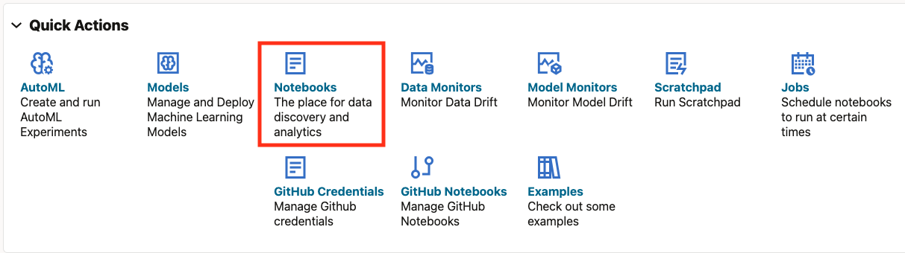

2. Click **Import** to expand the Import drop down.

    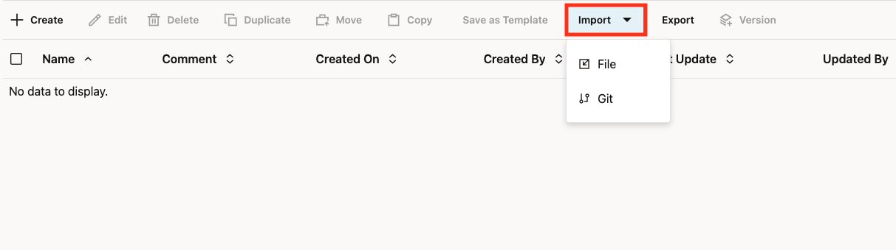

3. Select **Git**.

    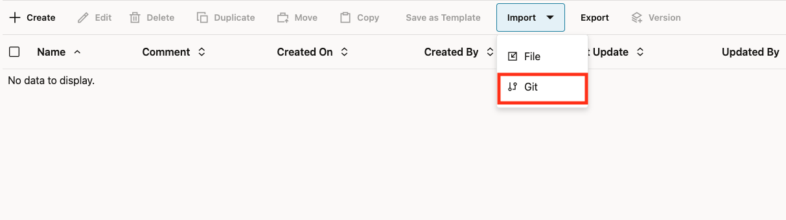

4. Paste the following GitHub URL leaving the credential field blank:

    ```text
    <copy>
    https://github.com/davidastart/database/blob/main/ai4u/agents-vs-zero-shot/lab2-agents-vs-zero-shot.json
    </copy>
    ```

    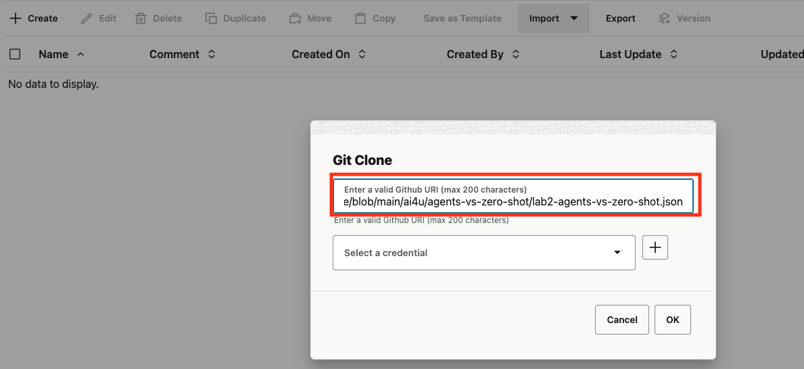

5. Click **Ok**.

    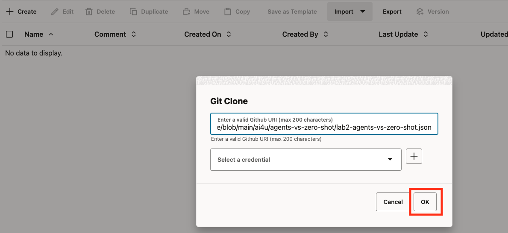

You should now be on the screen with the notebook imported. This workshop will have all of the screenshots and detailed information however the notebook will have the commands and basic instructions for completing the lab.

## Task 2: Experience Zero-Shot Prompting

Zero-shot queries go directly to the LLM for general knowledge answers. Use `SELECT AI CHAT` to ask questions without involving your database.

1. Set the profile.

    > This command is already in your notebook - just click the play button (▶) to run it. This first command may take a little longer as it establishes the connection to the notebook.

    ```sql
    <copy>
    EXEC DBMS_CLOUD_AI.SET_PROFILE('genai');
    </copy>
    ```

    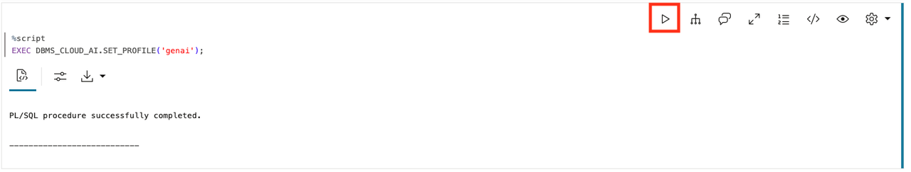

2. Ask a procedural question using zero-shot.

    **Observe:** You get a helpful explanation of the steps. But you still have to do each step yourself.

    > This command is already in your notebook - just click the play button (▶) to run it.

    ```sql
    <copy>
    SELECT AI CHAT How do I process a loan application;
    </copy>
    ```

    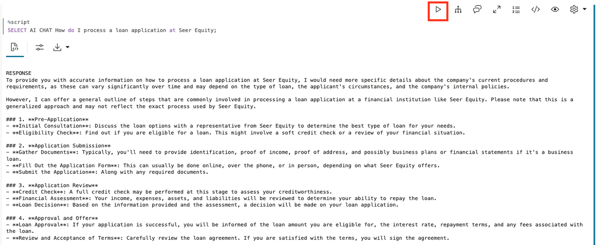

3. Now try asking for something that requires YOUR data.

    **Observe:** The AI cannot answer this because it has no access to your data. It gives generic advice about how to check loan status, but it does not actually know YOUR loan LOAN-12345.

    This is the limitation of zero-shot: great for general knowledge, useless for your specific business data.

    > This command is already in your notebook - just click the play button (▶) to run it.

    ```sql
    <copy>
    SELECT AI CHAT What is the status of loan LOAN-12345;
    </copy>
    ```

    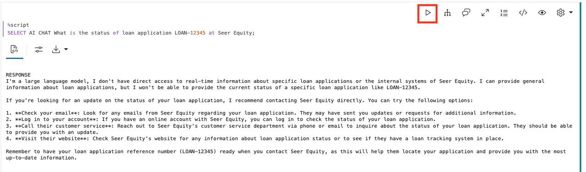

4. Ask it to do something.

    **Observe:** The AI explains HOW to update a loan but cannot actually do it. Zero-shot can advise; it cannot act.

    > This command is already in your notebook - just click the play button (▶) to run it.

    ```sql
    <copy>
    SELECT AI CHAT Update loan LOAN-12345 to approved;
    </copy>
    ```

    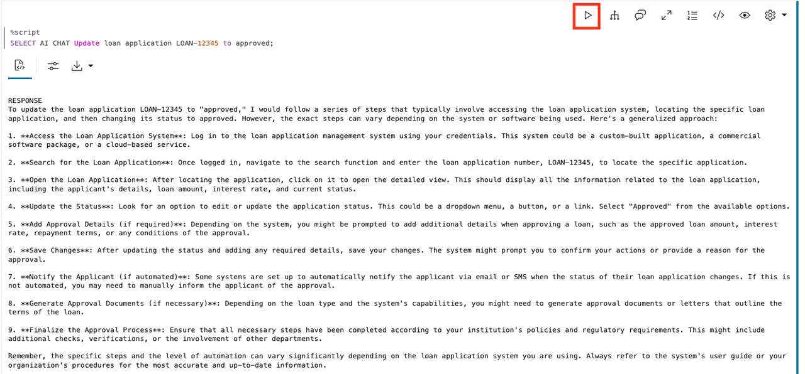

## Task 3: See What SELECT AI Can Do

Before we look at agents, let's see what SELECT AI (without CHAT or AGENT) can do. It can query your data using natural language.

1. Create a sample loan applications table with comments to help Select AI understand the schema.

    > This command is already in your notebook - just click the play button (▶) to run it.

    ```sql
    <copy>
    -- Create the loan applications table
    CREATE TABLE sample_loans (
        application_id  VARCHAR2(20) PRIMARY KEY,
        applicant       VARCHAR2(100),
        status          VARCHAR2(30),
        amount          NUMBER(12,2),
        loan_type       VARCHAR2(30),
        application_date DATE DEFAULT SYSDATE
    );

    -- Add comments so Select AI understands the table
    COMMENT ON TABLE sample_loans IS 'Seer Equity loan applications with status tracking.';
    COMMENT ON COLUMN sample_loans.application_id IS 'Unique loan application identifier. Examples: LOAN-12345, LOAN-12346.';
    COMMENT ON COLUMN sample_loans.applicant IS 'Name of the person or business applying for the loan';
    COMMENT ON COLUMN sample_loans.status IS 'Application status: PENDING, UNDER_REVIEW, APPROVED, or DENIED';
    COMMENT ON COLUMN sample_loans.amount IS 'Requested loan amount in US dollars';
    COMMENT ON COLUMN sample_loans.loan_type IS 'Type of loan: Personal, Auto, Mortgage, or Business';
    COMMENT ON COLUMN sample_loans.application_date IS 'Date the application was submitted';

    -- Insert sample data
    INSERT INTO sample_loans VALUES ('LOAN-12345', 'Acme Corp', 'UNDER_REVIEW', 150000, 'Business', SYSDATE - 3);
    INSERT INTO sample_loans VALUES ('LOAN-12346', 'TechStart', 'PENDING', 45000, 'Business', SYSDATE - 1);
    INSERT INTO sample_loans VALUES ('LOAN-12347', 'GlobalCo', 'APPROVED', 275000, 'Mortgage', SYSDATE - 7);
    COMMIT;
    </copy>
    ```

    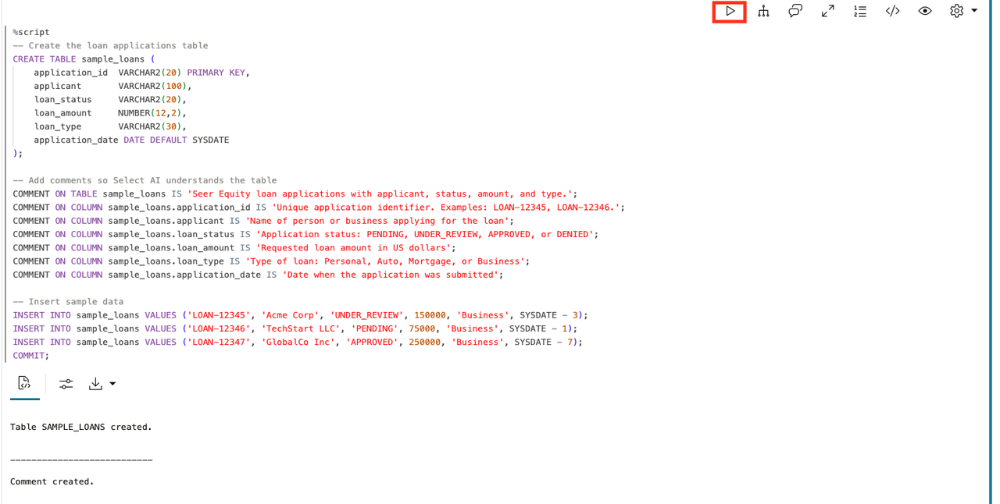

2. Add the table to your AI profile so SELECT AI knows about it.

    > This command is already in your notebook - just click the play button (▶) to run it.

    ```sql
    <copy>
    BEGIN
        DBMS_CLOUD_AI.SET_ATTRIBUTE(
            profile_name    => 'genai',
            attribute_name  => 'object_list',
            attribute_value => '[{"owner": "' || USER || '", "name": "SAMPLE_LOANS"}]'
        );
    END;
    /
    </copy>
    ```

    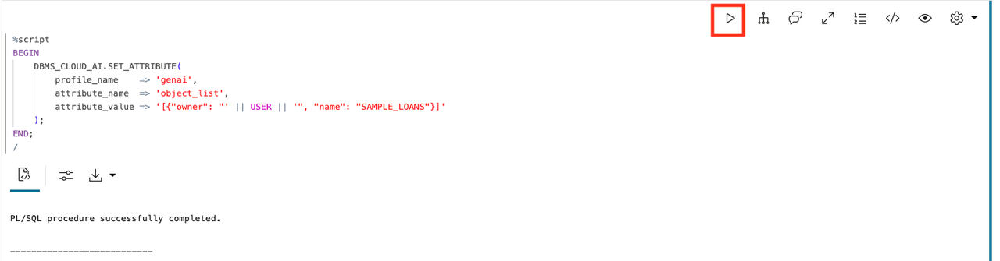

3. Use SELECT AI NARRATE to query the loan status.

    **Observe:** SELECT AI CAN read your data and answer questions about it.

    > This command is already in your notebook - just click the play button (▶) to run it.

    ```sql
    <copy>
    SELECT AI NARRATE What is the status of loan LOAN-12345;
    </copy>
    ```

    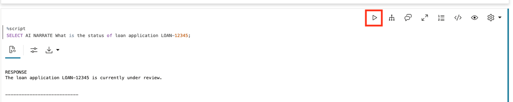

SELECT AI returned the actual status: `UNDER_REVIEW`. Compare this to zero-shot which could only give generic advice.

4. Now try to update using SELECT AI.

    **Observe:** SELECT AI cannot update data. It can only read.

    > This command is already in your notebook - just click the play button (▶) to run it.

    ```sql
    <copy>
    SELECT AI NARRATE Update loan LOAN-12345 to approved;
    </copy>
    ```

    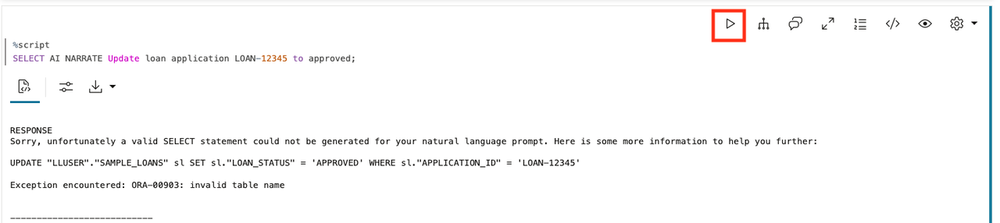

5. Verify the loan was NOT updated.

    > This command is already in your notebook - just click the play button (▶) to run it.

    ```sql
    <copy>
    SELECT application_id, status FROM sample_loans WHERE application_id = 'LOAN-12345';
    </copy>
    ```

    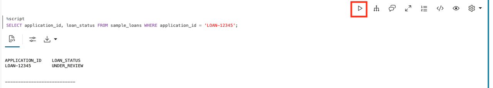

Still `UNDER_REVIEW`. SELECT AI can read but cannot write.

## Task 4: Create an Agent with Tools

Now let's create an agent that can both READ and WRITE. We'll give it two tools: one to look up loans and one to update them.

In this lab, we're using **function-based tools** instead of SQL tools. A function-based tool wraps a PL/SQL function you write, giving you complete control over what the tool does. This is how you give agents the ability to make changes to your data, not just read it.

1. Create a function to look up loans (read).

    This function takes a loan ID and returns the loan details. It's a simple read operation that the agent will use to check on loans before taking action.

    > This command is already in your notebook - just click the play button (▶) to run it.

    ```sql
    <copy>
    CREATE OR REPLACE FUNCTION lookup_loan(
        p_application_id VARCHAR2
    ) RETURN VARCHAR2 AS
        v_result VARCHAR2(500);
    BEGIN
        SELECT 'Loan ' || application_id || ': ' || status || 
               ', Applicant: ' || applicant || 
               ', Amount: $' || amount ||
               ', Type: ' || loan_type
        INTO v_result
        FROM sample_loans
        WHERE application_id = p_application_id;
        
        RETURN v_result;
    EXCEPTION
        WHEN NO_DATA_FOUND THEN
            RETURN 'Loan application ' || p_application_id || ' not found.';
    END;
    /
    </copy>
    ```

    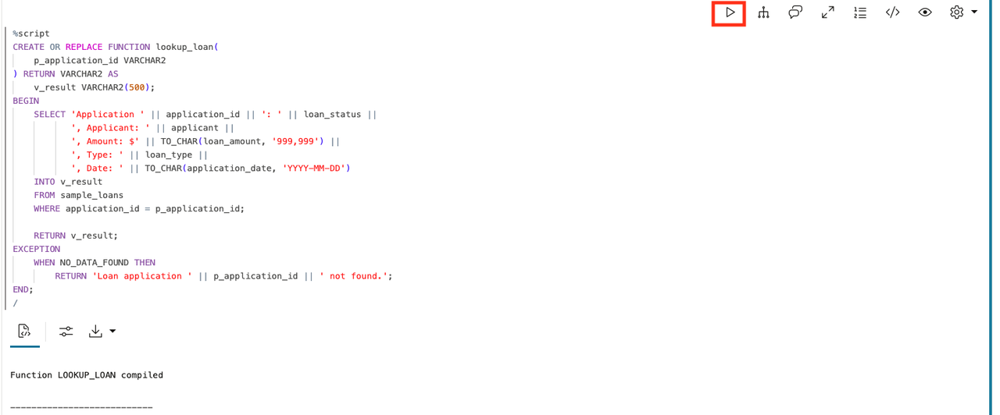

2. Create a function to update loan status (write).

    This function actually changes data in the database. Notice it first checks the current status, then makes the update. The agent will use this to approve or deny loans.

    > This command is already in your notebook - just click the play button (▶) to run it.

    ```sql
    <copy>
    CREATE OR REPLACE FUNCTION update_loan_status(
        p_application_id VARCHAR2,
        p_new_status     VARCHAR2
    ) RETURN VARCHAR2 AS
        PRAGMA AUTONOMOUS_TRANSACTION;
        v_old_status VARCHAR2(30);
    BEGIN
        -- Get current status
        SELECT status INTO v_old_status
        FROM sample_loans
        WHERE application_id = p_application_id;
        
        -- Update the status
        UPDATE sample_loans
        SET status = UPPER(p_new_status)
        WHERE application_id = p_application_id;
        
        COMMIT;
        
        RETURN 'Loan ' || p_application_id || ' updated from ' || v_old_status || ' to ' || UPPER(p_new_status);
    EXCEPTION
        WHEN NO_DATA_FOUND THEN
            RETURN 'Loan application ' || p_application_id || ' not found. Cannot update.';
        WHEN OTHERS THEN
            ROLLBACK;
            RETURN 'Error updating loan: ' || SQLERRM;
    END;
    /
    </copy>
    ```

    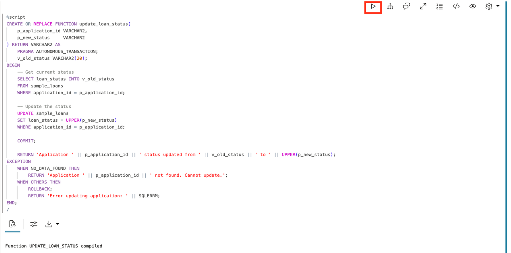

3. Register both functions as tools.

    Now we turn these functions into tools the agent can use. The `instruction` tells the agent when and how to use each tool. Notice how we tell the agent to check the loan status before updating. This is how you build smart behavior into your agent.

    > This command is already in your notebook - just click the play button (▶) to run it.

    ```sql
    <copy>
    BEGIN
        DBMS_CLOUD_AI_AGENT.CREATE_TOOL(
            tool_name   => 'LOAN_LOOKUP_TOOL',
            attributes  => '{"instruction": "Look up loan application status and details by application ID. Parameter: P_APPLICATION_ID (the loan number, e.g. LOAN-12345). Use this to check current status before making updates.",
                            "function": "lookup_loan"}',
            description => 'Retrieves loan status, applicant, amount, and type by application ID'
        );
    END;
    /

    BEGIN
        DBMS_CLOUD_AI_AGENT.CREATE_TOOL(
            tool_name   => 'LOAN_UPDATE_TOOL',
            attributes  => '{"instruction": "Update a loan application status. Parameters: P_APPLICATION_ID (the loan number), P_NEW_STATUS (PENDING, UNDER_REVIEW, APPROVED, or DENIED). Only call this after confirming the current status with LOAN_LOOKUP_TOOL.",
                            "function": "update_loan_status"}',
            description => 'Updates loan application status to a new value'
        );
    END;
    /
    </copy>
    ```

    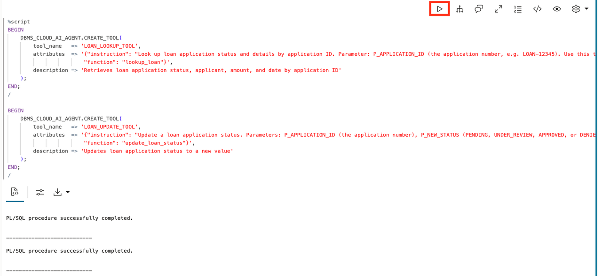

4. Create the agent, task, and team.

    Now we put it all together. The agent gets a role that tells it how to behave. The task gives it specific instructions and access to both tools. The team makes it all runnable. Notice how we give the agent access to TWO tools. It can decide which one to use based on what you ask.

    > This command is already in your notebook - just click the play button (▶) to run it.

    ```sql
    <copy>
    BEGIN
        DBMS_CLOUD_AI_AGENT.CREATE_AGENT(
            agent_name  => 'LOAN_MGMT_AGENT',
            attributes  => '{"profile_name": "genai",
                            "role": "You are a loan management agent for Seer Equity. You can look up loan applications and update their status. Always look up a loan first before updating it. Never make up loan information - always use your tools."}',
            description => 'Agent that can look up and update loan applications'
        );
    END;
    /

    BEGIN
        DBMS_CLOUD_AI_AGENT.CREATE_TASK(
            task_name   => 'LOAN_MGMT_TASK',
            attributes  => '{"instruction": "Help with loan application inquiries and updates. When asked to check a loan, use LOAN_LOOKUP_TOOL. When asked to update a loan, first use LOAN_LOOKUP_TOOL to verify current status, then use LOAN_UPDATE_TOOL to make the change. Do not ask clarifying questions - just do it. User request: {query}",
                            "tools": ["LOAN_LOOKUP_TOOL", "LOAN_UPDATE_TOOL"]}',
            description => 'Task for loan lookups and updates'
        );
    END;
    /

    BEGIN
        DBMS_CLOUD_AI_AGENT.CREATE_TEAM(
            team_name   => 'LOAN_MGMT_TEAM',
            attributes  => '{"agents": [{"name": "LOAN_MGMT_AGENT", "task": "LOAN_MGMT_TASK"}],
                            "process": "sequential"}',
            description => 'Team for loan management'
        );
    END;
    /
    </copy>
    ```

    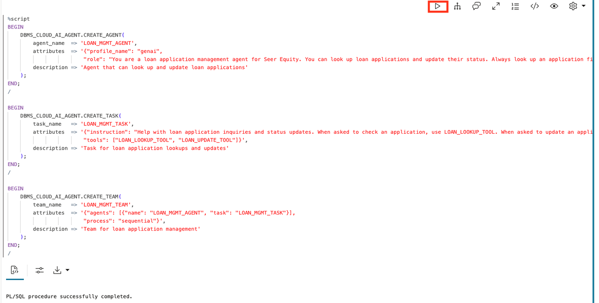

## Task 5: See the Agent Coordinate and Act

Now let's see the real power of agents: coordinating multiple tools and making changes.

1. First, check the current status of loan LOAN-12345.

    > This command is already in your notebook - just click the play button (▶) to run it.

    ```sql
    <copy>
    SELECT application_id, applicant, status FROM sample_loans WHERE application_id = 'LOAN-12345';
    </copy>
    ```

    

The loan is currently `UNDER_REVIEW`.

2. Set the team and ask the agent to check and update the loan.

    > This command is already in your notebook - just click the play button (▶) to run it.

    ```sql
    <copy>
    EXEC DBMS_CLOUD_AI_AGENT.SET_TEAM('LOAN_MGMT_TEAM');
    SELECT AI AGENT Check loan LOAN-12345 and if it is under review, approve it;
    </copy>
    ```

    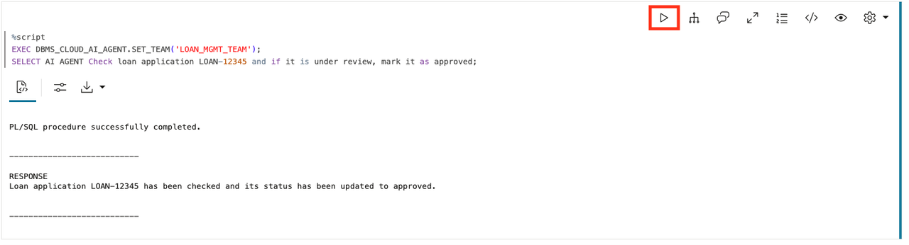

**Observe:** The agent:
1. Called `LOAN_LOOKUP_TOOL` to check current status (`UNDER_REVIEW`)
2. Made a decision based on the result
3. Called `LOAN_UPDATE_TOOL` to change it to `APPROVED`
4. Reported what it did

This is what SELECT AI cannot do: **coordinate multiple steps and take action**.

3. Verify the change actually happened.

    > This command is already in your notebook - just click the play button (▶) to run it.

    ```sql
    <copy>
    SELECT application_id, applicant, status FROM sample_loans WHERE application_id = 'LOAN-12345';
    </copy>
    ```

    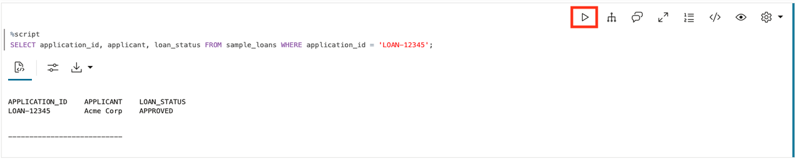

**The status changed from `UNDER_REVIEW` to `APPROVED`.** The agent didn't just talk about updating - it actually did it.

4. Try a conditional update that should NOT happen.

    > This command is already in your notebook - just click the play button (▶) to run it.

    ```sql
    <copy>
    SELECT AI AGENT Check loan LOAN-12346 and if it is under review, approve it;
    </copy>
    ```

    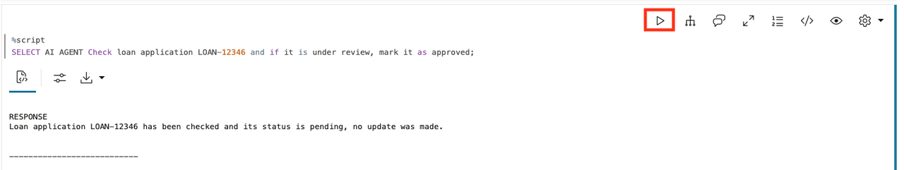

**Observe:** The agent looked up loan LOAN-12346, saw it was `PENDING` (not `UNDER_REVIEW`), and correctly decided NOT to update it. This is intelligent coordination.

## Task 6: See What the Agent Did

Every tool call is logged. Let's see the execution history.

1. Query the tool history.

    > This command is already in your notebook - just click the play button (▶) to run it.

    ```sql
    <copy>
    SELECT 
        tool_name,
        TO_CHAR(start_date, 'HH24:MI:SS') as called_at,
        SUBSTR(output, 1, 80) as result
    FROM USER_AI_AGENT_TOOL_HISTORY
    ORDER BY start_date DESC
    FETCH FIRST 10 ROWS ONLY;
    </copy>
    ```

    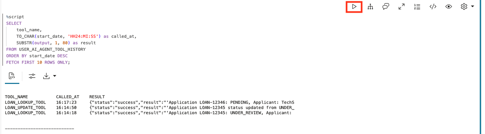

You can see the sequence: lookup, then update (or just lookup if no update was needed).

## Task 7: When to Use Each Approach

| Approach | Can Access Your Data | Can Modify Data | Can Coordinate Steps |
|----------|---------------------|-----------------|----------------------|
| `SELECT AI CHAT` | No | No | No |
| `SELECT AI` | Yes | No | No |
| `SELECT AI AGENT` | Yes | Yes | Yes |

**Use zero-shot (`SELECT AI CHAT`) when:**
- You need a quick answer from general knowledge
- No data access is required
- You want advice or explanation

**Use `SELECT AI` when:**
- You need to query your data with natural language
- Read-only access is sufficient
- Single-step retrieval

**Use agents (`SELECT AI AGENT`) when:**
- The task requires access to your data
- You need to READ and WRITE data
- Decisions depend on data (conditional logic)
- Actions need coordination across multiple tools

## Summary

In this lab, you directly compared three approaches:

* **`SELECT AI CHAT`**: Cannot access your data; can only give generic advice
* **`SELECT AI`**: Can read your data but cannot modify it
* **`SELECT AI AGENT`**: Can read your data, make decisions, and take action

You watched the agent coordinate: check status, decide, act, report. And you verified the data actually changed.

**Key takeaway:** The difference is not just intelligence. It's action. Zero-shot AI tells you what to do. SELECT AI can read. Agents do the work. For Seer Equity, that means loan officers can focus on clients instead of data entry.

## Learn More

* [`DBMS_CLOUD_AI_AGENT` Package](https://docs.oracle.com/en/cloud/paas/autonomous-database/serverless/adbsb/dbms-cloud-ai-agent-package.html)

## Acknowledgements

* **Author** - David Start
* **Last Updated By/Date** - David Start, January 2026

## Cleanup (Optional)

> This command is already in your notebook - just click the play button (▶) to run it.

```sql
<copy>
EXEC DBMS_CLOUD_AI_AGENT.DROP_TEAM('LOAN_MGMT_TEAM', TRUE);
EXEC DBMS_CLOUD_AI_AGENT.DROP_TASK('LOAN_MGMT_TASK', TRUE);
EXEC DBMS_CLOUD_AI_AGENT.DROP_AGENT('LOAN_MGMT_AGENT', TRUE);
EXEC DBMS_CLOUD_AI_AGENT.DROP_TOOL('LOAN_LOOKUP_TOOL', TRUE);
EXEC DBMS_CLOUD_AI_AGENT.DROP_TOOL('LOAN_UPDATE_TOOL', TRUE);
DROP TABLE sample_loans PURGE;
DROP FUNCTION lookup_loan;
DROP FUNCTION update_loan_status;
</copy>
```

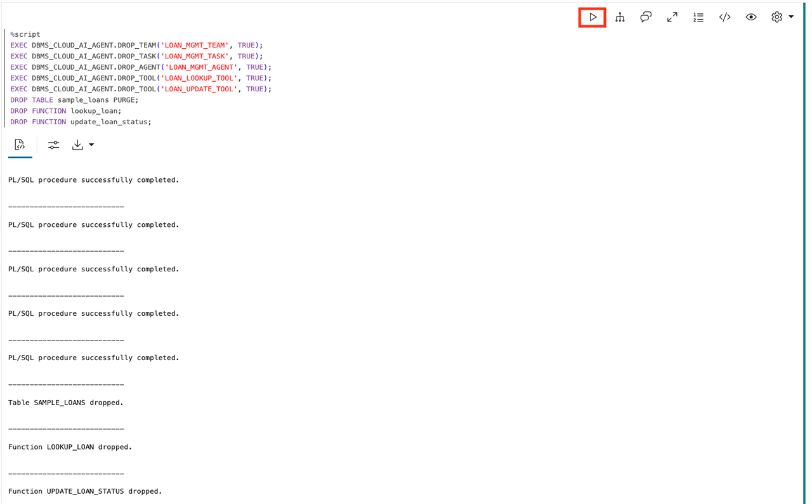
