# Connect Agents to Enterprise Data at Seer Equity

## Introduction

In this lab, you'll see why agents fail without enterprise data, and how connecting them to your business context transforms their usefulness.

Agents don't show up understanding your organization. They don't know your policies, your workflows, or how decisions were handled last time. That knowledge lives in your enterprise data.

You'll first ask the LLM business-specific questions it can't answer, then give an agent access to your data and see the difference.

### The Business Problem

Seer Equity deployed AI chatbots to help loan officers answer client questions. The problem? The chatbots don't know Seer Equity's actual rates, policies, or client information.

> *"I asked the AI what rates we offer preferred customers. It said 6.5%. Our actual preferred rate is 7.9%. I almost quoted wrong rates to a client!"*

> *"The AI doesn't know our policies. It gives generic answers about 'typical lending practices' when clients need our specific requirements."*

Without access to enterprise data, AI assistants are worse than useless. They're confidently wrong.

### What You'll Learn

In this lab, you'll see the transformation that happens when agents get access to real business data:

1. **Without data:** Ask about Seer Equity loan rates. Watch the AI give generic (or wrong) answers.
2. **With data:** Connect the agent to actual loan policies and client information.
3. **The difference:** The same question now returns real rates, real requirements, real client details.

Enterprise data is what turns a generic AI into YOUR AI—one that knows your business.

**What you'll build:** An agent connected to Seer Equity's loan policies and applicant data.

Estimated Time: 10 minutes

### Objectives

* Experience LLM failure without business context
* Create enterprise data tools for agents
* See how data access transforms agent responses
* Understand why enterprise data provides judgment and guardrails

### Prerequisites

For this workshop, we provide the environment. You'll need:

* Basic knowledge of SQL and PL/SQL, or the ability to follow along with the prompts

## Task 1: Import the Lab Notebook

Before you begin, you are going to import a notebook that has all of the commands for this lab into Oracle Machine Learning. This way you don't have to copy and paste them over to run them.

1. From the Oracle Machine Learning home page, click **Notebooks**.

    

2. Click **Import** to expand the Import drop down.

    

3. Select **Git**.

    

4. Paste the following GitHub URL leaving the credential field blank:

    ```text
    <copy>
    https://github.com/davidastart/database/blob/main/ai4u/enterprise-data/lab6-enterprise-data.json
    </copy>
    ```

5. Click **OK**.

    

    You should now be on the screen with the notebook imported. This workshop will have all of the screenshots and detailed information; however, the notebook will have the commands and basic instructions for completing the lab.

## Task 2: Ask the LLM About Seer Equity Without Data

Let's start by asking the raw LLM (`SELECT AI CHAT`) about Seer Equity's loan products. This goes directly to the LLM with no access to your business data.

**Watch what happens:** The LLM gives a generic response. It might describe typical loan rates or say it doesn't know. Either way, it can't tell you YOUR rates because it has no access to Seer Equity's data.

1. Ask about personal loan rates for preferred customers.

    > This command is already in your notebook—just click the play button (▶) to run it.

    ```sql
    <copy>
    -- Set the AI profile for SELECT AI CHAT
    EXEC DBMS_CLOUD_AI.SET_PROFILE('genai');

    SELECT AI CHAT What are the current interest rates for personal loans at Seer Equity for preferred customers;
    </copy>
    ```

    The LLM gives a generic response—it doesn't know YOUR rates because it has no access to Seer Equity's data.

    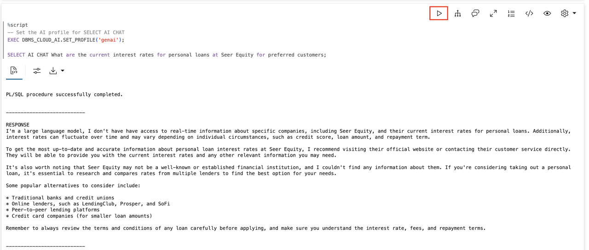

2. Ask about a specific applicant.

    Now ask about a specific loan applicant in your system. The LLM has no applicant data. It might hallucinate, admit it doesn't know, or give generic advice. It cannot tell you anything about YOUR applicant APPL-1001.

    > This command is already in your notebook—just click the play button (▶) to run it.

    ```sql
    <copy>
    SELECT AI CHAT Is applicant APPL-1001 eligible for a premium rate loan at Seer Equity;
    </copy>
    ```

    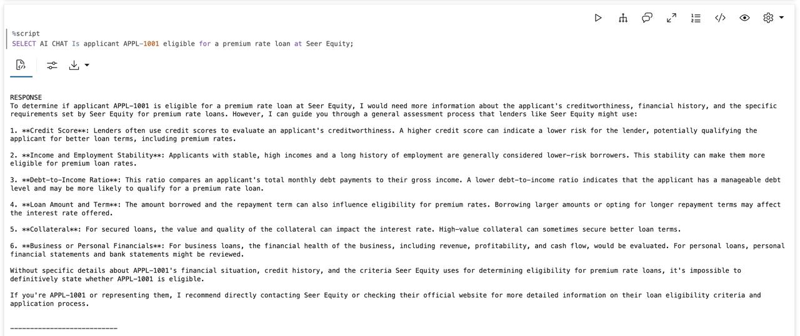

## Task 3: Create Seer Equity's Enterprise Data

Now let's create the business data that makes an agent useful for Seer Equity. You'll create:

- **loan_policies**: Seer Equity's actual loan products, rates, and requirements
- **loan_applicants**: Real applicant records with credit scores, income, and eligibility

This is the knowledge the agent needs to answer business-specific questions accurately.

1. Create the loan policies and applicant tables with data.

    > This command is already in your notebook—just click the play button (▶) to run it.

    ```sql
    <copy>
    -- Seer Equity Loan Policies
    CREATE TABLE loan_policies (
        policy_id      VARCHAR2(20) PRIMARY KEY,
        policy_name    VARCHAR2(100),
        policy_text    CLOB,
        applies_to     VARCHAR2(50)
    );

    INSERT INTO loan_policies VALUES (
        'POL-001', 'Personal Loan - Preferred Rate',
        'Preferred customers (credit score 750+) qualify for personal loans at 7.9% APR. ' ||
        'Maximum loan amount $100,000. No origination fee. Same-day approval for amounts under $50,000.',
        'PREFERRED'
    );

    INSERT INTO loan_policies VALUES (
        'POL-002', 'Personal Loan - Standard Rate',
        'Standard customers (credit score 650-749) qualify for personal loans at 12.9% APR. ' ||
        'Maximum loan amount $50,000. 2% origination fee applies. ' ||
        'Approval within 2 business days.',
        'STANDARD'
    );

    INSERT INTO loan_policies VALUES (
        'POL-003', 'Mortgage Guidelines',
        'All mortgage applications require: 1) Minimum credit score 680, 2) Debt-to-income ratio under 43%, ' ||
        '3) Down payment minimum 10%, 4) Employment verification for past 2 years. ' ||
        'Senior underwriter review required for all mortgages.',
        'ALL'
    );

    INSERT INTO loan_policies VALUES (
        'POL-004', 'Auto Loan - Preferred Rate',
        'Preferred customers qualify for auto loans at 5.9% APR for new vehicles, 7.9% for used. ' ||
        'Maximum term 72 months for new, 60 months for used. No down payment required for amounts under $35,000.',
        'PREFERRED'
    );

    INSERT INTO loan_policies VALUES (
        'POL-005', 'Credit Risk Escalation',
        'Loan applications with risk flags: 1) Agent assesses initial eligibility, 2) If debt-to-income exceeds 35%, ' ||
        'escalate to underwriter, 3) If credit score below 650, escalate to senior underwriter, ' ||
        '4) Applicant may request manager review of any decision.',
        'ALL'
    );

    -- Seer Equity Applicant Data
    CREATE TABLE loan_applicants (
        applicant_id        VARCHAR2(20) PRIMARY KEY,
        name                VARCHAR2(100),
        customer_tier       VARCHAR2(20),
        credit_score        NUMBER,
        annual_income       NUMBER(12,2),
        existing_debt       NUMBER(12,2),
        member_since        DATE,
        premium_eligible    VARCHAR2(1)
    );

    INSERT INTO loan_applicants VALUES ('APPL-1001', 'Acme Industries LLC', 'PREFERRED', 780, 450000, 125000, DATE '2019-03-15', 'Y');
    INSERT INTO loan_applicants VALUES ('APPL-1002', 'TechStart Solutions', 'STANDARD', 695, 125000, 45000, DATE '2022-06-01', 'N');
    INSERT INTO loan_applicants VALUES ('APPL-1003', 'NewVenture Corp', 'STANDARD', 620, 75000, 35000, DATE '2024-01-10', 'N');

    COMMIT;
    </copy>
    ```

    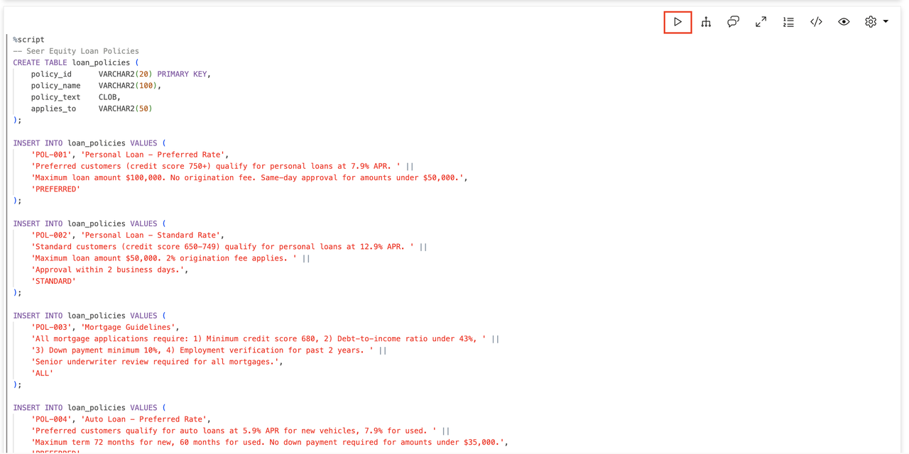

    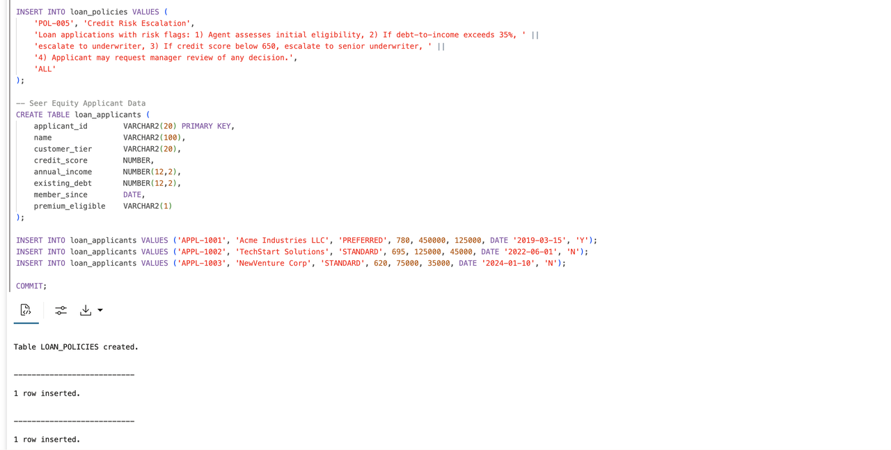

2. Create the data access functions.

    These functions become the agent's "eyes" into Seer Equity's enterprise data. Each function queries your tables and returns formatted information the agent can use.

    - **get_loan_policy**: Retrieves loan policies by type and optionally by customer tier
    - **get_applicant_info**: Retrieves applicant details including credit score, income, and eligibility

    > This command is already in your notebook—just click the play button (▶) to run it.

    ```sql
    <copy>
    -- Tool to look up loan policies
    CREATE OR REPLACE FUNCTION get_loan_policy(
        p_policy_type   VARCHAR2,
        p_customer_tier VARCHAR2 DEFAULT NULL
    ) RETURN VARCHAR2 AS
        v_result CLOB := '';
    BEGIN
        FOR rec IN (
            SELECT policy_name, policy_text 
            FROM loan_policies 
            WHERE UPPER(policy_name) LIKE '%' || UPPER(p_policy_type) || '%'
            AND (applies_to = p_customer_tier OR applies_to = 'ALL' OR p_customer_tier IS NULL)
        ) LOOP
            v_result := v_result || rec.policy_name || ': ' || rec.policy_text || CHR(10);
        END LOOP;
        
        IF v_result IS NULL THEN
            RETURN 'No policy found for: ' || p_policy_type;
        END IF;
        RETURN v_result;
    END;
    /

    -- Tool to look up applicant information
    CREATE OR REPLACE FUNCTION get_applicant_info(
        p_applicant_id VARCHAR2
    ) RETURN VARCHAR2 AS
        v_result VARCHAR2(500);
        v_dti NUMBER;
    BEGIN
        SELECT 'Applicant: ' || name || 
               ', Tier: ' || customer_tier || 
               ', Credit Score: ' || credit_score ||
               ', Annual Income: $' || TO_CHAR(annual_income, '999,999') ||
               ', Existing Debt: $' || TO_CHAR(existing_debt, '999,999') ||
               ', Debt-to-Income: ' || ROUND((existing_debt / annual_income) * 100, 1) || '%' ||
               ', Member Since: ' || TO_CHAR(member_since, 'YYYY-MM-DD') ||
               ', Premium Rate Eligible: ' || premium_eligible
        INTO v_result
        FROM loan_applicants
        WHERE applicant_id = p_applicant_id;
        
        RETURN v_result;
    EXCEPTION
        WHEN NO_DATA_FOUND THEN
            RETURN 'Applicant not found: ' || p_applicant_id;
    END;
    /
    </copy>
    ```

    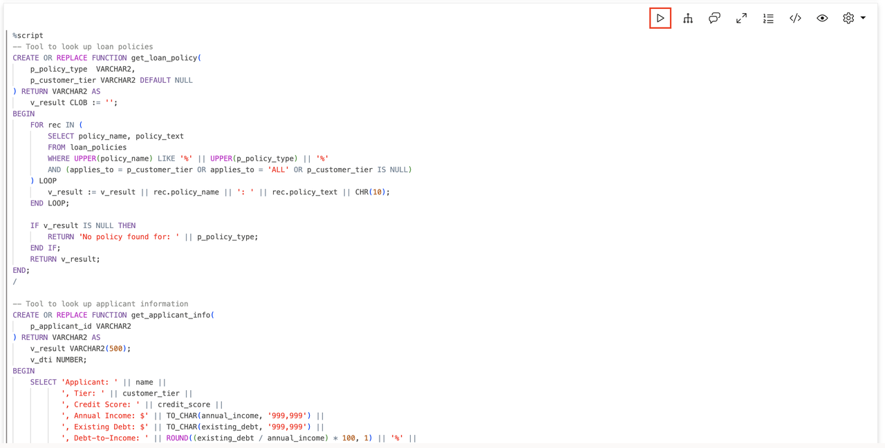

3. Register the tools.

    Register both functions as agent tools. The instructions tell the agent when to use each tool—loan policy questions use `LOAN_POLICY_TOOL`, applicant questions use `APPLICANT_LOOKUP_TOOL`.

    > This command is already in your notebook—just click the play button (▶) to run it.

    ```sql
    <copy>
    BEGIN
        DBMS_CLOUD_AI_AGENT.CREATE_TOOL(
            tool_name   => 'LOAN_POLICY_TOOL',
            attributes  => '{"instruction": "Look up Seer Equity loan policies. Parameters: P_POLICY_TYPE (e.g. personal, mortgage, auto, escalation), P_CUSTOMER_TIER (PREFERRED or STANDARD, optional). Always use this to answer loan policy and rate questions.",
                            "function": "get_loan_policy"}',
            description => 'Retrieves Seer Equity loan policies including rates, requirements, and approval guidelines'
        );
        
        DBMS_CLOUD_AI_AGENT.CREATE_TOOL(
            tool_name   => 'APPLICANT_LOOKUP_TOOL',
            attributes  => '{"instruction": "Look up loan applicant information. Parameter: P_APPLICANT_ID (e.g. APPL-1001). Returns credit score, income, debt-to-income ratio, and premium eligibility. Always use this when asked about specific applicants.",
                            "function": "get_applicant_info"}',
            description => 'Retrieves applicant details including credit score, income, and loan eligibility'
        );
    END;
    /
    </copy>
    ```

    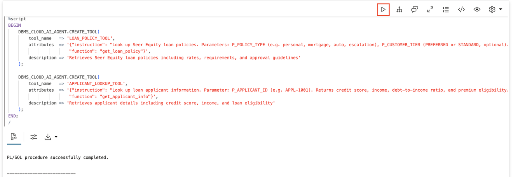

## Task 4: Create the Seer Equity Loan Agent

Create an agent that has access to your enterprise data tools. The role tells the agent it works for Seer Equity and should always use its tools—never guess about rates or applicant information.

1. Create the agent, task, and team.

    > This command is already in your notebook—just click the play button (▶) to run it.

    ```sql
    <copy>
    BEGIN
        DBMS_CLOUD_AI_AGENT.CREATE_AGENT(
            agent_name  => 'SEERS_LOAN_AGENT',
            attributes  => '{"profile_name": "genai",
                            "role": "You are a loan officer assistant for Seer Equity. You have access to company loan policies and applicant information. Always use your tools to look up real data - never guess about rates, policies, or applicant details."}',
            description => 'Agent with Seer Equity enterprise data access'
        );
        
        DBMS_CLOUD_AI_AGENT.CREATE_TASK(
            task_name   => 'SEERS_LOAN_TASK',
            attributes  => '{"instruction": "Help the loan officer by looking up relevant policies and applicant information using your tools. Do not ask clarifying questions - use the tools and report what you find. User request: {query}",
                            "tools": ["LOAN_POLICY_TOOL", "APPLICANT_LOOKUP_TOOL"]}',
            description => 'Task with Seer Equity data access'
        );
        
        DBMS_CLOUD_AI_AGENT.CREATE_TEAM(
            team_name   => 'SEERS_LOAN_TEAM',
            attributes  => '{"agents": [{"name": "SEERS_LOAN_AGENT", "task": "SEERS_LOAN_TASK"}],
                            "process": "sequential"}',
            description => 'Team with Seer Equity enterprise data'
        );
    END;
    /
    </copy>
    ```

    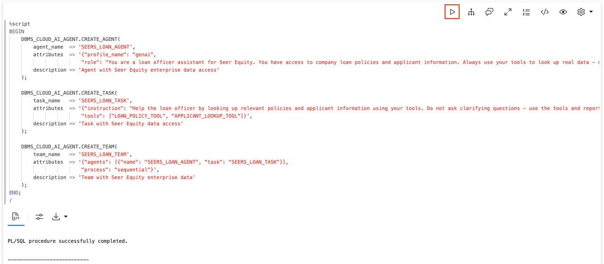

2. Activate the Seer Equity agent.

    Set the team so your `SELECT AI AGENT` commands go to this agent.

    > This command is already in your notebook—just click the play button (▶) to run it.

    ```sql
    <copy>
    EXEC DBMS_CLOUD_AI_AGENT.SET_TEAM('SEERS_LOAN_TEAM');
    </copy>
    ```

    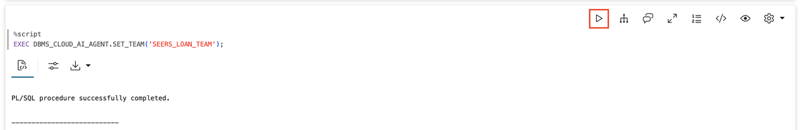

## Task 5: Ask the Same Questions Again

Now ask the SAME questions you asked the raw LLM earlier. This time, the agent has access to Seer Equity's policy data and applicant records. Watch the transformation.

1. Ask about personal loan rates for preferred customers.

    > This command is already in your notebook—just click the play button (▶) to run it.

    ```sql
    <copy>
    SELECT AI AGENT What are the current interest rates for personal loans for preferred customers;
    </copy>
    ```

    **Watch the difference:** Instead of generic advice, you get YOUR actual rates: 7.9% APR for preferred customers, $100,000 maximum, no origination fee, same-day approval for amounts under $50K.

    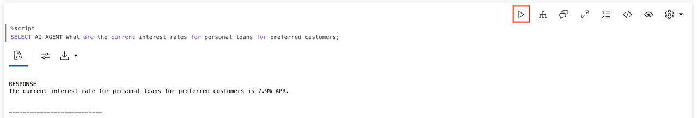

2. Ask about the specific applicant.

    Now ask about applicant APPL-1001 again.

    > This command is already in your notebook—just click the play button (▶) to run it.

    ```sql
    <copy>
    SELECT AI AGENT Is applicant APPL-1001 eligible for a premium rate loan;
    </copy>
    ```

    **Watch the difference:** The agent looks up the applicant and reports factual information: Acme Industries LLC, PREFERRED tier, 780 credit score, $450K income, 27.8% debt-to-income, premium eligible = YES. Real data, not hallucination.

    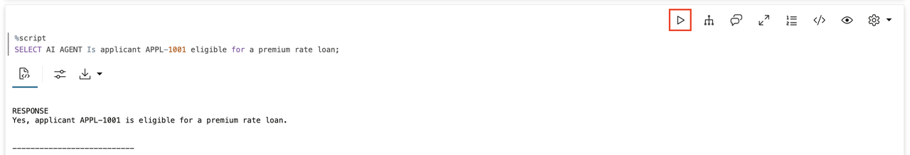

3. Ask about mortgage requirements.

    > This command is already in your notebook—just click the play button (▶) to run it.

    ```sql
    <copy>
    SELECT AI AGENT What are the mortgage requirements at Seer Equity;
    </copy>
    ```

    **Watch the result:** Your actual mortgage guidelines: minimum credit score 680, DTI under 43%, 10% down payment minimum, 2 years employment verification, senior underwriter required. The agent knows your procedures.

    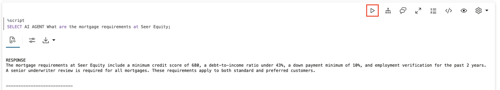

4. Ask about the risk escalation process.

    > This command is already in your notebook—just click the play button (▶) to run it.

    ```sql
    <copy>
    SELECT AI AGENT What is the escalation process for high-risk loan applications;
    </copy>
    ```

    **Watch the result:** Your actual escalation process: initial assessment by agent, underwriter if DTI exceeds 35%, senior underwriter if credit below 650, manager review available. The agent knows your risk management procedures.

    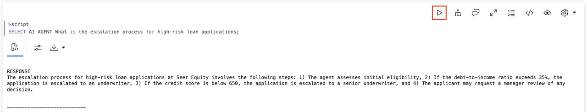

## Task 6: Verify the Agent Used Your Data

Look at the tool execution history to confirm the agent queried your enterprise data. You should see `LOAN_POLICY_TOOL` and `APPLICANT_LOOKUP_TOOL` calls, with results from your actual tables. This proves the agent is using real data, not making things up.

1. Query the tool history.

    > This command is already in your notebook—just click the play button (▶) to run it.

    ```sql
    <copy>
    SELECT 
        tool_name,
        TO_CHAR(start_date, 'HH24:MI:SS') as called_at,
        SUBSTR(output, 1, 80) as result
    FROM USER_AI_AGENT_TOOL_HISTORY
    ORDER BY start_date DESC
    FETCH FIRST 10 ROWS ONLY;
    </copy>
    ```

    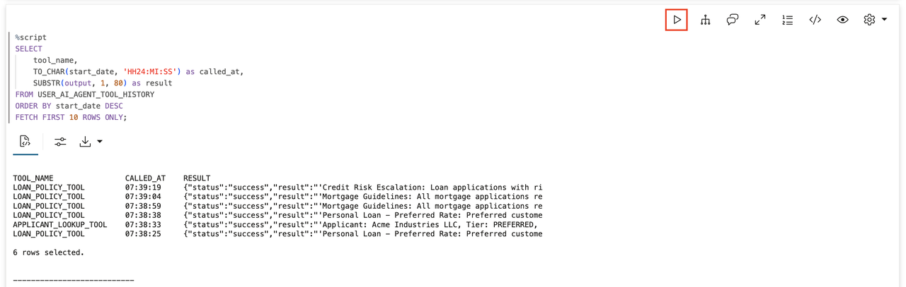

## Summary

In this lab, you experienced the transformative power of enterprise data at Seer Equity:

| Approach | Result |
|----------|--------|
| **SELECT AI CHAT** (LLM only) | Generic answers, no business knowledge |
| **SELECT AI AGENT** (with tools) | YOUR loan rates, YOUR applicants, YOUR procedures |

**Key takeaway:** Agents don't fail because they're not smart. They fail because they don't know your business. Enterprise data is what transforms generic AI into Seer Equity's AI.

The LLM provides the intelligence. Your database provides the knowledge. Together, they create an agent that actually understands your lending business.

## Learn More

* [`DBMS_CLOUD_AI_AGENT` Package](https://docs.oracle.com/en/cloud/paas/autonomous-database/serverless/adbsb/dbms-cloud-ai-agent-package.html)

## Acknowledgements

* **Author** - David Start
* **Last Updated By/Date** - David Start, January 2026

## Cleanup (Optional)

Run this to remove all objects created in this lab.

> This command is already in your notebook—just click the play button (▶) to run it.

```sql
<copy>
EXEC DBMS_CLOUD_AI_AGENT.DROP_TEAM('SEERS_LOAN_TEAM', TRUE);
EXEC DBMS_CLOUD_AI_AGENT.DROP_TASK('SEERS_LOAN_TASK', TRUE);
EXEC DBMS_CLOUD_AI_AGENT.DROP_AGENT('SEERS_LOAN_AGENT', TRUE);
EXEC DBMS_CLOUD_AI_AGENT.DROP_TOOL('LOAN_POLICY_TOOL', TRUE);
EXEC DBMS_CLOUD_AI_AGENT.DROP_TOOL('APPLICANT_LOOKUP_TOOL', TRUE);
DROP TABLE loan_policies PURGE;
DROP TABLE loan_applicants PURGE;
DROP FUNCTION get_loan_policy;
DROP FUNCTION get_applicant_info;
</copy>
```

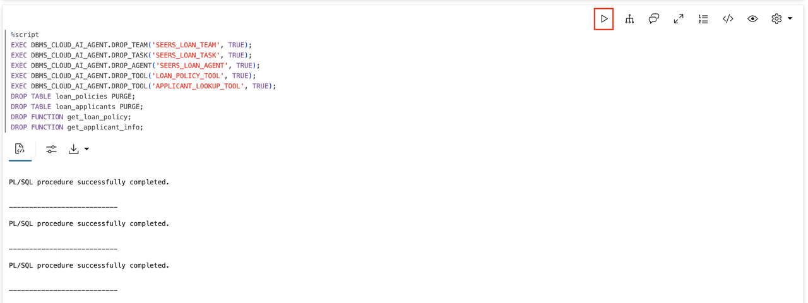
