# The Four Types of Agent Memory at Seer Equity

## Introduction

In this lab, you'll build all four types of memory that agents need to operate effectively.

### The Business Problem

Two similar business loan applications came in last quarter at Seer Equity. Same loan amount, similar credit profiles, similar businesses. One got approved at preferred rates; the other got denied outright.

> *"Every loan officer handles the same situation differently. There's no way to learn from past decisions or ensure consistency."*

The problem isn't just forgetting clients. It's forgetting *decisions*. Without memory of what worked before, every loan decision starts from scratch.

### What You'll Learn

Agents need four types of memory, just like people:

| Memory Type | Purpose | Example at Seer Equity |
|-------------|---------|------------------------|
| **Short-term context** | What's happening right now | "Working on LOAN-5678 for Sarah Chen" |
| **Long-term facts** | Stable client information | "Sarah Chen has 15% rate exception" |
| **Decisions/outcomes** | What we decided before | "Approved similar loan last quarter, client paid on time" |
| **Reference knowledge** | Corporate policies | "Preferred rate is 7.9% for 750+ credit" |

In this lab, you'll build all four types and see how they work together to make agents consistent and explainable.

**What you'll build:** A complete four-type memory architecture for loan decisions.

Estimated Time: 15 minutes

### Objectives

* Create the four types of agent memory
* Understand when each type is used
* Store and retrieve from each memory type
* See how agents coordinate multiple memory types

### Prerequisites

For this workshop, we provide the environment. You'll need:

* Basic knowledge of SQL and PL/SQL, or the ability to follow along with the prompts

## Task 1: Import the Lab Notebook

Before you begin, you are going to import a notebook that has all of the commands for this lab into Oracle Machine Learning. This way you don't have to copy and paste them over to run them.

1. From the Oracle Machine Learning home page, click **Notebooks**.

    

2. Click **Import** to expand the Import drop down.

    

3. Select **Git**.

    

4. Paste the following GitHub URL leaving the credential field blank:

    ```text
    <copy>
    https://github.com/davidastart/database/blob/main/ai4u/four-memory-types/lab8-four-memory-types.json
    </copy>
    ```

5. Click **OK**.

    

    You should now be on the screen with the notebook imported. This workshop will have all of the screenshots and detailed information; however, the notebook will have the commands and basic instructions for completing the lab.

## Task 2: Create the Memory Tables

You'll create two tables:

1. **agent_memory** — A unified table for short-term, long-term, and decision memory with a type classifier

2. **reference_knowledge** — A separate table for loan policies (agents can read but not modify)

    Notice the `memory_type` constraint limits values to SHORTTERM, LONGTERM, DECISION, and REFERENCE.

1. Create the unified agent memory table.

    > This command is already in your notebook—just click the play button (▶) to run it.

    ```sql
    <copy>
    CREATE TABLE agent_memory (
        memory_id      RAW(16) DEFAULT SYS_GUID() PRIMARY KEY,
        memory_type    VARCHAR2(20) NOT NULL,  -- SHORTTERM, LONGTERM, DECISION, REFERENCE
        session_id     VARCHAR2(100),          -- For short-term context
        entity_id      VARCHAR2(100),          -- What this is about (client or loan)
        content        JSON NOT NULL,
        created_at     TIMESTAMP DEFAULT SYSTIMESTAMP,
        expires_at     TIMESTAMP,              -- For short-term context expiration
        CONSTRAINT chk_memory_type CHECK (memory_type IN ('SHORTTERM', 'LONGTERM', 'DECISION', 'REFERENCE'))
    );

    CREATE INDEX idx_memory_type ON agent_memory(memory_type);
    CREATE INDEX idx_memory_entity ON agent_memory(entity_id);
    CREATE INDEX idx_memory_session ON agent_memory(session_id);
    </copy>
    ```

    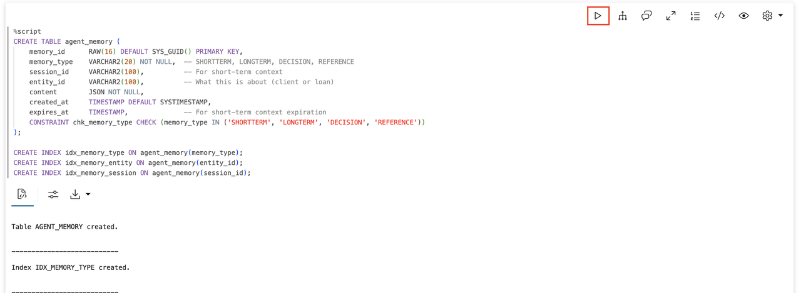

2. Create the reference knowledge table.

    Reference knowledge is different—it's maintained by humans, not agents. Agents can read Seer Equity's loan policies but shouldn't modify them. Notice the `updated_by` column tracks who changed the policy. This is corporate knowledge, not agent learning.

    > This command is already in your notebook—just click the play button (▶) to run it.

    ```sql
    <copy>
    CREATE TABLE reference_knowledge (
        ref_id       RAW(16) DEFAULT SYS_GUID() PRIMARY KEY,
        category     VARCHAR2(100) NOT NULL,
        name         VARCHAR2(200) NOT NULL,
        content      JSON NOT NULL,
        is_active    NUMBER(1) DEFAULT 1,
        created_at   TIMESTAMP DEFAULT SYSTIMESTAMP,
        updated_by   VARCHAR2(100)  -- Humans update this, not agents
    );
    </copy>
    ```

    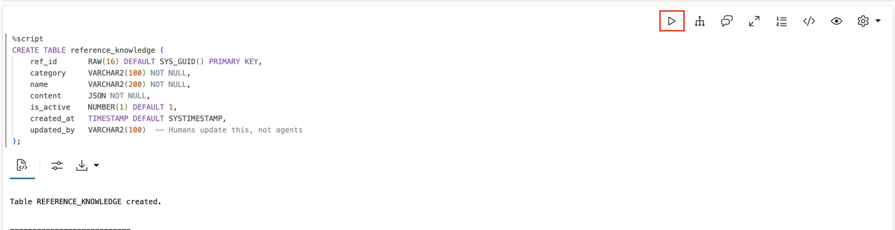

## Task 3: Short-Term Context (Current Task)

Short-term context holds what's happening right now—the active information for completing the current loan task. This is like a loan officer's working memory: what they're actively thinking about while processing an application.

- **set_context** — Store context for a session/entity (replaces old context, expires in 1 hour)
- **get_context** — Retrieve context for a session

1. Create the short-term context functions.

    > This command is already in your notebook—just click the play button (▶) to run it.

    ```sql
    <copy>
    -- Store short-term context
    CREATE OR REPLACE FUNCTION set_context(
        p_session_id  VARCHAR2,
        p_entity_id   VARCHAR2,
        p_context     VARCHAR2
    ) RETURN VARCHAR2 AS
        PRAGMA AUTONOMOUS_TRANSACTION;
    BEGIN
        -- Clear old context for this session/entity
        DELETE FROM agent_memory 
        WHERE memory_type = 'SHORTTERM' 
        AND session_id = p_session_id 
        AND entity_id = p_entity_id;
        
        -- Store new context (expires in 1 hour)
        INSERT INTO agent_memory (memory_type, session_id, entity_id, content, expires_at)
        VALUES (
            'SHORTTERM', 
            p_session_id, 
            p_entity_id,
            JSON_OBJECT('context' VALUE p_context, 'set_at' VALUE TO_CHAR(SYSTIMESTAMP, 'HH24:MI:SS')),
            SYSTIMESTAMP + INTERVAL '1' HOUR
        );
        COMMIT;
        RETURN 'Context set for ' || p_entity_id;
    END;
    /

    -- Get short-term context
    CREATE OR REPLACE FUNCTION get_context(
        p_session_id VARCHAR2,
        p_entity_id  VARCHAR2 DEFAULT NULL
    ) RETURN VARCHAR2 AS
        v_result CLOB := '';
    BEGIN
        FOR rec IN (
            SELECT entity_id, JSON_VALUE(content, '$.context') as context
            FROM agent_memory
            WHERE memory_type = 'SHORTTERM'
            AND session_id = p_session_id
            AND (p_entity_id IS NULL OR entity_id = p_entity_id)
            AND (expires_at IS NULL OR expires_at > SYSTIMESTAMP)
        ) LOOP
            v_result := v_result || rec.entity_id || ': ' || rec.context || CHR(10);
        END LOOP;
        
        IF v_result IS NULL THEN
            RETURN 'No active context found.';
        END IF;
        RETURN v_result;
    END;
    /
    </copy>
    ```

    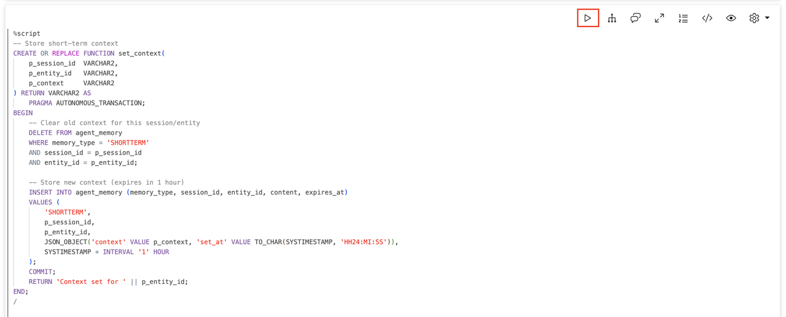

    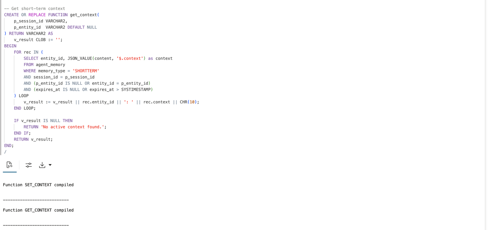

2. Test short-term context.

    Set context for a loan processing session—imagine a loan officer working on an application and tracking both the client and the application details. You should see both context items returned.

    > This command is already in your notebook—just click the play button (▶) to run it.

    ```sql
    <copy>
    -- Set context for current loan task
    SELECT set_context('SESSION-001', 'current_client', 'Sarah Chen, Preferred tier, discussing personal loan') FROM DUAL;
    SELECT set_context('SESSION-001', 'current_application', 'LOAN-5678, $75K personal loan, needs by Friday') FROM DUAL;

    -- Retrieve context
    SELECT get_context('SESSION-001') FROM DUAL;
    </copy>
    ```

    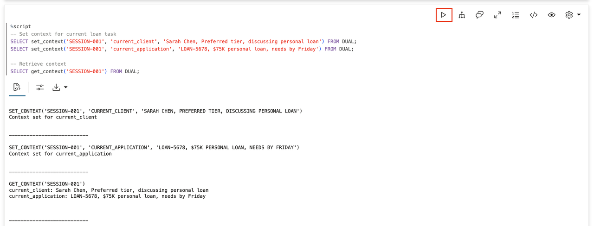

## Task 4: Long-Term Facts (Persistent Client Knowledge)

Long-term facts are stable information about clients that the agent should rely on across all tasks and sessions. Unlike short-term context, these don't expire—once Seer Equity learns something about a client, the agent remembers forever.

- **store_fact** — Store a fact about a client with an optional category
- **get_facts** — Retrieve facts about a client, optionally filtered by category

1. Create the long-term facts functions.

    > This command is already in your notebook—just click the play button (▶) to run it.

    ```sql
    <copy>
    -- Store a long-term fact
    CREATE OR REPLACE FUNCTION store_fact(
        p_entity_id   VARCHAR2,
        p_fact        VARCHAR2,
        p_category    VARCHAR2 DEFAULT 'general'
    ) RETURN VARCHAR2 AS
        PRAGMA AUTONOMOUS_TRANSACTION;
    BEGIN
        INSERT INTO agent_memory (memory_type, entity_id, content)
        VALUES (
            'LONGTERM',
            p_entity_id,
            JSON_OBJECT(
                'fact'     VALUE p_fact,
                'category' VALUE p_category,
                'learned'  VALUE TO_CHAR(SYSTIMESTAMP, 'YYYY-MM-DD HH24:MI:SS')
            )
        );
        COMMIT;
        RETURN 'Fact stored about ' || p_entity_id || ': ' || p_fact;
    END;
    /

    -- Retrieve facts about an entity
    CREATE OR REPLACE FUNCTION get_facts(
        p_entity_id VARCHAR2,
        p_category  VARCHAR2 DEFAULT NULL
    ) RETURN CLOB AS
        v_result CLOB := '';
        v_count NUMBER := 0;
    BEGIN
        FOR rec IN (
            SELECT 
                JSON_VALUE(content, '$.fact') as fact,
                JSON_VALUE(content, '$.category') as category
            FROM agent_memory
            WHERE memory_type = 'LONGTERM'
            AND entity_id = p_entity_id
            AND (p_category IS NULL OR JSON_VALUE(content, '$.category') = p_category)
            ORDER BY created_at DESC
        ) LOOP
            v_result := v_result || '- ' || rec.fact || ' (' || rec.category || ')' || CHR(10);
            v_count := v_count + 1;
        END LOOP;
        
        IF v_count = 0 THEN
            RETURN 'No facts found for ' || p_entity_id;
        END IF;
        RETURN 'Found ' || v_count || ' facts about ' || p_entity_id || ':' || CHR(10) || v_result;
    END;
    /
    </copy>
    ```

    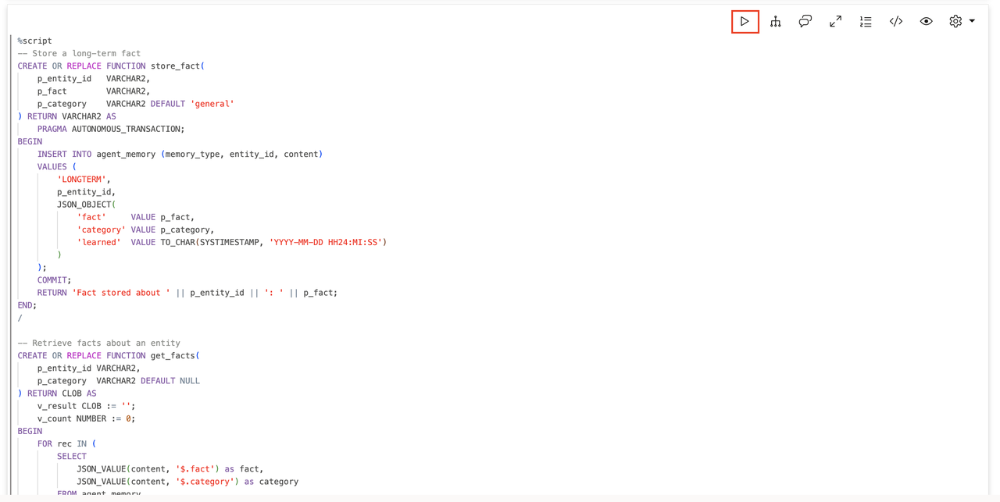

    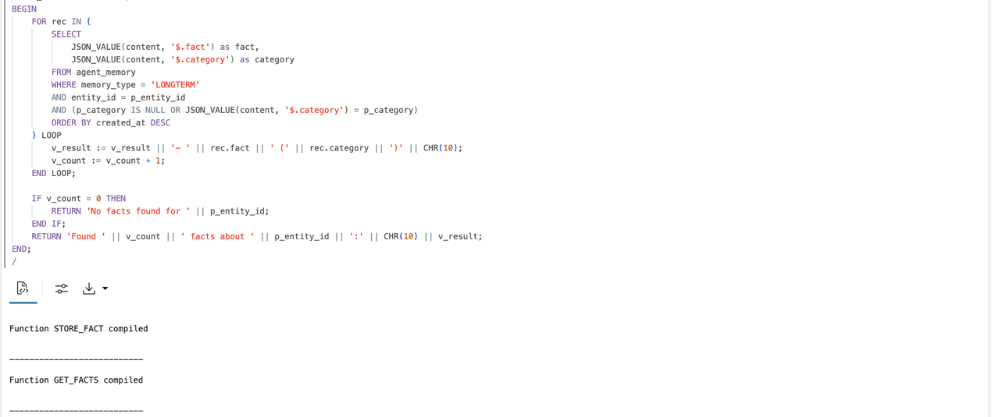

2. Store long-term facts about Seer Equity clients.

    Store several facts about two clients. Notice the different categories: `contact_preference`, `rate_exception`, `relationship`, `requirement`, `schedule`. These facts will persist across all sessions—every time the agent deals with CLIENT-001, it should know they prefer email and have a rate exception.

    > This command is already in your notebook—just click the play button (▶) to run it.

    ```sql
    <copy>
    -- Facts about Seer Equity clients
    SELECT store_fact('CLIENT-001', 'Prefers email contact, never phone', 'contact_preference') FROM DUAL;
    SELECT store_fact('CLIENT-001', 'Pacific timezone, best contact time is 9-11am PT', 'contact_preference') FROM DUAL;
    SELECT store_fact('CLIENT-001', 'Approved for 15% rate exception due to 6-year relationship', 'rate_exception') FROM DUAL;
    SELECT store_fact('CLIENT-001', 'Client since 2018, excellent payment history on 3 previous loans', 'relationship') FROM DUAL;

    SELECT store_fact('CLIENT-002', 'Requires all documents via secure portal', 'requirement') FROM DUAL;
    SELECT store_fact('CLIENT-002', 'Annual loan review scheduled for March', 'schedule') FROM DUAL;
    </copy>
    ```

    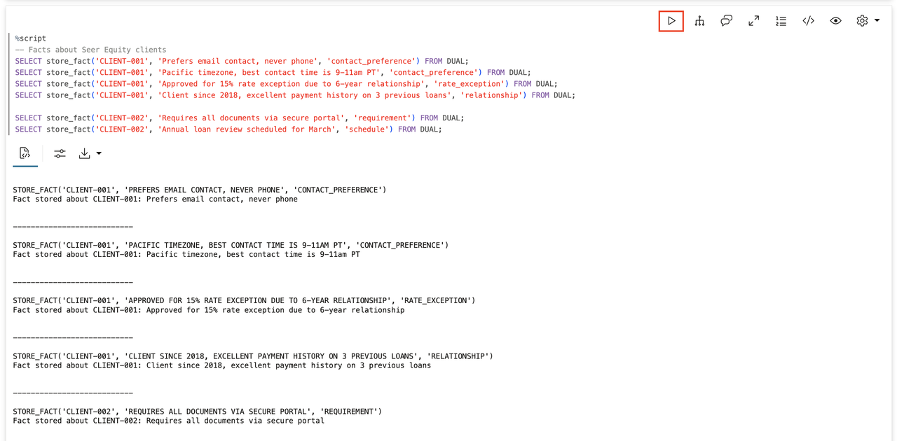

3. Retrieve long-term facts.

    Query the facts you stored. First get all facts about CLIENT-001, then filter to just contact preferences. You should see 4 facts for CLIENT-001, and 2 when filtered to just `contact_preference`.

    > This command is already in your notebook—just click the play button (▶) to run it.

    ```sql
    <copy>
    -- Get all facts about a client
    SELECT get_facts('CLIENT-001') as facts FROM DUAL;

    -- Get only contact preferences
    SELECT get_facts('CLIENT-001', 'contact_preference') as contact_prefs FROM DUAL;
    </copy>
    ```

    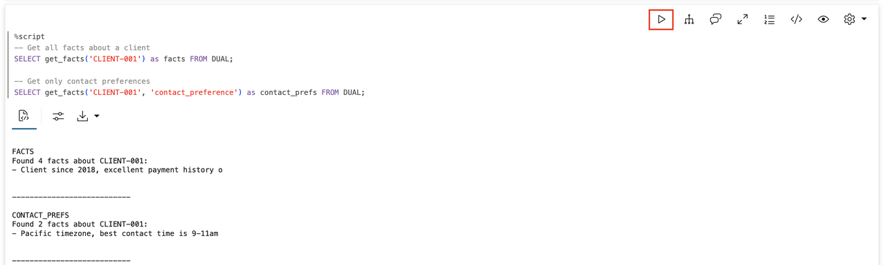

## Task 5: Decisions and Outcomes (Audit Trail)

Decisions and outcomes are the audit trail—what the agent decided on past loans and what happened as a result. This is how agents learn from experience: when facing a new loan situation, they can check what worked (or didn't work) before.

- **record_decision** — Store a loan decision with its situation, action, outcome, and success flag
- **find_past_decisions** — Search for similar loan situations to learn from past experience

1. Create the decision and outcome functions.

    > This command is already in your notebook—just click the play button (▶) to run it.

    ```sql
    <copy>
    -- Record a loan decision
    CREATE OR REPLACE FUNCTION record_decision(
        p_entity_id   VARCHAR2,
        p_situation   VARCHAR2,
        p_decision    VARCHAR2,
        p_outcome     VARCHAR2,
        p_success     VARCHAR2 DEFAULT 'true'
    ) RETURN VARCHAR2 AS
        PRAGMA AUTONOMOUS_TRANSACTION;
    BEGIN
        INSERT INTO agent_memory (memory_type, entity_id, content)
        VALUES (
            'DECISION',
            p_entity_id,
            JSON_OBJECT(
                'situation' VALUE p_situation,
                'decision'  VALUE p_decision,
                'outcome'   VALUE p_outcome,
                'success'   VALUE (CASE WHEN UPPER(p_success) = 'TRUE' THEN true ELSE false END),
                'recorded'  VALUE TO_CHAR(SYSTIMESTAMP, 'YYYY-MM-DD HH24:MI:SS')
            )
        );
        COMMIT;
        RETURN 'Decision recorded: ' || p_decision;
    END;
    /

    -- Find similar past decisions
    CREATE OR REPLACE FUNCTION find_past_decisions(
        p_situation VARCHAR2,
        p_limit     NUMBER DEFAULT 3
    ) RETURN CLOB AS
        v_result CLOB := '';
        v_count NUMBER := 0;
    BEGIN
        FOR rec IN (
            SELECT 
                entity_id,
                JSON_VALUE(content, '$.situation') as situation,
                JSON_VALUE(content, '$.decision') as decision,
                JSON_VALUE(content, '$.outcome') as outcome,
                JSON_VALUE(content, '$.success') as success
            FROM agent_memory
            WHERE memory_type = 'DECISION'
            AND (
                UPPER(JSON_VALUE(content, '$.situation')) LIKE '%' || UPPER(p_situation) || '%'
                OR UPPER(p_situation) LIKE '%' || UPPER(SUBSTR(JSON_VALUE(content, '$.situation'), 1, 20)) || '%'
            )
            ORDER BY created_at DESC
            FETCH FIRST p_limit ROWS ONLY
        ) LOOP
            v_result := v_result || 
                'Situation: ' || rec.situation || CHR(10) ||
                'Decision: ' || rec.decision || CHR(10) ||
                'Outcome: ' || rec.outcome || 
                ' (Success: ' || rec.success || ')' || CHR(10) || '---' || CHR(10);
            v_count := v_count + 1;
        END LOOP;
        
        IF v_count = 0 THEN
            RETURN 'No similar decisions found.';
        END IF;
        RETURN 'Found ' || v_count || ' similar decisions:' || CHR(10) || v_result;
    END;
    /
    </copy>
    ```

    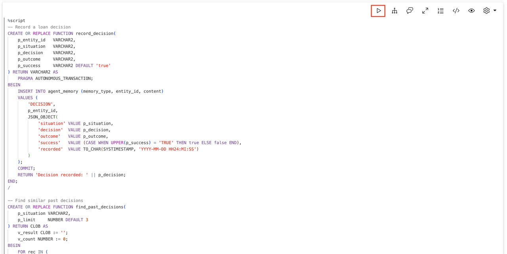

    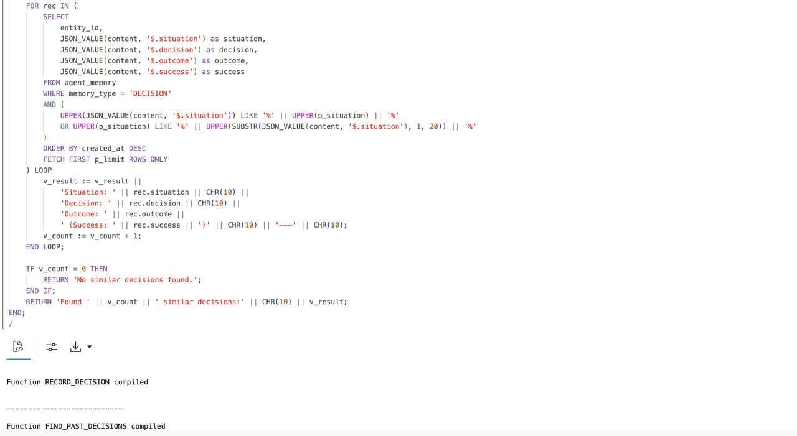

2. Record past loan decisions.

    Record some historical loan decisions, including both successful and unsuccessful outcomes. This creates a knowledge base the agent can learn from. Notice the third decision has `success = false`—the agent should learn what NOT to do from failures.

    > This command is already in your notebook—just click the play button (▶) to run it.

    ```sql
    <copy>
    -- Record past loan decisions and their outcomes
    SELECT record_decision(
        'CLIENT-001',
        'Preferred client requested rate exception for personal loan',
        'Approved 15% rate discount based on 6-year relationship and payment history',
        'Client accepted loan terms, successful disbursement, on-time payments',
        'true'
    ) FROM DUAL;

    SELECT record_decision(
        'CLIENT-002',
        'Standard client requested larger loan than credit profile supported',
        'Offered smaller loan amount with path to increase after 12 months good standing',
        'Client accepted modified terms, built relationship for future business',
        'true'
    ) FROM DUAL;

    SELECT record_decision(
        'CLIENT-003',
        'Client with marginal credit requested business loan',
        'Denied application citing credit score without offering alternatives',
        'Client went to competitor, later became successful business we lost',
        'false'
    ) FROM DUAL;

    SELECT record_decision(
        'CLIENT-003',
        'Client with marginal credit requested business loan',
        'Offered secured loan option with credit-building program',
        'Client accepted, improved credit over 18 months, now Preferred tier',
        'true'
    ) FROM DUAL;
    </copy>
    ```

    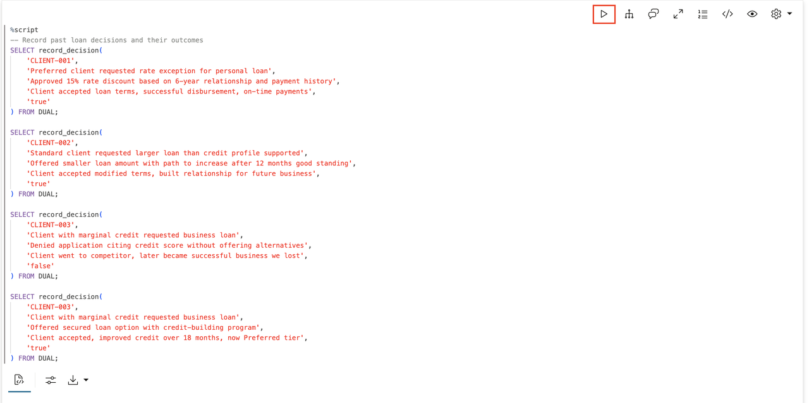

    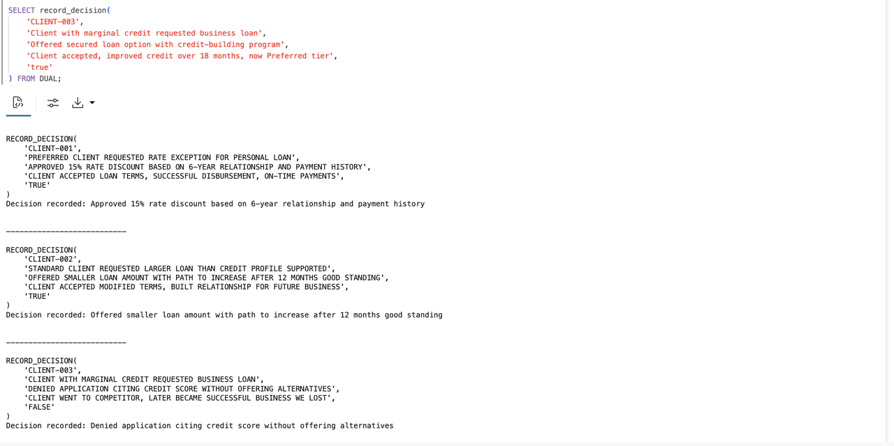

3. Search for similar past decisions.

    Search for decisions related to "rate exception" and "marginal credit". For rate exception you should find the successful decision. For marginal credit you should find BOTH the failed and successful approaches—a warning about what not to do AND what works.

    > This command is already in your notebook—just click the play button (▶) to run it.

    ```sql
    <copy>
    -- Find decisions about rate exceptions
    SELECT find_past_decisions('rate exception') as rate_decisions FROM DUAL;

    -- Find decisions about marginal credit
    SELECT find_past_decisions('marginal credit') as credit_decisions FROM DUAL;
    </copy>
    ```

    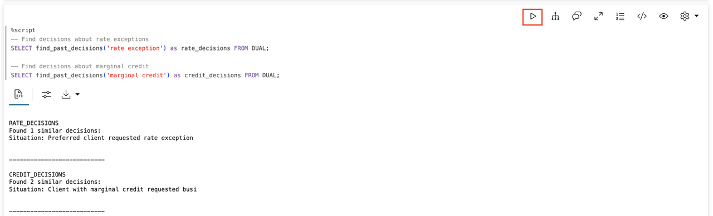

## Task 6: Reference Knowledge (Policies and Procedures)

Reference knowledge is Seer Equity's policies, procedures, and underwriting guidelines maintained by humans. Agents consult it but don't modify it. This separation is important: agents should follow corporate lending policies, not rewrite them.

- **add_reference** — Admin function to add policies (tracks who added it)
- **get_reference** — Agent function to look up policies

1. Create the reference knowledge functions.

    > This command is already in your notebook—just click the play button (▶) to run it.

    ```sql
    <copy>
    -- Add reference knowledge (admin function)
    CREATE OR REPLACE FUNCTION add_reference(
        p_category    VARCHAR2,
        p_name        VARCHAR2,
        p_content     VARCHAR2,
        p_updated_by  VARCHAR2 DEFAULT USER
    ) RETURN VARCHAR2 AS
        PRAGMA AUTONOMOUS_TRANSACTION;
    BEGIN
        INSERT INTO reference_knowledge (category, name, content, updated_by)
        VALUES (
            p_category,
            p_name,
            JSON_OBJECT('text' VALUE p_content),
            p_updated_by
        );
        COMMIT;
        RETURN 'Reference added: ' || p_name;
    END;
    /

    -- Get reference knowledge (agent reads this)
    CREATE OR REPLACE FUNCTION get_reference(
        p_category VARCHAR2 DEFAULT NULL,
        p_name     VARCHAR2 DEFAULT NULL
    ) RETURN CLOB AS
        v_result CLOB := '';
        v_count NUMBER := 0;
    BEGIN
        FOR rec IN (
            SELECT category, name, JSON_VALUE(content, '$.text') as text
            FROM reference_knowledge
            WHERE is_active = 1
            AND (p_category IS NULL OR UPPER(category) LIKE '%' || UPPER(p_category) || '%')
            AND (p_name IS NULL OR UPPER(name) LIKE '%' || UPPER(p_name) || '%')
            ORDER BY category, name
        ) LOOP
            v_result := v_result || '[' || rec.category || '] ' || rec.name || ':' || CHR(10) ||
                       rec.text || CHR(10) || CHR(10);
            v_count := v_count + 1;
        END LOOP;
        
        IF v_count = 0 THEN
            RETURN 'No reference knowledge found.';
        END IF;
        RETURN 'Found ' || v_count || ' references:' || CHR(10) || v_result;
    END;
    /
    </copy>
    ```

    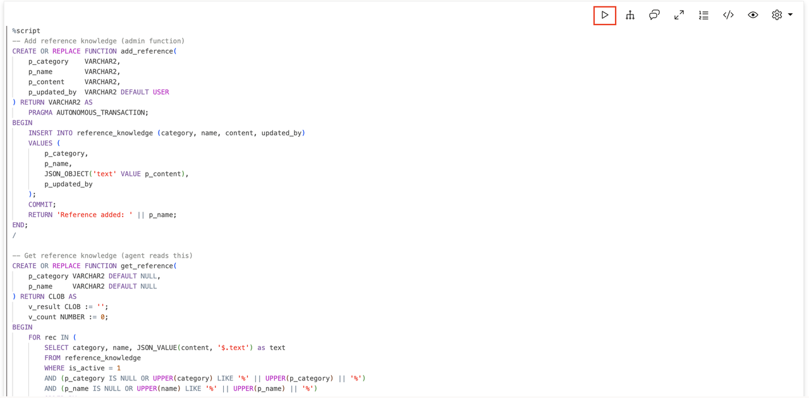

    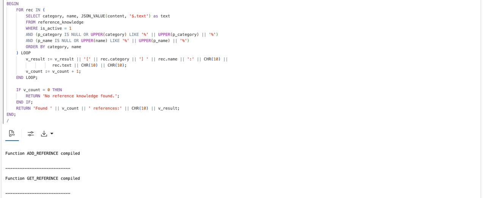

2. Add Seer Equity reference knowledge (loan policies).

    Add Seer Equity's loan policies as an administrator would. These are corporate rules the agent must follow. Notice the different categories: `policy`, `procedure`, `guideline`—this helps agents find the right type of reference.

    > This command is already in your notebook—just click the play button (▶) to run it.

    ```sql
    <copy>
    -- Add Seer Equity loan policies
    SELECT add_reference('policy', 'Personal Loan - Preferred Rate', 
        'Preferred customers (credit score 750+) qualify for personal loans at 7.9% APR. ' ||
        'Maximum loan amount $100,000. No origination fee. Same-day approval for amounts under $50,000.') FROM DUAL;
        
    SELECT add_reference('policy', 'Personal Loan - Standard Rate',
        'Standard customers (credit score 650-749) qualify for personal loans at 12.9% APR. ' ||
        'Maximum loan amount $50,000. 2% origination fee applies. Approval within 2 business days.') FROM DUAL;
        
    SELECT add_reference('procedure', 'Risk Escalation Process',
        'Loan risk escalation: 1) Agent assesses initial eligibility, 2) If DTI exceeds 35%, ' ||
        'escalate to underwriter, 3) If credit below 650, escalate to senior underwriter, ' ||
        '4) Applicant may request manager review of any decision.') FROM DUAL;
        
    SELECT add_reference('guideline', 'Client Communication Standards',
        'Always be professional and solution-focused. Acknowledge client concerns before ' ||
        'explaining policy. When declining, always offer alternatives or a path forward.') FROM DUAL;
    </copy>
    ```

    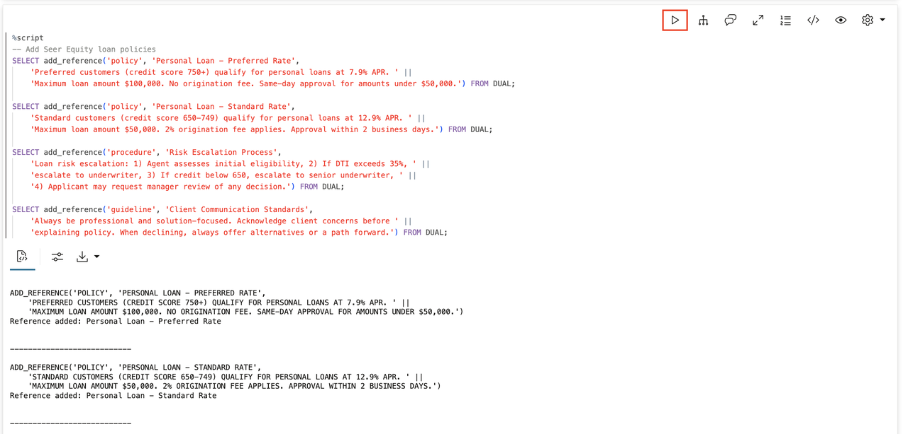

3. Query Seer Equity reference knowledge.

    Look up loan policies and procedures. You should see both rate policies when searching for `policy`, and the escalation steps when searching for `escalation`.

    > This command is already in your notebook—just click the play button (▶) to run it.

    ```sql
    <copy>
    -- Get all loan policies
    SELECT get_reference('policy') as policies FROM DUAL;

    -- Get escalation procedure
    SELECT get_reference('procedure', 'escalation') as escalation FROM DUAL;
    </copy>
    ```

    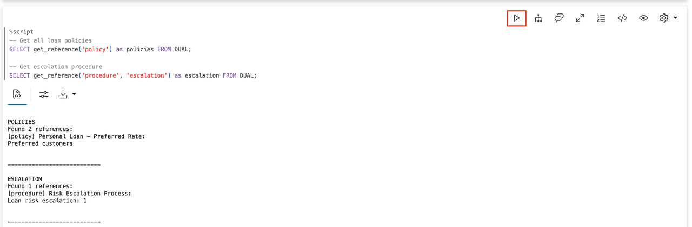

## Task 7: A Complete Example — Using All Four Memory Types

Now let's trace how an agent would use all four types together when handling a loan inquiry at Seer Equity.

**Scenario:** CLIENT-001 (Sarah Chen) calls about a new loan request.

* **Short-term context** — Record what's happening now
* **Long-term facts** — Check what we know about this client
* **Reference knowledge** — Check the relevant policy
* **Past decisions** — See what worked before in similar situations
* **Record the decision** — Log what we decided and what happened
* **Store new fact** — Remember anything new we learned

> This command is already in your notebook - just click the play button (▶) to run it.

1. Sarah Chen inquires about a new loan
    ```sql
    <copy>
    -- Scenario: CLIENT-001 (Sarah Chen) inquires about a new loan
    -- 1. Set short-term context (current task)
    SELECT set_context('SESSION-002', 'client', 'CLIENT-001 Sarah Chen calling about new personal loan') as step1_context FROM DUAL;
    SELECT set_context('SESSION-002', 'issue', '$75K request, wants to know applicable rate') as step1_issue FROM DUAL;

    -- 2. Check long-term facts (what do we know about them?)
    SELECT get_facts('CLIENT-001') as step2_facts FROM DUAL;

    -- 3. Check reference knowledge (what is the policy?)
    SELECT get_reference('policy', 'preferred') as step3_policy FROM DUAL;

    -- 4. Find similar past decisions (what worked before?)
    SELECT find_past_decisions('rate exception') as step4_past_decisions FROM DUAL;

    -- 5. Agent makes decision based on all of this, then records it
    SELECT record_decision(
        'CLIENT-001',
        'Preferred client Sarah Chen requested $75K personal loan',
        'Quoted preferred rate 7.9% with 15% rate exception applied per client history',
        'Client satisfied with rate, proceeded with application same day',
        'true'
    ) as step5_decision FROM DUAL;

    -- 6. Learn new fact if relevant
    SELECT store_fact('CLIENT-001', 'Values quick decisions - appreciates same-day processing', 'preference') as step6_new_fact FROM DUAL;
    </copy>
    ```


    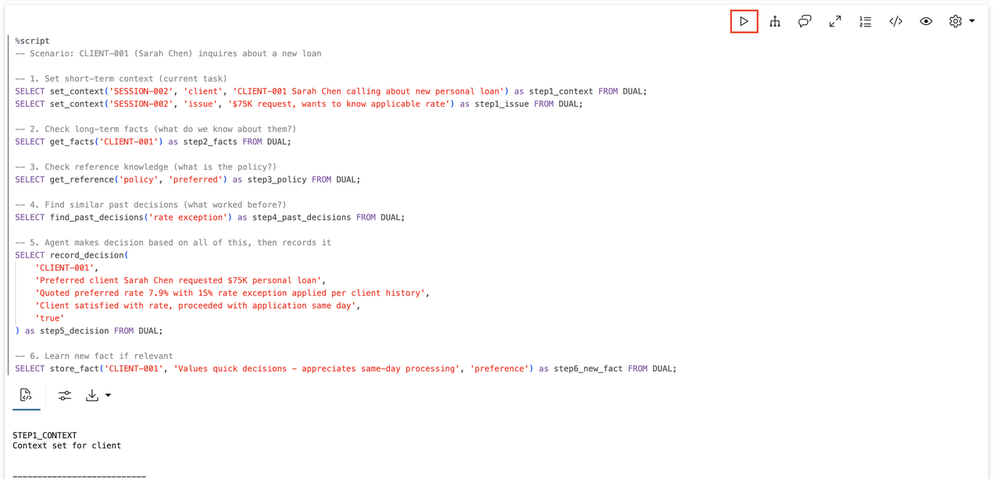

## Summary

In this lab, you built the four types of agent memory:

| Memory Type | Purpose | Lifespan | Who Updates |
|-------------|---------|----------|-------------|
| **Short-term** | Current loan task context | Expires (1 hour) | Agent |
| **Long-term** | Client knowledge | Forever | Agent |
| **Decision** | Loan decision audit trail | Forever | Agent |
| **Reference** | Loan policies | Forever | Humans |

Together, these memories make agents:
- **Consistent** — Same client, same treatment
- **Contextual** — Aware of current loan situation
- **Explainable** — Every loan decision is logged
- **Compliant** — Following human-defined lending policies

## Learn More

* [Oracle JSON Developer's Guide](https://docs.oracle.com/en/database/oracle/oracle-database/26/adjsn/)
* [`DBMS_CLOUD_AI_AGENT` Package](https://docs.oracle.com/en/cloud/paas/autonomous-database/serverless/adbsb/dbms-cloud-ai-agent-package.html)

## Acknowledgements

* **Author** - David Start
* **Last Updated By/Date** - David Start, January 2026

## Cleanup (Optional)

Run this to remove all objects created in this lab.

> This command is already in your notebook—just click the play button (▶) to run it.

```sql
<copy>
DROP TABLE agent_memory PURGE;
DROP TABLE reference_knowledge PURGE;
DROP FUNCTION set_context;
DROP FUNCTION get_context;
DROP FUNCTION store_fact;
DROP FUNCTION get_facts;
DROP FUNCTION record_decision;
DROP FUNCTION find_past_decisions;
DROP FUNCTION add_reference;
DROP FUNCTION get_reference;
</copy>
```

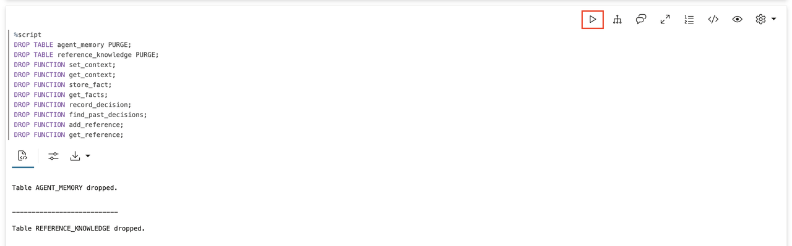
