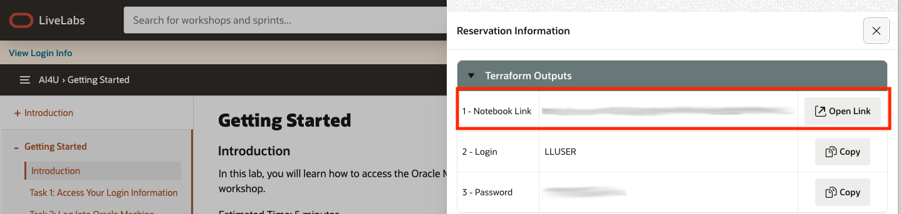
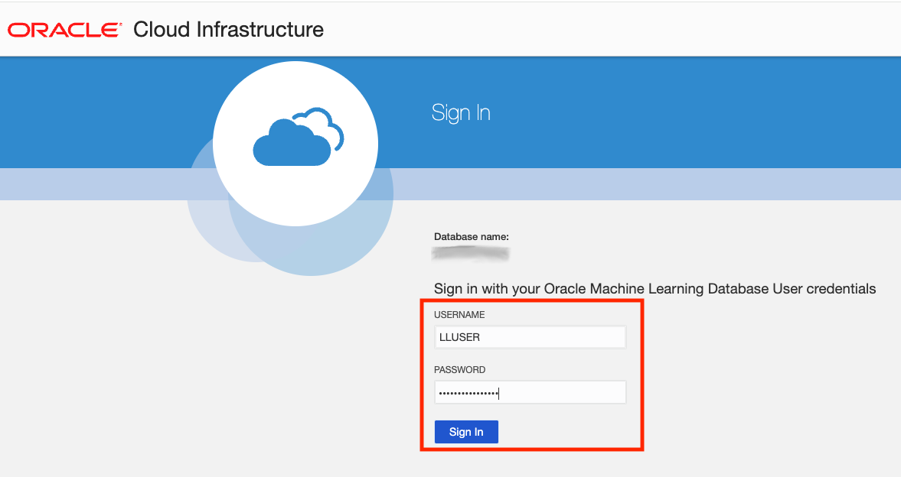
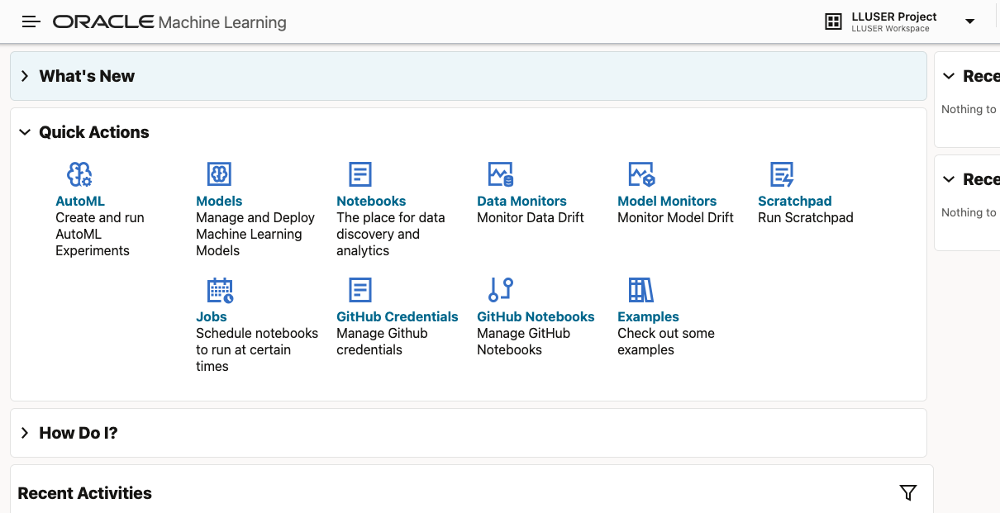

# Getting Started

## Introduction

In this lab, you will learn how to access the Oracle Machine Learning (OML) notebook environment where you will run all of the labs in this workshop.

Estimated Time: 5 minutes

### Objectives

* Access your reservation information
* Log into Oracle Machine Learning

## Task 1: Access Your Login Information

1. Click the **View Login Info** button in the workshop. This opens the reservation information panel on the right side of your screen.

    

2. In the reservation panel, you will see:

    - A link to the Oracle Machine Learning notebook (click the button to open it)
    - Your username
    - Your password

    

3. Click the button to open the Oracle Machine Learning notebook link. This opens OML in a new browser tab.

    

## Task 2: Log Into Oracle Machine Learning

1. On the Oracle Machine Learning sign-in page, enter the **username** and **password** from your reservation information and click **Sign In**

    

4. You should now see the Oracle Machine Learning home page.

    

## Summary

You are now logged into Oracle Machine Learning and ready to start the labs. Each lab includes instructions for importing its notebook, so proceed to Lab 1 and follow the steps there.

## Acknowledgements

* **Author** - David Start
* **Last Updated By/Date** - David Start, January 2026
