# Watch an Agent Think and Act at Seer Equity

## Introduction

In this lab, you will trace an agent through its complete execution loop, from understanding a request to taking action and reporting results.

Every agent follows the same pattern: **understand → plan → execute tools → analyze results → respond**. By observing this loop in detail—with step-by-step logging—you will understand exactly how agents transform requests into outcomes.

### The Business Problem

Seer Equity's loan officers are drowning in routine decisions. A $25,000 personal loan for someone with excellent credit should take minutes, not hours. But without smart routing, every application goes through the same manual review process.

> *"Small loans take as long to process as big ones. We spend hours reviewing applications that should just auto-approve."*

Meanwhile, the high-risk applications that actually need scrutiny get the same attention as routine ones. Senior underwriters waste time on $30K personal loans while $500K mortgages wait in queue.

### What You Will Learn

In this lab, you will build Seer Equity's risk assessment workflow. The agent will:

1. Create loan applications with proper tracking IDs
2. Assess risk based on loan type and amount
3. Route appropriately:
   - **Under $50K personal/auto** → Auto-approve (low risk)
   - **$50K–$250K** → Underwriter review
   - **Over $250K or mortgages** → Senior underwriter
4. Log every step for audit compliance

**What you will build:** A loan risk assessment workflow with conditional routing and audit trail.

Estimated Time: 10 minutes

### Objectives

* Trace the complete agent execution loop
* Understand the relationship between LLM reasoning and tool actions
* Use history views to see every step
* Build conditional routing based on loan amount and type

### Prerequisites

For this workshop, we provide the environment. You will need:

* Basic knowledge of SQL and PL/SQL, or the ability to follow along with the prompts

## Task 1: Import the Lab Notebook

Before you begin, import a notebook that has all of the commands for this lab into Oracle Machine Learning.

1. From the Oracle Machine Learning home page, click **Notebooks**.

    

2. Click **Import** to expand the Import drop down.

    

3. Select **Git**.

    

4. Paste the following GitHub URL leaving the credential field blank:

    ```text
    <copy>
    https://github.com/davidastart/database/blob/main/ai4u/how-agents-execute/lab4-how-agents-execute.json
    </copy>
    ```

5. Click **OK**.

    

    You should now be on the screen with the notebook imported. This workshop will have all of the screenshots and detailed information; however, the notebook will have the commands and basic instructions for completing the lab.

## Task 2: Create the Tracking Infrastructure

You will create tables that log every step the agent takes. This lets you watch the execution unfold like a movie—critical for audit trails in financial services.

The `workflow_log` table captures each step as it happens. The `loan_applications` table holds the actual business data the agent creates.

1. Create the sequence and tables.

    > This command is already in your notebook—just click the play button (▶) to run it.

    ```sql
    <copy>
    CREATE SEQUENCE loan_applications_seq START WITH 1001;

    CREATE TABLE workflow_log (
        log_id      NUMBER GENERATED ALWAYS AS IDENTITY PRIMARY KEY,
        step_name   VARCHAR2(100),
        step_detail VARCHAR2(500),
        logged_at   TIMESTAMP DEFAULT SYSTIMESTAMP
    );

    CREATE TABLE loan_applications (
        application_id  VARCHAR2(20) PRIMARY KEY,
        applicant_name  VARCHAR2(100),
        loan_amount     NUMBER(12,2),
        loan_type       VARCHAR2(50),
        risk_status     VARCHAR2(30) DEFAULT 'NEW',
        created_at      TIMESTAMP DEFAULT SYSTIMESTAMP
    );
    </copy>
    ```

    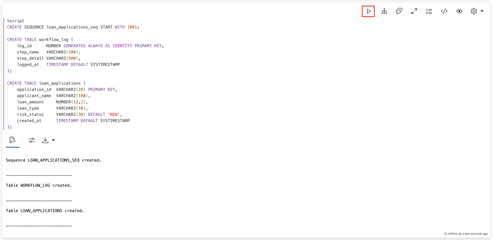

## Task 3: Create the Loan Application Tool

This function creates loan applications. Notice it logs to `workflow_log` before doing its work—this is how you'll trace execution.

The function generates a unique ID like `LOAN-250108-1001` and inserts the application with status `SUBMITTED`.

1. Create the `create_loan_application` function.

    > This command is already in your notebook—just click the play button (▶) to run it.

    ```sql
    <copy>
    CREATE OR REPLACE FUNCTION create_loan_application(
        p_applicant  VARCHAR2,
        p_amount     NUMBER,
        p_loan_type  VARCHAR2
    ) RETURN VARCHAR2 AS
        PRAGMA AUTONOMOUS_TRANSACTION;
        v_application_id VARCHAR2(20);
    BEGIN
        v_application_id := 'LOAN-' || TO_CHAR(SYSDATE, 'YYMMDD') || '-' || loan_applications_seq.NEXTVAL;
        
        -- Log the step
        INSERT INTO workflow_log (step_name, step_detail) 
        VALUES ('CREATE_APPLICATION', 'Created ' || v_application_id || ' for ' || p_applicant || ', $' || TO_CHAR(p_amount, '999,999'));
        
        -- Create the application
        INSERT INTO loan_applications (application_id, applicant_name, loan_amount, loan_type, risk_status)
        VALUES (v_application_id, p_applicant, p_amount, p_loan_type, 'SUBMITTED');
        
        COMMIT;
        RETURN 'Created loan application ' || v_application_id || ' for $' || TO_CHAR(p_amount, '999,999') || ' (' || p_loan_type || ' loan)';
    END;
    /
    </copy>
    ```

    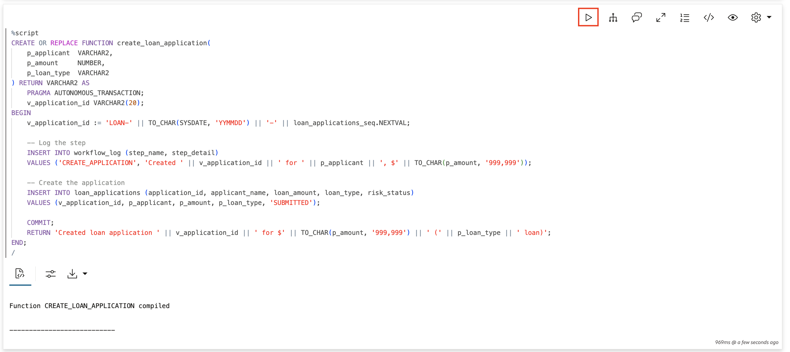

## Task 4: Create the Risk Assessment Tool

This function determines the risk level based on loan amount and type. At Seer Equity:

- Personal loans under $50K → **`AUTO_APPROVE`** (low risk, standard terms)
- Personal/Auto loans $50K–$250K → **`UNDERWRITER_REVIEW`** (moderate risk)
- Any loan $250K+ OR all Mortgage loans → **`SENIOR_UNDERWRITER`** (high value/complexity)

The agent will use this result to decide whether to call the routing tool.

1. Create the `assess_loan_risk` function.

    > This command is already in your notebook—just click the play button (▶) to run it.

    ```sql
    <copy>
    CREATE OR REPLACE FUNCTION assess_loan_risk(
        p_amount    NUMBER,
        p_loan_type VARCHAR2
    ) RETURN VARCHAR2 AS
        PRAGMA AUTONOMOUS_TRANSACTION;
        v_result VARCHAR2(200);
    BEGIN
        -- Log the step
        INSERT INTO workflow_log (step_name, step_detail) 
        VALUES ('ASSESS_RISK', 'Assessing risk for $' || TO_CHAR(p_amount, '999,999') || ' ' || p_loan_type || ' loan');
        
        -- Apply Seer Equity risk rules
        IF UPPER(p_loan_type) = 'MORTGAGE' THEN
            v_result := 'SENIOR_UNDERWRITER: All mortgage loans require senior review';
        ELSIF p_amount >= 250000 THEN
            v_result := 'SENIOR_UNDERWRITER: Loans $250K+ require senior underwriter';
        ELSIF p_amount >= 50000 THEN
            v_result := 'UNDERWRITER_REVIEW: Loans $50K-$250K require underwriter review';
        ELSE
            v_result := 'AUTO_APPROVE: Personal loans under $50K auto-approved';
        END IF;
        
        COMMIT;
        RETURN v_result;
    END;
    /
    </copy>
    ```

    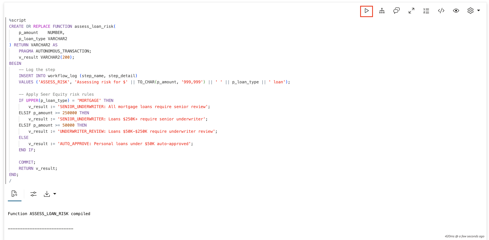

## Task 5: Create the Routing Tool

This function routes loan applications for underwriting review by updating their status. The agent should only call this when the risk assessment returns `UNDERWRITER_REVIEW` or `SENIOR_UNDERWRITER`.

This is where you will see the agent make decisions. It reads the risk assessment and decides whether to call this tool.

1. Create the `route_for_underwriting` function.

    > This command is already in your notebook—just click the play button (▶) to run it.

    ```sql
    <copy>
    CREATE OR REPLACE FUNCTION route_for_underwriting(
        p_application_id  VARCHAR2,
        p_review_level    VARCHAR2
    ) RETURN VARCHAR2 AS
        PRAGMA AUTONOMOUS_TRANSACTION;
    BEGIN
        -- Log the step
        INSERT INTO workflow_log (step_name, step_detail) 
        VALUES ('ROUTE_UNDERWRITING', 'Routing ' || p_application_id || ' for ' || p_review_level);
        
        -- Update status
        UPDATE loan_applications 
        SET risk_status = 'PENDING_' || p_review_level
        WHERE application_id = p_application_id;
        
        COMMIT;
        RETURN 'Routed ' || p_application_id || ' for ' || p_review_level || ' review';
    END;
    /
    </copy>
    ```

    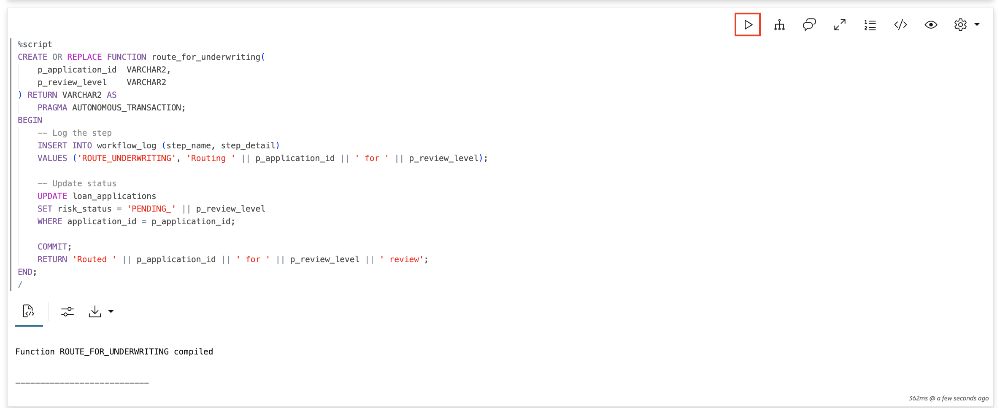

## Task 6: Register the Tools with the Agent Framework

Each tool has an `instruction` that tells the agent when and how to use it. Notice the instruction for `ROUTE_UNDERWRITING_TOOL` says "Only call this if `ASSESS_RISK_TOOL` returned `UNDERWRITER_REVIEW` or `SENIOR_UNDERWRITER`."

This is how you guide agent behavior: through clear instructions in tool definitions.

1. Register all three tools.

    > This command is already in your notebook—just click the play button (▶) to run it.

    ```sql
    <copy>
    BEGIN
        DBMS_CLOUD_AI_AGENT.CREATE_TOOL(
            tool_name   => 'CREATE_LOAN_TOOL',
            attributes  => '{"instruction": "Create a new loan application at Seer Equity. Parameters: P_APPLICANT (applicant name), P_AMOUNT (loan amount as number), P_LOAN_TYPE (personal, auto, mortgage, or business). Returns the application ID.",
                            "function": "create_loan_application"}',
            description => 'Creates a loan application and returns the application ID'
        );
        
        DBMS_CLOUD_AI_AGENT.CREATE_TOOL(
            tool_name   => 'ASSESS_RISK_TOOL',
            attributes  => '{"instruction": "Assess risk level for a loan application. Parameters: P_AMOUNT (loan amount as number), P_LOAN_TYPE (personal, auto, mortgage, or business). Returns AUTO_APPROVE, UNDERWRITER_REVIEW, or SENIOR_UNDERWRITER.",
                            "function": "assess_loan_risk"}',
            description => 'Returns the required review level based on amount and loan type'
        );
        
        DBMS_CLOUD_AI_AGENT.CREATE_TOOL(
            tool_name   => 'ROUTE_UNDERWRITING_TOOL',
            attributes  => '{"instruction": "Route a loan application for underwriting review. Only call this if ASSESS_RISK_TOOL returned UNDERWRITER_REVIEW or SENIOR_UNDERWRITER. Do NOT call this for AUTO_APPROVE. Parameters: P_APPLICATION_ID (the LOAN-YYMMDD-NNNN format ID), P_REVIEW_LEVEL (UNDERWRITER or SENIOR_UNDERWRITER).",
                            "function": "route_for_underwriting"}',
            description => 'Routes the loan application to the appropriate underwriter'
        );
    END;
    /
    </copy>
    ```

    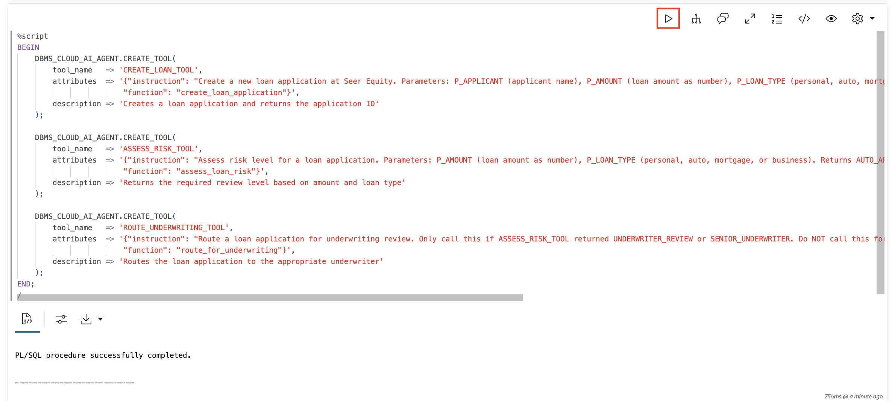

## Task 7: Create the Agent and Team

The agent's role tells it the sequence: create → assess risk → route (if needed). The task instruction reinforces this and specifically says NOT to route if risk assessment says `AUTO_APPROVE`.

This combination of role + task instruction shapes how the agent plans its work.

1. Create the agent, task, and team.

    > This command is already in your notebook—just click the play button (▶) to run it.

    ```sql
    <copy>
    BEGIN
        DBMS_CLOUD_AI_AGENT.CREATE_AGENT(
            agent_name  => 'LOAN_EXEC_AGENT',
            attributes  => '{"profile_name": "genai",
                            "role": "You are a loan processing agent for Seer Equity. Process loan applications by: 1) Creating the application, 2) Assessing the risk, 3) Only routing for underwriting if risk assessment requires it. If assessment says AUTO_APPROVE, do not route."}',
            description => 'Agent demonstrating loan processing execution loop'
        );
        
        DBMS_CLOUD_AI_AGENT.CREATE_TASK(
            task_name   => 'LOAN_EXEC_TASK',
            attributes  => '{"instruction": "Process the loan application: 1. Call CREATE_LOAN_TOOL to create the application 2. Call ASSESS_RISK_TOOL to determine risk level 3. If result contains UNDERWRITER_REVIEW or SENIOR_UNDERWRITER, call ROUTE_UNDERWRITING_TOOL. If result is AUTO_APPROVE, do NOT call ROUTE_UNDERWRITING_TOOL - just confirm the loan is auto-approved. User request: {query}",
                            "tools": ["CREATE_LOAN_TOOL", "ASSESS_RISK_TOOL", "ROUTE_UNDERWRITING_TOOL"]}',
            description => 'Task for loan execution demo'
        );
        
        DBMS_CLOUD_AI_AGENT.CREATE_TEAM(
            team_name   => 'LOAN_EXEC_TEAM',
            attributes  => '{"agents": [{"name": "LOAN_EXEC_AGENT", "task": "LOAN_EXEC_TASK"}],
                            "process": "sequential"}',
            description => 'Team for loan execution demo'
        );
    END;
    /
    </copy>
    ```

    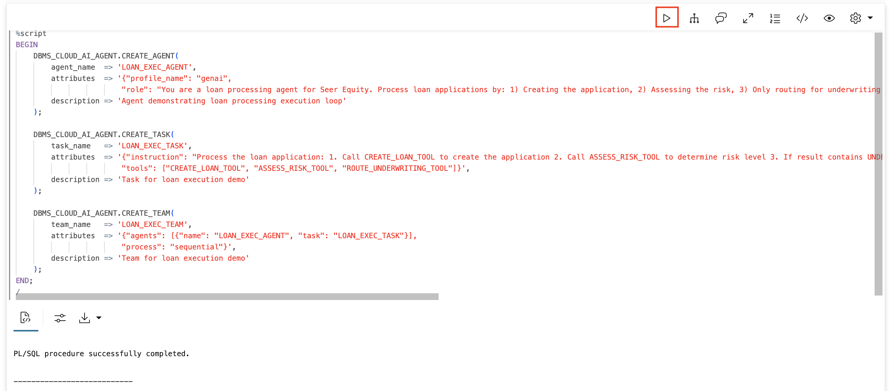

## Task 3: Submit a $75,000 Auto Loan (Underwriter Review Path)

Now let's run a request and trace every step. This $75,000 auto loan should trigger the full three-step workflow: create the application, assess risk (returns `UNDERWRITER_REVIEW`), then route for underwriter review.

1. Clear the log and activate the team.

    > This command is already in your notebook—just click the play button (▶) to run it.

    ```sql
    <copy>
    TRUNCATE TABLE workflow_log;
    EXEC DBMS_CLOUD_AI_AGENT.SET_TEAM('LOAN_EXEC_TEAM');
    </copy>
    ```

    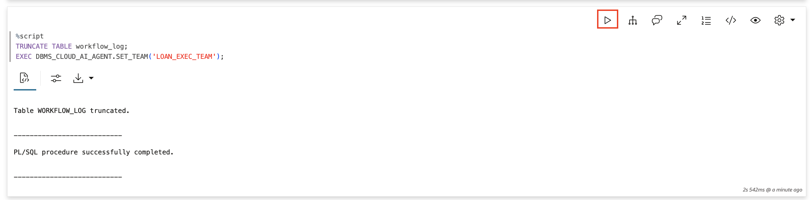

2. Submit the auto loan request.

    > This command is already in your notebook—just click the play button (▶) to run it.

    ```sql
    <copy>
    SELECT AI AGENT Submit a $75000 auto loan application for John Smith;
    </copy>
    ```

    Watch the agent's response—it should mention creating the application and routing it for underwriter review.

    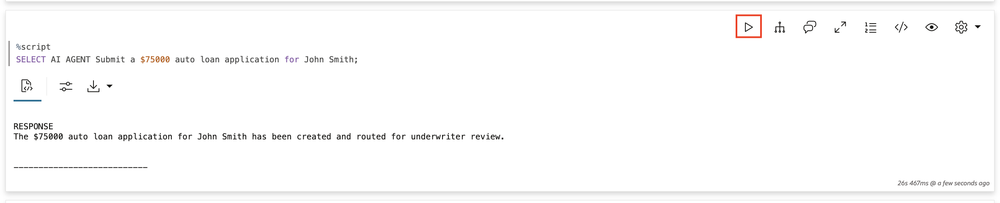

3. Examine the workflow log.

    You should see three entries: `CREATE_APPLICATION`, `ASSESS_RISK`, and `ROUTE_UNDERWRITING`. This is the execution trace—proof of what the agent actually did.

    > This command is already in your notebook—just click the play button (▶) to run it.

    ```sql
    <copy>
    SELECT 
        step_name,
        step_detail,
        TO_CHAR(logged_at, 'HH24:MI:SS.FF3') as time
    FROM workflow_log
    ORDER BY log_id;
    </copy>
    ```

    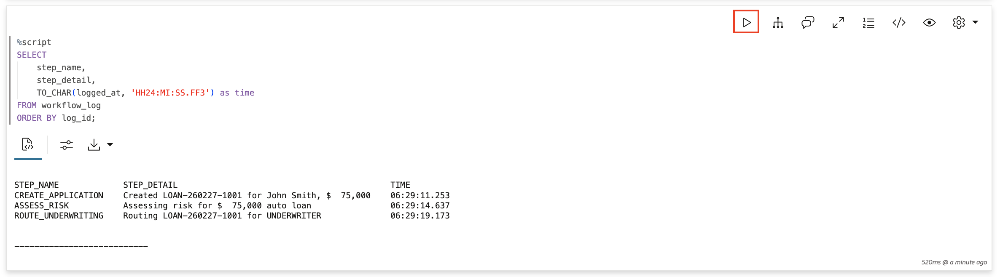

## Task 4: Trace the Agent's Tool Calls

Oracle maintains its own history of tool calls. These views show you the inputs and outputs of each tool the agent invoked.

1. Check the tool execution history.

    You should see `CREATE_LOAN_TOOL`, `ASSESS_RISK_TOOL`, and `ROUTE_UNDERWRITING_TOOL` in sequence.

    > This command is already in your notebook—just click the play button (▶) to run it.

    ```sql
    <copy>
    SELECT 
        tool_name,
        TO_CHAR(start_date, 'HH24:MI:SS.FF3') as started,
        TO_CHAR(end_date, 'HH24:MI:SS.FF3') as ended,
        SUBSTR(output, 1, 60) as result
    FROM USER_AI_AGENT_TOOL_HISTORY
    ORDER BY start_date DESC
    FETCH FIRST 10 ROWS ONLY;
    </copy>
    ```

    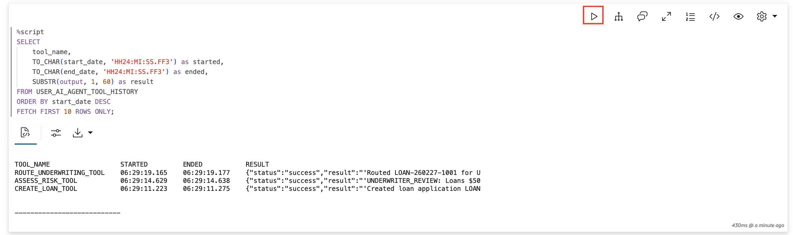

2. Verify the loan application record.

    Look at the actual database record. You should see John Smith's $75,000 auto loan with status **`PENDING_UNDERWRITER`**. This proves the agent didn't just say it routed the loan—it actually updated the database.

    > This command is already in your notebook—just click the play button (▶) to run it.

    ```sql
    <copy>
    SELECT 
        application_id,
        applicant_name,
        TO_CHAR(loan_amount, '$999,999') as loan_amount,
        loan_type,
        risk_status,
        TO_CHAR(created_at, 'HH24:MI:SS') as created
    FROM loan_applications
    ORDER BY created_at DESC;
    </copy>
    ```

    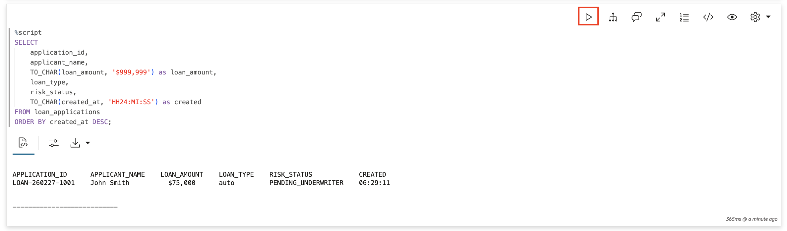

## Task 5: Trace Different Execution Paths

Different loan parameters trigger different routing paths—and sometimes skip a tool entirely. This is where you will see the agent make real decisions based on data.

1. Submit a $25,000 personal loan (Auto-Approve path).

    Clear the log first so you see only this execution. With $25,000, the risk assessment should return `AUTO_APPROVE`, and the agent should **NOT** call `ROUTE_UNDERWRITING_TOOL`.

    > This command is already in your notebook—just click the play button (▶) to run it.

    ```sql
    <copy>
    TRUNCATE TABLE workflow_log;
    SELECT AI AGENT Submit a $25000 personal loan application for Jane Doe;
    </copy>
    ```

    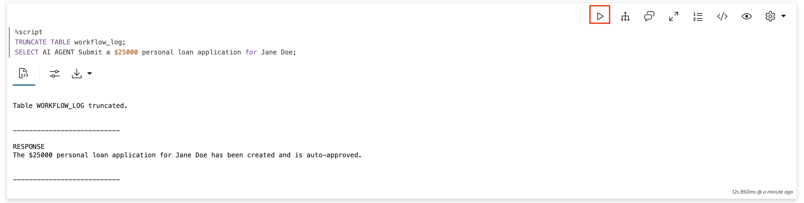

2. Check the workflow log for auto-approve.

    You should see only **two** steps this time: `CREATE_APPLICATION` and `ASSESS_RISK`. No `ROUTE_UNDERWRITING` step—the agent correctly decided not to route because the risk assessment said `AUTO_APPROVE`. This is the agent making a decision based on data.

    > This command is already in your notebook—just click the play button (▶) to run it.

    ```sql
    <copy>
    SELECT step_name, step_detail FROM workflow_log ORDER BY log_id;
    </copy>
    ```

    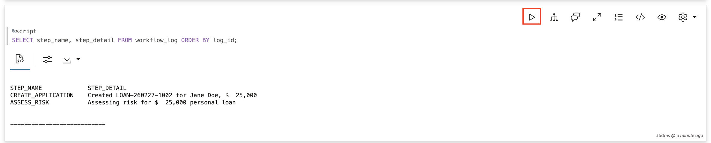

3. Verify the auto-approved loan.

    Jane's loan should have status **SUBMITTED** (not `PENDING_UNDERWRITER`), because it was auto-approved and didn't need routing.

    > This command is already in your notebook—just click the play button (▶) to run it.

    ```sql
    <copy>
    SELECT application_id, applicant_name, TO_CHAR(loan_amount, '$999,999') as amount, risk_status 
    FROM loan_applications 
    WHERE applicant_name = 'Jane Doe';
    </copy>
    ```

    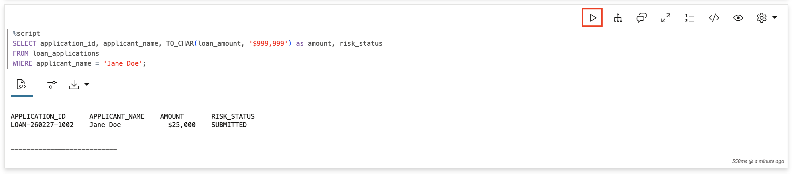

4. Submit a $350,000 mortgage (Senior Underwriter path).

    One more test: a mortgage application that requires senior underwriter review. Mortgages at Seer Equity always require senior review regardless of amount.

    > This command is already in your notebook—just click the play button (▶) to run it.

    ```sql
    <copy>
    TRUNCATE TABLE workflow_log;
    SELECT AI AGENT Submit a $350000 mortgage loan application for Bob Wilson;
    </copy>
    ```

    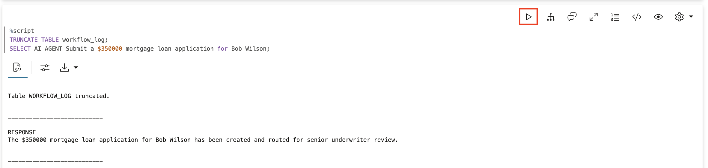

5. Check the senior underwriter path.

    You should see all three steps again, but this time `ROUTE_UNDERWRITING` shows `SENIOR_UNDERWRITER` instead of `UNDERWRITER`.

    > This command is already in your notebook—just click the play button (▶) to run it.

    ```sql
    <copy>
    SELECT step_name, step_detail FROM workflow_log ORDER BY log_id;
    </copy>
    ```

    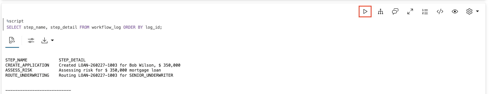

6. Verify Bob's mortgage status.

    Bob's mortgage should have status **`PENDING_SENIOR_UNDERWRITER`**. The agent correctly routed it to the higher review level.

    > This command is already in your notebook—just click the play button (▶) to run it.

    ```sql
    <copy>
    SELECT application_id, applicant_name, TO_CHAR(loan_amount, '$999,999') as amount, loan_type, risk_status 
    FROM loan_applications 
    WHERE applicant_name = 'Bob Wilson';
    </copy>
    ```

    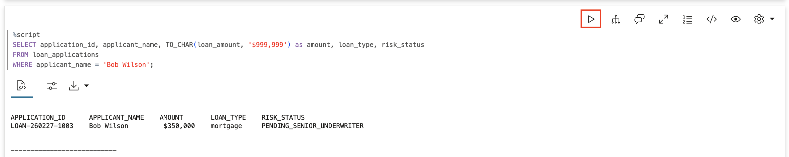

## Task 6: Compare All Three Execution Paths

Let's see all loan applications side by side. Notice how different amounts and loan types led to different statuses—same agent, same tools, but different execution paths based on the data.

| Amount | Type | Status | Why |
|--------|------|--------|-----|
| $25,000 | Personal | SUBMITTED | Auto-approved, under $50K |
| $75,000 | Auto | `PENDING_UNDERWRITER` | Between $50K–$250K |
| $350,000 | Mortgage | `PENDING_SENIOR_UNDERWRITER` | Mortgages require senior review |

> This command is already in your notebook—just click the play button (▶) to run it.

```sql
<copy>
SELECT 
    application_id,
    applicant_name,
    TO_CHAR(loan_amount, '$999,999') as loan_amount,
    loan_type,
    risk_status,
    CASE 
        WHEN loan_amount < 50000 AND loan_type != 'mortgage' THEN 'Auto-approved'
        WHEN loan_type = 'mortgage' THEN 'Senior underwriter (mortgage)'
        WHEN loan_amount >= 250000 THEN 'Senior underwriter (high value)'
        ELSE 'Standard underwriter review'
    END as routing_reason
FROM loan_applications
ORDER BY created_at;
</copy>
```

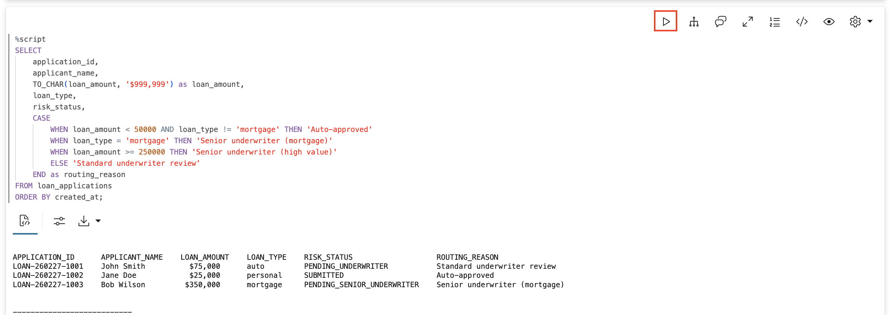

## Task 7: Understand the Execution Pattern

Every agent execution follows this pattern:

1. **Receive request** → Loan officer submits application
2. **LLM understands** → Interprets applicant, amount, loan type
3. **LLM plans** → Determines which tools, in what order
4. **Tool executes** → First tool runs, returns result
5. **LLM analyzes** → Interprets the result, **decides next step**
6. **Repeat** → More tools if needed (conditionally)
7. **LLM responds** → Generates final response

    The key insight: **step 5 is where decisions happen**. The agent reads the risk assessment and decides whether to route. This is what makes agents intelligent—they adapt based on data.

1. Query the complete execution timeline.

    > This command is already in your notebook—just click the play button (▶) to run it.

    ```sql
    <copy>
    SELECT 
        'TOOL: ' || tool_name as step,
        TO_CHAR(start_date, 'HH24:MI:SS.FF3') as time,
        SUBSTR(output, 1, 50) as output
    FROM USER_AI_AGENT_TOOL_HISTORY
    WHERE start_date > SYSTIMESTAMP - INTERVAL '5' MINUTE
    ORDER BY start_date;
    </copy>
    ```

    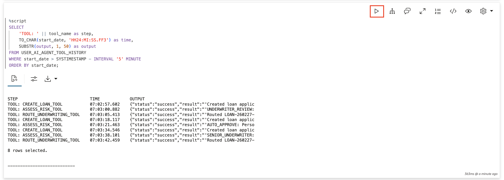

2. Compare with your workflow log.

    > This command is already in your notebook—just click the play button (▶) to run it.

    ```sql
    <copy>
    SELECT 
        'LOG: ' || step_name as step,
        TO_CHAR(logged_at, 'HH24:MI:SS.FF3') as time,
        step_detail as output
    FROM workflow_log
    WHERE logged_at > SYSTIMESTAMP - INTERVAL '5' MINUTE
    ORDER BY logged_at;
    </copy>
    ```

    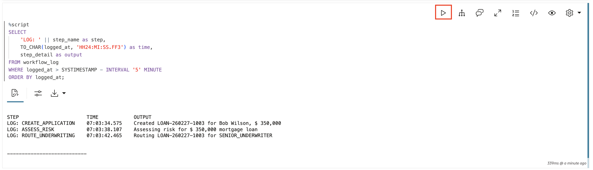

## Summary

In this lab, you traced the complete agent execution loop at Seer Equity:

* **Logging**: Added `workflow_log` entries to see each step
* **Conditional execution**: Agent called the routing tool only when risk assessment required it
* **Three paths**: Auto-approve, underwriter review, senior underwriter review
* **Verification**: Checked both logs and actual database records

**Key takeaway:** The agent orchestrates, the LLM thinks, the tools act. Every step is logged. Every action is traceable. This is what makes agents production-ready for financial services—small loans auto-approve in seconds, complex loans get routed appropriately, and compliance has a complete audit trail.

## Learn More

* [`DBMS_CLOUD_AI_AGENT` Package](https://docs.oracle.com/en/cloud/paas/autonomous-database/serverless/adbsb/dbms-cloud-ai-agent-package.html)

## Acknowledgements

* **Author** - David Start
* **Contributors** - Francis Regalado
* **Last Updated By/Date** - Francis Regalado, February 2026

## Cleanup (Optional)

Run this to remove all objects created in this lab.

> This command is already in your notebook—just click the play button (▶) to run it.

```sql
<copy>
EXEC DBMS_CLOUD_AI_AGENT.DROP_TEAM('LOAN_EXEC_TEAM', TRUE);
EXEC DBMS_CLOUD_AI_AGENT.DROP_TASK('LOAN_EXEC_TASK', TRUE);
EXEC DBMS_CLOUD_AI_AGENT.DROP_AGENT('LOAN_EXEC_AGENT', TRUE);
EXEC DBMS_CLOUD_AI_AGENT.DROP_TOOL('CREATE_LOAN_TOOL', TRUE);
EXEC DBMS_CLOUD_AI_AGENT.DROP_TOOL('ASSESS_RISK_TOOL', TRUE);
EXEC DBMS_CLOUD_AI_AGENT.DROP_TOOL('ROUTE_UNDERWRITING_TOOL', TRUE);
DROP TABLE loan_applications PURGE;
DROP TABLE workflow_log PURGE;
DROP SEQUENCE loan_applications_seq;
DROP FUNCTION create_loan_application;
DROP FUNCTION assess_loan_risk;
DROP FUNCTION route_for_underwriting;
</copy>
```

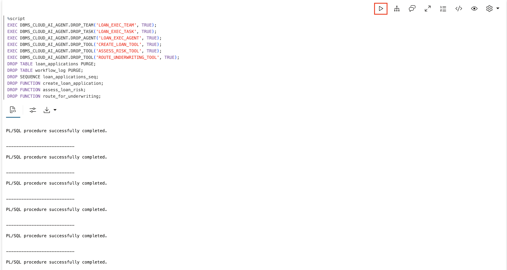
