# Why Agents Beat Zero-Shot Prompts at Big Star Collectibles

## Introduction

In this lab, you will directly compare zero-shot prompting with agent-based execution to understand why agents are transforming how work gets done at **Big Star Collectibles**.

Big Star Collectibles' inventory specialists have been using AI chatbots for months, and the reviews are mixed:

> *"I asked it about a client's item status and it told me how to log into our system. I know how to log in! I wanted the actual status."*

> *"It gave me great advice on updating item records, but it can't actually update them. I still have to do everything manually."*

The chatbots are helpful for general questions, but they can't access Big Star Collectibles' data or take action. They explain processes without executing them.

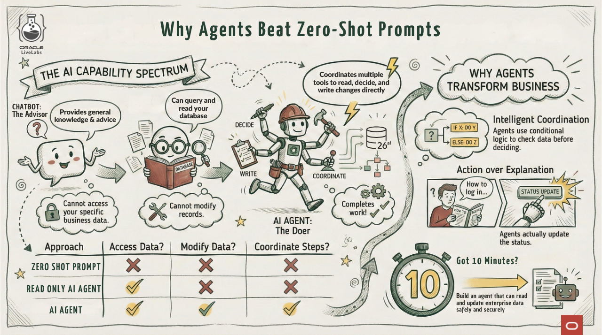

### What You Will Learn

In this lab, you will directly compare three approaches:

| Approach | Can Access Data | Can Modify Data | Can Coordinate |
|----------|-----------------|-----------------|----------------|
| **SELECT AI CHAT** (zero-shot) | No | No | No |
| **SELECT AI** | Yes | No | No |
| **SELECT AI AGENT** | Yes | Yes | Yes |

You will ask the same question about item submissions to each approach and see the dramatic difference.

**What you will build:** A comparison showing exactly when to use each approach, plus an agent that can both read and update item submission data.

**Estimated Time:** 10 minutes

### Objectives

* Understand what zero-shot prompting means and where it falls short
* Compare zero-shot, SELECT AI, and SELECT AI AGENT responses
* See how agents coordinate multiple tools to complete work
* Recognize when to use each approach

### Prerequisites

For this workshop, we provide the environment. You will need:

* Basic knowledge of SQL, or the ability to follow along with the prompts

## Task 1: Import the Lab Notebook

Before you begin, import the notebook that has all of the commands for this lab into Oracle Machine Learning. This way you don't have to copy and paste them over to run them.

1. From the Oracle Machine Learning home page, click **Notebooks**.

    

2. Click **Import** to expand the Import drop down.

    

3. Select **Git**.

    

4. Paste the following GitHub URL leaving the credential field blank, then click **OK**.

    ```text
    <copy>
    https://github.com/kaymalcolm/database/blob/main/ai4u/industries/retail-bigstar/agents-vs-zero-shot/lab2-agents-vs-zero-shot.json
    </copy>
    ```

    

    You should now be on the screen with the notebook imported. This workshop will have all of the screenshots and detailed information, however the notebook will have the commands and basic instructions for completing the lab.

## Task 2: Set Your AI Profile and Try Zero-Shot

First, activate your AI profile, then try zero-shot prompting to see its capabilities and limitations.

1. Set the AI profile.

    > This command is already in your notebook — just click the play button (▶) to run it. This first command may take a little longer as it establishes the connection.

    ```sql
    <copy>
    EXEC DBMS_CLOUD_AI.SET_PROFILE('genai');
    </copy>
    ```

    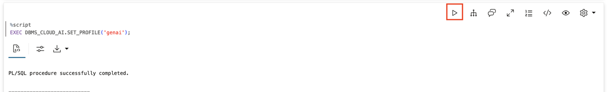

2. Ask a procedural question using zero-shot.

    Zero-shot (SELECT AI CHAT) goes directly to the LLM for general knowledge. Watch what happens when you ask how to process an item submission.

    **Observe:** You get a helpful explanation of the steps, but you still have to do each step yourself. The AI advises; it doesn't act.

    > This command is already in your notebook — just click the play button (▶) to run it.

    ```sql
    <copy>
    SELECT AI CHAT How do I process an item submission at Big Star Collectibles;
    </copy>
    ```

    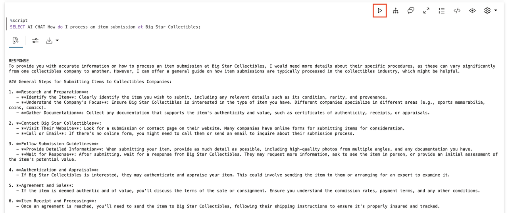

    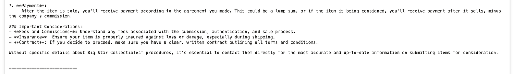

3. Ask about YOUR data using zero-shot.

    **Observe:** The AI cannot answer this because it has no access to your data. It gives generic advice about how to check item status, but it does not know anything about YOUR submission ITEM-20260115-1042.

    This is the fundamental limitation of zero-shot: great for general knowledge, useless for your specific business data.

    > This command is already in your notebook — just click the play button (▶) to run it.

    ```sql
    <copy>
    SELECT AI CHAT What is the status of item submission ITEM-20260115-1042 at Big Star Collectibles;
    </copy>
    ```

    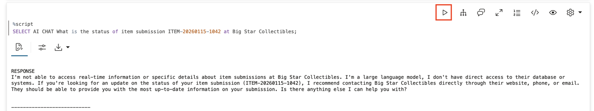

4. Ask zero-shot to take action.

    **Observe:** The AI explains HOW to update an item status but cannot actually do it. Zero-shot can advise; it cannot act.

    > This command is already in your notebook — just click the play button (▶) to run it.

    ```sql
    <copy>
    SELECT AI CHAT Update item submission ITEM-20260115-1042 to listed;
    </copy>
    ```

    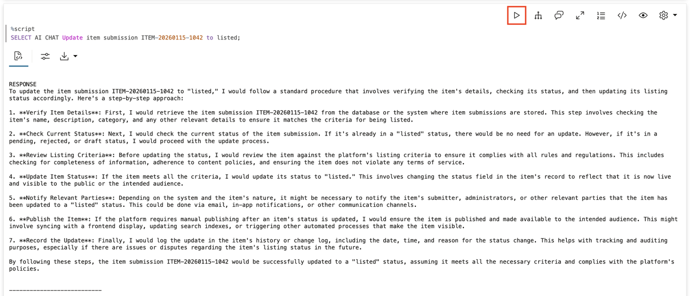

## Task 3: See What SELECT AI Can Do

Before building an agent, see what SELECT AI (without CHAT or AGENT) can do. It can query your data using natural language, but it cannot modify it.

1. Create the sample item submissions table.

    Notice the detailed column comments. These help SELECT AI understand what each column contains and generate accurate queries.

    > This command is already in your notebook — just click the play button (▶) to run it.

    ```sql
    <copy>
    -- Create the item submissions table
    CREATE TABLE sample_items (
        submission_id  VARCHAR2(20) PRIMARY KEY,
        collector       VARCHAR2(100),
        item_status     VARCHAR2(20),
        item_amount     NUMBER(12,2),
        item_type       VARCHAR2(30),
        submission_date DATE DEFAULT SYSDATE
    );

    -- Add comments so Select AI understands the table
    COMMENT ON TABLE sample_items IS 'Big Star Collectibles item submissions with collector, status, amount, and type.';
    COMMENT ON COLUMN sample_items.submission_id IS 'Unique submission identifier. Examples: ITEM-20260115-1042, ITEM-20260114-0821.';
    COMMENT ON COLUMN sample_items.collector IS 'Name of person or business applying for the item';
    COMMENT ON COLUMN sample_items.item_status IS 'Submission status: SUBMITTED, AUTHENTICATING, LISTED, or DENIED';
    COMMENT ON COLUMN sample_items.item_amount IS 'Requested declared value in US dollars';
    COMMENT ON COLUMN sample_items.item_type IS 'Type of item: collector_card, limited_art, authenticating, or museum_piece';
    COMMENT ON COLUMN sample_items.submission_date IS 'Date when the submission was submitted';

    -- Insert sample data
    INSERT INTO sample_items VALUES ('ITEM-20260115-1042', 'Alex Martinez', 'AUTHENTICATING', 150000, 'authenticating', SYSDATE - 3);
    INSERT INTO sample_items VALUES ('ITEM-20260114-0821', 'Jennifer Morales', 'SUBMITTED', 75000, 'collector_card', SYSDATE - 1);
    INSERT INTO sample_items VALUES ('ITEM-20260113-0905', 'Priya Desai', 'LISTED', 250000, 'limited_art', SYSDATE - 7);
    COMMIT;
    </copy>
    ```

    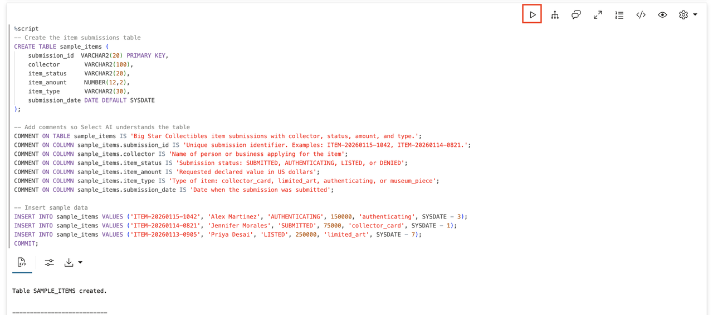

2. Add the table to your AI profile.

    SELECT AI needs to know which tables it can access. Add your new table to the profile's object list.

    > This command is already in your notebook — just click the play button (▶) to run it.

    ```sql
    <copy>
    BEGIN
        DBMS_CLOUD_AI.SET_ATTRIBUTE(
            profile_name    => 'genai',
            attribute_name  => 'object_list',
            attribute_value => '[{"owner": "' || USER || '", "name": "SAMPLE_ITEMS"}]'
        );
    END;
    /
    </copy>
    ```

    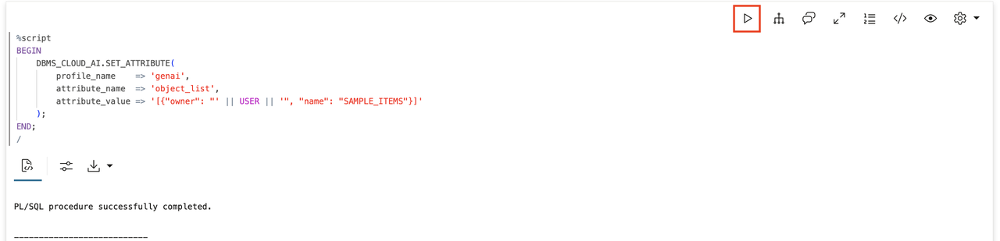

3. Use SELECT AI to query your data.

    **Observe:** SELECT AI CAN read your data and return the actual status. Compare this to zero-shot which could only give generic advice.

    > This command is already in your notebook — just click the play button (▶) to run it.

    ```sql
    <copy>
    SELECT AI NARRATE What is the status of item submission ITEM-20260115-1042;
    </copy>
    ```

    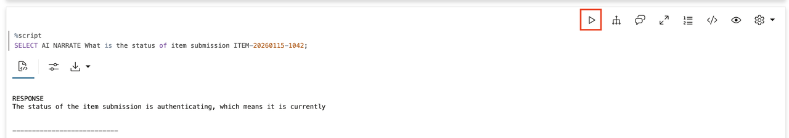

4. Try to update using SELECT AI.

    **Observe:** SELECT AI cannot update data. It can only read. It will attempt to generate a SELECT statement or explain what you would need to do, but it will not actually change anything.

    > This command is already in your notebook — just click the play button (▶) to run it.

    ```sql
    <copy>
    SELECT AI NARRATE Update item submission ITEM-20260115-1042 to listed;
    </copy>
    ```

    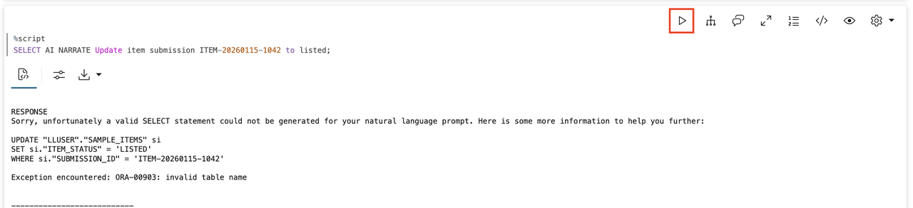

5. Verify the item was NOT updated.

    **Observe:** The status is still AUTHENTICATING. SELECT AI can read but cannot write.

    > This command is already in your notebook — just click the play button (▶) to run it.

    ```sql
    <copy>
    SELECT submission_id, item_status FROM sample_items WHERE submission_id = 'ITEM-20260115-1042';
    </copy>
    ```

    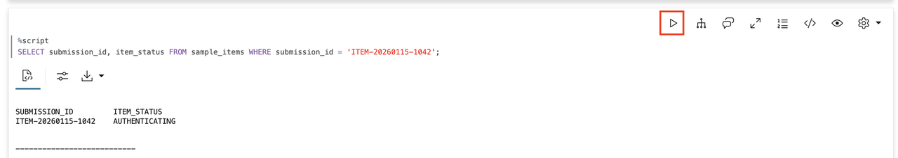

## Task 4: Create an Agent That Can Act

Now build an agent that can both READ and WRITE. Give it two tools: one to look up items and one to update them.

In this lab, we use **function-based tools** instead of SQL tools. A function-based tool wraps a PL/SQL function you write, giving you complete control over what the tool does. This is how you give agents the ability to make changes to your data, not just read it.

1. Create the lookup function.

    This function takes an item ID and returns the item details. It is a simple read operation the agent will use to check on items before taking action.

    > This command is already in your notebook — just click the play button (▶) to run it.

    ```sql
    <copy>
    CREATE OR REPLACE FUNCTION lookup_item(
        p_submission_id VARCHAR2
    ) RETURN VARCHAR2 AS
        v_result VARCHAR2(500);
    BEGIN
        SELECT 'Submission ' || submission_id || ': ' || item_status ||
               ', Collector: ' || collector ||
               ', Amount: $' || TO_CHAR(item_amount, '999,999') ||
               ', Type: ' || item_type ||
               ', Date: ' || TO_CHAR(submission_date, 'YYYY-MM-DD')
        INTO v_result
        FROM sample_items
        WHERE submission_id = p_submission_id;

        RETURN v_result;
    EXCEPTION
        WHEN NO_DATA_FOUND THEN
            RETURN 'Item submission ' || p_submission_id || ' not found.';
    END;
    /
    </copy>
    ```

    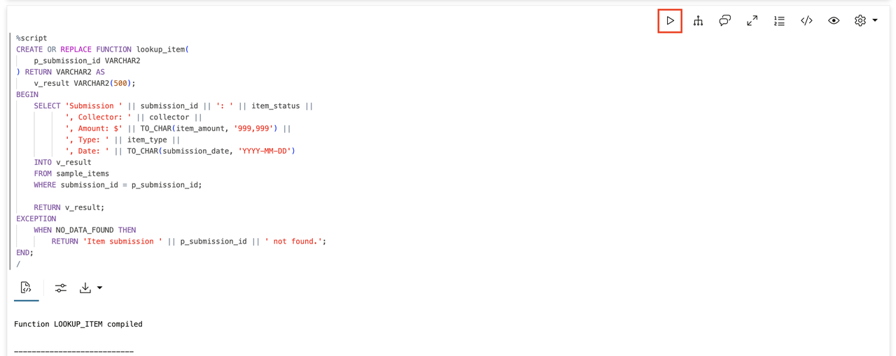

2. Create the update function.

    This function actually changes data in the database. Notice it first retrieves the current status, then makes the update. The `PRAGMA AUTONOMOUS_TRANSACTION` allows it to commit changes independently.

    > This command is already in your notebook — just click the play button (▶) to run it.

    ```sql
    <copy>
    CREATE OR REPLACE FUNCTION update_item_status(
        p_submission_id VARCHAR2,
        p_new_status     VARCHAR2
    ) RETURN VARCHAR2 AS
        PRAGMA AUTONOMOUS_TRANSACTION;
        v_old_status VARCHAR2(20);
    BEGIN
        -- Get current status
        SELECT item_status INTO v_old_status
        FROM sample_items
        WHERE submission_id = p_submission_id;

        -- Update the status
        UPDATE sample_items
        SET item_status = UPPER(p_new_status)
        WHERE submission_id = p_submission_id;

        COMMIT;

        RETURN 'Submission ' || p_submission_id || ' status updated from ' || v_old_status || ' to ' || UPPER(p_new_status);
    EXCEPTION
        WHEN NO_DATA_FOUND THEN
            RETURN 'Submission ' || p_submission_id || ' not found. Cannot update.';
        WHEN OTHERS THEN
            ROLLBACK;
            RETURN 'Error updating submission: ' || SQLERRM;
    END;
    /
    </copy>
    ```

    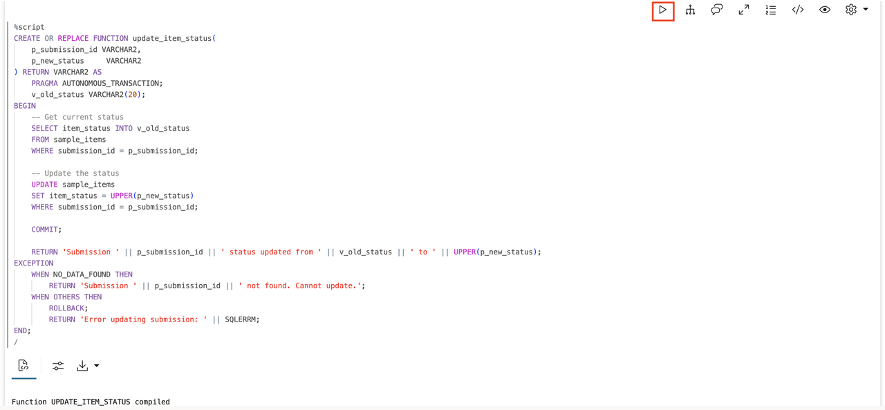

3. Register both functions as tools.

    Now turn these functions into tools the agent can use. The `instruction` tells the agent when and how to use each tool. Notice how we tell the agent to check the item status before updating — this is how you build smart behavior into your agent.

    > This command is already in your notebook — just click the play button (▶) to run it.

    ```sql
    <copy>
    BEGIN
        DBMS_CLOUD_AI_AGENT.CREATE_TOOL(
            tool_name   => 'ITEM_LOOKUP_TOOL',
            attributes  => '{"instruction": "Look up item submission status and details by submission ID. Parameter: P_SUBMISSION_ID (the submission number, e.g. ITEM-20260115-1042). Use this to check current submission status before making updates.",
                            "function": "lookup_item"}',
            description => 'Retrieves item submission status, collector, amount, and date by submission ID'
        );
    END;
    /

    BEGIN
        DBMS_CLOUD_AI_AGENT.CREATE_TOOL(
            tool_name   => 'ITEM_UPDATE_TOOL',
            attributes  => '{"instruction": "Update an item submission status. Parameters: P_SUBMISSION_ID (the submission number), P_NEW_STATUS (SUBMITTED, AUTHENTICATING, LISTED, or DENIED). Only call this after confirming the current status with ITEM_LOOKUP_TOOL.",
                            "function": "update_item_status"}',
            description => 'Updates item submission status to a new value'
        );
    END;
    /
    </copy>
    ```

    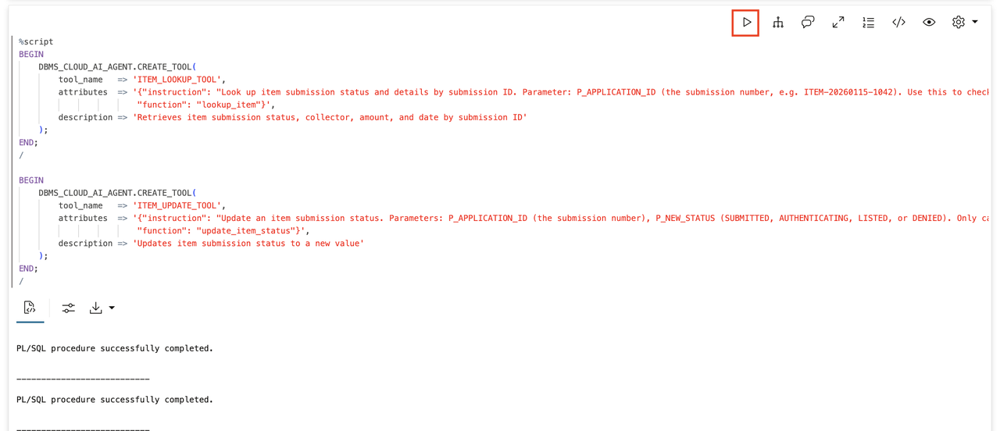

4. Create the agent, task, and team.

    The agent gets a role that tells it how to behave. The task gives it specific instructions and access to both tools. The team makes it all runnable.

    > This command is already in your notebook — just click the play button (▶) to run it.

    ```sql
    <copy>
    BEGIN
        DBMS_CLOUD_AI_AGENT.CREATE_AGENT(
            agent_name  => 'ITEM_MGMT_AGENT',
            attributes  => '{"profile_name": "genai",
                            "role": "You are an item submission management agent for Big Star Collectibles. You can look up item submissions and update their status. Always look up a submission first before updating it. Never make up submission information - always use your tools."}',
            description => 'Agent that can look up and update item submissions'
        );
    END;
    /

    BEGIN
        DBMS_CLOUD_AI_AGENT.CREATE_TASK(
            task_name   => 'ITEM_MGMT_TASK',
            attributes  => '{"instruction": "Help with item submission inquiries and status updates. When asked to check a submission, use ITEM_LOOKUP_TOOL. When asked to update a submission, first use ITEM_LOOKUP_TOOL to verify current status, then use ITEM_UPDATE_TOOL to make the change. Do not ask clarifying questions - just do it. User request: {query}",
                            "tools": ["ITEM_LOOKUP_TOOL", "ITEM_UPDATE_TOOL"]}',
            description => 'Task for item submission lookups and updates'
        );
    END;
    /

    BEGIN
        DBMS_CLOUD_AI_AGENT.CREATE_TEAM(
            team_name   => 'ITEM_MGMT_TEAM',
            attributes  => '{"agents": [{"name": "ITEM_MGMT_AGENT", "task": "ITEM_MGMT_TASK"}],
                            "process": "sequential"}',
            description => 'Team for item submission management'
        );
    END;
    /
    </copy>
    ```

    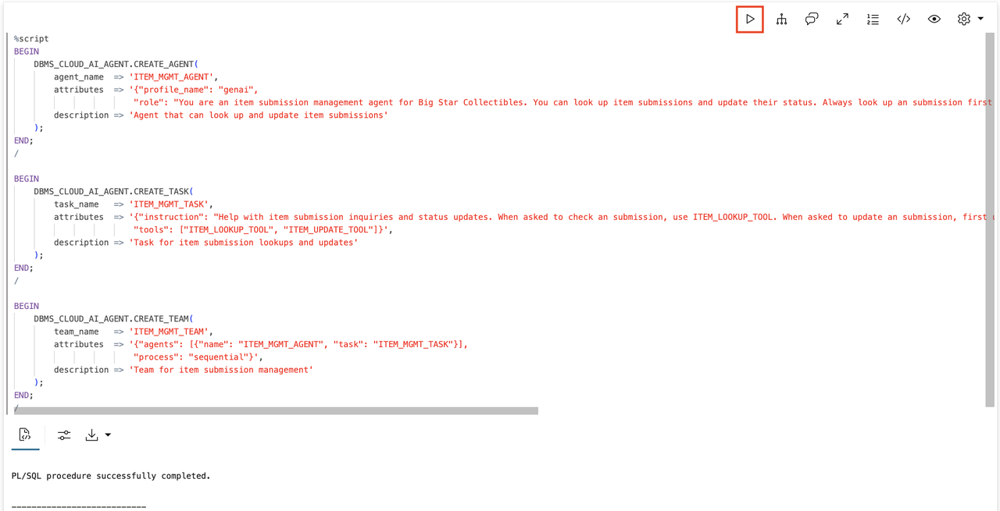

## Task 5: See the Agent Coordinate and Act

Now see the real power of agents: coordinating multiple tools and making changes.

1. Check the current status before testing the agent.

    **Observe:** Status is AUTHENTICATING.

    > This command is already in your notebook — just click the play button (▶) to run it.

    ```sql
    <copy>
    SELECT submission_id, collector, item_status FROM sample_items WHERE submission_id = 'ITEM-20260115-1042';
    </copy>
    ```

    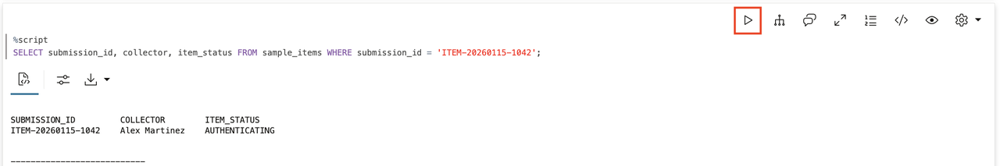

2. Ask the agent to check and update the item.

    This requires the agent to: (1) look up the current status, (2) make a decision based on what it finds, (3) take action and update to LISTED.

    **Observe:** The agent calls `ITEM_LOOKUP_TOOL`, sees the status is AUTHENTICATING, decides it should be updated, then calls `ITEM_UPDATE_TOOL` to change it to LISTED. This is what SELECT AI cannot do: coordinate multiple steps and take action.

    > This command is already in your notebook — just click the play button (▶) to run it.

    ```sql
    <copy>
    EXEC DBMS_CLOUD_AI_AGENT.SET_TEAM('ITEM_MGMT_TEAM');
    SELECT AI AGENT Check item submission ITEM-20260115-1042 and if it is authenticating, mark it as listed;
    </copy>
    ```

    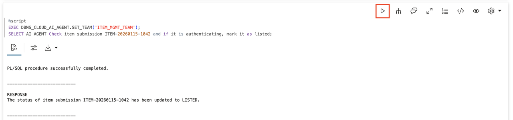

3. Verify the change actually happened.

    **Observe:** Status is now LISTED. The agent did not just talk about updating — it actually did it.

    > This command is already in your notebook — just click the play button (▶) to run it.

    ```sql
    <copy>
    SELECT submission_id, collector, item_status FROM sample_items WHERE submission_id = 'ITEM-20260115-1042';
    </copy>
    ```

    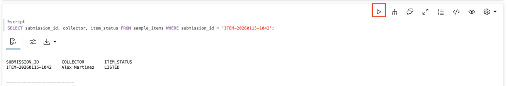

4. Test conditional logic — an update that should NOT happen.

    **Observe:** The agent looks up ITEM-20260114-0821, sees it is SUBMITTED (not authenticating), and correctly decides NOT to update it. This is intelligent coordination: the agent makes decisions based on data.

    > This command is already in your notebook — just click the play button (▶) to run it.

    ```sql
    <copy>
    SELECT AI AGENT Check item submission ITEM-20260114-0821 and if it is authenticating, mark it as listed;
    </copy>
    ```

    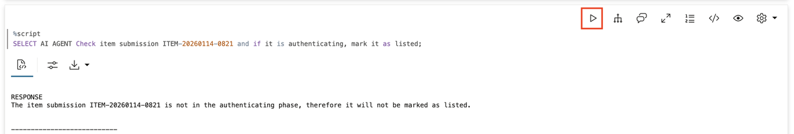

## Task 6: Review the Tool Execution History

Every tool call is logged. See exactly what the agent did and in what sequence.

1. Query the tool history.

    **Observe:** The sequence of tool calls: lookups followed by an update for the first item, and just a lookup (no update) for the second item.

    > This command is already in your notebook — just click the play button (▶) to run it.

    ```sql
    <copy>
    SELECT
        tool_name,
        TO_CHAR(start_date, 'HH24:MI:SS') as called_at,
        SUBSTR(output, 1, 80) as result
    FROM USER_AI_AGENT_TOOL_HISTORY
    ORDER BY start_date DESC
    FETCH FIRST 10 ROWS ONLY;
    </copy>
    ```

    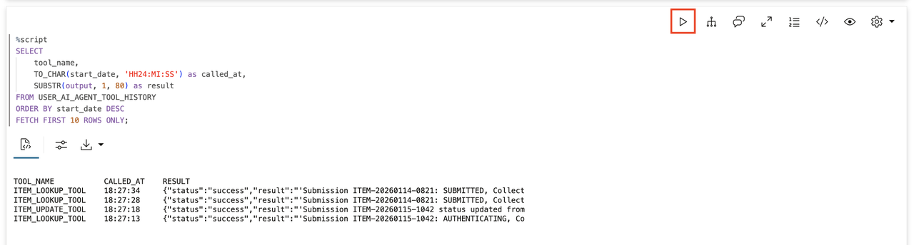

## Summary

You directly compared three approaches:

| Approach | Can Access Your Data | Can Modify Data | Can Coordinate Steps |
|----------|---------------------|-----------------|----------------------|
| `SELECT AI CHAT` | No | No | No |
| `SELECT AI` | Yes | No | No |
| `SELECT AI AGENT` | Yes | Yes | Yes |

**Use `SELECT AI CHAT` when:**
- You need general knowledge answers
- No data access is required
- You want advice or explanation

**Use `SELECT AI` when:**
- You need to query your data with natural language
- Read-only access is sufficient

**Use `SELECT AI AGENT` when:**
- You need to read AND write data
- Decisions depend on data (conditional logic)
- Actions need coordination across multiple steps

**Key takeaway:** The difference is not just intelligence — it is action. Zero-shot AI tells you what to do. SELECT AI can read. Agents do the work. For Big Star Collectibles, that means inventory specialists can check and update item statuses in a single natural language request instead of doing it manually.

## Learn More

* [Get an Autonomous Database for FREE!](https://www.oracle.com/autonomous-database/free-trial/)
* [Mark Hornick's Select AI Agent Blog](https://blogs.oracle.com/machinelearning/build-your-agentic-solution-using-oracle-adb-select-ai-agent)
* [`DBMS_CLOUD_AI_AGENT` Package](https://docs.oracle.com/en/cloud/paas/autonomous-database/serverless/adbsb/dbms-cloud-ai-agent-package.html)

## Acknowledgements

* **Author** - David Start, Director, Database Product Management
* **Last Updated By/Date** - Kay Malcolm, February 2026

## Cleanup (Optional)

> This command is already in your notebook — just click the play button (▶) to run it.

```sql
<copy>
EXEC DBMS_CLOUD_AI_AGENT.DROP_TEAM('ITEM_MGMT_TEAM', TRUE);
EXEC DBMS_CLOUD_AI_AGENT.DROP_TASK('ITEM_MGMT_TASK', TRUE);
EXEC DBMS_CLOUD_AI_AGENT.DROP_AGENT('ITEM_MGMT_AGENT', TRUE);
EXEC DBMS_CLOUD_AI_AGENT.DROP_TOOL('ITEM_LOOKUP_TOOL', TRUE);
EXEC DBMS_CLOUD_AI_AGENT.DROP_TOOL('ITEM_UPDATE_TOOL', TRUE);
DROP TABLE sample_items PURGE;
DROP FUNCTION lookup_item;
DROP FUNCTION update_item_status;
</copy>
```

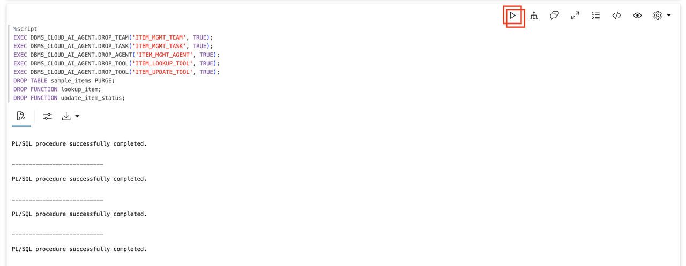
