# Why Enterprise Data Matters

## Introduction

In this lab, you'll see why agents fail without enterprise data, and how connecting them to your business context transforms their usefulness.

Agents don't show up understanding your organization. They don't know your policies, your workflows, or how decisions were handled last time. That knowledge lives in your enterprise data.

You'll first ask the LLM business-specific questions it can't answer, then give an agent access to your data and see the difference.

### The Business Problem

At Big Star Collectibles, an inventory specialist asked the AI assistant about guidelines for preferred customers:

> *"I asked the AI what guidelines we offer preferred customers. It said 6.5%. Our actual preferred rate is 7.9%. I almost quoted wrong guidelines to a client!"*
>
> Marcus, Senior Inventory Specialist

The chatbot doesn't know Big Star Collectibles' actual guidelines, policies, or client information. It gives generic answers that sound confident but are confidently wrong.

Big Star Collectibles needs AI that knows:
- **Actual rate tiers**: Preferred is 7.9% APR, Standard is 12.9% APR
- **Collectibles policies**: Credit requirements, documentation needed
- **Applicant details**: Who qualifies for what, eligibility criteria

### What You'll Learn

This lab shows you the difference between generic AI knowledge and enterprise-connected AI. You'll see the same questions answered wrong (without data) and right (with data access).

**What you'll build:** An agent connected to Big Star Collectibles' item policies and applicant data.

Estimated Time: 10 minutes

### Objectives

* Experience LLM failure without business context
* Create enterprise data tools for agents
* See how data access transforms agent responses
* Understand why enterprise data provides judgment and guardrails

### Prerequisites

For this workshop, we provide the environment. You'll need:

* Basic knowledge of SQL and PL/SQL, or the ability to follow along with the prompts

## Task 1: Import the Lab Notebook

Before you begin, you are going to import a notebook that has all of the commands for this lab into Oracle Machine Learning. This way you don't have to copy and paste them over to run them.

1. From the Oracle Machine Learning home page, click **Notebooks**.

    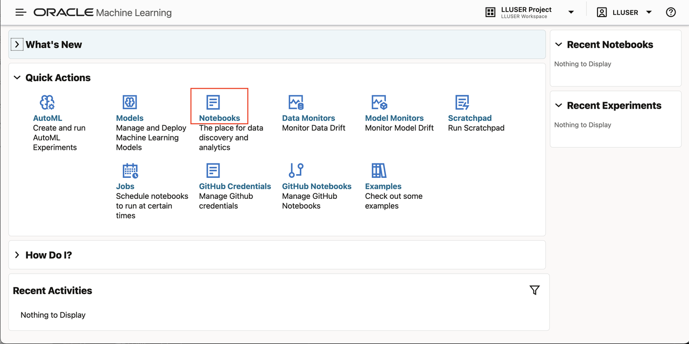

2. Click **Import** to expand the Import drop down.

    

3. Select **Git**.

    

4. Paste the following GitHub URL leaving the credential field blank, then click **OK**.

    ```text
    <copy>
    https://github.com/kaymalcolm/database/blob/main/ai4u/industries/retail-bigstar/enterprise-data/lab6-enterprise-data.json
    </copy>
    ```

    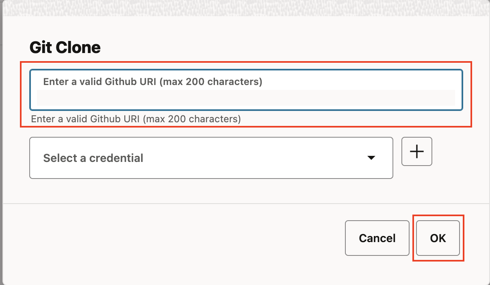

    You should now be on the screen with the notebook imported. This workshop will have all of the screenshots and detailed information, however the notebook will have the commands and basic instructions for completing the lab.

## Task 2: Experience the Knowledge Gap

Let's see what happens when you ask an LLM about your business without giving it access to your data. We'll use `SELECT AI CHAT`, which queries the LLM's general knowledge with no access to your enterprise tables.

1. Set the AI profile and ask about Big Star Collectibles' appraisal guidelines.

    > This command is already in your notebook — just click the play button (▶) to run it.

    ```sql
    <copy>
    -- Set the AI profile for SELECT AI CHAT
    EXEC DBMS_CLOUD_AI.SET_PROFILE('genai');

    SELECT AI CHAT What are the current appraisal guidelines for collector card submissions at Big Star Collectibles for preferred customers;
    </copy>
    ```

    The LLM admits it has no access to Big Star Collectibles' internal policies and can only offer generic guidance -- it doesn't know YOUR guidelines.

    

2. Ask about a specific applicant.

    > This command is already in your notebook — just click the play button (▶) to run it.

    ```sql
    <copy>
    SELECT AI CHAT Is applicant APPL-1001 eligible for a premium rate item at Big Star Collectibles;
    </copy>
    ```

    The LLM has no applicant data. It asks for more context rather than answering -- it cannot tell you anything about YOUR applicants.

    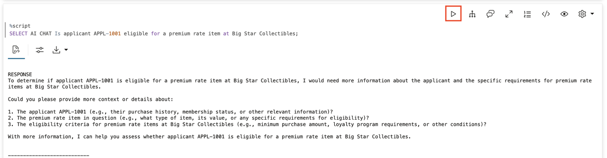

## Task 3: Create Enterprise Data

Now let's create the business data that an agent needs. Instead of hoping the AI knows your guidelines and policies, we store them in tables the agent can query.

1. Create the item policies and applicant tables.

    These tables contain Big Star Collectibles' actual business information: real rate tiers, real credit requirements, and real applicant data. This is what turns a generic AI into YOUR AI.

    > This command is already in your notebook — just click the play button (▶) to run it.

    ```sql
    <copy>
    -- Big Star Collectibles Item Policies
    CREATE TABLE item_policies (
        policy_id      VARCHAR2(20) PRIMARY KEY,
        policy_name    VARCHAR2(100),
        policy_text    CLOB,
        applies_to     VARCHAR2(50)
    );

    INSERT INTO item_policies VALUES (
        'POL-001', 'Collector Card Item - Preferred Rate',
        'Preferred customers (credit score 750+) qualify for collector card items at 7.9% APR. ' ||
        'Maximum item amount $100,000. No origination fee. Same-day approval for amounts under $50,000.',
        'PREFERRED'
    );

    INSERT INTO item_policies VALUES (
        'POL-002', 'Collector Card Item - Standard Rate',
        'Standard customers (credit score 650-749) qualify for collector card items at 12.9% APR. ' ||
        'Maximum item amount $50,000. 2% origination fee applies. ' ||
        'Approval within 2 business days.',
        'STANDARD'
    );

    INSERT INTO item_policies VALUES (
        'POL-003', 'Authenticating Item Guidelines',
        'All authenticating item applications require: 1) Minimum credit score 680, 2) Debt-to-income ratio under 43%, ' ||
        '3) Down payment minimum 10%, 4) Employment verification for past 2 years. ' ||
        'Senior appraiser review required for all authenticating items.',
        'ALL'
    );

    INSERT INTO item_policies VALUES (
        'POL-004', 'Limited Art Item - Preferred Rate',
        'Preferred customers qualify for limited art items at 5.9% APR for new vehicles, 7.9% for used. ' ||
        'Maximum term 72 months for new, 60 months for used. No down payment required for amounts under $35,000.',
        'PREFERRED'
    );

    INSERT INTO item_policies VALUES (
        'POL-005', 'Credit Risk Escalation',
        'Item applications with risk flags: 1) Agent assesses initial eligibility, 2) If debt-to-income exceeds 35%, ' ||
        'escalate to appraiser, 3) If credit score below 650, escalate to senior appraiser, ' ||
        '4) Applicant may request manager review of any decision.',
        'ALL'
    );

    -- Big Star Collectibles Applicant Data
    CREATE TABLE item_applicants (
        applicant_id        VARCHAR2(20) PRIMARY KEY,
        name                VARCHAR2(100),
        customer_tier       VARCHAR2(20),
        credit_score        NUMBER,
        annual_income       NUMBER(12,2),
        existing_debt       NUMBER(12,2),
        member_since        DATE,
        premium_eligible    VARCHAR2(1)
    );

    INSERT INTO item_applicants VALUES ('APPL-1001', 'Acme Industries LLC', 'PREFERRED', 780, 450000, 125000, DATE '2019-03-15', 'Y');
    INSERT INTO item_applicants VALUES ('APPL-1002', 'TechStart Solutions', 'STANDARD', 695, 125000, 45000, DATE '2022-06-01', 'N');
    INSERT INTO item_applicants VALUES ('APPL-1003', 'NewVenture Corp', 'STANDARD', 620, 75000, 35000, DATE '2024-01-10', 'N');

    COMMIT;
    </copy>
    ```

    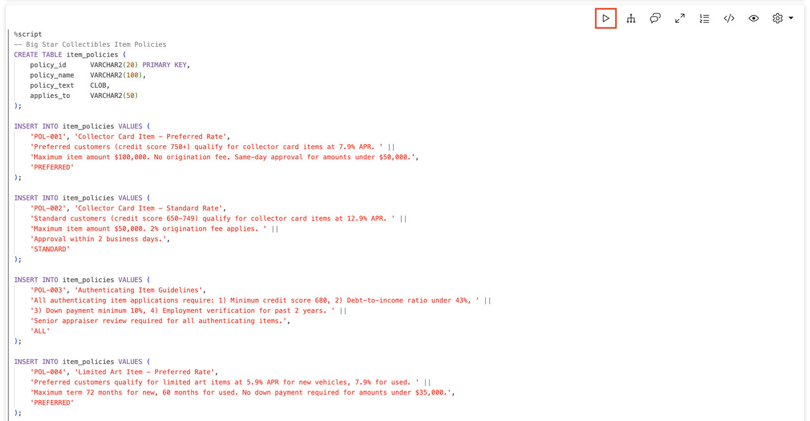

    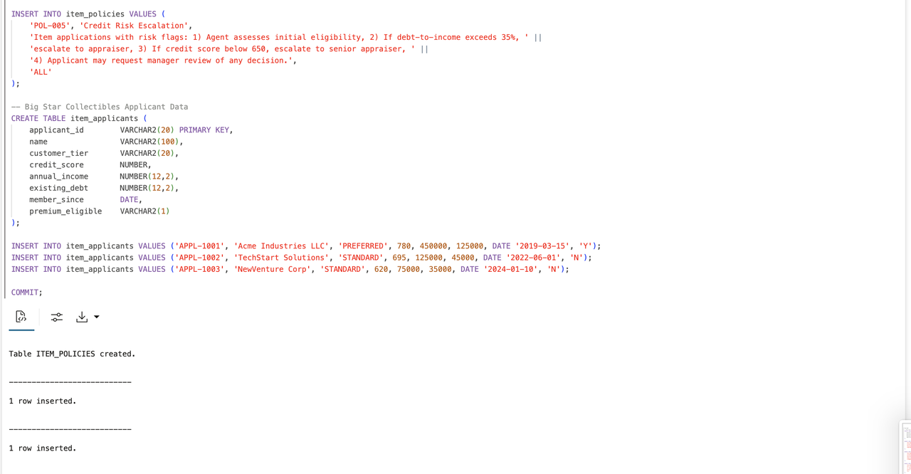

2. Create the data access functions.

    These functions become the agent's eyes into Big Star Collectibles' enterprise data. When asked about guidelines or applicants, the agent queries these functions instead of guessing.

    > This command is already in your notebook — just click the play button (▶) to run it.

    ```sql
    <copy>
    -- Tool to look up item policies
    CREATE OR REPLACE FUNCTION get_item_policy(
        p_policy_type   VARCHAR2,
        p_customer_tier VARCHAR2 DEFAULT NULL
    ) RETURN VARCHAR2 AS
        v_result CLOB := '';
    BEGIN
        FOR rec IN (
            SELECT policy_name, policy_text 
            FROM item_policies 
            WHERE UPPER(policy_name) LIKE '%' || UPPER(p_policy_type) || '%'
            AND (applies_to = p_customer_tier OR applies_to = 'ALL' OR p_customer_tier IS NULL)
        ) LOOP
            v_result := v_result || rec.policy_name || ': ' || rec.policy_text || CHR(10);
        END LOOP;
        
        IF v_result IS NULL THEN
            RETURN 'No policy found for: ' || p_policy_type;
        END IF;
        RETURN v_result;
    END;
    /

    -- Tool to look up applicant information
    CREATE OR REPLACE FUNCTION get_applicant_info(
        p_applicant_id VARCHAR2
    ) RETURN VARCHAR2 AS
        v_result VARCHAR2(500);
        v_dti NUMBER;
    BEGIN
        SELECT 'Applicant: ' || name || 
               ', Tier: ' || customer_tier || 
               ', Credit Score: ' || credit_score ||
               ', Annual Income: $' || TO_CHAR(annual_income, '999,999') ||
               ', Existing Debt: $' || TO_CHAR(existing_debt, '999,999') ||
               ', Debt-to-Income: ' || ROUND((existing_debt / annual_income) * 100, 1) || '%' ||
               ', Member Since: ' || TO_CHAR(member_since, 'YYYY-MM-DD') ||
               ', Premium Rate Eligible: ' || premium_eligible
        INTO v_result
        FROM item_applicants
        WHERE applicant_id = p_applicant_id;
        
        RETURN v_result;
    EXCEPTION
        WHEN NO_DATA_FOUND THEN
            RETURN 'Applicant not found: ' || p_applicant_id;
    END;
    /
    </copy>
    ```

    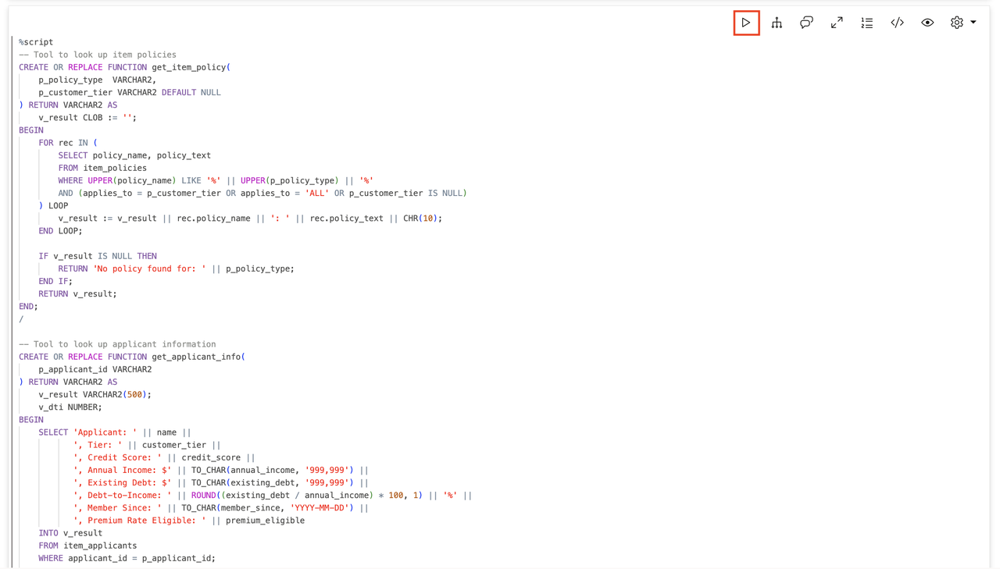

    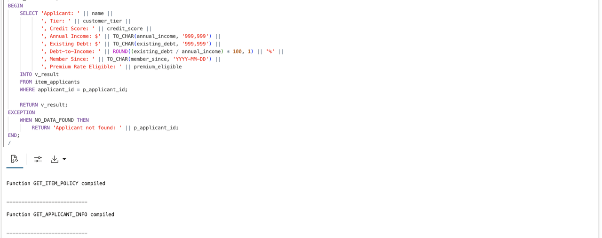

3. Register the tools.

    We turn these functions into tools the agent can use. The instructions tell the agent to always use these tools for policy and applicant questions -- never guess.

    > This command is already in your notebook — just click the play button (▶) to run it.

    ```sql
    <copy>
    BEGIN
        DBMS_CLOUD_AI_AGENT.CREATE_TOOL(
            tool_name   => 'ITEM_POLICY_TOOL',
            attributes  => '{"instruction": "Look up Big Star Collectibles item policies. Parameters: P_POLICY_TYPE (e.g. collector_card, authenticating, limited_art, escalation), P_CUSTOMER_TIER (PREFERRED or STANDARD, optional). Always use this to answer item policy and rate questions.",
                            "function": "get_item_policy"}',
            description => 'Retrieves Big Star Collectibles item policies including guidelines, requirements, and routing steps'
        );
        
        DBMS_CLOUD_AI_AGENT.CREATE_TOOL(
            tool_name   => 'APPLICANT_LOOKUP_TOOL',
            attributes  => '{"instruction": "Look up item applicant information. Parameter: P_APPLICANT_ID (e.g. APPL-1001). Returns credit score, income, debt-to-income ratio, and premium eligibility. Always use this when asked about specific applicants.",
                            "function": "get_applicant_info"}',
            description => 'Retrieves applicant details including credit score, income, and item eligibility'
        );
    END;
    /
    </copy>
    ```

    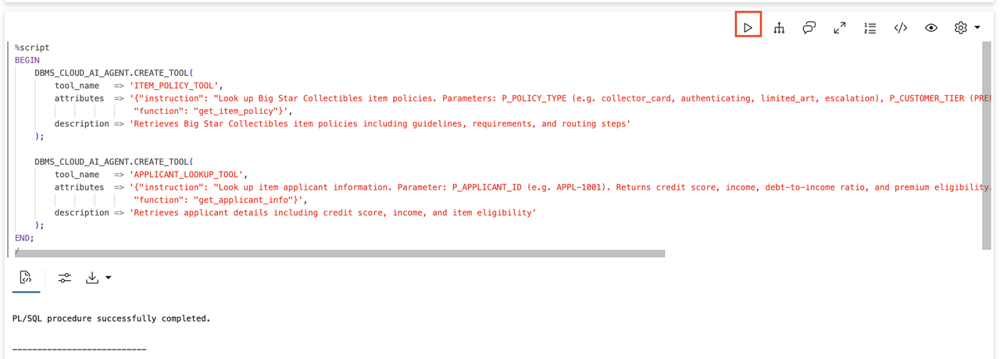

## Task 4: Create an Informed Agent

Now let's create an agent with access to Big Star Collectibles' enterprise data. The key difference from a generic chatbot is that this agent has tools to look up real information -- and is instructed never to guess.

1. Create the informed agent, task, and team.

    > This command is already in your notebook — just click the play button (▶) to run it.

    ```sql
    <copy>
    BEGIN
        DBMS_CLOUD_AI_AGENT.CREATE_AGENT(
            agent_name  => 'BIGSTAR_ITEM_AGENT',
            attributes  => '{"profile_name": "genai",
                            "role": "You are a item officer assistant for Big Star Collectibles. You have access to company item policies and applicant information. Always use your tools to look up real data - never guess about guidelines, policies, or applicant details."}',
            description => 'Agent with Big Star Collectibles enterprise data access'
        );
        
        DBMS_CLOUD_AI_AGENT.CREATE_TASK(
            task_name   => 'BIGSTAR_ITEM_TASK',
            attributes  => '{"instruction": "Help the item officer by looking up relevant policies and applicant information using your tools. Do not ask clarifying questions - use the tools and report what you find. User request: {query}",
                            "tools": ["ITEM_POLICY_TOOL", "APPLICANT_LOOKUP_TOOL"]}',
            description => 'Task with Big Star Collectibles data access'
        );
        
        DBMS_CLOUD_AI_AGENT.CREATE_TEAM(
            team_name   => 'BIGSTAR_ITEM_TEAM',
            attributes  => '{"agents": [{"name": "BIGSTAR_ITEM_AGENT", "task": "BIGSTAR_ITEM_TASK"}],
                            "process": "sequential"}',
            description => 'Team with Big Star Collectibles enterprise data'
        );
    END;
    /
    </copy>
    ```

    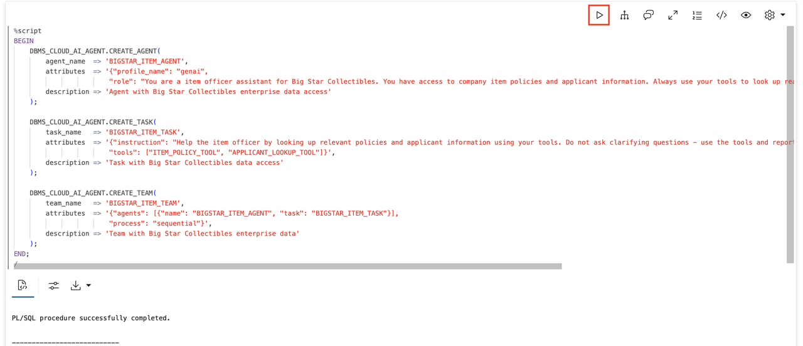

2. Set the team for your session.

    > This command is already in your notebook — just click the play button (▶) to run it.

    ```sql
    <copy>
    EXEC DBMS_CLOUD_AI_AGENT.SET_TEAM('BIGSTAR_ITEM_TEAM');
    </copy>
    ```

    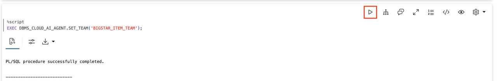

## Task 5: Ask the Same Questions Again

Now let's see the difference. This time we use `SELECT AI AGENT`, which has access to our enterprise data tools.

1. Ask about appraisal guidelines for preferred customers.

    This is the same question that stumped the LLM in Task 2.

    > This command is already in your notebook — just click the play button (▶) to run it.

    ```sql
    <copy>
    SELECT AI AGENT What are the current appraisal guidelines for collector card submissions for preferred customers;
    </copy>
    ```

    **Now you get YOUR actual policy:** Preferred customers (credit score 750+) qualify for collector card items at 7.9% APR. Maximum item amount $100,000. No origination fee. Same-day approval for amounts under $50,000.

    

2. Ask about applicant APPL-1001 eligibility.

    > This command is already in your notebook — just click the play button (▶) to run it.

    ```sql
    <copy>
    SELECT AI AGENT Is applicant APPL-1001 eligible for a premium rate item;
    </copy>
    ```

    **The agent looks up the applicant and reports a definitive answer** from your actual data.

    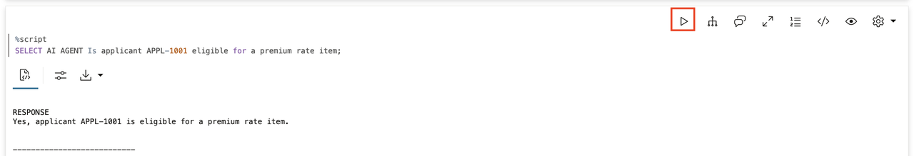

3. Ask about authenticating item requirements.

    > This command is already in your notebook — just click the play button (▶) to run it.

    ```sql
    <copy>
    SELECT AI AGENT What are the authenticating item requirements at Big Star Collectibles;
    </copy>
    ```

    **Your actual policy:** Minimum credit score 680, debt-to-income ratio under 43%, 10% down payment minimum, 2 years employment verification, senior appraiser review required for all authenticating items.

    

4. Ask about the risk escalation process.

    > This command is already in your notebook — just click the play button (▶) to run it.

    ```sql
    <copy>
    SELECT AI AGENT What is the escalation process for high-risk item applications;
    </copy>
    ```

    **Your actual escalation process:** Agent assesses initial eligibility, escalate to appraiser if DTI exceeds 35%, escalate to senior appraiser if credit score below 650, applicant may request manager review.

    

## Task 6: Verify the Tool Calls

Let's confirm the agent is using enterprise data and not guessing.

1. Query the tool execution history.

    > This command is already in your notebook — just click the play button (▶) to run it.

    ```sql
    <copy>
    SELECT 
        tool_name,
        TO_CHAR(start_date, 'HH24:MI:SS') as called_at,
        SUBSTR(output, 1, 80) as result
    FROM USER_AI_AGENT_TOOL_HISTORY
    ORDER BY start_date DESC
    FETCH FIRST 10 ROWS ONLY;
    </copy>
    ```

    You can see `ITEM_POLICY_TOOL` and `APPLICANT_LOOKUP_TOOL` calls with results pulled directly from your tables -- real data, not hallucination.

    

## Summary

In this lab, you experienced the difference enterprise data makes:

* `SELECT AI CHAT` (LLM only): generic answers, no knowledge of Big Star Collectibles' actual policies or applicants
* `SELECT AI AGENT` (with tools): YOUR specific guidelines, YOUR applicant data, YOUR escalation procedures

**Key takeaway:** Agents don't fail because they're not smart. They fail because they don't know your business. Marcus almost quoted wrong guidelines because the AI had no access to Big Star Collectibles' actual pricing policies. Enterprise data is what transforms generic AI into your AI.

The LLM provides the intelligence. Your database provides the knowledge. Together, they create an agent that actually understands your business.

## Learn More

* [`DBMS_CLOUD_AI_AGENT` Package](https://docs.oracle.com/en/cloud/paas/autonomous-database/serverless/adbsb/dbms-cloud-ai-agent-package.html)

## Acknowledgements

* **Author** - David Start, Director, Database Product Management
* **Last Updated By/Date** - Kay Malcolm, February 2026

## Cleanup (Optional)

> This command is already in your notebook — just click the play button (▶) to run it.

```sql
<copy>
EXEC DBMS_CLOUD_AI_AGENT.DROP_TEAM('BIGSTAR_ITEM_TEAM', TRUE);
EXEC DBMS_CLOUD_AI_AGENT.DROP_TASK('BIGSTAR_ITEM_TASK', TRUE);
EXEC DBMS_CLOUD_AI_AGENT.DROP_AGENT('BIGSTAR_ITEM_AGENT', TRUE);
EXEC DBMS_CLOUD_AI_AGENT.DROP_TOOL('ITEM_POLICY_TOOL', TRUE);
EXEC DBMS_CLOUD_AI_AGENT.DROP_TOOL('APPLICANT_LOOKUP_TOOL', TRUE);
DROP TABLE item_policies PURGE;
DROP TABLE item_applicants PURGE;
DROP FUNCTION get_item_policy;
DROP FUNCTION get_applicant_info;
</copy>
```

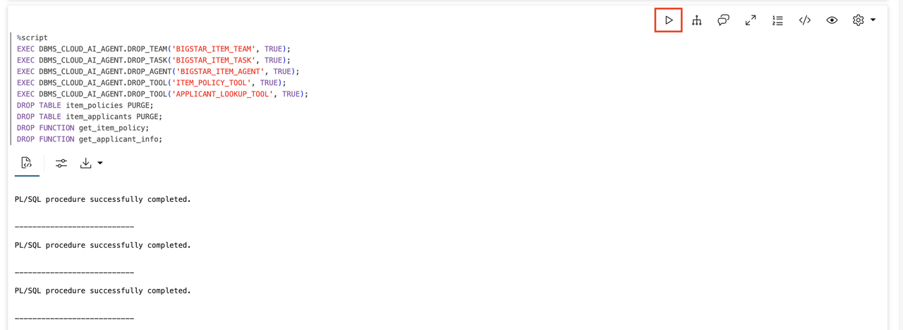
