# Watch an Agent Think and Act at Big Star Collectibles

## Introduction

In this lab, you'll trace an agent through its complete execution loop -- from understanding a request to taking action and reporting results.

Every agent follows the same pattern: understand, plan, execute tools, analyze results, and respond. By observing this loop in detail, you'll understand exactly how agents transform requests into outcomes.

### The Business Problem

Big Star Collectibles' inventory specialists are drowning in routine decisions. A $25,000 collector_card item for someone with excellent credit should take minutes, not hours. But without smart routing, every application goes through the same manual review process.

> *"Small items take as long to process as big ones. We spend hours reviewing applications that should just limited_art-approve."*
>
> David, Operations Manager

Meanwhile, the high-risk applications that actually need scrutiny get the same attention as routine ones. Senior appraisers waste time on $30K collector_card items while $500K authenticatings wait in queue.

### What You'll Learn

In this lab, you'll build Big Star Collectibles' risk assessment workflow. The agent will:

1. Create item submissions with proper tracking IDs
2. Assess risk based on item type and amount
3. Route appropriately:
   - **Under $50K collector_card/limited_art** → Limited_art-approve (low risk)
   - **$50K–$250K** → Appraiser review
   - **Over $250K or authenticatings** → Senior appraiser
4. Log every step for audit compliance

Every agent follows the same pattern: **understand → plan → execute tools → analyze results → respond**. You'll trace this loop with detailed logging.

**What you'll build:** A item risk assessment workflow with conditional routing and audit trail.

Estimated Time: 10 minutes

### Objectives

* Trace the complete agent execution loop
* Understand the relationship between LLM reasoning and tool actions
* Use history views to see every step
* Build conditional routing based on item risk

### Prerequisites

For this workshop, we provide the environment. You'll need:

* Basic knowledge of SQL and PL/SQL, or the ability to follow along with the prompts

## Task 1: Import the Lab Notebook

Before you begin, you are going to import a notebook that has all of the commands for this lab into Oracle Machine Learning. This way you don't have to copy and paste them over to run them.

1. From the Oracle Machine Learning home page, click **Notebooks**.

    

2. Click **Import** to expand the Import drop down.

    

3. Select **Git**.

    

4. Paste the following GitHub URL leaving the credential field blank, then click **OK**.

    ```text
    <copy>
    https://github.com/kaymalcolm/database/blob/main/ai4u/industries/retail-bigstar/how-agents-execute/lab4-how-agents-execute.json
    </copy>
    ```

    

    You should now be on the screen with the notebook imported. This workshop will have all of the screenshots and detailed information, however the notebook will have the commands and basic instructions for completing the lab.

## Task 2: Set Up the Execution Infrastructure

We'll create tables that log every step the agent takes. This lets you watch the execution unfold step by step -- critical for audit trails in financial services. The `workflow_log` table captures each step as it happens. The `item_applications` table holds the actual business data the agent creates.

1. Create the sequence and tables.

    > This command is already in your notebook — just click the play button (▶) to run it.

    ```sql
    <copy>
    CREATE SEQUENCE item_applications_seq START WITH 1001;

    CREATE TABLE workflow_log (
        log_id      NUMBER GENERATED ALWAYS AS IDENTITY PRIMARY KEY,
        step_name   VARCHAR2(100),
        step_detail VARCHAR2(500),
        logged_at   TIMESTAMP DEFAULT SYSTIMESTAMP
    );

    CREATE TABLE item_applications (
        application_id  VARCHAR2(20) PRIMARY KEY,
        applicant_name  VARCHAR2(100),
        item_amount     NUMBER(12,2),
        item_type       VARCHAR2(50),
        risk_status     VARCHAR2(30) DEFAULT 'NEW',
        created_at      TIMESTAMP DEFAULT SYSTIMESTAMP
    );
    </copy>
    ```

    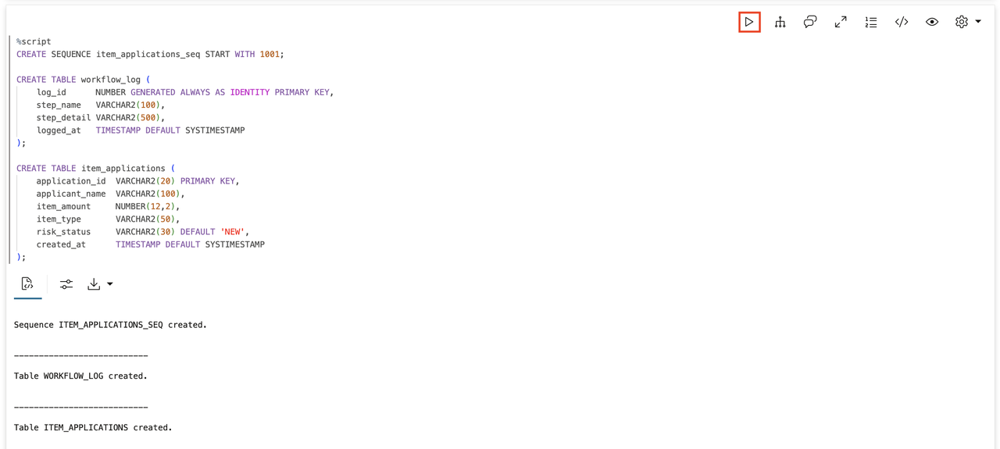

2. Create the item application function.

    This function creates item submissions. Notice it logs to `workflow_log` before doing its work -- this is how you'll trace execution. The function generates a unique ID like `ITEM-250108-1001` and inserts the application with status `SUBMITTED`.

    > This command is already in your notebook — just click the play button (▶) to run it.

    ```sql
    <copy>
    CREATE OR REPLACE FUNCTION create_item_application(
        p_applicant  VARCHAR2,
        p_amount     NUMBER,
        p_item_type  VARCHAR2
    ) RETURN VARCHAR2 AS
        PRAGMA AUTONOMOUS_TRANSACTION;
        v_application_id VARCHAR2(20);
    BEGIN
        v_application_id := 'ITEM-' || TO_CHAR(SYSDATE, 'YYMMDD') || '-' || item_applications_seq.NEXTVAL;
        
        -- Log the step
        INSERT INTO workflow_log (step_name, step_detail) 
        VALUES ('CREATE_APPLICATION', 'Created ' || v_application_id || ' for ' || p_applicant || ', $' || TO_CHAR(p_amount, '999,999'));
        
        -- Create the application
        INSERT INTO item_applications (application_id, applicant_name, item_amount, item_type, risk_status)
        VALUES (v_application_id, p_applicant, p_amount, p_item_type, 'SUBMITTED');
        
        COMMIT;
        RETURN 'Created item submission ' || v_application_id || ' for $' || TO_CHAR(p_amount, '999,999') || ' (' || p_item_type || ' item)';
    END;
    /
    </copy>
    ```

    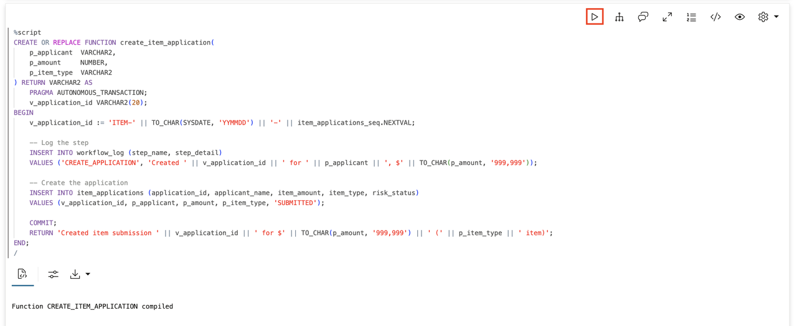

3. Create the risk assessment function.

    This function determines what risk level applies based on item amount and type. At Big Star Collectibles: collector_card items under $50K → AUTO_APPROVE; collector_card/limited_art items $50K–$250K → APPRAISER_REVIEW; any item $250K+ or all authenticating items → SENIOR_APPRAISER.

    > This command is already in your notebook — just click the play button (▶) to run it.

    ```sql
    <copy>
    CREATE OR REPLACE FUNCTION assess_item_risk(
        p_amount    NUMBER,
        p_item_type VARCHAR2
    ) RETURN VARCHAR2 AS
        PRAGMA AUTONOMOUS_TRANSACTION;
        v_result VARCHAR2(200);
    BEGIN
        -- Log the step
        INSERT INTO workflow_log (step_name, step_detail) 
        VALUES ('ASSESS_RISK', 'Assessing risk for $' || TO_CHAR(p_amount, '999,999') || ' ' || p_item_type || ' item');
        
        -- Apply Big Star Collectibles risk rules
        IF UPPER(p_item_type) = 'AUTHENTICATING' THEN
            v_result := 'SENIOR_APPRAISER: All authenticating items require senior review';
        ELSIF p_amount >= 250000 THEN
            v_result := 'SENIOR_APPRAISER: Items $250K+ require senior appraiser';
        ELSIF p_amount >= 50000 THEN
            v_result := 'APPRAISER_REVIEW: Items $50K-$250K require appraiser review';
        ELSE
            v_result := 'AUTO_APPROVE: Collector_card items under $50K limited_art-approved';
        END IF;
        
        COMMIT;
        RETURN v_result;
    END;
    /
    </copy>
    ```

    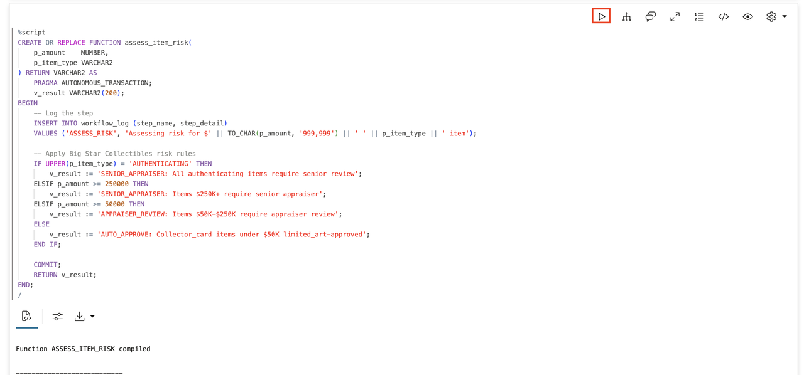

4. Create the routing function.

    This function routes item submissions for appraisal review by updating their status. The agent should only call this when the risk assessment returns APPRAISER_REVIEW or SENIOR_APPRAISER -- this is where you'll see the agent make decisions.

    > This command is already in your notebook — just click the play button (▶) to run it.

    ```sql
    <copy>
    CREATE OR REPLACE FUNCTION route_for_appraisal(
        p_application_id  VARCHAR2,
        p_review_level    VARCHAR2
    ) RETURN VARCHAR2 AS
        PRAGMA AUTONOMOUS_TRANSACTION;
    BEGIN
        -- Log the step
        INSERT INTO workflow_log (step_name, step_detail) 
        VALUES ('ROUTE_APPRAISER', 'Routing ' || p_application_id || ' for ' || p_review_level);
        
        -- Update status
        UPDATE item_applications 
        SET risk_status = 'SUBMITTED_' || p_review_level
        WHERE application_id = p_application_id;
        
        COMMIT;
        RETURN 'Routed ' || p_application_id || ' for ' || p_review_level || ' review';
    END;
    /
    </copy>
    ```

    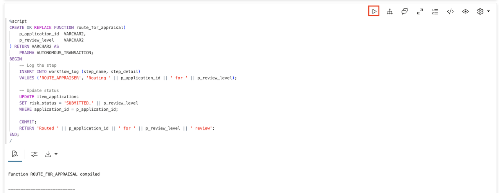

5. Register the tools with the agent framework.

    Each tool has an `instruction` that tells the agent when and how to use it. Notice the instruction for `ROUTE_AUTHENTICATION_TOOL` says "Only call this if ASSESS_ITEM_RISK_TOOL returned APPRAISER_REVIEW or SENIOR_APPRAISER." This is how you guide agent behavior -- through clear instructions in tool definitions.

    > This command is already in your notebook — just click the play button (▶) to run it.

    ```sql
    <copy>
    BEGIN
        DBMS_CLOUD_AI_AGENT.CREATE_TOOL(
            tool_name   => 'CREATE_ITEM_TOOL',
            attributes  => '{"instruction": "Create a new item submission at Big Star Collectibles. Parameters: P_APPLICANT (applicant name), P_AMOUNT (item amount as number), P_ITEM_TYPE (collector_card, limited_art, authenticating, or business). Returns the application ID.",
                            "function": "create_item_application"}',
            description => 'Creates a item submission and returns the application ID'
        );
        
        DBMS_CLOUD_AI_AGENT.CREATE_TOOL(
            tool_name   => 'ASSESS_ITEM_RISK_TOOL',
            attributes  => '{"instruction": "Assess risk level for a item submission. Parameters: P_AMOUNT (item amount as number), P_ITEM_TYPE (collector_card, limited_art, authenticating, or business). Returns AUTO_APPROVE, APPRAISER_REVIEW, or SENIOR_APPRAISER.",
                            "function": "assess_item_risk"}',
            description => 'Returns the required review level based on amount and item type'
        );
        
        DBMS_CLOUD_AI_AGENT.CREATE_TOOL(
            tool_name   => 'ROUTE_AUTHENTICATION_TOOL',
            attributes  => '{"instruction": "Route a item submission for appraisal review. Only call this if ASSESS_ITEM_RISK_TOOL returned APPRAISER_REVIEW or SENIOR_APPRAISER. Do NOT call this for AUTO_APPROVE. Parameters: P_APPLICATION_ID (the ITEM-YYMMDD-NNNN format ID), P_REVIEW_LEVEL (APPRAISER or SENIOR_APPRAISER).",
                            "function": "route_for_appraisal"}',
            description => 'Routes the item submission to the appropriate appraiser'
        );
    END;
    /
    </copy>
    ```

    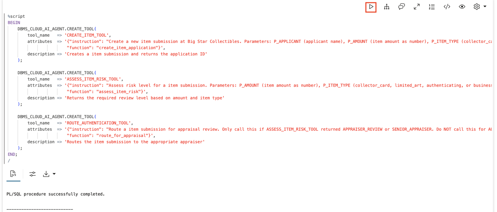

6. Create the agent, task, and team.

    The agent's role tells it the sequence: create → assess risk → route (if needed). The task instruction reinforces this and specifically says NOT to route if risk assessment says AUTO_APPROVE. This combination of role + task instruction shapes how the agent plans its work.

    > This command is already in your notebook — just click the play button (▶) to run it.

    ```sql
    <copy>
    BEGIN
        DBMS_CLOUD_AI_AGENT.CREATE_AGENT(
            agent_name  => 'ITEM_EXEC_AGENT',
            attributes  => '{"profile_name": "genai",
                            "role": "You are a item processing agent for Big Star Collectibles. Process item submissions by: 1) Creating the application, 2) Assessing the risk, 3) Only routing for appraisal if risk assessment requires it. If assessment says AUTO_APPROVE, do not route."}',
            description => 'Agent demonstrating item processing execution loop'
        );
        
        DBMS_CLOUD_AI_AGENT.CREATE_TASK(
            task_name   => 'ITEM_EXEC_TASK',
            attributes  => '{"instruction": "Process the item submission: 1. Call CREATE_ITEM_TOOL to create the application 2. Call ASSESS_ITEM_RISK_TOOL to determine risk level 3. If result contains APPRAISER_REVIEW or SENIOR_APPRAISER, call ROUTE_AUTHENTICATION_TOOL. If result is AUTO_APPROVE, do NOT call ROUTE_AUTHENTICATION_TOOL - just confirm the item is limited_art-approved. User request: {query}",
                            "tools": ["CREATE_ITEM_TOOL", "ASSESS_ITEM_RISK_TOOL", "ROUTE_AUTHENTICATION_TOOL"]}',
            description => 'Task for item execution demo'
        );
        
        DBMS_CLOUD_AI_AGENT.CREATE_TEAM(
            team_name   => 'ITEM_EXEC_TEAM',
            attributes  => '{"agents": [{"name": "ITEM_EXEC_AGENT", "task": "ITEM_EXEC_TASK"}],
                            "process": "sequential"}',
            description => 'Team for item execution demo'
        );
    END;
    /
    </copy>
    ```

    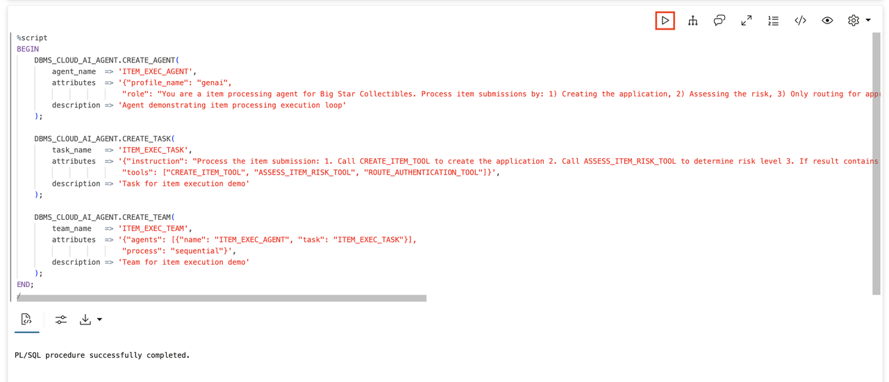

## Task 3: Execute the Full Appraiser-Review Path

Let's run a $75,000 limited_art submission and trace every step. This amount falls between $50K and $250K, so it should trigger the full three-step workflow: create → assess → route for appraiser review.

1. Clear the log and activate the team.

    Before running a test, clear the workflow log so you see only the steps from this execution. Then set the team so your `SELECT AI AGENT` commands go to this agent.

    > This command is already in your notebook — just click the play button (▶) to run it.

    ```sql
    <copy>
    TRUNCATE TABLE workflow_log;
    EXEC DBMS_CLOUD_AI_AGENT.SET_TEAM('ITEM_EXEC_TEAM');
    </copy>
    ```

    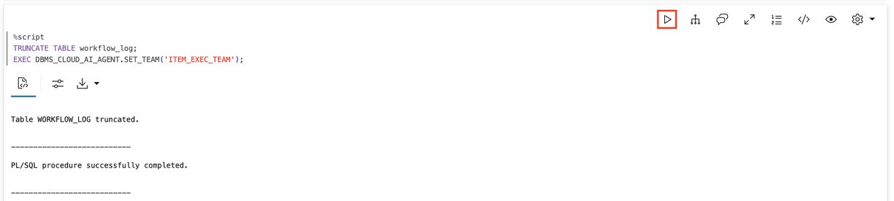

2. Submit a $75,000 limited_art item.

    Watch the agent's response -- it should mention creating the application and routing it for appraiser review.

    > This command is already in your notebook — just click the play button (▶) to run it.

    ```sql
    <copy>
    SELECT AI AGENT Submit a $75000 limited_art item submission for John Smith;
    </copy>
    ```

    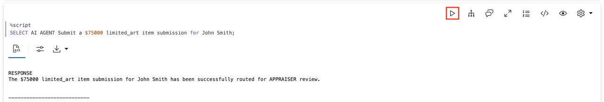

3. Examine the workflow log.

    Look at exactly what happened, step by step. You should see three entries showing the complete execution trace.

    > This command is already in your notebook — just click the play button (▶) to run it.

    ```sql
    <copy>
    SELECT 
        step_name,
        step_detail,
        TO_CHAR(logged_at, 'HH24:MI:SS.FF3') as time
    FROM workflow_log
    ORDER BY log_id;
    </copy>
    ```

    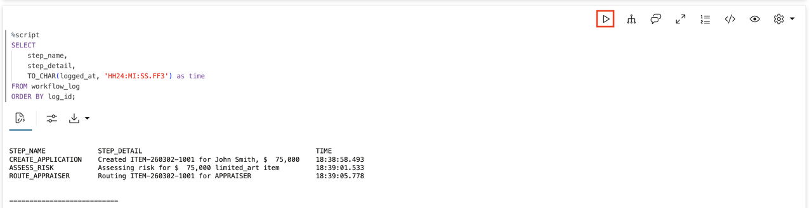

    **Observe the execution sequence:**
    - `CREATE_APPLICATION`: The item submission was created with a unique ID (e.g., `ITEM-260302-1001`)
    - `ASSESS_RISK`: Risk was evaluated ($75K limited_art item requires appraiser)
    - `ROUTE_APPRAISER`: It was routed for appraiser review

## Task 4: Check the Tool History and Verify the Record

Oracle also maintains its own history of every tool call. This shows you the inputs and outputs from the agent framework's perspective -- a second audit trail on top of your workflow log.

1. Query the tool execution history.

    You should see `CREATE_ITEM_TOOL`, `ASSESS_ITEM_RISK_TOOL`, and `ROUTE_AUTHENTICATION_TOOL` in sequence with timestamps.

    > This command is already in your notebook — just click the play button (▶) to run it.

    ```sql
    <copy>
    SELECT 
        tool_name,
        TO_CHAR(start_date, 'HH24:MI:SS.FF3') as started,
        TO_CHAR(end_date, 'HH24:MI:SS.FF3') as ended,
        SUBSTR(output, 1, 60) as result
    FROM USER_AI_AGENT_TOOL_HISTORY
    ORDER BY start_date DESC
    FETCH FIRST 10 ROWS ONLY;
    </copy>
    ```

    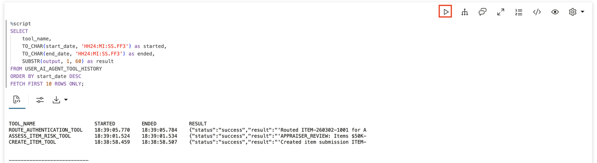

2. Verify the item application record.

    Look at the actual database record. You should see John Smith's $75,000 limited_art item with status `SUBMITTED_APPRAISER` -- proof the agent didn't just talk about routing the item, it actually updated the database.

    > This command is already in your notebook — just click the play button (▶) to run it.

    ```sql
    <copy>
    SELECT 
        application_id,
        applicant_name,
        TO_CHAR(item_amount, '$999,999') as item_amount,
        item_type,
        risk_status,
        TO_CHAR(created_at, 'HH24:MI:SS') as created
    FROM item_applications
    ORDER BY created_at DESC;
    </copy>
    ```

    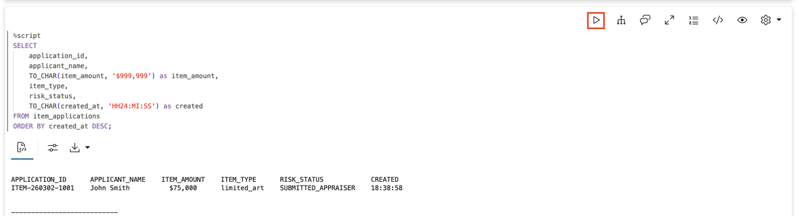

## Task 5: Trace the Other Execution Paths

The same agent, same tools -- but different inputs lead to different routing paths. Let's test the auto-approve path and the senior appraiser path to see the agent make different decisions.

1. Submit a $25,000 collector_card item -- the auto-approve path.

    With $25,000, the risk assessment should return AUTO_APPROVE, and the agent should NOT call `ROUTE_AUTHENTICATION_TOOL`.

    > This command is already in your notebook — just click the play button (▶) to run it.

    ```sql
    <copy>
    TRUNCATE TABLE workflow_log;
    SELECT AI AGENT Submit a $25000 collector_card item submission for Jane Doe;
    </copy>
    ```

    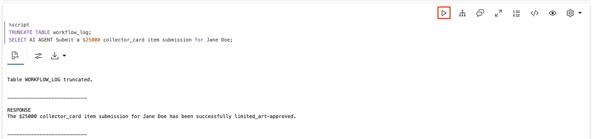

2. Check the workflow log for the auto-approve path.

    You should see only **two** steps this time -- no ROUTE_APPRAISER entry. The agent correctly decided not to route because the risk assessment said AUTO_APPROVE.

    > This command is already in your notebook — just click the play button (▶) to run it.

    ```sql
    <copy>
    SELECT step_name, step_detail FROM workflow_log ORDER BY log_id;
    </copy>
    ```

    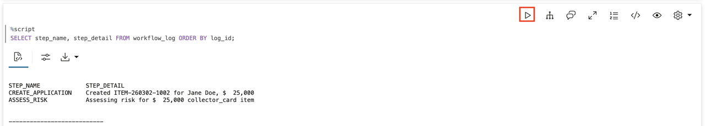

    **Observe:** Only two steps -- `CREATE_APPLICATION` and `ASSESS_RISK`. No routing step. This is the agent making a decision based on data: it read the risk assessment result and chose not to call the routing tool.

3. Verify Jane's application record.

    Jane's item should have status `SUBMITTED` (not `SUBMITTED_APPRAISER`), because it was auto-approved and didn't need routing.

    > This command is already in your notebook — just click the play button (▶) to run it.

    ```sql
    <copy>
    SELECT application_id, applicant_name, TO_CHAR(item_amount, '$999,999') as amount, risk_status 
    FROM item_applications 
    WHERE applicant_name = 'Jane Doe';
    </copy>
    ```

    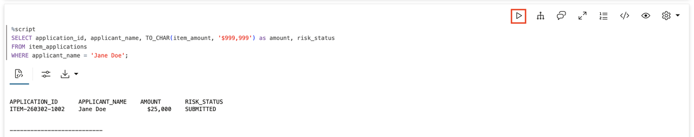

4. Submit a $350,000 authenticating -- the senior appraiser path.

    Authenticating items at Big Star Collectibles always require senior review regardless of amount. Clear the log first so you see only this execution.

    > This command is already in your notebook — just click the play button (▶) to run it.

    ```sql
    <copy>
    TRUNCATE TABLE workflow_log;
    SELECT AI AGENT Submit a $350000 authenticating item submission for Bob Wilson;
    </copy>
    ```

    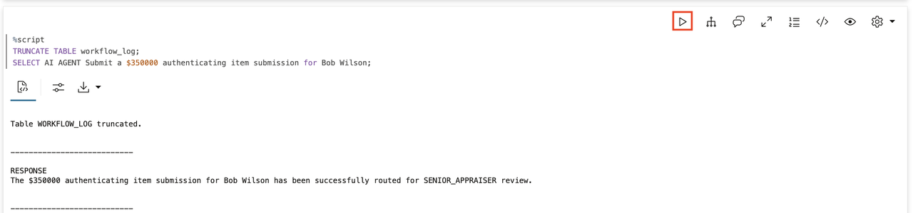

5. Check the workflow log for the senior appraiser path.

    You should see all three steps again -- but this time `ROUTE_APPRAISER` shows `SENIOR_APPRAISER` instead of `APPRAISER`.

    > This command is already in your notebook — just click the play button (▶) to run it.

    ```sql
    <copy>
    SELECT step_name, step_detail FROM workflow_log ORDER BY log_id;
    </copy>
    ```

    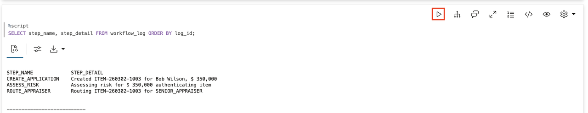

6. Verify Bob's application record.

    Bob's item should have status `SUBMITTED_SENIOR_APPRAISER`. The agent correctly identified an authenticating item and routed it to the higher review level.

    > This command is already in your notebook — just click the play button (▶) to run it.

    ```sql
    <copy>
    SELECT application_id, applicant_name, TO_CHAR(item_amount, '$999,999') as amount, item_type, risk_status 
    FROM item_applications 
    WHERE applicant_name = 'Bob Wilson';
    </copy>
    ```

    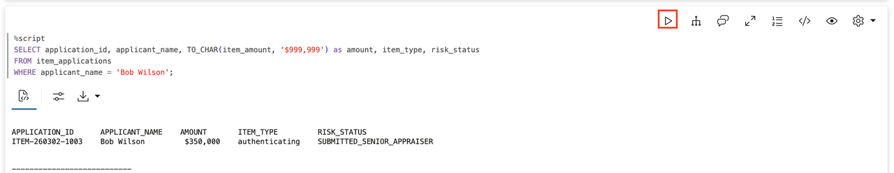

## Task 6: Compare All Three Execution Paths

Let's see all three item submissions side by side with their routing reasons. Same agent, same tools -- but different execution paths based on the data.

1. Query all applications with routing logic.

    > This command is already in your notebook — just click the play button (▶) to run it.

    ```sql
    <copy>
    SELECT 
        application_id,
        applicant_name,
        TO_CHAR(item_amount, '$999,999') as item_amount,
        item_type,
        risk_status,
        CASE 
            WHEN item_amount < 50000 AND item_type != 'authenticating' THEN 'Limited_art-approved'
            WHEN item_type = 'authenticating' THEN 'Senior appraiser (authenticating)'
            WHEN item_amount >= 250000 THEN 'Senior appraiser (high value)'
            ELSE 'Standard appraiser review'
        END as routing_reason
    FROM item_applications
    ORDER BY created_at;
    </copy>
    ```

    

    **Observe:** The same agent produced three different statuses based on the data:

    | Amount | Type | Status | Why |
    |--------|------|--------|-----|
    | $75,000 | limited_art | SUBMITTED_APPRAISER | Between $50K–$250K |
    | $25,000 | collector_card | SUBMITTED | Auto-approved, under $50K |
    | $350,000 | authenticating | SUBMITTED_SENIOR_APPRAISER | Authenticatings always require senior review |

    That is exactly how Big Star Collectibles manages item risk. Small items auto-approve in seconds. Complex items get routed appropriately. And compliance has a complete audit trail for every decision.

## Summary

In this lab, you traced the complete agent execution loop at Big Star Collectibles:

* **Logging**: `workflow_log` entries captured each step as it happened
* **Conditional execution**: The agent called `ROUTE_AUTHENTICATION_TOOL` only when the risk assessment required it -- and skipped it for AUTO_APPROVE
* **Three paths**: Auto-approve, appraiser review, and senior appraiser review, all from the same agent
* **Verification**: Checked both the workflow log and actual database records

**The execution pattern every agent follows:**

1. **Receive request** → Inventory specialist submits application
2. **LLM understands** → Interprets applicant, amount, item type
3. **LLM plans** → Determines which tools, in what order
4. **Tool executes** → First tool runs, returns result
5. **LLM analyzes** → Interprets the result, decides next step (this is where decisions happen)
6. **Repeat** → More tools if needed (conditionally)
7. **LLM responds** → Generates final response

**Key takeaway:** The agent orchestrates, the LLM thinks, the tools act. Every step is logged. Every action is traceable. This is what makes agents production-ready for financial services.

## Learn More

* [`DBMS_CLOUD_AI_AGENT` Package](https://docs.oracle.com/en/cloud/paas/autonomous-database/serverless/adbsb/dbms-cloud-ai-agent-package.html)

## Acknowledgements

* **Author** - David Start, Director, Database Product Management
* **Last Updated By/Date** - Kay Malcolm, February 2026

## Cleanup (Optional)

> This command is already in your notebook — just click the play button (▶) to run it.

```sql
<copy>
EXEC DBMS_CLOUD_AI_AGENT.DROP_TEAM('ITEM_EXEC_TEAM', TRUE);
EXEC DBMS_CLOUD_AI_AGENT.DROP_TASK('ITEM_EXEC_TASK', TRUE);
EXEC DBMS_CLOUD_AI_AGENT.DROP_AGENT('ITEM_EXEC_AGENT', TRUE);
EXEC DBMS_CLOUD_AI_AGENT.DROP_TOOL('CREATE_ITEM_TOOL', TRUE);
EXEC DBMS_CLOUD_AI_AGENT.DROP_TOOL('ASSESS_ITEM_RISK_TOOL', TRUE);
EXEC DBMS_CLOUD_AI_AGENT.DROP_TOOL('ROUTE_AUTHENTICATION_TOOL', TRUE);
DROP TABLE item_applications PURGE;
DROP TABLE workflow_log PURGE;
DROP SEQUENCE item_applications_seq;
DROP FUNCTION create_item_application;
DROP FUNCTION assess_item_risk;
DROP FUNCTION route_for_appraisal;
</copy>
```

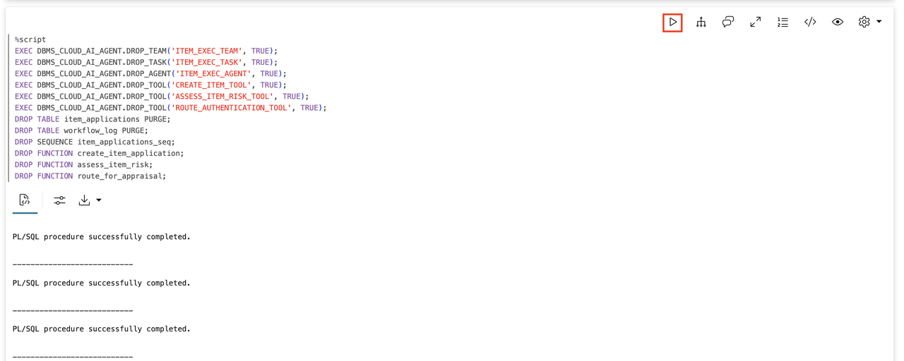
