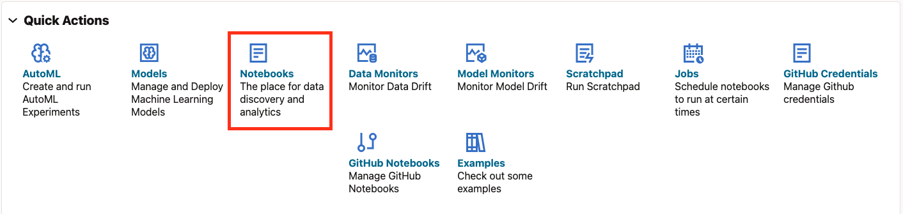
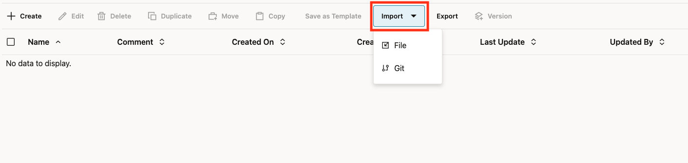
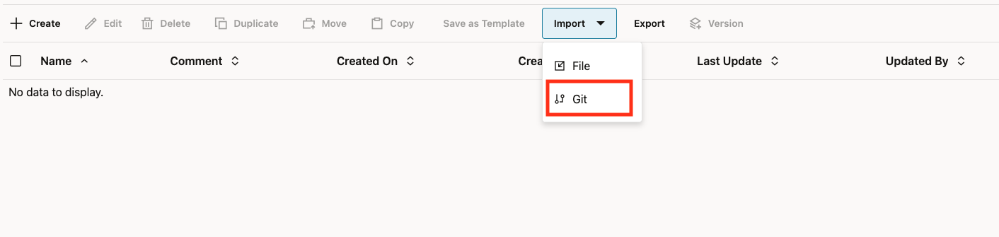
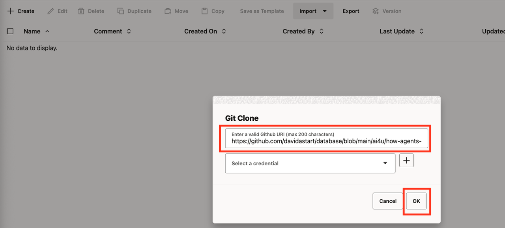

# How Agents Plan the Work

## Introduction

In this lab, you'll observe how an AI agent plans its work before taking action.

Planning is what separates agents from chatbots. Before executing anything, an agent breaks a task into steps, identifies which tools to use, and determines the order of operations. This makes agent behavior predictable and debuggable.

You'll give an agent a multi-step task and watch how it decomposes the work.

### The Business Problem

At Big Star Collectibles, preparing for a client call is tedious. A inventory specialist needs to pull together information from multiple places:

- **Contact info**: How does this client prefer to be reached?
- **Item history**: What submissions do they have pending?
- **Rate eligibility**: What tier are they in?
- **Credit information**: What credit tier applies?

> *"Before every client call, I spend 10-15 minutes just gathering the information I need. By the time I'm ready, I've forgotten why they called."*
>
> Jennifer, Inventory Specialist

The inventory specialists need an agent that can plan and execute a multi-step information retrieval: analyze what's needed, identify the right tools, determine the order, and synthesize the results.

### What You'll Learn

This lab shows you how agents plan multi-tool operations. You'll see the agent decide which tools to call, in what order, and how to combine the results. This is the foundation for solving Big Star Collectibles' "gathering" problem.

**What you'll build:** A multi-tool agent that plans information retrieval for item collectors.

Estimated Time: 10 minutes

### Story Sync
**Story Sync:** Chapter 1.2 – see the corresponding narrative beat for context.

### Objectives

* Understand how agents break tasks into steps
* Observe the planning process through history views
* See the relationship between instructions and execution
* Learn why planning makes agents predictable

### Prerequisites

For this workshop, we provide the environment. You'll need:

* Basic knowledge of SQL and PL/SQL, or the ability to follow along with the prompts

## Task 1: Import the Lab Notebook

Before you begin, you are going to import a notebook that has all of the commands for this lab into Oracle Machine Learning. This way you don't have to copy and paste them over to run them.

1. From the Oracle Machine Learning home page, click **Notebooks**.

    

2. Click **Import** to expand the Import drop down.

    

3. Select **Git**.

    

4. Paste the following GitHub URL leaving the credential field blank:

    ```text
    <copy>
    https://github.com/davidastart/database/blob/main/ai4u/how-agents-plan/lab3-how-agents-plan.json
    </copy>
    ```

    

5. Click **Ok**.

    

You should now be on the screen with the notebook imported. This workshop will have all of the screenshots and detailed information however the notebook will have the commands and basic instructions for completing the lab.

## Task 2: Create a Multi-Tool Agent

To see planning in action, we need an agent with multiple tools. When an agent has several tools available, it has to figure out which ones to use and in what order. This decision-making process is what we call "planning."

1. Create sample data tables.

    First, we need some data for the agent to work with. We'll create two tables: one for collectors (with their contact info and credit tier) and one for their items.

    > This command is already in your notebook - just click the play button (▶) to run it.

    ```sql
    <copy>
    -- Collector table
    CREATE TABLE demo_collectors (
        collector_id    VARCHAR2(20) PRIMARY KEY,
        name            VARCHAR2(100),
        credit_tier     VARCHAR2(20),
        contact_email   VARCHAR2(100),
        contact_pref    VARCHAR2(20)
    );

    INSERT INTO demo_collectors VALUES ('APP-001', 'Acme Corp', 'PREFERRED', 'sarah@acme.com', 'EMAIL');
    INSERT INTO demo_collectors VALUES ('APP-002', 'TechStart', 'STANDARD', 'info@techstart.com', 'PHONE');

    -- Item submission table
    CREATE TABLE demo_items (
        item_id       VARCHAR2(20) PRIMARY KEY,
        collector_id  VARCHAR2(20),
        status        VARCHAR2(30),
        amount        NUMBER(12,2),
        item_type     VARCHAR2(30),
        rate          NUMBER(5,2)
    );

    INSERT INTO demo_items VALUES ('ITEM-100', 'APP-001', 'APPROVED', 150000, 'Business', 7.9);
    INSERT INTO demo_items VALUES ('ITEM-101', 'APP-001', 'PENDING', 75000, 'Personal', 8.5);
    INSERT INTO demo_items VALUES ('ITEM-102', 'APP-002', 'UNDER_REVIEW', 45000, 'Auto', 9.9);

    COMMIT;
    </copy>
    ```

    

2. Create tool functions.

    Now we create three different functions, each doing one specific job. This separation is important - instead of one big function that does everything, we give the agent three focused tools. The agent will then decide which ones it needs based on what you ask.

    > This command is already in your notebook - just click the play button (▶) to run it.

    ```sql
    <copy>
    -- Tool 1: Look up collector
    CREATE OR REPLACE FUNCTION get_collector(p_collector_id VARCHAR2) RETURN VARCHAR2 AS
        v_result VARCHAR2(500);
    BEGIN
        SELECT 'Collector: ' || name || ', Credit Tier: ' || credit_tier || 
               ', Contact: ' || contact_email || ' (' || contact_pref || ')'
        INTO v_result FROM demo_collectors WHERE collector_id = p_collector_id;
        RETURN v_result;
    EXCEPTION WHEN NO_DATA_FOUND THEN RETURN 'Collector not found: ' || p_collector_id;
    END;
    /

    -- Tool 2: Get collector items
    CREATE OR REPLACE FUNCTION get_collector_items(p_collector_id VARCHAR2) RETURN VARCHAR2 AS
        v_result CLOB := '';
        v_count NUMBER := 0;
    BEGIN
        FOR rec IN (SELECT item_id, status, amount, item_type, rate 
                    FROM demo_items WHERE collector_id = p_collector_id ORDER BY amount DESC) LOOP
            v_result := v_result || rec.item_id || ': ' || rec.status || ', $' || rec.amount || 
                       ' ' || rec.item_type || ' at ' || rec.rate || '%' || CHR(10);
            v_count := v_count + 1;
        END LOOP;
        IF v_count = 0 THEN RETURN 'No items found for collector.'; END IF;
        RETURN 'Found ' || v_count || ' items:' || CHR(10) || v_result;
    END;
    /

    -- Tool 3: Check rate eligibility
    CREATE OR REPLACE FUNCTION check_rate_eligibility(p_collector_id VARCHAR2) RETURN VARCHAR2 AS
        v_tier VARCHAR2(20);
    BEGIN
        SELECT credit_tier INTO v_tier FROM demo_collectors WHERE collector_id = p_collector_id;
        IF v_tier = 'PREFERRED' THEN
            RETURN 'PREFERRED RATES: Eligible for rates starting at 7.9% loyalty pricing tier. Up to $500K limit.';
        ELSIF v_tier = 'STANDARD' THEN
            RETURN 'STANDARD RATES: Eligible for rates starting at 9.9% loyalty pricing tier. Up to $100K limit.';
        ELSE
            RETURN 'SUBPRIME RATES: Rates starting at 14.9% loyalty pricing tier. Up to $25K limit.';
        END IF;
    EXCEPTION WHEN NO_DATA_FOUND THEN RETURN 'Collector not found.';
    END;
    /
    </copy>
    ```

    

3. Register the tools.

    Each function becomes a tool that the agent can use. The `instruction` for each tool explains what it does and when to use it. Think of these instructions as training the agent on its toolkit - the better the instructions, the smarter the agent's choices.

    > This command is already in your notebook - just click the play button (▶) to run it.

    ```sql
    <copy>
    BEGIN
        DBMS_CLOUD_AI_AGENT.CREATE_TOOL(
            tool_name   => 'GET_COLLECTOR_TOOL',
            attributes  => '{"instruction": "Get collector details by ID. Parameter: P_COLLECTOR_ID (e.g. APP-001). Returns name, credit tier, and contact info.",
                            "function": "get_collector"}',
            description => 'Retrieves collector name, credit tier, and contact preferences'
        );
    END;
    /

    BEGIN
        DBMS_CLOUD_AI_AGENT.CREATE_TOOL(
            tool_name   => 'GET_ITEMS_TOOL',
            attributes  => '{"instruction": "Get all items for an collector. Parameter: P_COLLECTOR_ID (e.g. APP-001). Returns item IDs, statuses, amounts, and rates.",
                            "function": "get_collector_items"}',
            description => 'Retrieves collector item history with status and rates'
        );
    END;
    /

    BEGIN
        DBMS_CLOUD_AI_AGENT.CREATE_TOOL(
            tool_name   => 'CHECK_RATES_TOOL',
            attributes  => '{"instruction": "Check rate eligibility for an collector. Parameter: P_COLLECTOR_ID (e.g. APP-001). Returns eligible rate tier and limits.",
                            "function": "check_rate_eligibility"}',
            description => 'Checks what rate tier the collector qualifies for'
        );
    END;
    /
    </copy>
    ```

    

4. Create the agent and team.

    Now we create the agent with access to all three tools. When you ask a question, the agent will look at its available tools and plan which ones to use. A simple question might need just one tool; a complex question might need all three.

    > This command is already in your notebook - just click the play button (▶) to run it.

    ```sql
    <copy>
    BEGIN
        DBMS_CLOUD_AI_AGENT.CREATE_AGENT(
            agent_name  => 'PLANNING_AGENT',
            attributes  => '{"profile_name": "genai",
                            "role": "You are a inventory specialist assistant for Big Star Collectibles. Use your tools to look up collector information, item history, and rate eligibility. Always use the tools - never guess or make up information."}',
            description => 'Agent that plans multi-step responses'
        );
    END;
    /

    BEGIN
        DBMS_CLOUD_AI_AGENT.CREATE_TASK(
            task_name   => 'PLANNING_TASK',
            attributes  => '{"instruction": "Answer inventory specialist inquiries by using the available tools. Do not ask clarifying questions - use the tools to look up the information and report what you find. User request: {query}",
                            "tools": ["GET_COLLECTOR_TOOL", "GET_ITEMS_TOOL", "CHECK_RATES_TOOL"]}',
            description => 'Task with multiple tools for planning demonstration'
        );
    END;
    /

    BEGIN
        DBMS_CLOUD_AI_AGENT.CREATE_TEAM(
            team_name   => 'PLANNING_TEAM',
            attributes  => '{"agents": [{"name": "PLANNING_AGENT", "task": "PLANNING_TASK"}],
                            "process": "sequential"}',
            description => 'Team demonstrating agent planning'
        );
    END;
    /
    </copy>
    ```

    

## Task 3: Observe Single-Tool Planning

Let's start with a simple request that needs only one tool.

1. Set the team and ask a simple question.

    > This command is already in your notebook - just click the play button (▶) to run it.

    ```sql
    <copy>
    EXEC DBMS_CLOUD_AI_AGENT.SET_TEAM('PLANNING_TEAM');
    SELECT AI AGENT Who is collector APP-001;
    </copy>
    ```

    

2. Check the tool history to see the plan execution.

    > This command is already in your notebook - just click the play button (▶) to run it.

    ```sql
    <copy>
    SELECT 
        tool_name,
        TO_CHAR(start_date, 'HH24:MI:SS.FF3') as called_at,
        SUBSTR(output, 1, 60) as result
    FROM USER_AI_AGENT_TOOL_HISTORY
    ORDER BY start_date DESC
    FETCH FIRST 5 ROWS ONLY;
    </copy>
    ```

    

**Observe:** The agent planned to use just `GET_COLLECTOR_TOOL` because that's all the question required.

## Task 4: Observe Multi-Tool Planning

Now let's ask a question that requires multiple tools, just like a inventory specialist preparing for a client call.

1. Ask a complex question.

    > This command is already in your notebook - just click the play button (▶) to run it.

    ```sql
    <copy>
    SELECT AI AGENT Give me a complete picture of collector APP-001 including their items and rate eligibility;
    </copy>
    ```

    

2. Check the tool history.

    > This command is already in your notebook - just click the play button (▶) to run it.

    ```sql
    <copy>
    SELECT 
        tool_name,
        TO_CHAR(start_date, 'HH24:MI:SS.FF3') as called_at,
        SUBSTR(output, 1, 60) as result
    FROM USER_AI_AGENT_TOOL_HISTORY
    ORDER BY start_date DESC
    FETCH FIRST 10 ROWS ONLY;
    </copy>
    ```

    

**Observe:** The agent planned to use multiple tools:
- `GET_COLLECTOR_TOOL` to get basic info
- `GET_ITEMS_TOOL` to get item history
- `CHECK_RATES_TOOL` to verify rate eligibility

3. Notice the sequence - the agent determined the logical order.

## Task 5: See How Instructions Shape Planning

The task instruction guides how the agent plans. Let's modify it.

1. Create a more specific task.

    > This command is already in your notebook - just click the play button (▶) to run it.

    ```sql
    <copy>
    BEGIN
        DBMS_CLOUD_AI_AGENT.CREATE_TASK(
            task_name   => 'STRUCTURED_TASK',
            attributes  => '{"instruction": "For collector inquiries, ALWAYS follow this exact sequence: 1. First, look up the collector using GET_COLLECTOR_TOOL 2. Then, get their items using GET_ITEMS_TOOL 3. Finally, check rate eligibility using CHECK_RATES_TOOL. Report all findings. User request: {query}",
                            "tools": ["GET_COLLECTOR_TOOL", "GET_ITEMS_TOOL", "CHECK_RATES_TOOL"]}',
            description => 'Task with explicit planning instructions'
        );
    END;
    /

    -- Update the team to use the new task
    BEGIN
        DBMS_CLOUD_AI_AGENT.DROP_TEAM('PLANNING_TEAM', TRUE);
        DBMS_CLOUD_AI_AGENT.CREATE_TEAM(
            team_name   => 'PLANNING_TEAM',
            attributes  => '{"agents": [{"name": "PLANNING_AGENT", "task": "STRUCTURED_TASK"}],
                            "process": "sequential"}',
            description => 'Team with structured planning'
        );
    END;
    /
    </copy>
    ```

    

2. Test with the structured instructions.

    > This command is already in your notebook - just click the play button (▶) to run it.

    ```sql
    <copy>
    EXEC DBMS_CLOUD_AI_AGENT.SET_TEAM('PLANNING_TEAM');
    SELECT AI AGENT Tell me about collector APP-001;
    </copy>
    ```

    

3. Check the tool history again.

    > This command is already in your notebook - just click the play button (▶) to run it.

    ```sql
    <copy>
    SELECT 
        tool_name,
        TO_CHAR(start_date, 'HH24:MI:SS.FF3') as called_at
    FROM USER_AI_AGENT_TOOL_HISTORY
    ORDER BY start_date DESC
    FETCH FIRST 5 ROWS ONLY;
    </copy>
    ```

    

**Observe:** The agent followed the explicit plan: collector first, then items, then rate eligibility, in that order. This is how Jennifer's 10-15 minute prep becomes a 10-second agent call.

## Task 6: Understand Why Planning Matters

Planning provides:

1. **Predictability**: You can anticipate what the agent will do
2. **Debuggability**: When something goes wrong, you can see where
3. **Efficiency**: The agent gathers what it needs without redundant calls
4. **Control**: You shape the plan through instructions

Query the complete execution sequence:

> This command is already in your notebook - just click the play button (▶) to run it.

```sql
<copy>
SELECT 
    tool_name,
    TO_CHAR(start_date, 'HH24:MI:SS') as started,
    TO_CHAR(end_date, 'HH24:MI:SS') as ended
FROM USER_AI_AGENT_TOOL_HISTORY
ORDER BY start_date DESC
FETCH FIRST 10 ROWS ONLY;
</copy>
```


## Summary

In this lab, you observed how agents plan their work:

* Created an agent with multiple tools
* Watched the agent choose tools based on the question
* Saw how multi-step questions trigger multi-tool plans
* Learned how instructions shape the planning process

**Key takeaway:** Planning is what makes agents predictable. Before any action happens, the agent knows the path. You can see that path in the history views. For Big Star Collectibles, this means inventory specialists get complete client summaries in seconds, not minutes.

## Learn More

* [`DBMS_CLOUD_AI_AGENT` Package](https://docs.oracle.com/en/cloud/paas/autonomous-database/serverless/adbsb/dbms-cloud-ai-agent-package.html)

## Acknowledgements

* **Author** - David Start, Director, Database Product Management
* **Last Updated By/Date** - Kay Malcolm, February 2026

## Cleanup (Optional)

> This command is already in your notebook - just click the play button (▶) to run it.

```sql
<copy>
EXEC DBMS_CLOUD_AI_AGENT.DROP_TEAM('PLANNING_TEAM', TRUE);
EXEC DBMS_CLOUD_AI_AGENT.DROP_TASK('PLANNING_TASK', TRUE);
EXEC DBMS_CLOUD_AI_AGENT.DROP_TASK('STRUCTURED_TASK', TRUE);
EXEC DBMS_CLOUD_AI_AGENT.DROP_AGENT('PLANNING_AGENT', TRUE);
EXEC DBMS_CLOUD_AI_AGENT.DROP_TOOL('GET_COLLECTOR_TOOL', TRUE);
EXEC DBMS_CLOUD_AI_AGENT.DROP_TOOL('GET_ITEMS_TOOL', TRUE);
EXEC DBMS_CLOUD_AI_AGENT.DROP_TOOL('CHECK_RATES_TOOL', TRUE);
DROP TABLE demo_items PURGE;
DROP TABLE demo_collectors PURGE;
DROP FUNCTION get_collector;
DROP FUNCTION get_collector_items;
DROP FUNCTION check_rate_eligibility;
</copy>
```


