# How Agents Plan Their Work at Big Star Collectibles

## Introduction

In this lab, you'll observe how an AI agent plans its work before taking action.

Planning is what separates agents from chatbots. Before executing anything, an agent breaks a task into steps, identifies which tools to use, and determines the order of operations. This makes agent behavior predictable and debuggable.

You'll give an agent a multi-step task and watch how it decomposes the work.

### The Business Problem

When an inventory specialist at Big Star Collectibles needs to prepare for a client call, they have to pull information from multiple places: client contact info, submission history, rate eligibility, credit tier. It takes 10-15 minutes just to get ready for a conversation.

*"Give me a complete picture of Alex Martinez"* seems like a simple request, but it requires checking three different systems. The inventory specialists want an assistant that can gather all this information automatically.

> *"Before every client call, I spend 10-15 minutes just gathering the information I need. By the time I'm ready, I've forgotten why they called."*
>
> Jennifer, Inventory Specialist

### What You'll Learn

In this lab, you'll see how agents *plan* before they act. When you ask for a "complete picture" of a client, the agent:

1. Analyzes what information is needed
2. Identifies which tools can provide that information
3. Determines the optimal order to call them
4. Executes the plan and synthesizes the results

This planning capability is what makes agents predictable and debuggable. You can see exactly what the agent decided to do before it does it.

**What you'll build:** A multi-tool agent that plans and coordinates client information retrieval.

Estimated Time: 10 minutes

### Objectives

* Understand how agents break tasks into steps
* Observe the planning process through history views
* See the relationship between instructions and execution
* Learn why planning makes agents predictable

### Prerequisites

For this workshop, we provide the environment. You'll need:

* Basic knowledge of SQL and PL/SQL, or the ability to follow along with the prompts

## Task 1: Import the Lab Notebook

Before you begin, you are going to import a notebook that has all of the commands for this lab into Oracle Machine Learning. This way you don't have to copy and paste them over to run them.

1. From the Oracle Machine Learning home page, click **Notebooks**.

    

2. Click **Import** to expand the Import drop down.

    

3. Select **Git**.

    

4. Paste the following GitHub URL leaving the credential field blank, then click **OK**.

    ```text
    <copy>
    https://github.com/kaymalcolm/database/blob/main/ai4u/industries/retail-bigstar/how-agents-plan/lab3-how-agents-plan.json
    </copy>
    ```

    

    You should now be on the screen with the notebook imported. This workshop will have all of the screenshots and detailed information, however the notebook will have the commands and basic instructions for completing the lab.

## Task 2: Create a Multi-Tool Agent

To see planning in action, we need an agent with multiple tools. When an agent has several tools available, it has to figure out which ones to use and in what order. This decision-making process is what we call "planning."

1. Create sample data tables.

    First, we need some data for the agent to work with. We'll create two tables: one for collectors (with their contact info and credit tier) and one for their item submissions.

    > This command is already in your notebook — just click the play button (▶) to run it.

    ```sql
    <copy>
    -- Applicant table
    CREATE TABLE demo_collectors (
        collector_id    VARCHAR2(20) PRIMARY KEY,
        name            VARCHAR2(100),
        credit_tier     VARCHAR2(20),
        contact_email   VARCHAR2(100)
    );

    INSERT INTO demo_collectors VALUES ('COLL-001', 'Alex Martinez', 'PREFERRED', 'items@acme.com');
    INSERT INTO demo_collectors VALUES ('COLL-002', 'Jennifer Morales', 'STANDARD', 'finance@techstart.com');

    -- Application table
    CREATE TABLE demo_applications (
        application_id  VARCHAR2(20) PRIMARY KEY,
        collector_id    VARCHAR2(20),
        item_status     VARCHAR2(20),
        item_amount     NUMBER(12,2),
        submission_date DATE
    );

    INSERT INTO demo_applications VALUES ('ITEM-20260115-1042', 'COLL-001', 'APPROVED', 150000, SYSDATE - 2);
    INSERT INTO demo_applications VALUES ('ITEM-20260114-0821', 'COLL-001', 'PENDING', 75000, SYSDATE);
    INSERT INTO demo_applications VALUES ('ITEM-20260113-0905', 'COLL-002', 'APPROVED', 50000, SYSDATE - 5);

    COMMIT;
    </copy>
    ```

    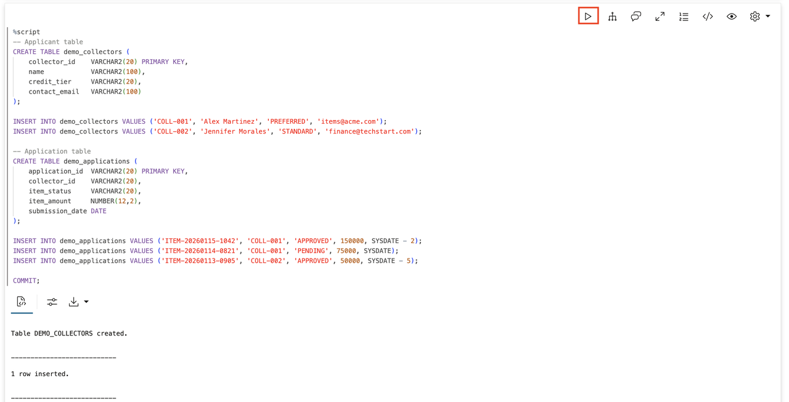

2. Create tool functions.

    Now we create three different functions, each doing one specific job. This separation is important — instead of one big function that does everything, we give the agent three focused tools. The agent will then decide which ones it needs based on what you ask.

    1. **get_collector**: Basic collector info (name, credit tier, email)
    2. **get_collector_items**: Item submission history for a collector
    3. **check_premium_tier**: Whether the collector qualifies for premium collector perks

    > This command is already in your notebook — just click the play button (▶) to run it.

    ```sql
    <copy>
    -- Tool 1: Look up applicant
    CREATE OR REPLACE FUNCTION get_collector(p_collector_id VARCHAR2) RETURN VARCHAR2 AS
        v_result VARCHAR2(500);
    BEGIN
        SELECT 'Applicant: ' || name || ', Credit Tier: ' || credit_tier || ', Email: ' || contact_email
        INTO v_result FROM demo_collectors WHERE collector_id = p_collector_id;
        RETURN v_result;
    EXCEPTION WHEN NO_DATA_FOUND THEN RETURN 'Applicant not found: ' || p_collector_id;
    END;
    /

    -- Tool 2: Get applicant items
    CREATE OR REPLACE FUNCTION get_collector_items(p_collector_id VARCHAR2) RETURN VARCHAR2 AS
        v_result CLOB := '';
        v_count NUMBER := 0;
    BEGIN
        FOR rec IN (SELECT application_id, item_status, item_amount, submission_date 
                    FROM demo_applications WHERE collector_id = p_collector_id ORDER BY submission_date DESC) LOOP
            v_result := v_result || rec.application_id || ': ' || rec.item_status || ', $' || TO_CHAR(rec.item_amount, '999,999') || CHR(10);
            v_count := v_count + 1;
        END LOOP;
        IF v_count = 0 THEN RETURN 'No item submissions found for applicant.'; END IF;
        RETURN 'Found ' || v_count || ' item submissions:' || CHR(10) || v_result;
    END;
    /

    -- Tool 3: Check if applicant is eligible for premium collector perks
    CREATE OR REPLACE FUNCTION check_premium_tier(p_collector_id VARCHAR2) RETURN VARCHAR2 AS
        v_tier VARCHAR2(20);
    BEGIN
        SELECT credit_tier INTO v_tier FROM demo_collectors WHERE collector_id = p_collector_id;
        IF v_tier = 'PREFERRED' THEN
            RETURN 'ELIGIBLE: Applicant has Preferred credit tier - qualifies for premium collector perks (7.9% APR).';
        ELSE
            RETURN 'NOT ELIGIBLE: Applicant has ' || v_tier || ' credit tier - standard rates apply (12.9% APR).';
        END IF;
    EXCEPTION WHEN NO_DATA_FOUND THEN RETURN 'Applicant not found.';
    END;
    /
    </copy>
    ```

    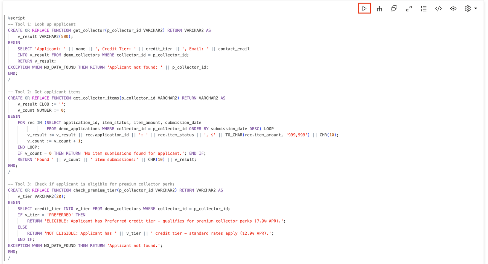

    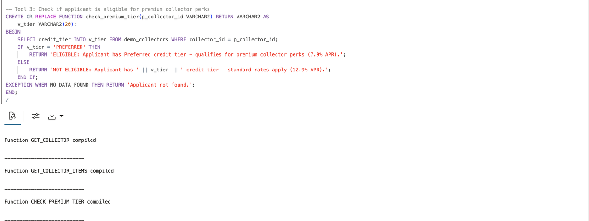

3. Register the tools.

    Each function becomes a tool that the agent can use. The `instruction` for each tool explains what it does and when to use it. Think of these instructions as training the agent on its toolkit — the better the instructions, the smarter the agent's choices.

    > This command is already in your notebook — just click the play button (▶) to run it.

    ```sql
    <copy>
    BEGIN
        DBMS_CLOUD_AI_AGENT.CREATE_TOOL(
            tool_name   => 'GET_COLLECTOR_TOOL',
            attributes  => '{"instruction": "Get collector details by ID. Parameter: P_APPLICANT_ID (e.g. COLL-001). Returns name, credit tier, and email.",
                            "function": "get_collector"}',
            description => 'Retrieves applicant name, credit tier, and contact email'
        );
    END;
    /

    BEGIN
        DBMS_CLOUD_AI_AGENT.CREATE_TOOL(
            tool_name   => 'GET_ITEMS_TOOL',
            attributes  => '{"instruction": "Get all item submissions for an applicant. Parameter: P_APPLICANT_ID (e.g. COLL-001). Returns application IDs, statuses, and amounts.",
                            "function": "get_collector_items"}',
            description => 'Retrieves applicant item submission history with status and amounts'
        );
    END;
    /

    BEGIN
        DBMS_CLOUD_AI_AGENT.CREATE_TOOL(
            tool_name   => 'CHECK_PREMIUM_TOOL',
            attributes  => '{"instruction": "Check if applicant qualifies for premium item rates. Parameter: P_APPLICANT_ID (e.g. COLL-001). Returns ELIGIBLE or NOT ELIGIBLE with rate information.",
                            "function": "check_premium_tier"}',
            description => 'Checks if applicant credit tier qualifies for premium collector perks'
        );
    END;
    /
    </copy>
    ```

    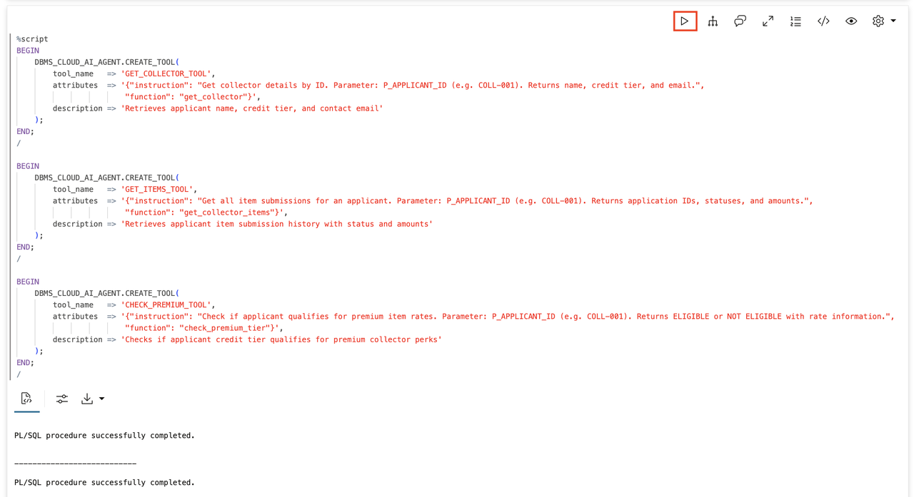

4. Create the agent, task, and team.

    Now we create the agent with access to all three tools. When you ask a question, the agent will look at its available tools and plan which ones to use. A simple question might need just one tool; a complex question might need all three.

    > This command is already in your notebook — just click the play button (▶) to run it.

    ```sql
    <copy>
    BEGIN
        DBMS_CLOUD_AI_AGENT.CREATE_AGENT(
            agent_name  => 'COLLECTOR_PLANNING_AGENT',
            attributes  => '{"profile_name": "genai",
                            "role": "You are a inventory specialist assistant for Big Star Collectibles. Use your tools to look up applicant information, submission history, and rate eligibility. Always use the tools - never guess or make up information."}',
            description => 'Agent that plans multi-step responses'
        );
    END;
    /

    BEGIN
        DBMS_CLOUD_AI_AGENT.CREATE_TASK(
            task_name   => 'COLLECTOR_PLANNING_TASK',
            attributes  => '{"instruction": "Answer collector inquiries by using the available tools. Do not ask clarifying questions - use the tools to look up the information and report what you find. User request: {query}",
                            "tools": ["GET_COLLECTOR_TOOL", "GET_ITEMS_TOOL", "CHECK_PREMIUM_TOOL"]}',
            description => 'Task with multiple tools for planning demonstration'
        );
    END;
    /

    BEGIN
        DBMS_CLOUD_AI_AGENT.CREATE_TEAM(
            team_name   => 'COLLECTOR_PLANNING_TEAM',
            attributes  => '{"agents": [{"name": "COLLECTOR_PLANNING_AGENT", "task": "COLLECTOR_PLANNING_TASK"}],
                            "process": "sequential"}',
            description => 'Team demonstrating agent planning'
        );
    END;
    /
    </copy>
    ```

    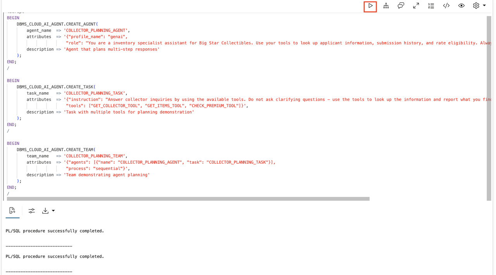

## Task 3: Observe Single-Tool Planning

Let's start with a simple request that only needs one tool. The agent should plan to use just `GET_COLLECTOR_TOOL`.

1. Set the team and ask a simple question.

    > This command is already in your notebook — just click the play button (▶) to run it.

    ```sql
    <copy>
    EXEC DBMS_CLOUD_AI_AGENT.SET_TEAM('COLLECTOR_PLANNING_TEAM');
    SELECT AI AGENT Who is applicant COLL-001;
    </copy>
    ```

    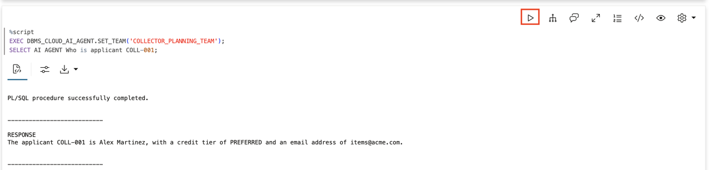

2. Check the tool history to see the plan execution.

    > This command is already in your notebook — just click the play button (▶) to run it.

    ```sql
    <copy>
    SELECT 
        tool_name,
        TO_CHAR(start_date, 'HH24:MI:SS.FF3') as called_at,
        SUBSTR(output, 1, 60) as result
    FROM USER_AI_AGENT_TOOL_HISTORY
    ORDER BY start_date DESC
    FETCH FIRST 5 ROWS ONLY;
    </copy>
    ```

    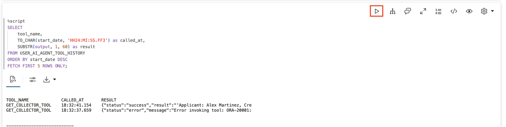

    **Observe:** The agent planned to use just `GET_COLLECTOR_TOOL` because that's all the question required. You can see exactly one tool call in the history.

## Task 4: Observe Multi-Tool Planning

Now let's ask a question that requires multiple tools — just like an inventory specialist preparing for a client call.

1. Ask a complex question requiring all three tools.

    > This command is already in your notebook — just click the play button (▶) to run it.

    ```sql
    <copy>
    SELECT AI AGENT Give me a complete picture of applicant COLL-001 including their submission history and rate eligibility;
    </copy>
    ```

    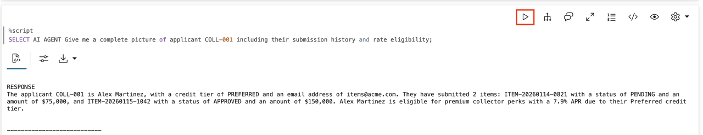

2. Check the tool history to see the full plan.

    > This command is already in your notebook — just click the play button (▶) to run it.

    ```sql
    <copy>
    SELECT 
        tool_name,
        TO_CHAR(start_date, 'HH24:MI:SS.FF3') as called_at,
        SUBSTR(output, 1, 60) as result
    FROM USER_AI_AGENT_TOOL_HISTORY
    ORDER BY start_date DESC
    FETCH FIRST 10 ROWS ONLY;
    </copy>
    ```

    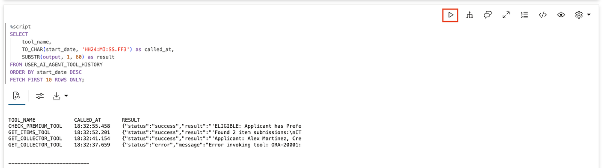

    **Observe:** The agent planned to use all three tools:
    - `GET_COLLECTOR_TOOL` to get basic collector info
    - `GET_ITEMS_TOOL` to get submission history
    - `CHECK_PREMIUM_TOOL` to verify rate eligibility

    The agent determined the logical order on its own. This is what replaces Jennifer's 10-15 minute manual prep.

## Task 5: See How Instructions Shape Planning

The task instruction guides how the agent plans. Let's create a new task with an explicit, prescribed sequence and see how that changes behavior.

1. Create a structured task with explicit ordering.

    > This command is already in your notebook — just click the play button (▶) to run it.

    ```sql
    <copy>
    BEGIN
        DBMS_CLOUD_AI_AGENT.CREATE_TASK(
            task_name   => 'STRUCTURED_TASK',
            attributes  => '{"instruction": "For applicant inquiries, ALWAYS follow this exact sequence: 1. First, look up the applicant using GET_COLLECTOR_TOOL 2. Then, get their submission history using GET_ITEMS_TOOL 3. Finally, check premium rate eligibility using CHECK_PREMIUM_TOOL. Report all findings. User request: {query}",
                            "tools": ["GET_COLLECTOR_TOOL", "GET_ITEMS_TOOL", "CHECK_PREMIUM_TOOL"]}',
            description => 'Task with explicit planning instructions'
        );
    END;
    /

    -- Update the team to use the new task
    BEGIN
        DBMS_CLOUD_AI_AGENT.DROP_TEAM('COLLECTOR_PLANNING_TEAM', TRUE);
        DBMS_CLOUD_AI_AGENT.CREATE_TEAM(
            team_name   => 'COLLECTOR_PLANNING_TEAM',
            attributes  => '{"agents": [{"name": "COLLECTOR_PLANNING_AGENT", "task": "STRUCTURED_TASK"}],
                            "process": "sequential"}',
            description => 'Team with structured planning'
        );
    END;
    /
    </copy>
    ```

    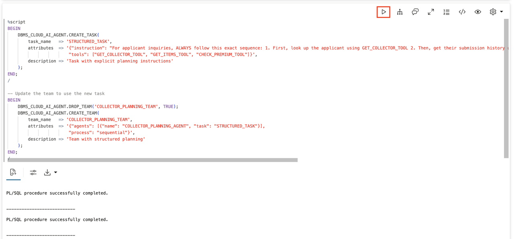

2. Test with a simple question under structured instructions.

    Even though "tell me about" could be answered with just collector info, the structured task will force all three tools to run in the prescribed order.

    > This command is already in your notebook — just click the play button (▶) to run it.

    ```sql
    <copy>
    EXEC DBMS_CLOUD_AI_AGENT.SET_TEAM('COLLECTOR_PLANNING_TEAM');
    SELECT AI AGENT Tell me about applicant COLL-001;
    </copy>
    ```

    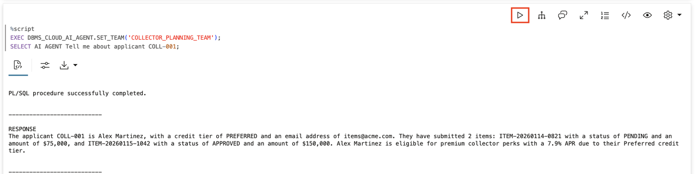

3. Verify the explicit plan was followed.

    > This command is already in your notebook — just click the play button (▶) to run it.

    ```sql
    <copy>
    SELECT 
        tool_name,
        TO_CHAR(start_date, 'HH24:MI:SS.FF3') as called_at
    FROM USER_AI_AGENT_TOOL_HISTORY
    ORDER BY start_date DESC
    FETCH FIRST 5 ROWS ONLY;
    </copy>
    ```

    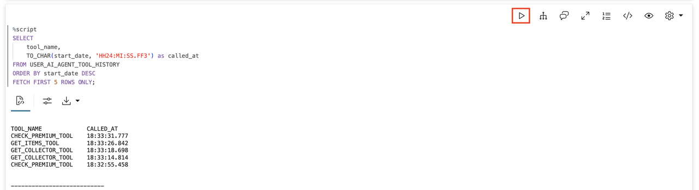

    **Observe:** The agent followed the explicit plan — collector first, then items, then premium eligibility — exactly as specified in the task instructions. This is how you guarantee consistent, auditable behavior regardless of how a question is phrased.

## Task 6: Review the Full Execution Timeline

Every tool call is logged with start and end times. Query the complete execution history to see the full picture of what the agent planned and executed across all the tasks in this lab.

1. Query the complete tool execution timeline.

    > This command is already in your notebook — just click the play button (▶) to run it.

    ```sql
    <copy>
    SELECT 
        tool_name,
        TO_CHAR(start_date, 'HH24:MI:SS') as started,
        TO_CHAR(end_date, 'HH24:MI:SS') as ended
    FROM USER_AI_AGENT_TOOL_HISTORY
    ORDER BY start_date DESC
    FETCH FIRST 10 ROWS ONLY;
    </copy>
    ```

    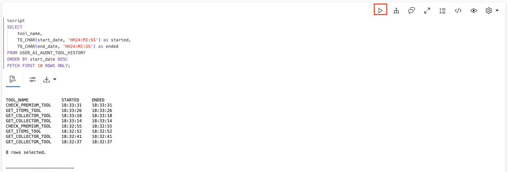

    **Observe:** The timeline shows every tool that was called, in what order, and how long each one took. For Big Star Collectibles, this is your audit trail — you can see exactly what the agent did and when.

## Summary

In this lab, you observed how agents plan their work:

* Created a multi-tool agent with `GET_COLLECTOR_TOOL`, `GET_ITEMS_TOOL`, and `CHECK_PREMIUM_TOOL`
* Watched the agent choose tools based on the complexity of the question
* Saw how multi-step questions trigger multi-tool plans
* Learned how explicit task instructions shape and enforce the planning process
* Reviewed the full execution timeline in `USER_AI_AGENT_TOOL_HISTORY`

**Key takeaway:** Planning is what makes agents predictable. Before any action happens, the agent knows the path. You can see that path in the history views. For Big Star Collectibles, this means inventory specialists get complete client summaries in seconds instead of minutes — and every step is logged for compliance.

## Learn More

* [`DBMS_CLOUD_AI_AGENT` Package](https://docs.oracle.com/en/cloud/paas/autonomous-database/serverless/adbsb/dbms-cloud-ai-agent-package.html)

## Acknowledgements

* **Author** - David Start, Director, Database Product Management
* **Last Updated By/Date** - Kay Malcolm, February 2026

## Cleanup (Optional)

> This command is already in your notebook — just click the play button (▶) to run it.

```sql
<copy>
EXEC DBMS_CLOUD_AI_AGENT.DROP_TEAM('COLLECTOR_PLANNING_TEAM', TRUE);
EXEC DBMS_CLOUD_AI_AGENT.DROP_TASK('COLLECTOR_PLANNING_TASK', TRUE);
EXEC DBMS_CLOUD_AI_AGENT.DROP_TASK('STRUCTURED_TASK', TRUE);
EXEC DBMS_CLOUD_AI_AGENT.DROP_AGENT('COLLECTOR_PLANNING_AGENT', TRUE);
EXEC DBMS_CLOUD_AI_AGENT.DROP_TOOL('GET_COLLECTOR_TOOL', TRUE);
EXEC DBMS_CLOUD_AI_AGENT.DROP_TOOL('GET_ITEMS_TOOL', TRUE);
EXEC DBMS_CLOUD_AI_AGENT.DROP_TOOL('CHECK_PREMIUM_TOOL', TRUE);
DROP TABLE demo_applications PURGE;
DROP TABLE demo_collectors PURGE;
DROP FUNCTION get_collector;
DROP FUNCTION get_collector_items;
DROP FUNCTION check_premium_tier;
</copy>
```

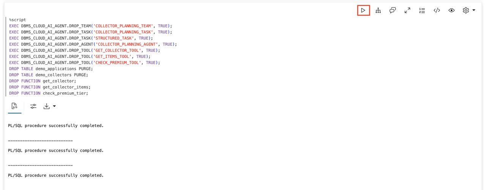
