# The Learning Loop at Big Star Collectibles

## Introduction

In this lab, you'll build the learning loop that turns agents from first-day interns into seasoned inventory specialists.

### The Business Problem

Big Star Collectibles approved a similar item three months ago. Same amount, same credit profile, same industry. The inventory specialist who handled it negotiated special terms based on the client's cash flow timing. But today's inventory specialist has no idea that case exists.

> *"We keep solving the same problems from scratch. Someone figured out how to handle seasonal cash flow for agricultural clients last quarter, but that knowledge just... disappeared."*
>
> Jennifer, Senior Item Officer

The problem isn't intelligence. It's retrieval. When a new situation arises, the agent can't find similar past situations to learn from. And when keyword search fails ("seasonal" vs "cyclical" vs "variable cash flow"), the connection is lost.

### What You'll Learn

In this lab, you'll build **semantic search**, the ability to find relevant past item decisions by *meaning*, not just keywords:

1. **Load an ONNX embedding model** directly into the database
2. **Add vector columns** to store semantic meaning alongside facts
3. **Build semantic search** that finds "seasonal cash flow" when you search for "cyclical revenue"
4. **Create the learning loop**: decision -> outcome -> memory -> better future decisions

    This is what lets agents learn from experience. Not just store it, but retrieve it when it's relevant.

    **What you'll build:** A semantic memory system that finds similar past item decisions and improves over time.

    Estimated Time: 20 minutes

### Objectives

* Load an ONNX embedding model into the database
* Add VECTOR columns for semantic embeddings
* Create semantic search that finds by meaning
* Build a memory-enabled agent with five tools
* See how agents get better over time

### Prerequisites

For this workshop, we provide the environment. You'll need:

* Basic knowledge of SQL and PL/SQL, or the ability to follow along with the prompts

## Task 1: Import the Lab Notebook

Before you begin, you are going to import a notebook that has all of the commands for this lab into Oracle Machine Learning. This way you don't have to copy and paste them over to run them.

1. From the Oracle Machine Learning home page, click **Notebooks**.

    

2. Click **Import** to expand the Import drop down.

    

3. Select **Git**.

    

4. Paste the following GitHub URL leaving the credential field blank, then click **Import**.

    ```text
    <copy>
    https://github.com/kaymalcolm/database/blob/main/ai4u/industries/retail-bigstar/learning-loop/lab9-learning-loop.json
    </copy>
    ```

    

    You should now be on the screen with the notebook imported. This workshop will have all of the screenshots and detailed information however the notebook will have the commands and basic instructions for completing the lab.

## Task 2: Load the ONNX Embedding Model

Embedding models convert text into numerical vectors that capture meaning. Instead of calling an external API every time we need an embedding, we load the model directly into the database. This means embeddings happen locally, instantly, and without network latency.

1. Download the model.

    We're using a pre-trained model called "all_MiniLM_L12_v2" that's good at understanding the meaning of sentences. This downloads the model file to the database server.

    > This command is already in your notebook -- just click the play button (▶) to run it.

    ```sql
    <copy>
    BEGIN
        DBMS_CLOUD.GET_OBJECT(
            credential_name => NULL,
            directory_name  => 'DATA_PUMP_DIR',
            object_uri      => 'https://adwc4pm.objectstorage.us-ashburn-1.oci.customer-oci.com/' ||
                               'p/eLddQappgBJ7jNi6Guz9m9LOtYe2u8LWY19GfgU8flFK4N9YgP4kTlrE9Px3pE12/' ||
                               'n/adwc4pm/b/OML-Resources/o/all_MiniLM_L12_v2.onnx'
        );
    END;
    /
    </copy>
    ```

    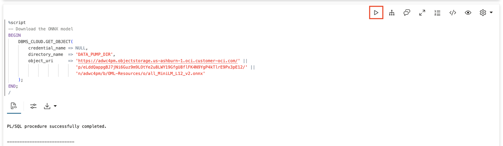

2. Load it into the database.

    This loads the ONNX model into the database so we can use it in SQL. Once loaded, we can call `VECTOR_EMBEDDING()` in any query to convert text to vectors.

    > This command is already in your notebook -- just click the play button (▶) to run it.

    ```sql
    <copy>
    BEGIN
        DBMS_VECTOR.DROP_ONNX_MODEL(model_name => 'ALL_MINILM_L12_V2', force => true);
    EXCEPTION WHEN OTHERS THEN NULL;
    END;
    /

    BEGIN
        DBMS_VECTOR.LOAD_ONNX_MODEL(
            directory  => 'DATA_PUMP_DIR',
            file_name  => 'all_MiniLM_L12_v2.onnx',
            model_name => 'ALL_MINILM_L12_V2'
        );
    END;
    /
    </copy>
    ```

    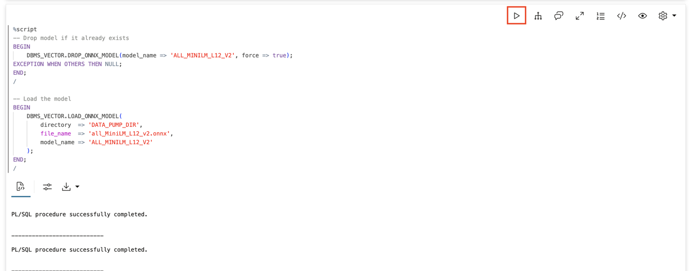

3. Verify the model is loaded.

    > This command is already in your notebook -- just click the play button (▶) to run it.

    ```sql
    <copy>
    SELECT model_name, algorithm, mining_function
    FROM user_mining_models
    WHERE model_name = 'ALL_MINILM_L12_V2';
    </copy>
    ```

    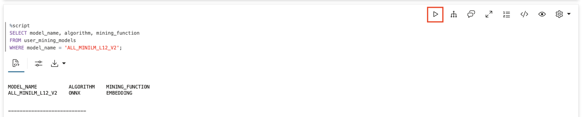

## Task 3: Create the Memory Infrastructure

Create tables that will hold Big Star Collectibles' agent memory. The key difference from earlier labs is the VECTOR column - this stores the mathematical representation of what each memory means.

1. Create the memory table with a vector column.

    The `embedding` column with type `VECTOR(384)` stores 384 numbers that capture the meaning of each memory. Two memories with similar meanings will have similar vectors, even if they use different words.

    > This command is already in your notebook -- just click the play button (▶) to run it.

    ```sql
    <copy>
    -- Main memory table with vector embeddings
    CREATE TABLE bigstars_memory (
        memory_id      RAW(16) DEFAULT SYS_GUID() PRIMARY KEY,
        memory_type    VARCHAR2(20) NOT NULL,
        entity_id      VARCHAR2(100),
        content        JSON NOT NULL,
        embedding      VECTOR(384),
        created_at     TIMESTAMP DEFAULT SYSTIMESTAMP,
        CONSTRAINT chk_mem_type CHECK (memory_type IN ('FACT', 'DECISION', 'CONTEXT'))
    );

    -- Item policies table (reference knowledge)
    CREATE TABLE bigstars_policies (
        policy_id    RAW(16) DEFAULT SYS_GUID() PRIMARY KEY,
        policy_type  VARCHAR2(50) NOT NULL,
        policy_name  VARCHAR2(200) NOT NULL,
        content      JSON NOT NULL,
        is_active    NUMBER(1) DEFAULT 1
    );

    -- Indexes
    CREATE INDEX idx_bigstars_mem_type ON bigstars_memory(memory_type);
    CREATE INDEX idx_bigstars_mem_entity ON bigstars_memory(entity_id);
    CREATE INDEX idx_bigstars_policy_type ON bigstars_policies(policy_type);
    </copy>
    ```

    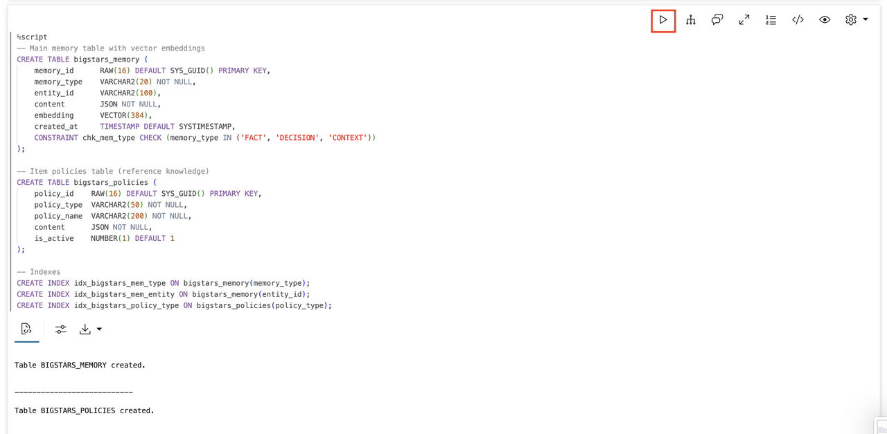

2. Create a vector index for fast similarity search.

    The index uses "cosine distance" which measures how similar two vectors are based on their direction, not their size. A 95% accuracy target means the index is optimized for speed while staying very accurate.

    > This command is already in your notebook -- just click the play button (▶) to run it.

    ```sql
    <copy>
    CREATE VECTOR INDEX idx_memory_vector ON bigstars_memory(embedding)
    ORGANIZATION NEIGHBOR PARTITIONS
    DISTANCE COSINE
    WITH TARGET ACCURACY 95;
    </copy>
    ```

    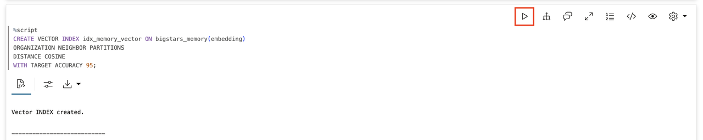

## Task 4: Populate Big Star Collectibles Item Policies

Add Big Star Collectibles' item policies. These are the corporate rules the agent must follow when processing item submissions.

> This command is already in your notebook -- just click the play button (▶) to run it.

```sql
<copy>
INSERT INTO bigstars_policies (policy_type, policy_name, content) VALUES (
    'rate_policy',
    'Personal Item - Preferred Rate',
    '{"description": "Preferred customers with credit score 750+ qualify for personal items at 7.9% APR. Maximum item amount $100,000. No origination fee. Same-day approval for items under $50,000.",
      "credit_min": 750, "apr": 7.9, "max_amount": 100000}'
);

INSERT INTO bigstars_policies (policy_type, policy_name, content) VALUES (
    'rate_policy',
    'Personal Item - Standard Rate',
    '{"description": "Standard customers with credit score 650-749 qualify for personal items at 12.9% APR. Maximum item amount $50,000. 2% origination fee applies.",
      "credit_min": 650, "credit_max": 749, "apr": 12.9, "max_amount": 50000}'
);

INSERT INTO bigstars_policies (policy_type, policy_name, content) VALUES (
    'rate_policy',
    'Business Item - Preferred',
    '{"description": "Established businesses (3+ years) with strong financials qualify for business items at 8.5% APR. Maximum $500,000. Requires 2 years tax returns and business plan.",
      "business_years_min": 3, "apr": 8.5, "max_amount": 500000}'
);

INSERT INTO bigstars_policies (policy_type, policy_name, content) VALUES (
    'escalation_policy',
    'Risk Escalation Guidelines',
    '{"description": "Escalation rules: 1) DTI above 35% requires underwriter review, 2) Credit below 650 requires senior underwriter, 3) Items above $250K require committee approval, 4) Any exception to policy requires manager sign-off."}'
);

INSERT INTO bigstars_policies (policy_type, policy_name, content) VALUES (
    'exception_policy',
    'Rate Exception Authority',
    '{"description": "Rate exceptions may be granted for: 1) Long-term clients (5+ years) - up to 15% discount, 2) Multi-product relationships - up to 10% discount, 3) Strategic accounts - case by case with VP approval. All exceptions must be documented."}'
);

COMMIT;
</copy>
```

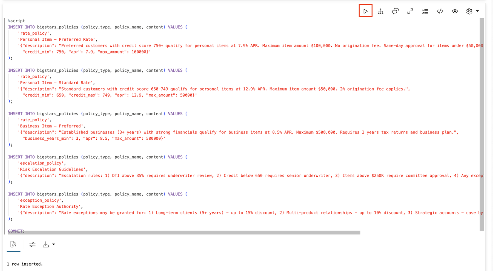

## Task 5: Create Memory Functions with Semantic Search

Create the core memory functions. The key difference from earlier labs: `find_similar_decisions` uses vector similarity search to find relevant past decisions by meaning, not just keywords.

1. Create functions to store and recall client facts.

    > This command is already in your notebook -- just click the play button (▶) to run it.

    ```sql
    <copy>
    -- Remember a fact about a client (with semantic embedding)
    CREATE OR REPLACE FUNCTION remember_client_fact(
        p_client      VARCHAR2,
        p_fact        VARCHAR2,
        p_category    VARCHAR2 DEFAULT 'general'
    ) RETURN VARCHAR2 AS
        PRAGMA AUTONOMOUS_TRANSACTION;
    BEGIN
        INSERT INTO bigstars_memory (memory_type, entity_id, content, embedding)
        VALUES (
            'FACT',
            UPPER(p_client),
            JSON_OBJECT(
                'fact' VALUE p_fact,
                'category' VALUE p_category,
                'learned' VALUE TO_CHAR(SYSTIMESTAMP, 'YYYY-MM-DD HH24:MI:SS')
            ),
            VECTOR_EMBEDDING(ALL_MINILM_L12_V2 USING p_fact AS DATA)
        );
        COMMIT;
        RETURN 'Remembered about ' || p_client || ': ' || p_fact;
    END;
    /

    -- Recall everything about a client
    CREATE OR REPLACE FUNCTION recall_client_info(
        p_client VARCHAR2
    ) RETURN CLOB AS
        v_result CLOB := '';
        v_count NUMBER := 0;
    BEGIN
        FOR rec IN (
            SELECT
                JSON_VALUE(content, '$.fact') as fact,
                JSON_VALUE(content, '$.category') as category,
                TO_CHAR(created_at, 'YYYY-MM-DD') as learned_date
            FROM bigstars_memory
            WHERE memory_type = 'FACT'
            AND UPPER(entity_id) = UPPER(p_client)
            ORDER BY created_at DESC
        ) LOOP
            v_result := v_result || '- ' || rec.fact || ' [' || rec.category || ', learned ' || rec.learned_date || ']' || CHR(10);
            v_count := v_count + 1;
        END LOOP;

        IF v_count = 0 THEN
            RETURN 'No information found about client ' || p_client || '. This may be a new client.';
        END IF;
        RETURN 'Found ' || v_count || ' facts about ' || p_client || ':' || CHR(10) || v_result;
    END;
    /
    </copy>
    ```

    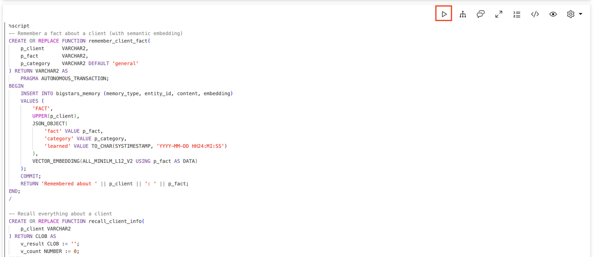

    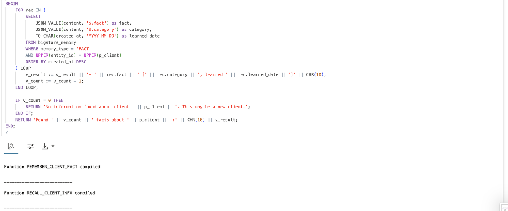

2. Create functions to record and find item decisions with semantic search.

    This is where the magic happens. When we store a decision, we embed the situation description. When we search, we find decisions with similar meaning - even if the words are different.

    > This command is already in your notebook -- just click the play button (▶) to run it.

    ```sql
    <copy>
    -- Record a item decision (with semantic embedding)
    CREATE OR REPLACE FUNCTION record_item_decision(
        p_client      VARCHAR2,
        p_situation   VARCHAR2,
        p_decision    VARCHAR2,
        p_outcome     VARCHAR2 DEFAULT NULL
    ) RETURN VARCHAR2 AS
        PRAGMA AUTONOMOUS_TRANSACTION;
        v_search_text VARCHAR2(2000);
    BEGIN
        v_search_text := p_situation || ' ' || p_decision || ' ' || NVL(p_outcome, '');

        INSERT INTO bigstars_memory (memory_type, entity_id, content, embedding)
        VALUES (
            'DECISION',
            UPPER(p_client),
            JSON_OBJECT(
                'situation' VALUE p_situation,
                'decision' VALUE p_decision,
                'outcome' VALUE NVL(p_outcome, 'Pending'),
                'recorded' VALUE TO_CHAR(SYSTIMESTAMP, 'YYYY-MM-DD HH24:MI:SS')
            ),
            VECTOR_EMBEDDING(ALL_MINILM_L12_V2 USING v_search_text AS DATA)
        );
        COMMIT;
        RETURN 'Decision recorded for ' || p_client || ': ' || p_decision;
    END;
    /

    -- Find similar past decisions using SEMANTIC SEARCH
    CREATE OR REPLACE FUNCTION find_similar_decisions(
        p_situation VARCHAR2,
        p_limit     NUMBER DEFAULT 3
    ) RETURN CLOB AS
        v_result CLOB := '';
        v_count NUMBER := 0;
    BEGIN
        FOR rec IN (
            SELECT
                entity_id as client,
                JSON_VALUE(content, '$.situation') as situation,
                JSON_VALUE(content, '$.decision') as decision,
                JSON_VALUE(content, '$.outcome') as outcome,
                ROUND(1 - VECTOR_DISTANCE(
                    embedding,
                    VECTOR_EMBEDDING(ALL_MINILM_L12_V2 USING p_situation AS DATA),
                    COSINE
                ), 3) as relevance
            FROM bigstars_memory
            WHERE memory_type = 'DECISION'
            AND embedding IS NOT NULL
            ORDER BY VECTOR_DISTANCE(
                embedding,
                VECTOR_EMBEDDING(ALL_MINILM_L12_V2 USING p_situation AS DATA),
                COSINE
            )
            FETCH FIRST p_limit ROWS ONLY
        ) LOOP
            v_result := v_result ||
                'Client: ' || rec.client || CHR(10) ||
                'Situation: ' || rec.situation || CHR(10) ||
                'Decision: ' || rec.decision || CHR(10) ||
                'Outcome: ' || rec.outcome || CHR(10) ||
                'Relevance: ' || (rec.relevance * 100) || '%' || CHR(10) || '---' || CHR(10);
            v_count := v_count + 1;
        END LOOP;

        IF v_count = 0 THEN
            RETURN 'No similar past decisions found. This appears to be a new type of situation.';
        END IF;
        RETURN 'Found ' || v_count || ' similar past decisions:' || CHR(10) || v_result;
    END;
    /
    </copy>
    ```

    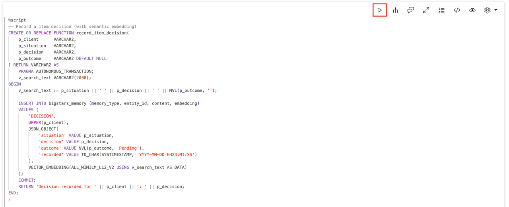

    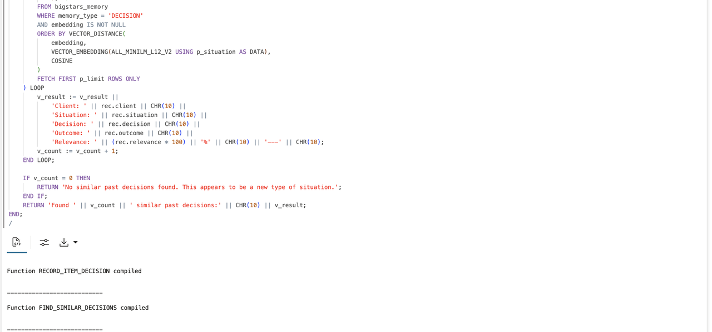

3. Create a function to look up item policies.

    > This command is already in your notebook -- just click the play button (▶) to run it.

    ```sql
    <copy>
    -- Look up item policies
    CREATE OR REPLACE FUNCTION lookup_policy(
        p_policy_type VARCHAR2 DEFAULT NULL,
        p_search      VARCHAR2 DEFAULT NULL
    ) RETURN CLOB AS
        v_result CLOB := '';
        v_count NUMBER := 0;
    BEGIN
        FOR rec IN (
            SELECT
                policy_type,
                policy_name,
                JSON_VALUE(content, '$.description') as description
            FROM bigstars_policies
            WHERE is_active = 1
            AND (p_policy_type IS NULL OR UPPER(policy_type) LIKE '%' || UPPER(p_policy_type) || '%')
            AND (p_search IS NULL OR UPPER(policy_name) LIKE '%' || UPPER(p_search) || '%'
                 OR UPPER(JSON_VALUE(content, '$.description')) LIKE '%' || UPPER(p_search) || '%')
            ORDER BY policy_type, policy_name
        ) LOOP
            v_result := v_result || '[' || rec.policy_type || '] ' || rec.policy_name || ':' || CHR(10) ||
                       rec.description || CHR(10) || CHR(10);
            v_count := v_count + 1;
        END LOOP;

        IF v_count = 0 THEN
            RETURN 'No matching policies found.';
        END IF;
        RETURN 'Found ' || v_count || ' policies:' || CHR(10) || v_result;
    END;
    /
    </copy>
    ```

    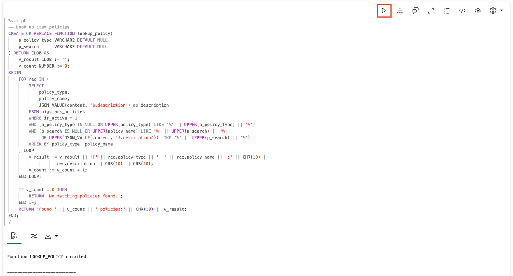

## Task 6: Register the Memory Tools

Register all five functions as agent tools. The instructions tell the agent when to use each tool.

> This command is already in your notebook -- just click the play button (▶) to run it.

```sql
<copy>
BEGIN
    DBMS_CLOUD_AI_AGENT.CREATE_TOOL(
        tool_name   => 'REMEMBER_CLIENT_TOOL',
        attributes  => '{"instruction": "Store a fact about a Big Star Collectibles client for future reference. Parameters: P_CLIENT (client name), P_FACT (information to remember), P_CATEGORY (optional: contact_preference, rate_exception, relationship, requirement, behavior). Use when inventory specialists share important client information.",
                        "function": "remember_client_fact"}',
        description => 'Stores facts about clients in long-term memory with semantic embeddings'
    );
END;
/

BEGIN
    DBMS_CLOUD_AI_AGENT.CREATE_TOOL(
        tool_name   => 'RECALL_CLIENT_TOOL',
        attributes  => '{"instruction": "Retrieve everything known about a Big Star Collectibles client. Parameter: P_CLIENT (client name to search). Use this FIRST when asked about any client to check what you already know.",
                        "function": "recall_client_info"}',
        description => 'Retrieves all stored facts about a client'
    );
END;
/

BEGIN
    DBMS_CLOUD_AI_AGENT.CREATE_TOOL(
        tool_name   => 'RECORD_DECISION_TOOL',
        attributes  => '{"instruction": "Record a item decision for audit trail. Parameters: P_CLIENT (client name), P_SITUATION (what was the request/situation), P_DECISION (what was decided), P_OUTCOME (optional: what happened as a result). Use after making or discussing significant item decisions.",
                        "function": "record_item_decision"}',
        description => 'Records item decisions for audit and learning with semantic embeddings'
    );
END;
/

BEGIN
    DBMS_CLOUD_AI_AGENT.CREATE_TOOL(
        tool_name   => 'FIND_DECISIONS_TOOL',
        attributes  => '{"instruction": "Search for similar past item decisions using semantic search. Parameter: P_SITUATION (describe the situation - the search finds similar meanings, not just keywords). Use when facing a decision to learn from past experience.",
                        "function": "find_similar_decisions"}',
        description => 'Finds similar past decisions using semantic vector search'
    );
END;
/

BEGIN
    DBMS_CLOUD_AI_AGENT.CREATE_TOOL(
        tool_name   => 'POLICY_LOOKUP_TOOL',
        attributes  => '{"instruction": "Look up Big Star Collectibles item policies. Parameters: P_POLICY_TYPE (optional: rate_policy, escalation_policy, exception_policy), P_SEARCH (optional: search term). Use when you need to know company lending policy or rates.",
                        "function": "lookup_policy"}',
        description => 'Retrieves Big Star Collectibles item policies and guidelines'
    );
END;
/
</copy>
```

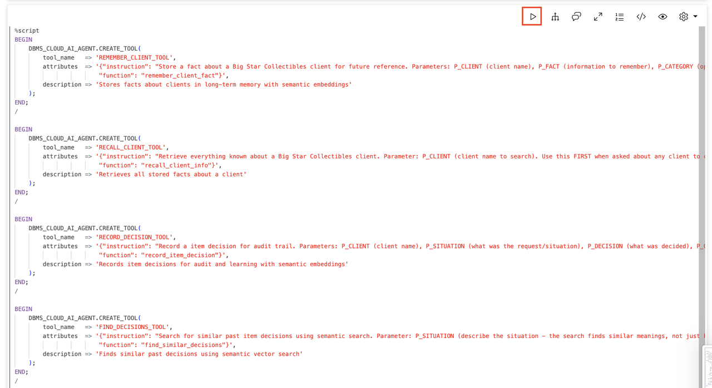

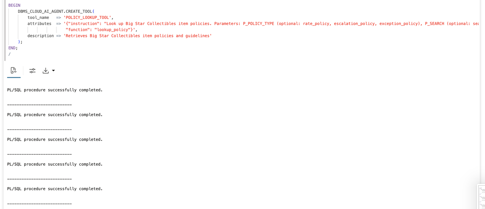

## Task 7: Create the Memory-Enabled Agent

Create an agent with access to all memory tools. The role instructions tell the agent to use its memory proactively.

> This command is already in your notebook -- just click the play button (▶) to run it.

```sql
<copy>
BEGIN
    DBMS_CLOUD_AI_AGENT.CREATE_AGENT(
        agent_name  => 'bigstarS_MEMORY_AGENT',
        attributes  => '{"profile_name": "genai",
                        "role": "You are a inventory specialist assistant for Big Star Collectibles with full memory capabilities. ALWAYS check your memory first when asked about a client (use RECALL_CLIENT_TOOL). When inventory specialists share client information, store it (use REMEMBER_CLIENT_TOOL). When making item decisions, check policy (POLICY_LOOKUP_TOOL) and past decisions (FIND_DECISIONS_TOOL). Record important decisions (RECORD_DECISION_TOOL). Never guess about client information - always check your memory and tools."}',
        description => 'Memory-enabled inventory specialist assistant with semantic search'
    );
END;
/

BEGIN
    DBMS_CLOUD_AI_AGENT.CREATE_TASK(
        task_name   => 'bigstarS_MEMORY_TASK',
        attributes  => '{"instruction": "Process this inventory specialist request using your memory tools. When asked about a client, FIRST use RECALL_CLIENT_TOOL. When given client information, use REMEMBER_CLIENT_TOOL. When asked about policies or rates, use POLICY_LOOKUP_TOOL. For decision guidance, use FIND_DECISIONS_TOOL (it uses semantic search to find similar situations even with different wording). Record decisions with RECORD_DECISION_TOOL. Do not ask clarifying questions - use your tools. User request: {query}",
                        "tools": ["REMEMBER_CLIENT_TOOL", "RECALL_CLIENT_TOOL", "RECORD_DECISION_TOOL", "FIND_DECISIONS_TOOL", "POLICY_LOOKUP_TOOL"]}',
        description => 'Task with full memory capabilities and semantic search'
    );
END;
/

BEGIN
    DBMS_CLOUD_AI_AGENT.CREATE_TEAM(
        team_name   => 'bigstarS_MEMORY_TEAM',
        attributes  => '{"agents": [{"name": "bigstarS_MEMORY_AGENT", "task": "bigstarS_MEMORY_TASK"}],
                        "process": "sequential"}',
        description => 'Memory-enabled item processing team'
    );
END;
/
</copy>
```

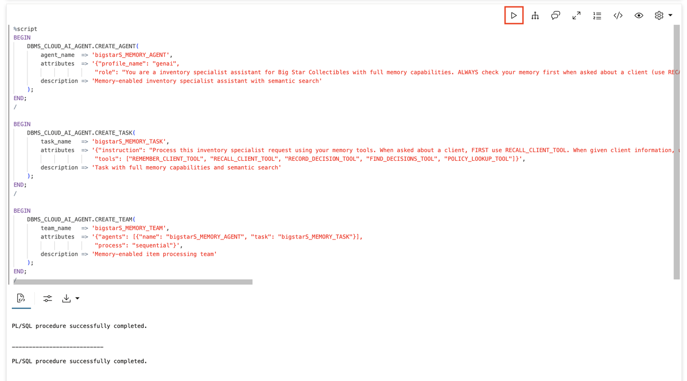

## Task 8: Seed Historical Decisions for Learning

Add historical item decisions that the agent can learn from. Notice we're using varied wording - "seasonal cash flow," "cyclical revenue," "variable income" - to test semantic search.

> This command is already in your notebook -- just click the play button (▶) to run it.

```sql
<copy>
-- Decision about seasonal business cash flow
INSERT INTO bigstars_memory (memory_type, entity_id, content, embedding) VALUES (
    'DECISION', 'HARVEST FARMS',
    '{"situation": "Agricultural client with seasonal cash flow requested business item with flexible payment schedule",
      "decision": "Approved item with quarterly payments aligned to harvest cycles instead of monthly",
      "outcome": "Client paid on time, renewed for larger amount next season",
      "recorded": "2024-06-15"}',
    VECTOR_EMBEDDING(ALL_MINILM_L12_V2 USING
        'Agricultural client with seasonal cash flow requested business item with flexible payment schedule. Approved item with quarterly payments aligned to harvest cycles instead of monthly. Client paid on time, renewed for larger amount next season.' AS DATA)
);

-- Decision about rate exception for long-term client
INSERT INTO bigstars_memory (memory_type, entity_id, content, embedding) VALUES (
    'DECISION', 'GLOBALCO',
    '{"situation": "Long-term client requested rate exception for expansion item",
      "decision": "Approved 12% rate discount based on 7-year relationship and $2M in previous items",
      "outcome": "Client expanded successfully, referred two new business clients",
      "recorded": "2024-08-20"}',
    VECTOR_EMBEDDING(ALL_MINILM_L12_V2 USING
        'Long-term client requested rate exception for expansion item. Approved 12% rate discount based on 7-year relationship and $2M in previous items. Client expanded successfully, referred two new business clients.' AS DATA)
);

-- Decision about new client wanting exception (what NOT to do)
INSERT INTO bigstars_memory (memory_type, entity_id, content, embedding) VALUES (
    'DECISION', 'NEWSTART INC',
    '{"situation": "New business client requested rate exception without established relationship",
      "decision": "Denied exception request outright citing policy",
      "outcome": "Client went to competitor, later became successful business we lost",
      "recorded": "2024-04-10"}',
    VECTOR_EMBEDDING(ALL_MINILM_L12_V2 USING
        'New business client requested rate exception without established relationship. Denied exception request outright citing policy. Client went to competitor, later became successful business we lost.' AS DATA)
);

-- Better approach for new client wanting exception
INSERT INTO bigstars_memory (memory_type, entity_id, content, embedding) VALUES (
    'DECISION', 'TECHSTART LLC',
    '{"situation": "New business client requested rate exception without established relationship",
      "decision": "Offered standard rate with commitment to review for exception after 12 months of on-time payments",
      "outcome": "Client accepted, became loyal customer, now qualifies for preferred rates",
      "recorded": "2024-05-22"}',
    VECTOR_EMBEDDING(ALL_MINILM_L12_V2 USING
        'New business client requested rate exception without established relationship. Offered standard rate with commitment to review for exception after 12 months of on-time payments. Client accepted, became loyal customer, now qualifies for preferred rates.' AS DATA)
);

-- Decision about client with variable income
INSERT INTO bigstars_memory (memory_type, entity_id, content, embedding) VALUES (
    'DECISION', 'CONSULTING PARTNERS',
    '{"situation": "Consulting firm with cyclical revenue patterns needed item for equipment",
      "decision": "Structured item with variable payments tied to quarterly revenue, higher in Q4, lower in Q1",
      "outcome": "Client appreciated flexibility, maintained perfect payment record",
      "recorded": "2024-07-15"}',
    VECTOR_EMBEDDING(ALL_MINILM_L12_V2 USING
        'Consulting firm with cyclical revenue patterns needed item for equipment. Structured item with variable payments tied to quarterly revenue, higher in Q4, lower in Q1. Client appreciated flexibility, maintained perfect payment record.' AS DATA)
);

COMMIT;
</copy>
```

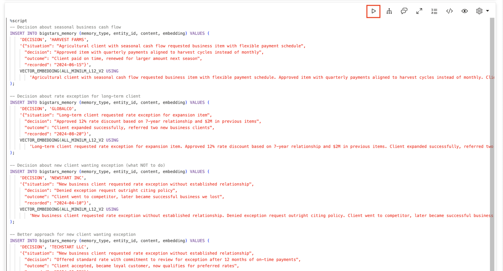

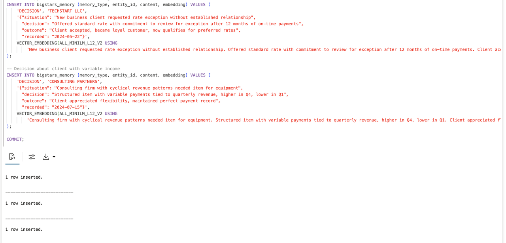

## Task 9: Test Semantic Search

Now test finding relevant decisions by meaning, not keywords. This is where the magic happens - we'll search using different words than what we stored.

1. Search for "irregular income patterns" (finds "seasonal cash flow" and "cyclical revenue").

    > This command is already in your notebook -- just click the play button (▶) to run it.

    ```sql
    <copy>
    SELECT find_similar_decisions('client has irregular income patterns throughout the year') FROM DUAL;
    </copy>
    ```

    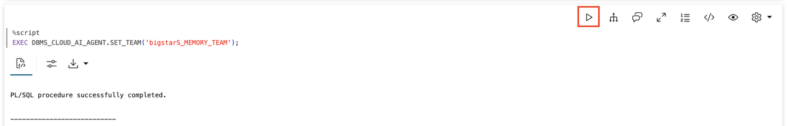

    **Observe:** Finds Harvest Farms ("seasonal cash flow") and Consulting Partners ("cyclical revenue") even though we said "irregular income patterns."

2. Search for "discount request from new customer."

    > This command is already in your notebook -- just click the play button (▶) to run it.

    ```sql
    <copy>
    SELECT find_similar_decisions('new customer asking for a discount on their first item') FROM DUAL;
    </copy>
    ```

    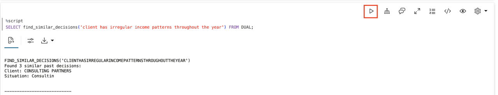

    **Observe:** Finds BOTH the failed approach (NewStart - denied outright) and the successful approach (TechStart - offered path to exception). The agent learns from both!

3. Activate the team and set your session.

    > This command is already in your notebook -- just click the play button (▶) to run it.

    ```sql
    <copy>
    EXEC DBMS_CLOUD_AI_AGENT.SET_TEAM('bigstarS_MEMORY_TEAM');
    </copy>
    ```

    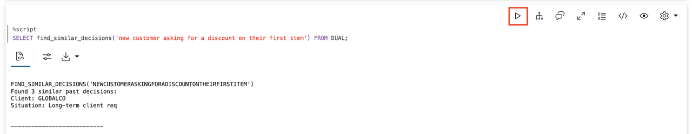

## Task 10: See the Full Learning Loop

Now use the agent to demonstrate the complete learning loop.

1. Teach the agent about a client.

    > This command is already in your notebook -- just click the play button (▶) to run it.

    ```sql
    <copy>
    SELECT AI AGENT Acme Industries is one of our best clients. They prefer email contact through their CFO Sarah Chen. They have been with Big Star Collectibles since 2019 and were approved for a 15% rate exception due to their excellent payment history on 4 previous items. Please remember all of this;
    </copy>
    ```

    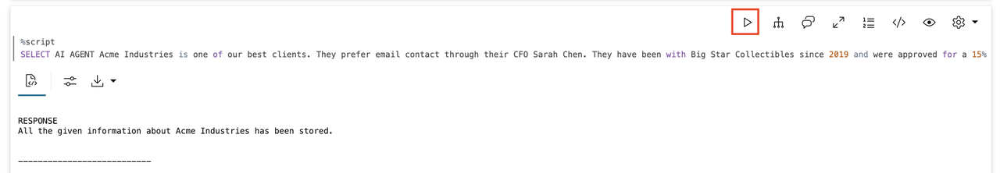

2. Ask the agent to recall what it knows.

    > This command is already in your notebook -- just click the play button (▶) to run it.

    ```sql
    <copy>
    SELECT AI AGENT What do you know about Acme Industries;
    </copy>
    ```

    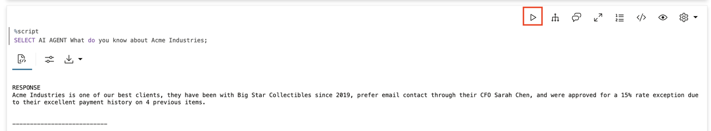

3. Ask for guidance on a new situation.

    > This command is already in your notebook -- just click the play button (▶) to run it.

    ```sql
    <copy>
    SELECT AI AGENT A landscaping company has unpredictable revenue - busy in spring and summer, slow in winter. They want a business item. What have we done in similar situations;
    </copy>
    ```

    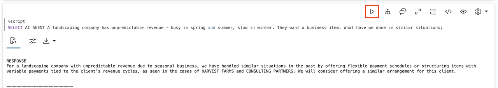

    **Observe:** The semantic search finds Harvest Farms (seasonal) and Consulting Partners (cyclical) even though we said "unpredictable revenue" and "landscaping."

4. Record a new decision.

    > This command is already in your notebook -- just click the play button (▶) to run it.

    ```sql
    <copy>
    SELECT AI AGENT We just approved a $150K equipment item for GreenScape Landscaping with seasonal payment schedule - higher payments April through October, reduced payments November through March. Record this decision;
    </copy>
    ```

    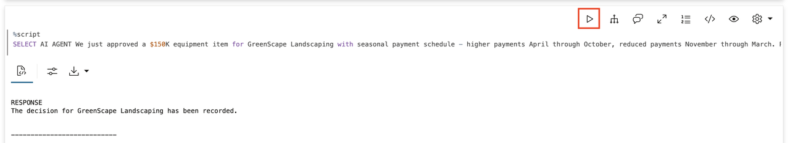

## Task 11: Test Memory Persistence

Clear the session and verify memory persists.

1. Clear and reset the session.

    > This command is already in your notebook -- just click the play button (▶) to run it.

    ```sql
    <copy>
    EXEC DBMS_CLOUD_AI_AGENT.CLEAR_TEAM;
    EXEC DBMS_CLOUD_AI_AGENT.SET_TEAM('bigstarS_MEMORY_TEAM');
    </copy>
    ```

    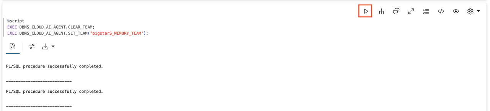

2. Ask about Acme Industries in the "new" session.

    > This command is already in your notebook -- just click the play button (▶) to run it.

    ```sql
    <copy>
    SELECT AI AGENT What do you know about Acme Industries and their rate arrangements;
    </copy>
    ```

    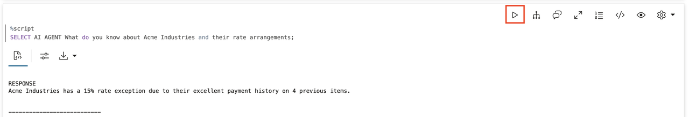

    **Observe:** The agent still knows! Because facts are stored in the database with embeddings, they persist across sessions.

3. Search for seasonal payment decisions (now includes GreenScape).

    > This command is already in your notebook -- just click the play button (▶) to run it.

    ```sql
    <copy>
    SELECT find_similar_decisions('business with seasonal revenue needs flexible payments') FROM DUAL;
    </copy>
    ```

    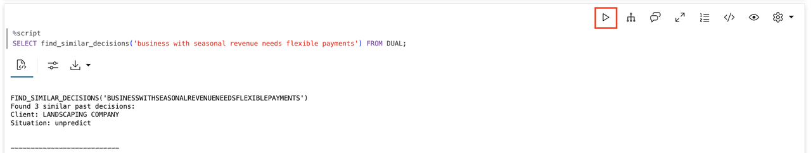

    **Observe:** Now finds THREE relevant decisions: Harvest Farms, Consulting Partners, AND the new GreenScape decision you just recorded. The agent is learning!

## Task 12: Examine the Memory Core

Look at what's stored in the memory tables.

1. Query the tool execution history.

    > This command is already in your notebook -- just click the play button (▶) to run it.

    ```sql
    <copy>
    SELECT
        tool_name,
        TO_CHAR(start_date, 'HH24:MI:SS') as called_at,
        SUBSTR(output, 1, 80) as result_preview
    FROM USER_AI_AGENT_TOOL_HISTORY
    ORDER BY start_date DESC
    FETCH FIRST 15 ROWS ONLY;
    </copy>
    ```

    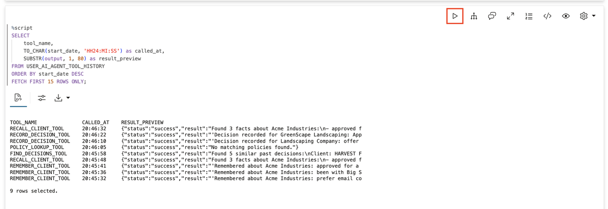

2. Examine the memory table contents.

    > This command is already in your notebook -- just click the play button (▶) to run it.

    ```sql
    <copy>
    SELECT
        memory_type,
        entity_id,
        JSON_VALUE(content, '$.situation') as situation,
        CASE WHEN embedding IS NOT NULL THEN 'Yes' ELSE 'No' END as has_embedding,
        TO_CHAR(created_at, 'YYYY-MM-DD HH24:MI') as created
    FROM bigstars_memory
    WHERE memory_type = 'DECISION'
    ORDER BY created_at DESC;
    </copy>
    ```

    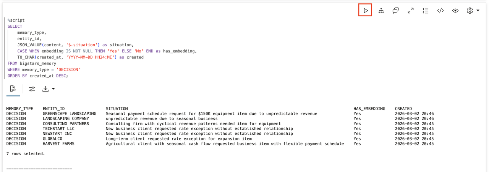

## Summary

In this lab, you built the learning loop with semantic search:

* **Loaded an ONNX embedding model** directly into the database
* **Added VECTOR columns** to store semantic meaning alongside facts
* **Built semantic search** that finds "seasonal cash flow" when you search "irregular income"
* **Created a memory-enabled agent** with five tools
* **Tested memory persistence** across session boundaries
* **Watched the agent learn** as new decisions were recorded

**Key takeaway:** This is how agents improve. Not magically, but systematically. Decision -> outcome -> memory -> better future decisions. The semantic search ensures relevant past experience is found even when described differently. The AI database powers it all.

## Cleanup (Optional)

> This command is already in your notebook -- just click the play button (▶) to run it.

```sql
<copy>
EXEC DBMS_CLOUD_AI_AGENT.DROP_TEAM('bigstarS_MEMORY_TEAM', TRUE);
EXEC DBMS_CLOUD_AI_AGENT.DROP_TASK('bigstarS_MEMORY_TASK', TRUE);
EXEC DBMS_CLOUD_AI_AGENT.DROP_AGENT('bigstarS_MEMORY_AGENT', TRUE);
EXEC DBMS_CLOUD_AI_AGENT.DROP_TOOL('REMEMBER_CLIENT_TOOL', TRUE);
EXEC DBMS_CLOUD_AI_AGENT.DROP_TOOL('RECALL_CLIENT_TOOL', TRUE);
EXEC DBMS_CLOUD_AI_AGENT.DROP_TOOL('RECORD_DECISION_TOOL', TRUE);
EXEC DBMS_CLOUD_AI_AGENT.DROP_TOOL('FIND_DECISIONS_TOOL', TRUE);
EXEC DBMS_CLOUD_AI_AGENT.DROP_TOOL('POLICY_LOOKUP_TOOL', TRUE);
DROP TABLE bigstars_memory PURGE;
DROP TABLE bigstars_policies PURGE;
DROP FUNCTION remember_client_fact;
DROP FUNCTION recall_client_info;
DROP FUNCTION record_item_decision;
DROP FUNCTION find_similar_decisions;
DROP FUNCTION lookup_policy;

-- Drop the ONNX model
BEGIN
    DBMS_VECTOR.DROP_ONNX_MODEL(model_name => 'ALL_MINILM_L12_V2', force => true);
EXCEPTION WHEN OTHERS THEN NULL;
END;
/
</copy>
```

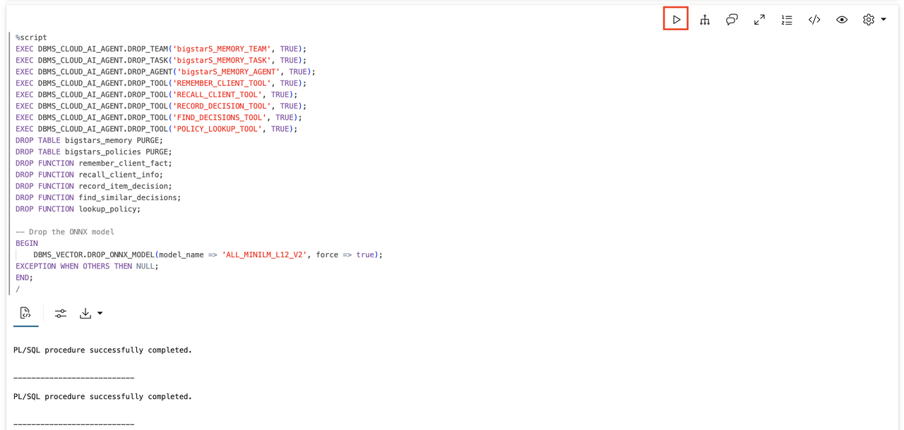

## Learn More

* [AI Vector Search Guide](https://docs.oracle.com/en/database/oracle/oracle-database/23/vecse/)
* [`DBMS_CLOUD_AI_AGENT` Package](https://docs.oracle.com/en/cloud/paas/autonomous-database/serverless/adbsb/dbms-cloud-ai-agent-package.html)

## Acknowledgements

* **Author** - David Start
* **Last Updated By/Date** - Kay Malcolm, February 2026
