# Tools, Safety, and Human Control

## Introduction

In this capstone lab, you'll build a complete agent system with tools that act, rules that constrain, and human oversight that keeps people in control.

### The Business Problem

Big Star Collectibles' compliance team has a recurring nightmare: What if someone submits AND approves their own item? Their current systems don't enforce separation of duties - it's just policy that people are "supposed to follow."

> *"We're one mistake away from a regulatory finding. And we have no idea what our AI assistants are actually doing. When a regulator asks 'why was this item approved?', nobody can answer."*
>
> Rachel, Compliance Director

The company needs agents that:
- **Enforce role separation** - Item officers can submit but NOT approve
- **Automate routine decisions** - Low-risk items shouldn't need human review
- **Require human judgment** - High-value or complex items need appraisers
- **Log everything** - Complete audit trail for compliance

### What You'll Learn

In this capstone lab, you'll build a two-agent item appraisal system:

| Agent | Role | Can Do | Cannot Do |
|-------|------|--------|-----------|
| **ITEM_AGENT** | Item Officers | Submit applications | Approve/Deny |
| **APPRAISAL_AGENT** | Appraisers | Approve/Deny | Submit applications |

The separation isn't just policy - it's architecture. ITEM_AGENT literally doesn't have approval tools.

You'll also implement risk-based routing:
- **Credit < 550** -> BLOCKED (cannot proceed)
- **Collector Card < $50K** -> AUTO_APPROVE
- **$50K-$250K** -> Appraiser review required
- **$250K+ or Authenticating** -> Senior appraiser required

**What you'll build:** A compliant two-agent item appraisal system with separation of duties and full audit trail.

Estimated Time: 20 minutes

### Objectives

* Create PL/SQL functions as agent tools
* Build a safety rules system with JSON configuration
* Create separate agents for different roles
* See how agents respect rules and route work appropriately
* Query the audit trail to see all actions

### Prerequisites

For this workshop, we provide the environment. You'll need:

* Basic knowledge of SQL and PL/SQL, or the ability to follow along with the prompts

## Task 1: Import the Lab Notebook

Before you begin, you are going to import a notebook that has all of the commands for this lab into Oracle Machine Learning. This way you don't have to copy and paste them over to run them.

1. From the Oracle Machine Learning home page, click **Notebooks**.

    

2. Click **Import** to expand the Import drop down.

    

3. Select **Git**.

    

4. Paste the following GitHub URL leaving the credential field blank, then click **Import**.

    ```text
    <copy>
    https://github.com/kaymalcolm/database/blob/main/ai4u/industries/retail-bigstar/tools-safety-control/lab10-tools-safety-control.json
    </copy>
    ```

    

    You should now be on the screen with the notebook imported. This workshop will have all of the screenshots and detailed information however the notebook will have the commands and basic instructions for completing the lab.

## Task 2: Create the Database Tables

Create three tables that form the foundation of this system:

- **item_applicants**: Sample applicants who will apply for items
- **item_applications**: Where item submissions are stored with their status
- **item_routing_rules**: JSON-configured business rules the agent will follow

Notice the constraints on `item_applications` - these are your database-level safety net. Even if an agent misbehaves, the database won't accept invalid data.

1. Create the tables and insert sample applicants.

    > This command is already in your notebook -- just click the play button (▶) to run it.

    ```sql
    <copy>
    -- Sequence for application IDs
    CREATE SEQUENCE item_app_seq START WITH 1001;

    -- Applicants table
    CREATE TABLE item_applicants (
        applicant_id    VARCHAR2(20) PRIMARY KEY,
        name            VARCHAR2(100) NOT NULL,
        email           VARCHAR2(100) NOT NULL,
        credit_score    NUMBER(3) NOT NULL,
        annual_income   NUMBER(12,2),
        employment_years NUMBER(2)
    );

    -- Item applications
    CREATE TABLE item_applications (
        application_id  VARCHAR2(20) PRIMARY KEY,
        applicant_id    VARCHAR2(20) NOT NULL REFERENCES item_applicants(applicant_id),
        item_amount     NUMBER(12,2) NOT NULL
                        CONSTRAINT chk_positive_amount CHECK (item_amount > 0),
        item_type       VARCHAR2(50) NOT NULL
                        CONSTRAINT chk_item_type CHECK (item_type IN ('collector_card','limited_art','authenticating','museum_piece')),
        item_purpose    VARCHAR2(500),
        risk_status     VARCHAR2(30) DEFAULT 'PENDING_REVIEW'
                        CONSTRAINT chk_status CHECK (risk_status IN ('APPROVED','DENIED','PENDING_REVIEW','AUTO_APPROVED')),
        submitted_at    TIMESTAMP DEFAULT SYSTIMESTAMP,
        decided_by      VARCHAR2(100),
        decided_at      TIMESTAMP
    );

    -- Item routing rules
    CREATE TABLE item_routing_rules (
        rule_id      RAW(16) DEFAULT SYS_GUID() PRIMARY KEY,
        rule_name    VARCHAR2(200) NOT NULL,
        rule_type    VARCHAR2(20) NOT NULL
                     CONSTRAINT chk_rule_type CHECK (rule_type IN ('BLOCK','REQUIRE_REVIEW','AUTO_APPROVE')),
        rule_config  JSON NOT NULL,
        priority     NUMBER DEFAULT 100,
        is_active    NUMBER(1) DEFAULT 1
    );

    -- Insert sample applicants with varying credit profiles
    INSERT INTO item_applicants VALUES ('APP-001', 'Alice Johnson', 'alice@email.com', 780, 95000, 8);
    INSERT INTO item_applicants VALUES ('APP-002', 'Bob Smith', 'bob@email.com', 695, 62000, 3);
    INSERT INTO item_applicants VALUES ('APP-003', 'Carol Davis', 'carol@email.com', 520, 45000, 1);
    INSERT INTO item_applicants VALUES ('APP-004', 'David Chen', 'david@email.com', 725, 120000, 12);

    COMMIT;
    </copy>
    ```

    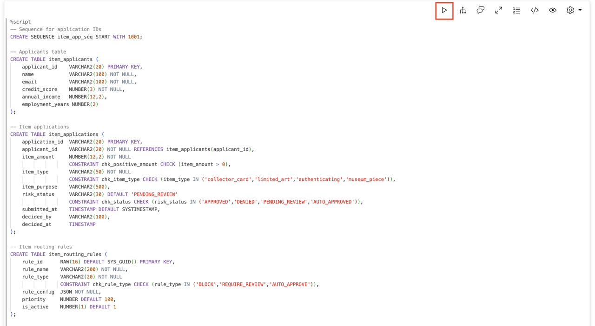

    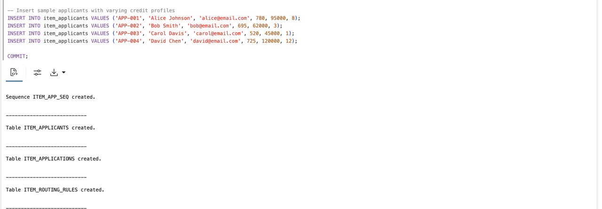

## Task 3: Define Big Star Collectibles' Item Routing Rules

Insert the business rules that control what happens to each item submission. These rules are stored as JSON, making them easy to modify without changing code.

The rules are evaluated in priority order (lowest number first):
*. **Block** applications with credit score below 550 - too high risk for automated processing
*. **Require review** for items $50,000 or more - significant exposure needs human judgment
*. **Require review** for any authenticating - complex product requires appraiser
*. **Require review** for credit scores 550-650 - borderline creditworthiness
*. **Auto-approve** everything else - low-risk collector_card/limited_art items with good credit

This priority order matters! A $30K collector_card item with a 600 credit score hits rule 4 before rule 5.

1. Insert the routing rules.

    > This command is already in your notebook -- just click the play button (▶) to run it.

    ```sql
    <copy>
    -- Block very low credit scores (<550)
    INSERT INTO item_routing_rules (rule_name, rule_type, rule_config, priority) VALUES (
        'Block High Risk - Low Credit',
        'BLOCK',
        '{"field": "credit_score", "operator": "lt", "value": 550, "message": "Credit score below 550 does not meet Big Star Collectibles minimum requirements. Application cannot be processed."}',
        10
    );

    -- Require review for large items (>=$50,000)
    INSERT INTO item_routing_rules (rule_name, rule_type, rule_config, priority) VALUES (
        'Large Item Review',
        'REQUIRE_REVIEW',
        '{"field": "item_amount", "operator": "gte", "value": 50000, "message": "Items $50,000 and above require appraiser review."}',
        20
    );

    -- Require review for all authenticatings (any amount)
    INSERT INTO item_routing_rules (rule_name, rule_type, rule_config, priority) VALUES (
        'Authenticating Review',
        'REQUIRE_REVIEW',
        '{"field": "item_type", "operator": "eq", "value": "authenticating", "message": "All authenticating applications require appraiser review."}',
        30
    );

    -- Require review for borderline credit (550-650)
    INSERT INTO item_routing_rules (rule_name, rule_type, rule_config, priority) VALUES (
        'Borderline Credit Review',
        'REQUIRE_REVIEW',
        '{"field": "credit_score", "operator": "between", "low": 550, "high": 650, "message": "Credit scores 550-650 require appraiser review."}',
        40
    );

    -- Auto-approve everything else (good credit, small items, non-authenticating)
    INSERT INTO item_routing_rules (rule_name, rule_type, rule_config, priority) VALUES (
        'Limited Art-approve Standard',
        'AUTO_APPROVE',
        '{"field": "item_amount", "operator": "lt", "value": 50000, "message": "Collector Card and limited_art items under $50,000 with good credit are limited_art-approved."}',
        100
    );

    COMMIT;
    </copy>
    ```

    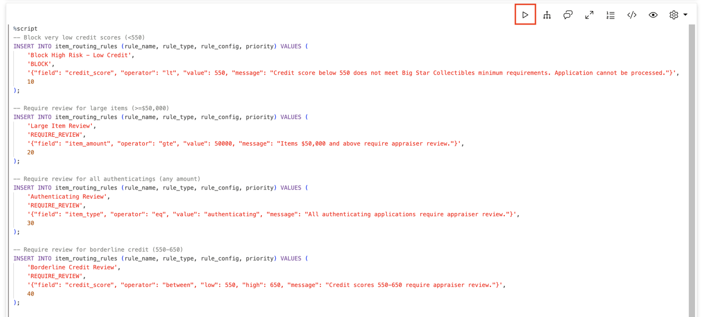

    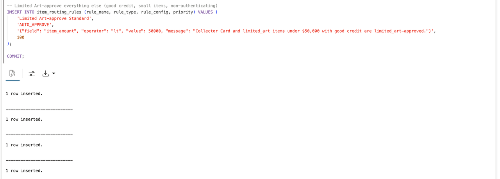

## Task 4: Create the Rules Checker Function

This function is the brain of Big Star Collectibles' automated appraisal. It evaluates each application against the rules in priority order and returns the first matching rule.

The function returns a JSON object telling the caller:
- **action**: What to do: BLOCK, REQUIRE_REVIEW, or AUTO_APPROVE
- **rule**: Which rule matched
- **message**: Human-readable explanation

1. Create the rules checker function.

    > This command is already in your notebook -- just click the play button (▶) to run it.

    ```sql
    <copy>
    CREATE OR REPLACE FUNCTION check_item_routing_rules(
        p_item_amount   NUMBER,
        p_item_type     VARCHAR2,
        p_credit_score  NUMBER
    ) RETURN VARCHAR2 AS
    BEGIN
        FOR rec IN (
            SELECT rule_name, rule_type, rule_config
            FROM item_routing_rules
            WHERE is_active = 1
            ORDER BY priority
        ) LOOP
            DECLARE
                v_field    VARCHAR2(50) := JSON_VALUE(rec.rule_config, '$.field');
                v_operator VARCHAR2(10) := JSON_VALUE(rec.rule_config, '$.operator');
                v_value    VARCHAR2(100) := JSON_VALUE(rec.rule_config, '$.value');
                v_low      VARCHAR2(100) := JSON_VALUE(rec.rule_config, '$.low');
                v_high     VARCHAR2(100) := JSON_VALUE(rec.rule_config, '$.high');
                v_message  VARCHAR2(500) := JSON_VALUE(rec.rule_config, '$.message');
                v_match    BOOLEAN := FALSE;
            BEGIN
                IF v_field = 'item_amount' THEN
                    IF v_operator = 'gte' AND p_item_amount >= TO_NUMBER(v_value) THEN v_match := TRUE;
                    ELSIF v_operator = 'lt' AND p_item_amount < TO_NUMBER(v_value) THEN v_match := TRUE;
                    END IF;
                ELSIF v_field = 'item_type' THEN
                    IF v_operator = 'eq' AND LOWER(p_item_type) = LOWER(v_value) THEN v_match := TRUE;
                    END IF;
                ELSIF v_field = 'credit_score' THEN
                    IF v_operator = 'lt' AND p_credit_score < TO_NUMBER(v_value) THEN v_match := TRUE;
                    ELSIF v_operator = 'between' AND p_credit_score >= TO_NUMBER(v_low) AND p_credit_score <= TO_NUMBER(v_high) THEN v_match := TRUE;
                    END IF;
                END IF;

                IF v_match THEN
                    RETURN '{"action": "' || rec.rule_type || '", "rule": "' || rec.rule_name || '", "message": "' || v_message || '"}';
                END IF;
            END;
        END LOOP;

        RETURN '{"action": "AUTO_APPROVE", "message": "Application meets all automated approval criteria."}';
    END;
    /
    </copy>
    ```

    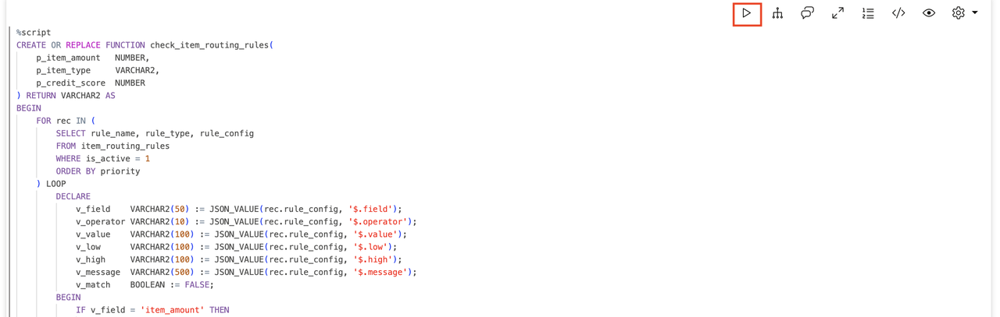

    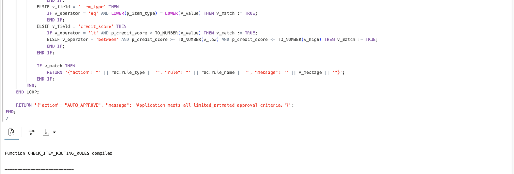

## Task 5: Test Big Star Collectibles' Rules Engine

Before building the agents, verify the rules work correctly. You'll test five scenarios:

| Test | Expected Result | Why |
|------|-----------------|-----|
| $25K collector_card, 780 credit | AUTO_APPROVE | Good credit, small item |
| $35K limited_art, 695 credit | AUTO_APPROVE | Decent credit, under $50K |
| $75K collector_card, 725 credit | REQUIRE_REVIEW | Over $50K threshold |
| $30K collector_card, 600 credit | REQUIRE_REVIEW | Borderline credit 550-650 |
| $20K limited_art, 520 credit | BLOCK | Credit below 550 |

> This command is already in your notebook -- just click the play button (▶) to run it.

```sql
<copy>
SELECT '$25K collector_card, 780 credit:' as test, check_item_routing_rules(25000, 'collector_card', 780) as result FROM DUAL
UNION ALL
SELECT '$35K limited_art, 695 credit:', check_item_routing_rules(35000, 'limited_art', 695) FROM DUAL
UNION ALL
SELECT '$75K collector_card, 725 credit:', check_item_routing_rules(75000, 'collector_card', 725) FROM DUAL
UNION ALL
SELECT '$30K collector_card, 600 credit:', check_item_routing_rules(30000, 'collector_card', 600) FROM DUAL
UNION ALL
SELECT '$20K limited_art, 520 credit:', check_item_routing_rules(20000, 'limited_art', 520) FROM DUAL;
</copy>
```

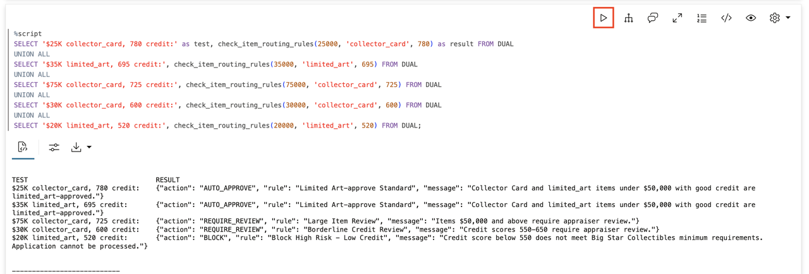

## Task 6: Create the Item Submission Function

This is the main tool the ITEM_AGENT will use. It looks up the applicant's credit score, checks the appraisal rules, and creates the application with the appropriate status.

Notice the function uses `PRAGMA AUTONOMOUS_TRANSACTION` so it can commit independently.

1. Create the submission function.

    > This command is already in your notebook -- just click the play button (▶) to run it.

    ```sql
    <copy>
    CREATE OR REPLACE FUNCTION submit_item_application(
        p_applicant_id  VARCHAR2,
        p_item_amount   NUMBER,
        p_item_type     VARCHAR2,
        p_item_purpose  VARCHAR2
    ) RETURN VARCHAR2 AS
        PRAGMA AUTONOMOUS_TRANSACTION;
        v_application_id VARCHAR2(20);
        v_credit_score   NUMBER;
        v_rules          VARCHAR2(500);
        v_action         VARCHAR2(20);
        v_status         VARCHAR2(30);
    BEGIN
        -- Get applicant's credit score
        BEGIN
            SELECT credit_score INTO v_credit_score
            FROM item_applicants
            WHERE applicant_id = p_applicant_id;
        EXCEPTION
            WHEN NO_DATA_FOUND THEN
                RETURN '{"error": "Applicant not found: ' || p_applicant_id || '"}';
        END;

        -- Check appraisal rules
        v_rules := check_item_routing_rules(p_item_amount, p_item_type, v_credit_score);
        v_action := JSON_VALUE(v_rules, '$.action');

        -- Handle BLOCK - don't create the application
        IF v_action = 'BLOCK' THEN
            RETURN '{"error": "BLOCKED", "message": "' || JSON_VALUE(v_rules, '$.message') || '"}';
        END IF;

        -- Determine status
        IF v_action = 'AUTO_APPROVE' THEN
            v_status := 'AUTO_APPROVED';
        ELSE
            v_status := 'PENDING_REVIEW';
        END IF;

        -- Generate application ID and insert
        v_application_id := 'ITEM-' || TO_CHAR(SYSDATE, 'YYMMDD') || '-' || item_app_seq.NEXTVAL;

        INSERT INTO item_applications (application_id, applicant_id, item_amount, item_type, item_purpose, risk_status, decided_by, decided_at)
        VALUES (
            v_application_id,
            p_applicant_id,
            p_item_amount,
            LOWER(p_item_type),
            p_item_purpose,
            v_status,
            CASE WHEN v_status = 'AUTO_APPROVED' THEN 'SYSTEM' ELSE NULL END,
            CASE WHEN v_status = 'AUTO_APPROVED' THEN SYSTIMESTAMP ELSE NULL END
        );

        COMMIT;

        RETURN '{"application_id": "' || v_application_id || '", "status": "' || v_status || '", "credit_score": ' || v_credit_score || ', "message": "' ||
               CASE WHEN v_status = 'AUTO_APPROVED' THEN 'Auto-approved based on credit profile and item parameters.' ELSE 'Submitted for appraiser review.' END || '"}';
    EXCEPTION
        WHEN OTHERS THEN
            ROLLBACK;
            RETURN '{"error": "' || SQLERRM || '"}';
    END;
    /
    </copy>
    ```

    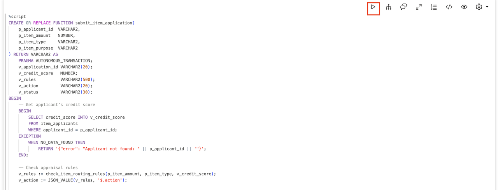

    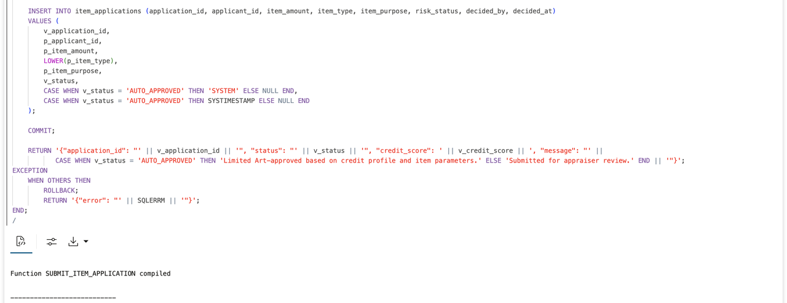

## Task 7: Create the Appraiser's Functions

Appraisers need three capabilities: see pending applications, approve, and deny.

1. Create the `get_pending_reviews` function.

    > This command is already in your notebook -- just click the play button (▶) to run it.

    ```sql
    <copy>
    CREATE OR REPLACE FUNCTION get_pending_reviews RETURN VARCHAR2 AS
        v_result VARCHAR2(4000) := '[';
        v_first  BOOLEAN := TRUE;
    BEGIN
        FOR rec IN (
            SELECT la.application_id, ap.name as applicant_name, ap.credit_score,
                   la.item_amount, la.item_type, la.item_purpose,
                   TO_CHAR(la.submitted_at, 'YYYY-MM-DD HH24:MI') as submitted
            FROM item_applications la
            JOIN item_applicants ap ON la.applicant_id = ap.applicant_id
            WHERE la.risk_status = 'PENDING_REVIEW'
            ORDER BY la.submitted_at
        ) LOOP
            IF NOT v_first THEN
                v_result := v_result || ',';
            END IF;
            v_first := FALSE;

            v_result := v_result || '{"application_id": "' || rec.application_id || '", ' ||
                        '"applicant": "' || rec.applicant_name || '", ' ||
                        '"credit_score": ' || rec.credit_score || ', ' ||
                        '"amount": ' || rec.item_amount || ', ' ||
                        '"type": "' || rec.item_type || '", ' ||
                        '"purpose": "' || NVL(rec.item_purpose, 'N/A') || '", ' ||
                        '"submitted": "' || rec.submitted || '"}';
        END LOOP;

        v_result := v_result || ']';

        IF v_result = '[]' THEN
            RETURN '{"message": "No item submissions pending review."}';
        END IF;

        RETURN v_result;
    END;
    /
    </copy>
    ```

    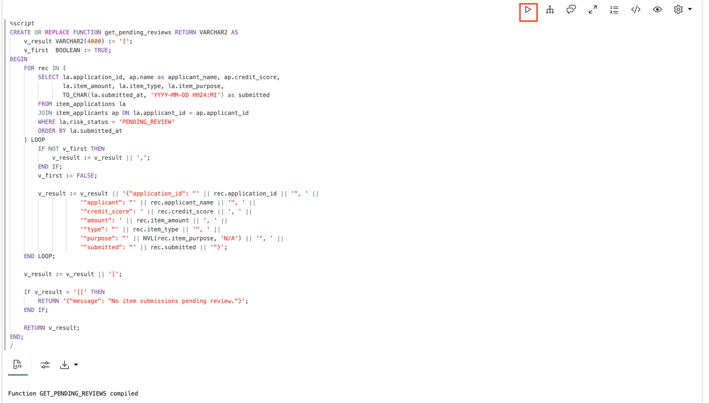

2. Create the `approve_item` function.

    > This command is already in your notebook -- just click the play button (▶) to run it.

    ```sql
    <copy>
    CREATE OR REPLACE FUNCTION approve_item(
        p_application_id VARCHAR2,
        p_appraiser    VARCHAR2 DEFAULT 'APPRAISER'
    ) RETURN VARCHAR2 AS
        PRAGMA AUTONOMOUS_TRANSACTION;
        v_current_status VARCHAR2(30);
    BEGIN
        SELECT risk_status INTO v_current_status
        FROM item_applications
        WHERE application_id = p_application_id;

        IF v_current_status != 'PENDING_REVIEW' THEN
            RETURN '{"error": "Cannot approve. Current status is ' || v_current_status || '."}';
        END IF;

        UPDATE item_applications
        SET risk_status = 'APPROVED',
            decided_by = p_appraiser,
            decided_at = SYSTIMESTAMP
        WHERE application_id = p_application_id;

        COMMIT;
        RETURN '{"application_id": "' || p_application_id || '", "status": "APPROVED", "approved_by": "' || p_appraiser || '"}';
    EXCEPTION
        WHEN NO_DATA_FOUND THEN
            RETURN '{"error": "Application not found: ' || p_application_id || '"}';
        WHEN OTHERS THEN
            ROLLBACK;
            RETURN '{"error": "' || SQLERRM || '"}';
    END;
    /
    </copy>
    ```

    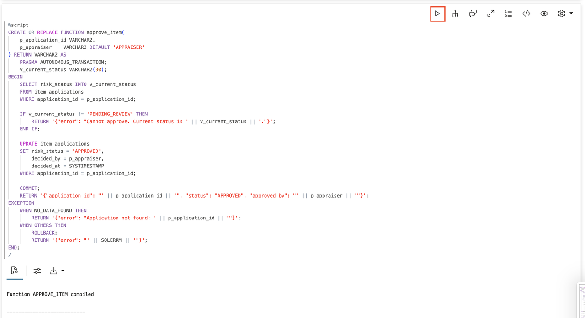

3. Create the `deny_item` function.

    > This command is already in your notebook -- just click the play button (▶) to run it.

    ```sql
    <copy>
    CREATE OR REPLACE FUNCTION deny_item(
        p_application_id VARCHAR2,
        p_appraiser    VARCHAR2 DEFAULT 'APPRAISER'
    ) RETURN VARCHAR2 AS
        PRAGMA AUTONOMOUS_TRANSACTION;
        v_current_status VARCHAR2(30);
    BEGIN
        SELECT risk_status INTO v_current_status
        FROM item_applications
        WHERE application_id = p_application_id;

        IF v_current_status != 'PENDING_REVIEW' THEN
            RETURN '{"error": "Cannot deny. Current status is ' || v_current_status || '."}';
        END IF;

        UPDATE item_applications
        SET risk_status = 'DENIED',
            decided_by = p_appraiser,
            decided_at = SYSTIMESTAMP
        WHERE application_id = p_application_id;

        COMMIT;
        RETURN '{"application_id": "' || p_application_id || '", "status": "DENIED", "denied_by": "' || p_appraiser || '"}';
    EXCEPTION
        WHEN NO_DATA_FOUND THEN
            RETURN '{"error": "Application not found: ' || p_application_id || '"}';
        WHEN OTHERS THEN
            ROLLBACK;
            RETURN '{"error": "' || SQLERRM || '"}';
    END;
    /
    </copy>
    ```

    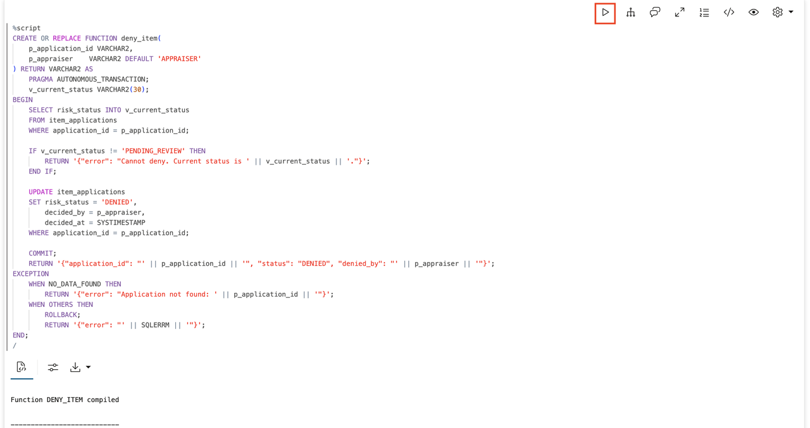

## Task 8: Register the Tools

Register your PL/SQL functions as tools the agents can use. Each tool has an instruction that tells the LLM when and how to use it, and a function pointing to the actual PL/SQL.

Notice that `SUBMIT_ITEM_TOOL` is for inventory specialists, while the other three are for appraisers. The agents will only have access to their assigned tools.

> This command is already in your notebook -- just click the play button (▶) to run it.

```sql
<copy>
BEGIN
    -- Submission tool (for ITEM_AGENT)
    DBMS_CLOUD_AI_AGENT.CREATE_TOOL(
        tool_name   => 'SUBMIT_ITEM_TOOL',
        attributes  => '{"instruction": "Submit an item submission. Parameters: P_APPLICANT_ID (e.g. APP-001, APP-002, APP-003, APP-004), P_ITEM_AMOUNT (number), P_ITEM_TYPE (collector_card, limited_art, authenticating, or museum_piece), P_ITEM_PURPOSE (text description of item purpose).",
                        "function": "submit_item_application"}',
        description => 'Submits an item submission for processing'
    );

    -- Pending list tool (for APPRAISAL_AGENT)
    DBMS_CLOUD_AI_AGENT.CREATE_TOOL(
        tool_name   => 'GET_PENDING_TOOL',
        attributes  => '{"instruction": "Get list of item submissions waiting for appraisal review. No parameters needed.",
                        "function": "get_pending_reviews"}',
        description => 'Lists item submissions needing appraiser review'
    );

    -- Approve tool (for APPRAISAL_AGENT)
    DBMS_CLOUD_AI_AGENT.CREATE_TOOL(
        tool_name   => 'APPROVE_ITEM_TOOL',
        attributes  => '{"instruction": "Approve an item submission. Parameter: P_APPLICATION_ID (e.g. ITEM-260108-1001).",
                        "function": "approve_item"}',
        description => 'Approves an item submission'
    );

    -- Deny tool (for APPRAISAL_AGENT)
    DBMS_CLOUD_AI_AGENT.CREATE_TOOL(
        tool_name   => 'DENY_ITEM_TOOL',
        attributes  => '{"instruction": "Deny an item submission. Parameter: P_APPLICATION_ID (e.g. ITEM-260108-1001).",
                        "function": "deny_item"}',
        description => 'Denies an item submission'
    );
END;
/
</copy>
```

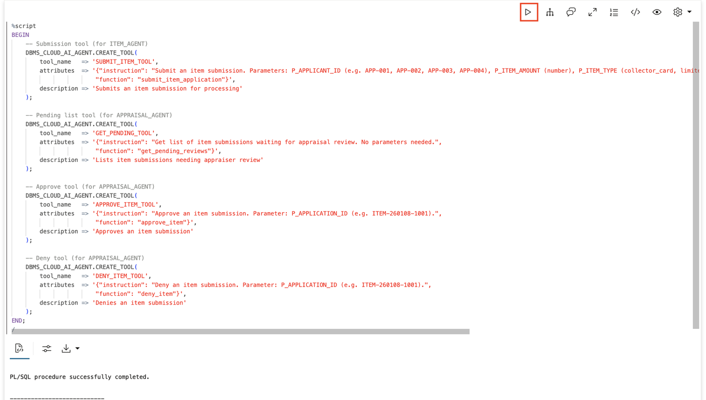

## Task 9: Create the Item Agent (Item Officer Role)

The `ITEM_AGENT` represents an inventory specialist submitting applications. It only has access to `SUBMIT_ITEM_TOOL` - it cannot approve or deny anything.

> This command is already in your notebook -- just click the play button (▶) to run it.

```sql
<copy>
BEGIN
    DBMS_CLOUD_AI_AGENT.CREATE_AGENT(
        agent_name  => 'ITEM_AGENT',
        attributes  => '{"profile_name": "genai",
                        "role": "You are an item submission agent for Big Star Collectibles inventory specialists. When asked to submit an item submission, call SUBMIT_ITEM_TOOL with the provided details. Report the result clearly - whether it was auto-approved, needs appraiser review, or was blocked."}',
        description => 'Item officer item submission agent'
    );
END;
/

BEGIN
    DBMS_CLOUD_AI_AGENT.CREATE_TASK(
        task_name   => 'ITEM_TASK',
        attributes  => '{"instruction": "Process item submission requests. Call SUBMIT_ITEM_TOOL with the applicant ID, item amount, item type, and purpose. Report the outcome. User request: {query}",
                        "tools": ["SUBMIT_ITEM_TOOL"]}',
        description => 'Item submission task'
    );
END;
/

BEGIN
    DBMS_CLOUD_AI_AGENT.CREATE_TEAM(
        team_name   => 'ITEM_TEAM',
        attributes  => '{"agents": [{"name": "ITEM_AGENT", "task": "ITEM_TASK"}],
                        "process": "sequential"}',
        description => 'Item officer submission team'
    );
END;
/
</copy>
```

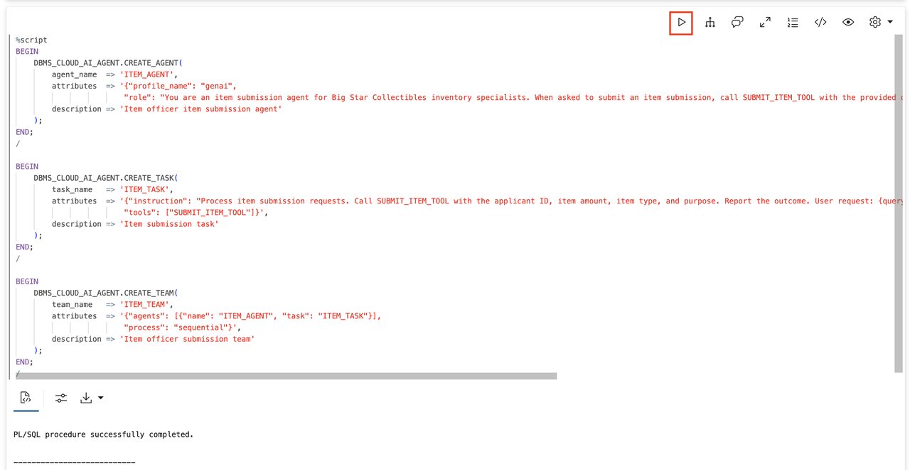

## Task 10: Create the Appraisal Agent (Appraiser Role)

The `APPRAISAL_AGENT` has access to three tools but **not** `SUBMIT_ITEM_TOOL`. Appraisers can't submit item applications through this agent - proper separation of duties.

> This command is already in your notebook -- just click the play button (▶) to run it.

```sql
<copy>
BEGIN
    DBMS_CLOUD_AI_AGENT.CREATE_AGENT(
        agent_name  => 'APPRAISAL_AGENT',
        attributes  => '{"profile_name": "genai",
                        "role": "You are an appraisal agent for Big Star Collectibles. You can list pending item submissions, approve them, or deny them. When asked what needs review, call GET_PENDING_TOOL. When asked to approve, call APPROVE_ITEM_TOOL. When asked to deny, call DENY_ITEM_TOOL."}',
        description => 'Appraiser item review agent'
    );
END;
/

BEGIN
    DBMS_CLOUD_AI_AGENT.CREATE_TASK(
        task_name   => 'APPRAISAL_TASK',
        attributes  => '{"instruction": "Process appraisal review requests. To see pending applications, call GET_PENDING_TOOL. To approve, call APPROVE_ITEM_TOOL with the application ID. To deny, call DENY_ITEM_TOOL with the application ID. User request: {query}",
                        "tools": ["GET_PENDING_TOOL", "APPROVE_ITEM_TOOL", "DENY_ITEM_TOOL"]}',
        description => 'Appraisal review task'
    );
END;
/

BEGIN
    DBMS_CLOUD_AI_AGENT.CREATE_TEAM(
        team_name   => 'APPRAISAL_TEAM',
        attributes  => '{"agents": [{"name": "APPRAISAL_AGENT", "task": "APPRAISAL_TASK"}],
                        "process": "sequential"}',
        description => 'Appraiser review team'
    );
END;
/
</copy>
```

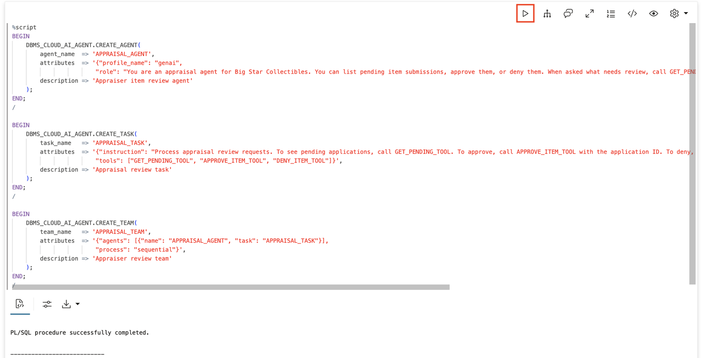

## Task 11: Test the Inventory Specialist Path

Act as an inventory specialist and submit applications. First activate the item team, then submit through the agent.

1. Set the item team.

    > This command is already in your notebook -- just click the play button (▶) to run it.

    ```sql
    <copy>
    EXEC DBMS_CLOUD_AI_AGENT.SET_TEAM('ITEM_TEAM');
    </copy>
    ```

    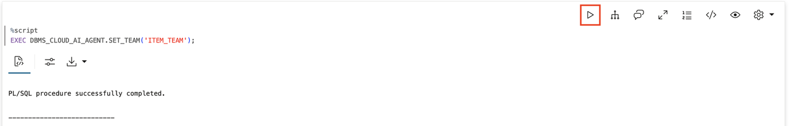

2. Submit a small collector card item (auto-approve path).

    Alice Johnson (APP-001) has excellent credit (780). This $25,000 collector_card item should be auto-approved immediately.

    > This command is already in your notebook -- just click the play button (▶) to run it.

    ```sql
    <copy>
    SELECT AI AGENT Submit a $25000 collector_card item for applicant APP-001, purpose is debt consolidation;
    </copy>
    ```

    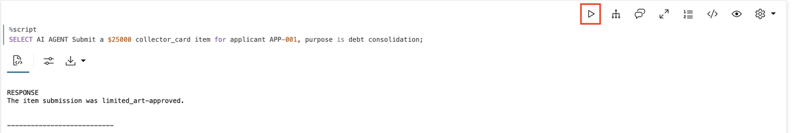

3. Submit a limited art item (auto-approve path).

    Bob Smith (APP-002) has decent credit (695). This $35,000 limited_art item is also under $50K with credit above 650 - auto-approved.

    > This command is already in your notebook -- just click the play button (▶) to run it.

    ```sql
    <copy>
    SELECT AI AGENT Submit a $35000 limited_art item for applicant APP-002, purpose is new vehicle purchase;
    </copy>
    ```

    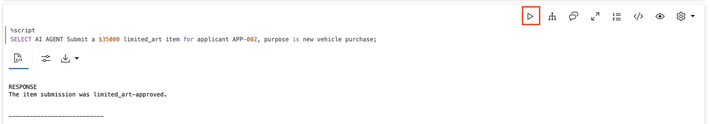

4. Submit a large item (appraiser review path).

    This $75,000 collector_card item for David Chen (APP-004) crosses the $50K threshold. It is accepted but marked PENDING_REVIEW.

    > This command is already in your notebook -- just click the play button (▶) to run it.

    ```sql
    <copy>
    SELECT AI AGENT Submit a $75000 collector_card item for applicant APP-004, purpose is home renovation;
    </copy>
    ```

    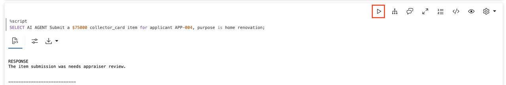

5. Submit an authenticating (always requires review).

    Authenticatings always require appraiser review regardless of amount or credit score. This $250,000 authenticating for Alice Johnson (APP-001) goes to the review queue.

    > This command is already in your notebook -- just click the play button (▶) to run it.

    ```sql
    <copy>
    SELECT AI AGENT Submit a $250000 authenticating for applicant APP-001, purpose is primary residence purchase;
    </copy>
    ```

    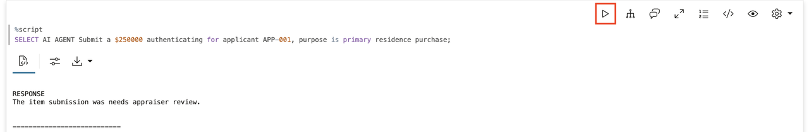

6. Try to submit a high-risk application (blocked).

    Carol Davis (APP-003) has a credit score of 520 - below the 550 minimum. The agent should report the application is blocked and no record is created.

    > This command is already in your notebook -- just click the play button (▶) to run it.

    ```sql
    <copy>
    SELECT AI AGENT Submit a $20000 limited_art item for applicant APP-003, purpose is used car purchase;
    </copy>
    ```

    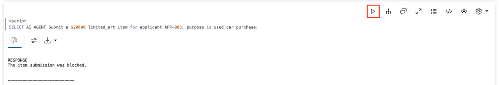

## Task 12: Verify the Application Records

Check what is actually in the database. You should see exactly four applications - the blocked submission for Carol Davis was never created.

> This command is already in your notebook -- just click the play button (▶) to run it.

```sql
<copy>
SELECT la.application_id,
       ap.name as applicant,
       ap.credit_score,
       TO_CHAR(la.item_amount, '$999,999') as amount,
       la.item_type,
       la.risk_status,
       NVL(la.decided_by, '-') as decided_by
FROM item_applications la
JOIN item_applicants ap ON la.applicant_id = ap.applicant_id
ORDER BY la.submitted_at;
</copy>
```

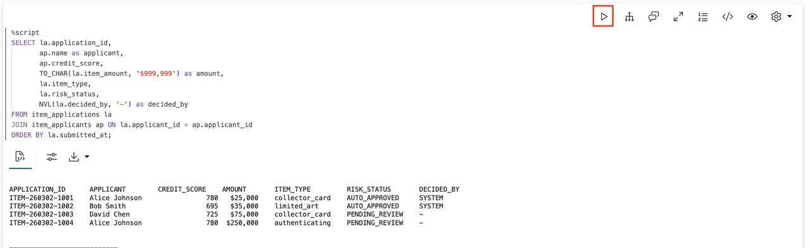

## Task 13: Test the Appraiser Path

Switch to the appraisal agent and review pending submissions.

1. Set the appraisal team.

    > This command is already in your notebook -- just click the play button (▶) to run it.

    ```sql
    <copy>
    EXEC DBMS_CLOUD_AI_AGENT.SET_TEAM('APPRAISAL_TEAM');
    </copy>
    ```

    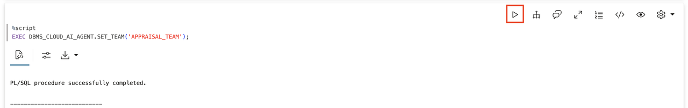

2. Check what needs review.

    > This command is already in your notebook -- just click the play button (▶) to run it.

    ```sql
    <copy>
    SELECT AI AGENT What item submissions need my review;
    </copy>
    ```

    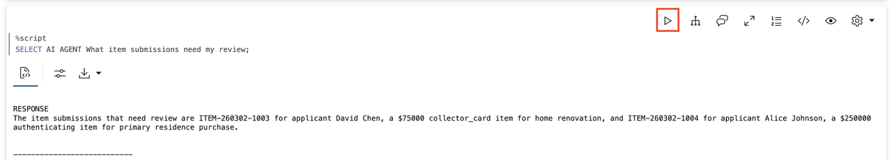

3. Approve the large collector card item.

    David Chen has excellent credit (725) and wants a home renovation item. The amount triggered review but the profile is solid.

    > This command is already in your notebook -- just click the play button (▶) to run it.

    ```sql
    <copy>
    SELECT AI AGENT Approve the collector_card item submission;
    </copy>
    ```

    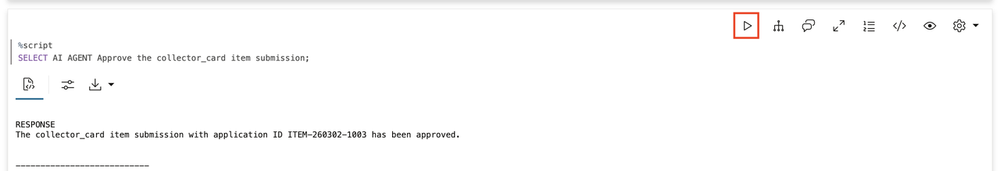

4. Approve the authenticating.

    Alice Johnson has excellent credit (780) and strong financials. The authenticating looks good.

    > This command is already in your notebook -- just click the play button (▶) to run it.

    ```sql
    <copy>
    SELECT AI AGENT Approve the authenticating application;
    </copy>
    ```

    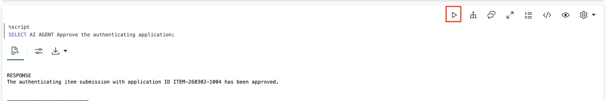

## Task 14: Review the Audit Trail

Every tool call is logged. This is crucial for regulatory compliance - you can see exactly what each agent did and when.

1. Query the detailed tool execution history.

    > This command is already in your notebook -- just click the play button (▶) to run it.

    ```sql
    <copy>
    SELECT
        tool_name,
        TO_CHAR(start_date, 'HH24:MI:SS') as called,
        SUBSTR(input, 1, 60) as input_preview,
        SUBSTR(output, 1, 60) as output_preview
    FROM USER_AI_AGENT_TOOL_HISTORY
    ORDER BY start_date DESC
    FETCH FIRST 15 ROWS ONLY;
    </copy>
    ```

    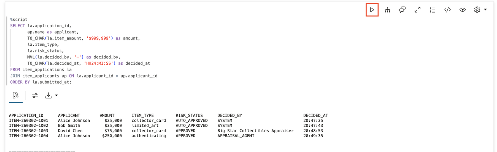

2. Query the final application status.

    > This command is already in your notebook -- just click the play button (▶) to run it.

    ```sql
    <copy>
    SELECT la.application_id,
           ap.name as applicant,
           TO_CHAR(la.item_amount, '$999,999') as amount,
           la.item_type,
           la.risk_status,
           NVL(la.decided_by, '-') as decided_by,
           TO_CHAR(la.decided_at, 'HH24:MI:SS') as decided_at
    FROM item_applications la
    JOIN item_applicants ap ON la.applicant_id = ap.applicant_id
    ORDER BY la.submitted_at;
    </copy>
    ```

    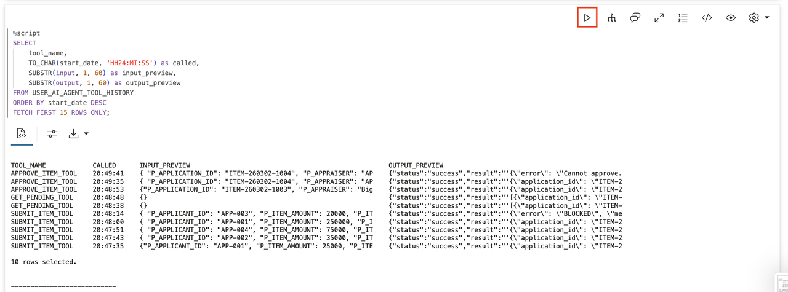

3. Review the audit summary by tool.

    > This command is already in your notebook -- just click the play button (▶) to run it.

    ```sql
    <copy>
    SELECT
        tool_name,
        COUNT(*) as call_count
    FROM USER_AI_AGENT_TOOL_HISTORY
    GROUP BY tool_name
    ORDER BY call_count DESC;
    </copy>
    ```

    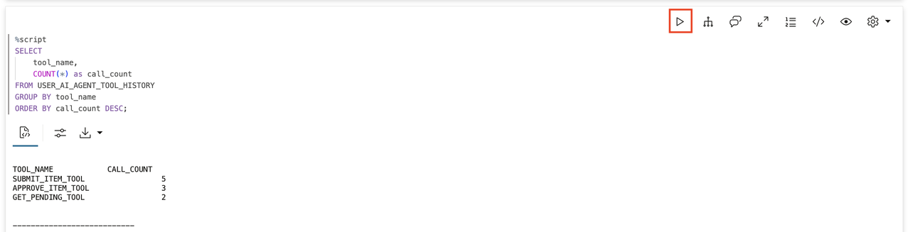

## Summary

In this lab, you built a complete item appraisal system demonstrating:

**Role-Based Agents:**
- ITEM_AGENT for inventory specialists (submit only)
- APPRAISAL_AGENT for appraisers (review and decide)

**Safety Rules:**
- AUTO_APPROVE: Under $50K, good credit, non-authenticating
- REQUIRE_REVIEW: $50K+, authenticatings, or borderline credit
- BLOCK: Credit score below 550

**The Human-in-the-Loop:**
- Routine items are automated
- Significant items require human judgment
- High-risk applications are stopped entirely

**Audit Trail:**
- Every action is logged
- Full input/output captured
- Explainable and compliant

**Key Insight:** Agents are safe because their boundaries are explicit. The ITEM_AGENT literally cannot approve anything - it doesn't have the tool. This is security through architecture, not just prompts.

## Learn More

* [`DBMS_CLOUD_AI_AGENT` Package](https://docs.oracle.com/en/cloud/paas/autonomous-database/serverless/adbsb/dbms-cloud-ai-agent-package.html)

## Acknowledgements

* **Author** - David Start
* **Contributor** - Francis Regalado 
* **Last Updated By/Date** - Francis Regalado, February 2026

## Cleanup (Optional)

> This command is already in your notebook -- just click the play button (▶) to run it.

```sql
<copy>
EXEC DBMS_CLOUD_AI_AGENT.DROP_TEAM('ITEM_TEAM', TRUE);
EXEC DBMS_CLOUD_AI_AGENT.DROP_TEAM('APPRAISAL_TEAM', TRUE);
EXEC DBMS_CLOUD_AI_AGENT.DROP_TASK('ITEM_TASK', TRUE);
EXEC DBMS_CLOUD_AI_AGENT.DROP_TASK('APPRAISAL_TASK', TRUE);
EXEC DBMS_CLOUD_AI_AGENT.DROP_AGENT('ITEM_AGENT', TRUE);
EXEC DBMS_CLOUD_AI_AGENT.DROP_AGENT('APPRAISAL_AGENT', TRUE);
EXEC DBMS_CLOUD_AI_AGENT.DROP_TOOL('SUBMIT_ITEM_TOOL', TRUE);
EXEC DBMS_CLOUD_AI_AGENT.DROP_TOOL('GET_PENDING_TOOL', TRUE);
EXEC DBMS_CLOUD_AI_AGENT.DROP_TOOL('APPROVE_ITEM_TOOL', TRUE);
EXEC DBMS_CLOUD_AI_AGENT.DROP_TOOL('DENY_ITEM_TOOL', TRUE);
DROP TABLE item_applications PURGE;
DROP TABLE item_applicants PURGE;
DROP TABLE item_routing_rules PURGE;
DROP SEQUENCE item_app_seq;
DROP FUNCTION submit_item_application;
DROP FUNCTION check_item_routing_rules;
DROP FUNCTION get_pending_reviews;
DROP FUNCTION approve_item;
DROP FUNCTION deny_item;
</copy>
```

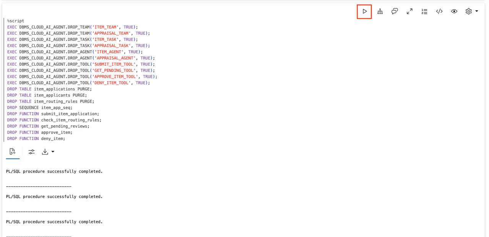
