# Why Agents Need Memory

## Introduction

In this lab, you'll experience the forgetting problem firsthand and understand why memory is essential for agents that do real work.

Most AI agents have amnesia. Every conversation starts fresh. They don't remember what happened yesterday, what they learned last week, or what rules they're supposed to follow. This works for demos. It fails completely in production.

You'll tell an agent something important, clear the session, and watch it forget everything.

### The Business Problem

Last month at Big Star Collectibles, an inventory specialist quoted standard rates to Sarah Chen, a client who's been with the company for six years and has a **15% rate exception** on file.

Sarah was not happy:

> *"I've told three different people my preferences. I've explained my rate arrangement every time I call. Why doesn't anyone remember?"*
>
> Sarah Chen, Big Star Collectibles Client

This is exactly what's happening with Big Star Collectibles' AI assistants. They have amnesia. Every conversation starts fresh. A client shares their preferences, and five minutes later -- or after a session reset -- the AI has no idea who they are.

### What You'll Learn

This lab lets you experience the forgetting problem directly. You'll tell an agent about a client, clear the session, and watch it forget everything. This demonstrates why memory is essential, not just nice to have.

**What you'll build:** Nothing permanent. This lab is about experiencing the problem that the rest of the workshop solves.

Estimated Time: 10 minutes

### Objectives

* Experience the forgetting problem directly
* Understand the difference between chat memory and agentic memory
* See why stateless agents can't run real workflows
* Recognize the need for persistent memory

### Prerequisites

For this workshop, we provide the environment. You'll need:

* Basic knowledge of SQL and PL/SQL, or the ability to follow along with the prompts

## Task 1: Import the Lab Notebook

Before you begin, you are going to import a notebook that has all of the commands for this lab into Oracle Machine Learning. This way you don't have to copy and paste them over to run them.

1. From the Oracle Machine Learning home page, click **Notebooks**.

    

2. Click **Import** to expand the Import drop down.

    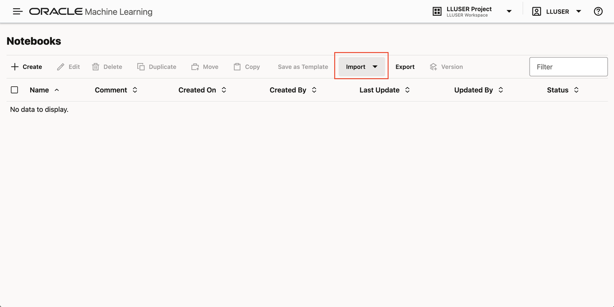

3. Select **Git**.

    

4. Paste the following GitHub URL leaving the credential field blank, then click **OK**.

    ```text
    <copy>
    https://github.com/kaymalcolm/database/blob/main/ai4u/industries/retail-bigstar/why-agents-need-memory/lab5-why-agents-need-memory.json
    </copy>
    ```

    

    You should now be on the screen with the notebook imported. This workshop will have all of the screenshots and detailed information, however the notebook will have the commands and basic instructions for completing the lab.

## Task 2: Create an Agent Without Memory

We'll create an agent that has no way to store or retrieve information between sessions. Notice that we tell the agent in its role to "remember" things, but we don't give it any tools to actually do that. This is the gap: the agent wants to remember but has no way to make memories persist.

1. Create the forgetful agent, task, and team.

    > This command is already in your notebook — just click the play button (▶) to run it.

    ```sql
    <copy>
    -- Create a basic SQL tool so the agent can function
    BEGIN
        DBMS_CLOUD_AI_AGENT.CREATE_TOOL(
            tool_name   => 'BASIC_SQL_TOOL',
            attributes  => '{"tool_type": "SQL",
                            "tool_params": {"profile_name": "genai"}}',
            description => 'Basic SQL query tool'
        );
    EXCEPTION WHEN OTHERS THEN NULL;
    END;
    /

    BEGIN
        DBMS_CLOUD_AI_AGENT.CREATE_AGENT(
            agent_name  => 'FORGETFUL_AGENT',
            attributes  => '{"profile_name": "genai",
                            "role": "You are a helpful inventory specialist assistant for Big Star Collectibles. Remember any preferences or information clients share with you so you can serve them better on future item submissions."}',
            description => 'Agent without memory capabilities'
        );
    EXCEPTION WHEN OTHERS THEN NULL;
    END;
    /

    BEGIN
        DBMS_CLOUD_AI_AGENT.CREATE_TASK(
            task_name   => 'FORGETFUL_TASK',
            attributes  => '{"instruction": "Help the inventory specialist with their request. {query}",
                            "tools": ["BASIC_SQL_TOOL"]}',
            description => 'Task without memory tools'
        );
    EXCEPTION WHEN OTHERS THEN NULL;
    END;
    /

    BEGIN
        DBMS_CLOUD_AI_AGENT.CREATE_TEAM(
            team_name   => 'FORGETFUL_TEAM',
            attributes  => '{"agents": [{"name": "FORGETFUL_AGENT", "task": "FORGETFUL_TASK"}],
                            "process": "sequential"}',
            description => 'Team demonstrating memory limitations'
        );
    EXCEPTION WHEN OTHERS THEN NULL;
    END;
    /
    </copy>
    ```

    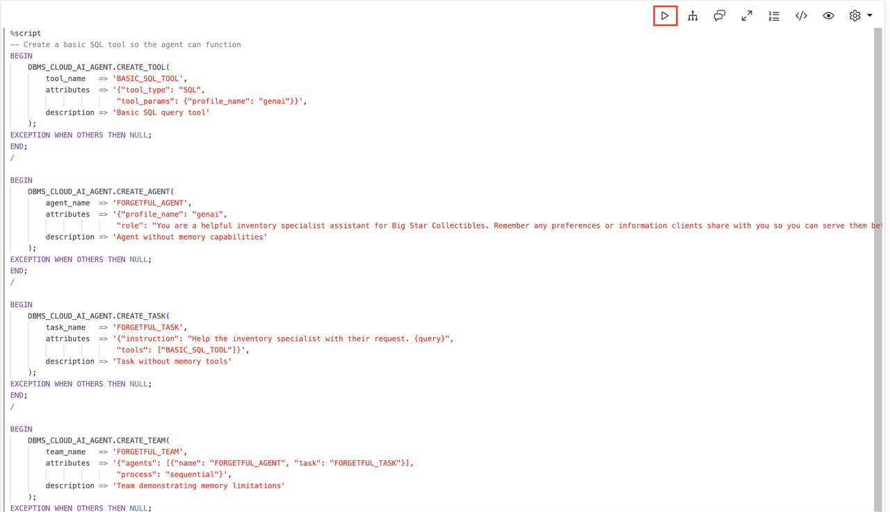

    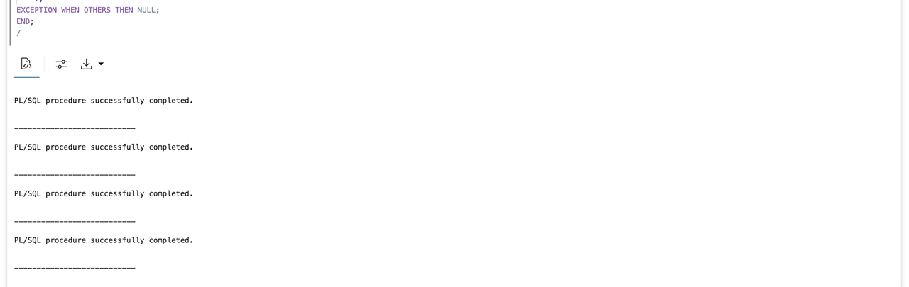

2. Set the team for your session.

    > This command is already in your notebook — just click the play button (▶) to run it.

    ```sql
    <copy>
    EXEC DBMS_CLOUD_AI_AGENT.SET_TEAM('FORGETFUL_TEAM');
    </copy>
    ```

    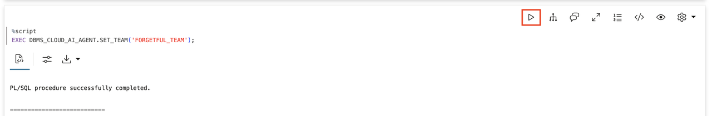

## Task 3: Teach the Agent About Sarah Chen

Let's give the agent important information about a client, just like a real inventory specialist would share. The agent will acknowledge and seem to understand. It seems to remember.

1. Tell the agent about Sarah Chen's preferences.

    > This command is already in your notebook — just click the play button (▶) to run it.

    ```sql
    <copy>
    SELECT AI AGENT Client Sarah Chen prefers email contact and is in Pacific timezone. She has been approved for a 15% rate exception due to her long relationship with Big Star Collectibles. Please remember this for future interactions;
    </copy>
    ```

    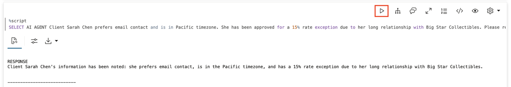

2. Immediately ask about what you just said.

    Within the same session, the context is still available. You should get the correct answer.

    > This command is already in your notebook — just click the play button (▶) to run it.

    ```sql
    <copy>
    SELECT AI AGENT What is Sarah Chens preferred contact method;
    </copy>
    ```

    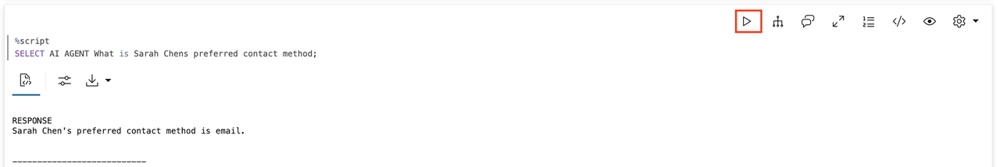

3. Ask about her rate exception in the same session.

    Still works -- the context is maintained within the session.

    > This command is already in your notebook — just click the play button (▶) to run it.

    ```sql
    <copy>
    SELECT AI AGENT What rate exception was Sarah Chen approved for;
    </copy>
    ```

    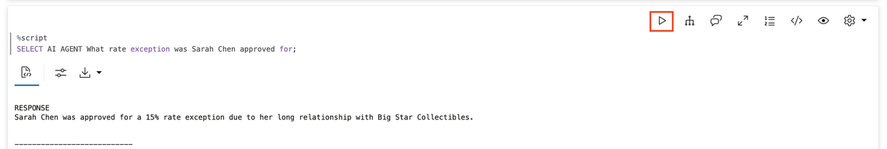

## Task 4: Experience the Forgetting

Now let's simulate what happens when the session ends and a new one begins -- like when a different inventory specialist takes the next call.

1. Clear the team (simulating session end).

    `CLEAR_TEAM` resets the session context. This is equivalent to logging out or starting a new day.

    > This command is already in your notebook — just click the play button (▶) to run it.

    ```sql
    <copy>
    EXEC DBMS_CLOUD_AI_AGENT.CLEAR_TEAM;
    </copy>
    ```

    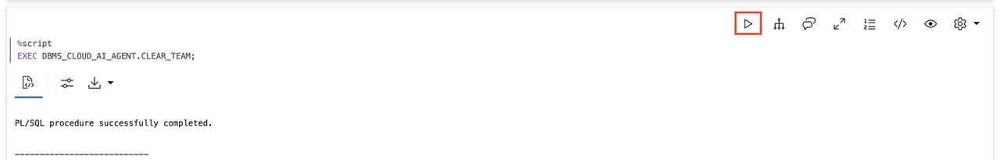

2. Start a new session.

    Reactivate the team. This is like the inventory specialist returning the next day.

    > This command is already in your notebook — just click the play button (▶) to run it.

    ```sql
    <copy>
    EXEC DBMS_CLOUD_AI_AGENT.SET_TEAM('FORGETFUL_TEAM');
    </copy>
    ```

    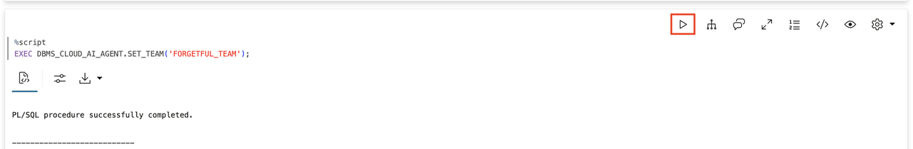

3. Ask about the preferences you shared.

    Ask the same question you asked before. The context has been reset -- the agent no longer has access to what was shared in the previous session.

    > This command is already in your notebook — just click the play button (▶) to run it.

    ```sql
    <copy>
    SELECT AI AGENT What is Sarah Chens preferred contact method;
    </copy>
    ```

    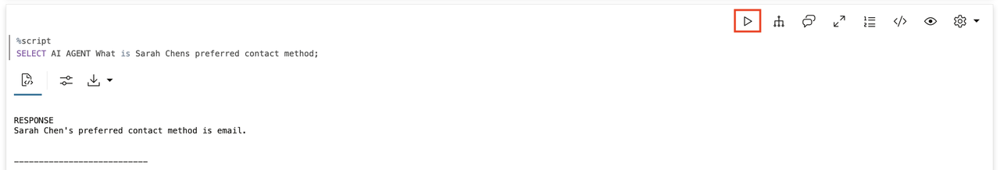

4. Ask about her rate exception.

    > This command is already in your notebook — just click the play button (▶) to run it.

    ```sql
    <copy>
    SELECT AI AGENT What rate exception was Sarah Chen approved for;
    </copy>
    ```

    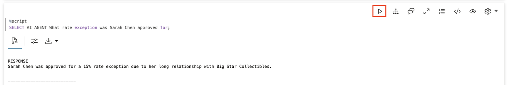

## Task 5: See the Business Impact

This isn't just an inconvenience. It breaks real workflows and damages client relationships. Let's simulate a multi-day item scenario.

1. Day 1 -- tell the agent about an active item application.

    > This command is already in your notebook — just click the play button (▶) to run it.

    ```sql
    <copy>
    SELECT AI AGENT Applicant TechStart LLC is working on a $500K business expansion item. They have provided 3 years of financials but still need to submit their business plan. The deadline for the SBA guarantee program is January 31st;
    </copy>
    ```

    

2. Simulate Day 2 -- reset the session.

    Night passes. New session begins. The inventory specialist calls back expecting to continue where they left off.

    > This command is already in your notebook — just click the play button (▶) to run it.

    ```sql
    <copy>
    EXEC DBMS_CLOUD_AI_AGENT.CLEAR_TEAM;
    EXEC DBMS_CLOUD_AI_AGENT.SET_TEAM('FORGETFUL_TEAM');
    </copy>
    ```

    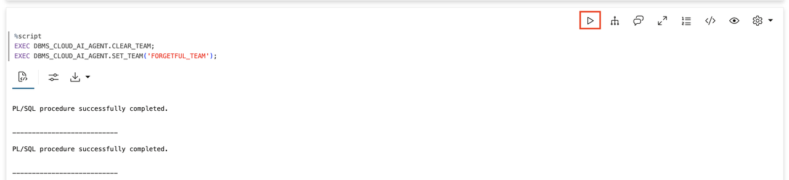

3. Ask about the TechStart application status.

    The inventory specialist assumes the agent remembers the TechStart application details from yesterday.

    > This command is already in your notebook — just click the play button (▶) to run it.

    ```sql
    <copy>
    SELECT AI AGENT What documents are still missing for the TechStart item submission;
    </copy>
    ```

    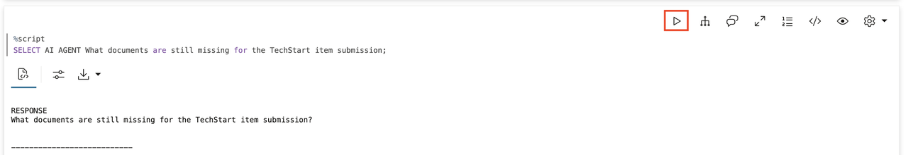

    **The agent has no idea what application you're talking about.** The January 31st deadline? Forgotten. The missing business plan? Lost. The inventory specialist has to start from zero.

## Task 6: Understand What's Missing

Let's be clear about what the agent lacks.

1. Query what tools the agent has.

    The forgetful agent has only `BASIC_SQL_TOOL`. It has no memory tools -- no way to store or retrieve information persistently.

    > This command is already in your notebook — just click the play button (▶) to run it.

    ```sql
    <copy>
    SELECT tool_name, description 
    FROM USER_AI_AGENT_TOOLS;
    </copy>
    ```

    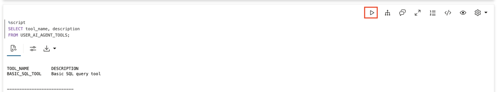

2. Check the tool execution history.

    You'll see only `BASIC_SQL_TOOL` calls. There are no REMEMBER or RECALL tools because this agent doesn't have them. The agent can only work with what's in the current conversation context. Once that context is cleared, everything is lost.

    > This command is already in your notebook — just click the play button (▶) to run it.

    ```sql
    <copy>
    SELECT 
        tool_name,
        TO_CHAR(start_date, 'YYYY-MM-DD HH24:MI:SS') as called_at
    FROM USER_AI_AGENT_TOOL_HISTORY
    WHERE start_date > SYSTIMESTAMP - INTERVAL '10' MINUTE
    ORDER BY start_date DESC;
    </copy>
    ```

    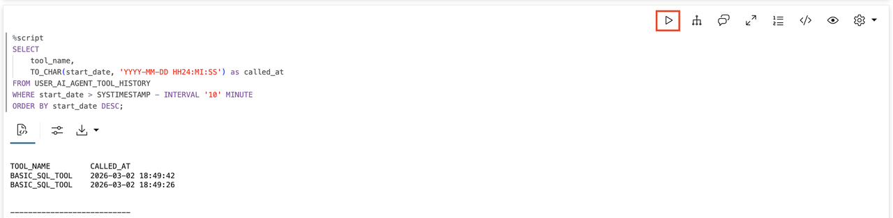

## Summary

In this lab, you experienced the forgetting problem:

* **Shared information**: Told the agent about client preferences and item details
* **Immediate recall worked**: Context was available within the session
* **Session ended**: Cleared the team, simulating logout
* **Everything forgotten**: Agent had no knowledge of the client or item after reset
* **Business impact**: Item application tracking breaks completely

**The two types of memory:**

**Chat memory** (what this agent has): lives in the conversation context, cleared when the session ends, works for single conversations, fails for ongoing client relationships.

**Agentic memory** (what this agent lacks): persists in the database, survives session boundaries, builds knowledge over time, enables continuous client service.

**Key takeaway:** Intelligence doesn't matter if an agent can't remember what just happened. Without memory, agents perform. With memory, agents progress. Sarah Chen shouldn't have to explain her preferences every time she calls -- and with agentic memory, she won't have to.

The next labs will show you how to solve this problem.

## Learn More

* [`DBMS_CLOUD_AI_AGENT` Package](https://docs.oracle.com/en/cloud/paas/autonomous-database/serverless/adbsb/dbms-cloud-ai-agent-package.html)

## Acknowledgements

* **Author** - David Start, Director, Database Product Management
* **Last Updated By/Date** - Kay Malcolm, February 2026

## Cleanup (Optional)

> This command is already in your notebook — just click the play button (▶) to run it.

```sql
<copy>
EXEC DBMS_CLOUD_AI_AGENT.DROP_TEAM('FORGETFUL_TEAM', TRUE);
EXEC DBMS_CLOUD_AI_AGENT.DROP_TASK('FORGETFUL_TASK', TRUE);
EXEC DBMS_CLOUD_AI_AGENT.DROP_AGENT('FORGETFUL_AGENT', TRUE);
EXEC DBMS_CLOUD_AI_AGENT.DROP_TOOL('BASIC_SQL_TOOL', TRUE);
</copy>
```

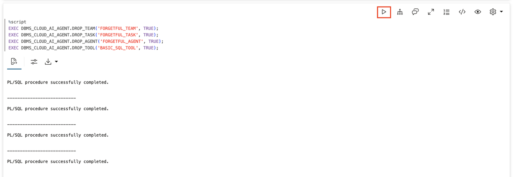
