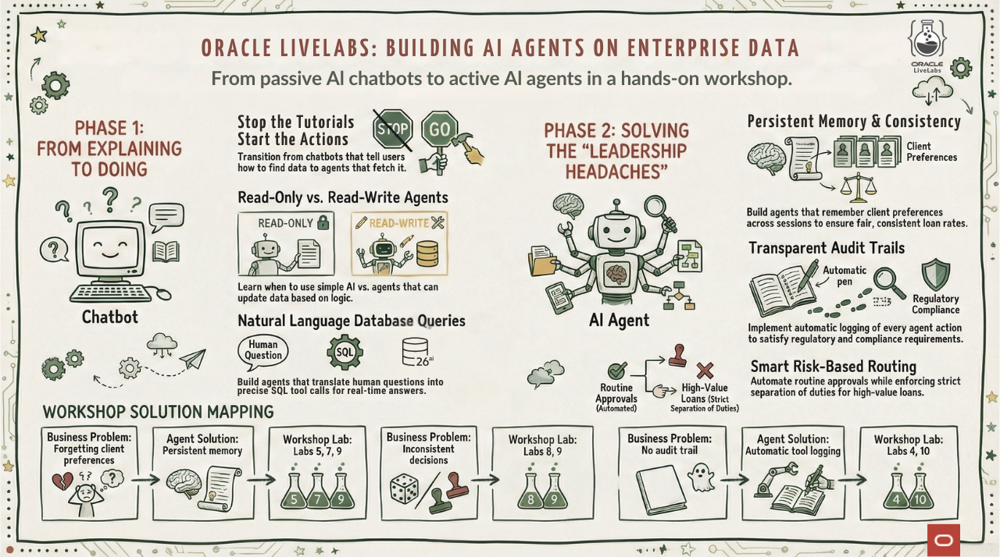

# Introduction

## About this Workshop

**What if your AI could actually do things instead of just explaining how?**

Most AI chatbots are helpful explainers. Ask about a loan status and they'll tell you how to log into the portal, navigate to the right screen, and find the information yourself. Helpful, sure. But you wanted the status, not a tutorial.

AI agents are different. They act. Ask an agent about a loan status and it queries the database and tells you the answer. Same question, completely different outcome.

This workshop teaches you to build agents that execute instead of explain.

## Meet Seer Equity

Throughout this workshop, you will build AI agents for **Seer Equity**, a growing financial services company specializing in personal, auto, mortgage, and business loans.

Seer Equity has been growing fast. Maybe too fast. Their loan officers are overwhelmed, and cracks are starting to show.

### Problems Solved So Far

**"I asked the AI about my loan and it told me how to look it up."**

When clients called asking about their loan applications, they wanted answers, not tutorials. The loan officers were frustrated too, spending time on calls walking clients through information the AI could have fetched instantly.

**In Lab 1, we fixed this.** We built an agent that connects to the loan database and returns real answers. Now when someone asks "What is the status of loan application LOAN-12345?", the agent tells them: "Approved, $45,000 personal loan for Alex Chen, submitted January 2nd." No tutorials. Just the answer.

**"When do we actually need an agent?"**

After deploying the first agent, Seer Equity's technical team had a question: can't we just ask the AI to generate SQL directly? When does the full agent framework actually help?

**In Lab 2, we explored this.** We compared three approaches: zero-shot (no data access), SELECT AI (read-only), and agents (read and write). Watch an agent check a loan's status and update it based on conditions. Seer Equity now knows exactly when to deploy each approach.

### The Problems Still Keeping Leadership Up at Night

**"We keep forgetting our best clients."**

A loan officer quoted standard rates to Sarah Chen, a client who's been with Seer Equity for six years and has a 15% rate exception on file. Sarah was not happy. She'd told three different loan officers about her preferences, and none of them remembered. How many other clients are getting this treatment?

**"Every loan officer handles the same situation differently."**

Two similar business loan applications came in. One got approved at preferred rates; the other got denied outright. Same loan amount, similar credit profiles, similar businesses. The only difference? Which loan officer happened to pick up the phone. There's no way to learn from past decisions or ensure consistency.

**"We have no idea what our AI assistants are actually doing."**

The company deployed AI chatbots to help loan officers, but they're black boxes. When a regulator asks "why was this loan approved?", nobody can answer. The chatbots don't log their reasoning, don't follow documented policies, and sometimes make up information about rates and requirements.

**"Small loans take as long to process as big ones."**

A $25,000 personal loan for a client with excellent credit shouldn't require the same scrutiny as a $500,000 mortgage. But without smart routing, everything goes through the same manual review process. Loan officers spend hours on applications that should take minutes.

**"We can't enforce separation of duties."**

Compliance requires that the person who submits a loan application can't be the same person who approves it. But their current systems don't enforce this. It's just policy that people are supposed to follow. One mistake away from a regulatory finding.

### What's Coming

We'll solve all of these problems in future labs. Here's what Seer Equity will build:

| Business Problem | Agent Solution | you will Build It In |
|------------------|----------------|---------------------|
| Forgetting client preferences | Persistent memory that survives sessions | Labs 5, 7, 9 |
| Inconsistent decisions | Past decision lookup for guidance | Labs 8, 9 |
| No audit trail | Automatic logging of every tool call | Labs 4, 10 |
| No access to policies | Enterprise data integration | Lab 6 |
| Manual processing of routine loans | Risk-based auto-approval rules | Labs 4, 10 |
| No separation of duties | Role-based agents with limited tools | Lab 10 |

This is an ongoing series following Seer Equity as they transform their AI from helpful explainers into trusted actors with memory, consistency, and accountability.

**Follow us on LinkedIn to catch new labs as they release. Also check back into this workshop as we add more content.**

## This Workshop

✅ **Labs available now:**

* **Lab 1: What is an AI Agent?** Build your first agent that queries loan application data. See the difference between a chatbot that *explains* how to check loan status versus an agent that *actually checks it*.

* **Lab 2: Agents vs Zero-Shot.** Compare three approaches: zero-shot (no data access), SELECT AI (read-only), and agents (read and write). Watch an agent check a loan's status and update it based on conditions.

### Objectives

By the end of this workshop, you will be able to:

* Explain the difference between a chatbot and an agent
* Create database tables with comments that help Select AI understand your schema
* Build an agent with a SQL tool using Oracle Select AI Agent framework
* Query the agent using natural language and receive data-driven answers
* View execution history to see what the agent did
* Choose the right approach (zero-shot, SELECT AI, or agent) for different use cases
* Build agents that can update data based on conditional logic

### Prerequisites

For this workshop, we provide the environment. You will need:

* Explain the difference between a chatbot and an agent
* Create database tables with comments that help Select AI understand your schema
* Build an agent with a SQL tool using Oracle Select AI Agent framework
* Query the agent using natural language and receive data-driven answers
* View execution history to see what the agent did
* Choose the right approach (zero-shot, SELECT AI, or agent) for different use cases
* Build agents that can update data based on conditional logic

### Prerequisites

For this workshop, we provide the environment. You will need:

* Basic knowledge of SQL, or the ability to follow along with the prompts

## Learn More

* [Get an Autonomous Database for FREE!](https://www.oracle.com/autonomous-database/free-trial/)
* [Mark Hornick's Select AI Agent Blog](https://blogs.oracle.com/machinelearning/build-your-agentic-solution-using-oracle-adb-select-ai-agent)
* [Oracle Database Documentation](https://docs.oracle.com/en/database/oracle/oracle-database/)
* [`DBMS_CLOUD_AI_AGENT` Package](https://docs.oracle.com/en/cloud/paas/autonomous-database/serverless/adbsb/dbms-cloud-ai-agent-package.html)

## Acknowledgements

* **Author** - David Start, Director, Database Product Management
* **Last Updated By/Date** - Kay Malcolm, February 2026
