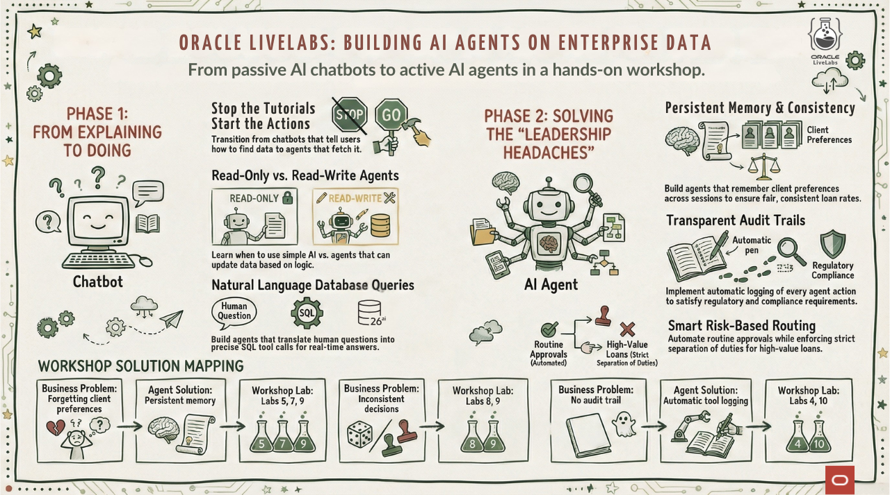

# Introduction

## About this Workshop

**What if your AI could actually do things instead of just explaining how?**

Most AI chatbots are helpful explainers. Ask about a loan status and they'll tell you how to log into the portal, navigate to the right screen, and find the information yourself. Helpful, sure. But you wanted the status, not a tutorial.

AI agents are different. They act. Ask an agent about a loan status and it queries the database and tells you the answer. Same question. Better outcome.

This workshop teaches you to build agents that execute instead of explain.

Estimated Time: 1 hour

## Meet Seer Equity

Throughout this workshop, you will build AI agents for **Seer Equity**, a growing financial services company specializing in personal, auto, mortgage, and business loans.

Seer Equity has been growing fast. Maybe too fast. Their loan officers are overwhelmed, and cracks are starting to show.

### Problems Solved So Far

**"I asked the AI about my loan and it told me how to look it up."**

When clients called asking about their loan applications, they wanted answers, not tutorials. The loan officers were frustrated too, spending time on calls walking clients through information the AI could have fetched instantly.

**In Lab 1, we fixed this.** We built an agent that connects to the loan database and returns real answers. Now when someone asks "What is the status of loan application LOAN-12345?", the agent tells them: "Approved, $45,000 personal loan for Alex Chen, submitted January 2nd." No tutorials. Just the answer.

**"When do we actually need an agent?"**

After deploying the first agent, Seer Equity's technical team had a question: can't we just ask the AI to generate SQL directly? When does the full agent framework actually help?

**In Lab 2, we explored this.** We compared three approaches: zero-shot (no data access), SELECT AI (read-only), and agents (read and write). Watch an agent check a loan's status and update it based on conditions. Seer Equity now knows exactly when to deploy each approach.

**"Before every client call, I spend 10-15 minutes just gathering the information I need."**

Loan officers were pulling together client information from multiple places before every call. Contact preferences, loan history, rate eligibility, credit tier. By the time they had everything, they'd forgotten why the client called. One agent with one tool was not enough. They needed an agent that could plan and execute a multi-step lookup on its own.

**In Lab 3, we fixed this.** We built an agent with three tools and let it figure out which ones to call, in what order, and how to combine the results. Jennifer's 10-15 minute prep is now a 10-second agent call. We also saw how instructions control the planning process, so the agent's behavior stays predictable and easy to debug.

**"Small loans take as long to process as big ones."**

A $25,000 personal loan for a client with excellent credit should not require the same scrutiny as a $500,000 mortgage. But without smart routing, everything goes through the same manual review process. Loan officers spend hours on applications that should take minutes.

**In Lab 4, we fixed this.** We built Seer Equity's loan risk assessment workflow with tools that evaluate applications and route them based on amount and type. Auto-approve, underwriter review, or senior underwriter. We traced the full execution loop, seeing exactly what happens at each step, so every decision is visible and auditable.

**"We keep forgetting our best clients."**

A loan officer quoted standard rates to Sarah Chen. She has been with Seer Equity for six years and has a 15% rate exception on file. Sarah was not happy. She had told three different loan officers about her preferences, and none of them remembered. How many other clients are getting this treatment?

**In Lab 5, we experienced this firsthand.** We told an agent about Sarah Chen's email preference and 15% rate exception. Cleared the session. Asked again. The agent had no idea who Sarah Chen was. This is exactly what is happening to Seer Equity's clients. Now we understand why memory has to persist.

**"Our agents make things up when they don't have the right information."**

Loan officers noticed the AI was confidently stating rate requirements and policy details that were just wrong. It was not lying on purpose. It simply did not have access to Seer Equity's actual lending policies, so it filled in the blanks with its best guess. Best guesses don't survive audits.

**In Lab 6, we fixed this.** We asked an agent about Seer Equity's loan rates. Without enterprise data, it gave generic answers. We connected it to the actual policy database and watched it quote real rates, requirements, and client-specific information. No more guessing.

### The Problems Still Keeping Leadership Up at Night

**"Every loan officer handles the same situation differently."**

Two similar business loan applications came in. One got approved at preferred rates; the other got denied outright. Same loan amount, similar credit profiles, similar businesses. The only difference? Which loan officer happened to pick up the phone. There is no way to learn from past decisions or ensure consistency.

**"We cannot enforce separation of duties."**

Compliance requires that the person who submits a loan application cannot be the same person who approves it. But their current systems don't enforce this. It is just policy that people are supposed to follow. One mistake away from a regulatory finding.

### What is Coming

We will solve these problems in future labs. Here is what Seer Equity will build:

| Business Problem | Agent Solution | You Will Build It In |
|------------------|----------------|---------------------|
| Forgetting client preferences | Persistent memory that survives sessions | Labs 7, 9 |
| Inconsistent decisions | Past decision lookup for guidance | Labs 8, 9 |
| No separation of duties | Role-based agents with limited tools | Lab 10 |

This is an ongoing series following Seer Equity as they transform their AI from helpful explainers into trusted actors with memory, consistency, and accountability.

**Follow us on LinkedIn to catch new labs as they release. Also check back into this workshop as we add more content.**

## This Workshop

✅ **Labs available now:**

* **Lab 1: What Is an AI Agent?** Build your first agent that queries loan application data. See the difference between a chatbot that *explains* how to check loan status versus an agent that *actually checks it*.

* **Lab 2: Agents vs Zero-Shot.** Compare three approaches: zero-shot (no data access), SELECT AI (read-only), and agents (read and write). Watch an agent check a loan's status and update it based on conditions.

* **Lab 3: How Agents Plan the Work.** Give an agent three tools and watch it plan a multi-step client lookup. See how it picks which tools to call, in what order, and how instructions keep the behavior predictable.

* **Lab 4: How Agents Actually Get Work Done.** Build Seer Equity's loan risk assessment workflow. Create tools that evaluate applications and route them based on amount and type. Trace the full execution loop from request to response.

* **Lab 5: Why Agents Need Memory.** Experience the forgetting problem firsthand. Tell an agent about a client's preferences, clear the session, and watch it forget everything. See why memory has to persist across sessions.

* **Lab 6: Why Enterprise Data Matters.** See agents fail when they lack context, then succeed once connected to enterprise data. Watch an agent go from generic guesses to quoting real rates and policies.

### Objectives

By the end of this workshop, you will be able to:

* Explain the difference between a chatbot and an agent
* Build an agent with SQL tools and query it using natural language
* Choose the right approach (zero-shot, SELECT AI, or agent) for different use cases
* Trace an agent's execution loop and interpret its reasoning at each step
* Explain why agents need memory that persists and what happens without it
* Connect agents to enterprise data sources so they stop guessing

### Prerequisites

For this workshop, we provide the environment. You will need:

* Basic knowledge of SQL, or the ability to follow along with the prompts

## Learn More

* [Get an Autonomous Database for FREE!](https://www.oracle.com/autonomous-database/free-trial/)
* [Mark Hornick's Select AI Agent Blog](https://blogs.oracle.com/machinelearning/build-your-agentic-solution-using-oracle-adb-select-ai-agent)
* [Oracle Database Documentation](https://docs.oracle.com/en/database/oracle/oracle-database/)
* [`DBMS_CLOUD_AI_AGENT` Package](https://docs.oracle.com/en/cloud/paas/autonomous-database/serverless/adbsb/dbms-cloud-ai-agent-package.html)

## Acknowledgements

* **Author** - David Start, Director, Database Product Management
* **Last Updated By/Date** - Kay Malcolm, February 2026
