# What Is an AI Agent, Really?

## Introduction

Most people think AI is just a chatbot. You ask a question, it gives an answer. But agents do more. They don't just respond, they *act*. They look up real data, make decisions based on your systems, and complete tasks.

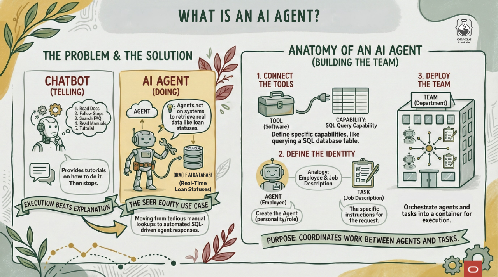

In this lab, you'll see that difference firsthand at **Seer Equity**, a growing financial services company. You'll create an agent that can query actual loan application data from your database. It won't explain how to check applications. It will actually check them and give you real answers.

### The Business Problem

At Seer Equity, loan officers spend hours every day answering the same question: *"What's my loan status?"*

When a client calls, the loan officer has to log into the system, navigate to the right screen, find the application, and read out the status. It's tedious. It's slow. And it takes time away from actually helping clients.

The company tried deploying a chatbot. But when a client asked "What's the status of my loan application?", the chatbot responded with a 5-step tutorial on how to log in and check. The client didn't want a tutorial. They wanted their status.

> *"I asked the AI about my loan and it told me how to look it up. I know how to look it up! I wanted you to just tell me the status."*
>
> Frustrated Seer Equity client

### What You'll Learn

This lab shows you the fundamental difference between a chatbot (explains how) and an agent (actually does it). You'll build an agent that queries real loan data and returns actual answers. This is the first step toward solving Seer Equity's client service challenges.

**What you'll build:** A loan application lookup agent with a SQL tool that queries your database.

Estimated Time: 10 minutes

### Objectives

* Create sample loan application data for the agent to query
* Build an agent with a SQL tool
* See the agent look up real loan information
* Understand why execution beats explanation

### Prerequisites

For this workshop, we provide the environment. You'll need:

* Basic knowledge of SQL and PL/SQL, or the ability to follow along with the prompts

## Task 1: Import the Lab Notebook

Before you begin, you are going to import a notebook that has all of the commands for this lab into Oracle Machine Learning. This way you don't have to copy and paste them over to run them.

1. From the Oracle Machine Learning home page, click **Notebooks**.

    

2. Click **Import** to expand the Import drop down.

    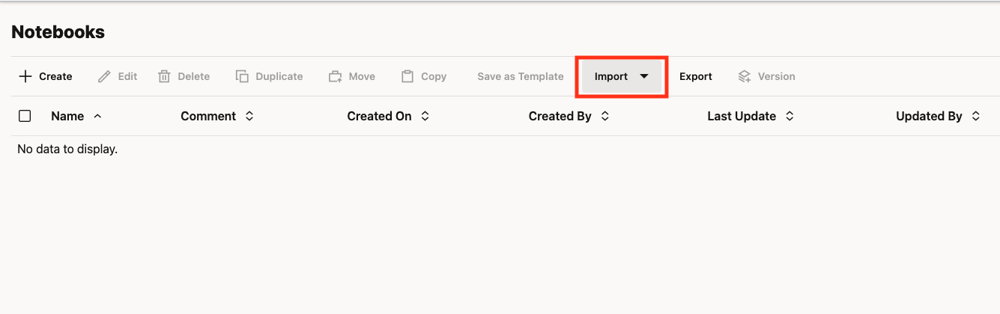

3. Select **Git**.

    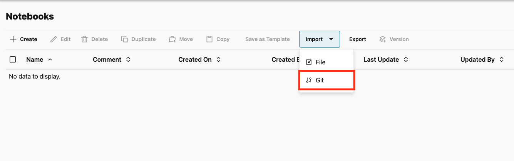

4. Paste the following GitHub URL leaving the credential field blank:

    ```text
    <copy>
    https://github.com/davidastart/database/blob/main/ai4u/what-is-agent/lab1-what-is-agent.json
    </copy>
    ```
    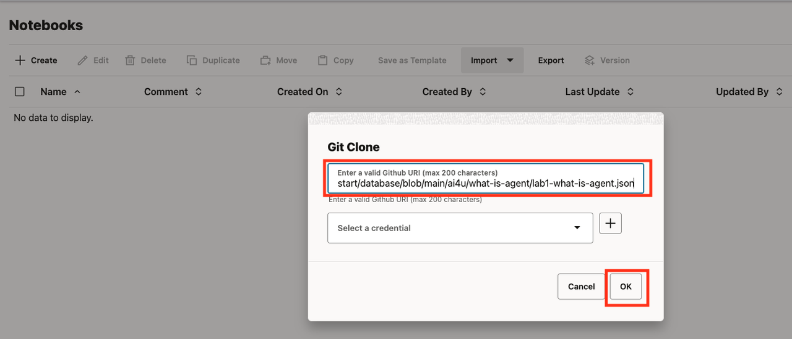

5. Click **Ok**.

    

You should now be on the screen with the notebook imported. This workshop will have all of the screenshots and detailed information however the notebook will have the commands and basic instructions for completing the lab.

## Task 2: Create the Loan Applications Table

First, let's create a loan applications table. This gives the agent something real to work with, the kind of data that a chatbot would never be able to access.

1. Create the loan applications table.

    > This command is already in your notebook—just click the play button (▶) to run it.

    ```sql
    <copy>
    CREATE TABLE loan_applications (
        application_id     VARCHAR2(20) PRIMARY KEY,
        applicant_name     VARCHAR2(100),
        application_date   DATE,
        loan_status        VARCHAR2(30),
        loan_amount        NUMBER(12,2),
        loan_type          VARCHAR2(30)
    );
    </copy>
    ```

    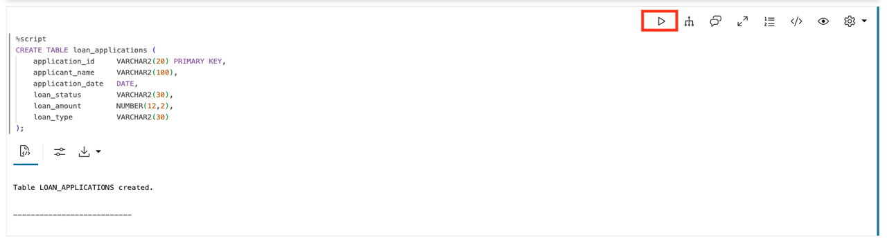

2. Add comments so Select AI understands what this table contains.

    >**Note:** Select AI reads table and column comments to understand your schema. Good comments make the AI smarter about your data.

    > This command is already in your notebook—just click the play button (▶) to run it.

    ```sql
    <copy>
    COMMENT ON TABLE loan_applications IS 'Seer Equity loan applications including status tracking and amounts';
    COMMENT ON COLUMN loan_applications.application_id IS 'Unique application identifier like LOAN-12345';
    COMMENT ON COLUMN loan_applications.applicant_name IS 'Full name of the person or business applying for the loan';
    COMMENT ON COLUMN loan_applications.application_date IS 'Date the loan application was submitted';
    COMMENT ON COLUMN loan_applications.loan_status IS 'Current status: Pending, Under Review, Approved, or Denied';
    COMMENT ON COLUMN loan_applications.loan_amount IS 'Requested loan amount in dollars';
    COMMENT ON COLUMN loan_applications.loan_type IS 'Type of loan: Personal, Auto, Mortgage, or Business';
    </copy>
    ```

    

3. Add sample loan applications.

    > This command is already in your notebook—just click the play button (▶) to run it.

    ```sql
    <copy>
    INSERT INTO loan_applications VALUES ('LOAN-12345', 'Alex Chen', DATE '2025-01-02', 'Approved', 45000, 'Personal');
    INSERT INTO loan_applications VALUES ('LOAN-12346', 'Maria Santos', DATE '2025-01-03', 'Under Review', 275000, 'Mortgage');
    INSERT INTO loan_applications VALUES ('LOAN-12347', 'James Wilson', DATE '2024-12-28', 'Approved', 32000, 'Auto');
    INSERT INTO loan_applications VALUES ('LOAN-12348', 'Sarah Johnson', DATE '2025-01-04', 'Pending', 85000, 'Business');
    COMMIT;
    </copy>
    ```

    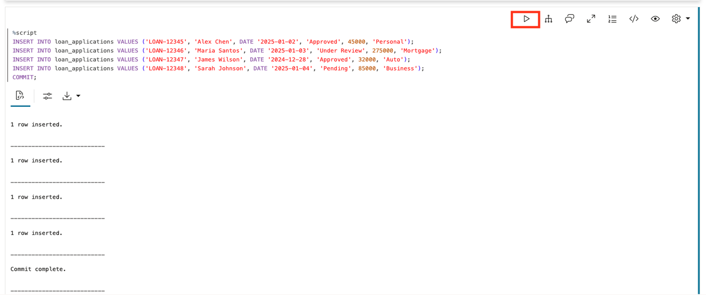

4. Verify the data exists.

    > This command is already in your notebook—just click the play button (▶) to run it.

    ```sql
    <copy>
    SELECT application_id, applicant_name, loan_status, loan_amount, loan_type FROM loan_applications;
    </copy>
    ```

    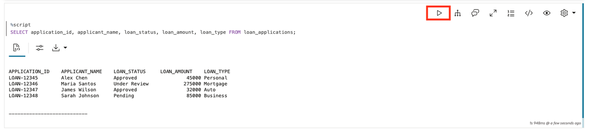

## Task 3: Add the Table to Your AI Profile

For Select AI to query your table, the profile needs to know about it. We'll add the table to your existing `genai` profile's object list.

1. Add the LOAN_APPLICATIONS table to the genai profile.

    >**Note:** The `object_list` tells Select AI which tables it can query. Without this, the AI won't know your table exists.

    > This command is already in your notebook—just click the play button (▶) to run it.

    ```sql
    <copy>
    BEGIN
        DBMS_CLOUD_AI.SET_ATTRIBUTE(
            profile_name    => 'genai',
            attribute_name  => 'object_list',
            attribute_value => '[{"owner": "' || USER || '", "name": "LOAN_APPLICATIONS"}]'
        );
    END;
    /
    </copy>
    ```

    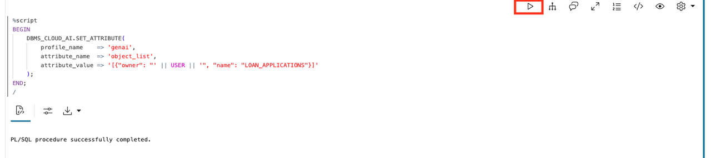

## Task 4: Create the Agent Components

Now let's build an agent that can query this data. An agent system has four components that work together:

| Component | Purpose |
|-----------|--------|
| **Tool** | Defines a specific capability the agent can use (like querying a database) |
| **Agent** | The AI personality with a role and behavior guidelines |
| **Task** | Instructions that tell the agent what to do and which tools to use |
| **Team** | Brings agents and tasks together so you can run them |

Think of it like hiring a new employee: the **tool** is the software they'll use, the **agent** is the person with their job title and responsibilities, the **task** is their job description, and the **team** is the department that coordinates their work.

1. Create the SQL tool.

    A **tool** gives the agent a specific capability. Without tools, an agent can only talk, it can't actually do anything. This SQL tool connects to your AI profile and allows the agent to query the loan applications table. The description helps the agent understand when and how to use this tool.

    > This command is already in your notebook—just click the play button (▶) to run it.

    ```sql
    <copy>
    BEGIN
        DBMS_CLOUD_AI_AGENT.CREATE_TOOL(
            tool_name   => 'LOAN_LOOKUP',
            attributes  => '{"tool_type": "SQL",
                            "tool_params": {"profile_name": "genai"}}',
            description => 'Query the LOAN_APPLICATIONS table. Columns: APPLICATION_ID, APPLICANT_NAME, APPLICATION_DATE, LOAN_STATUS (Pending/Under Review/Approved/Denied), LOAN_AMOUNT, LOAN_TYPE (Personal/Auto/Mortgage/Business).'
        );
    END;
    /
    </copy>
    ```

    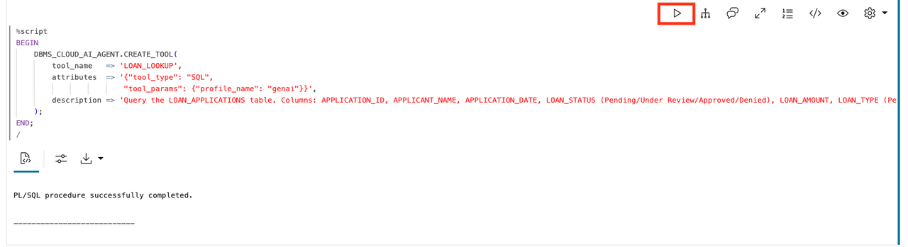

2. Create the agent.

    An **agent** is the AI entity that will handle requests. The `role` attribute shapes the agent's personality and behavior, it's like giving an employee their job title and explaining how they should approach their work. Here we're telling the agent it's a loan application assistant and should always use its tools rather than asking follow-up questions.

    > This command is already in your notebook—just click the play button (▶) to run it.

    ```sql
    <copy>
    BEGIN
        DBMS_CLOUD_AI_AGENT.CREATE_AGENT(
            agent_name  => 'LOAN_AGENT',
            attributes  => '{"profile_name": "genai",
                            "role": "You are a loan application assistant for Seer Equity. Always use the LOAN_LOOKUP tool to query the database and provide answers. Never ask clarifying questions - just query the data and report what you find."}',
            description => 'Agent that looks up loan application information'
        );
    END;
    /
    </copy>
    ```

    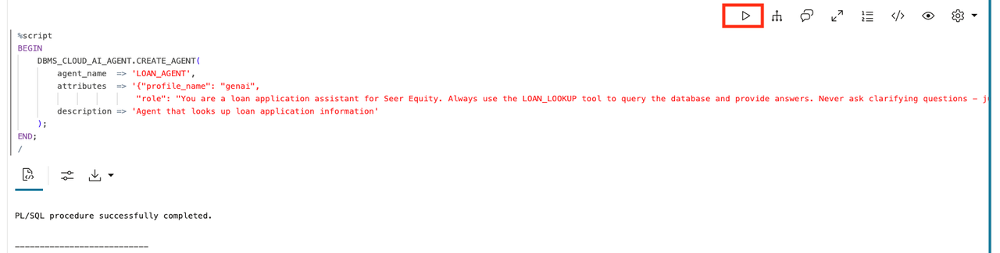

3. Create the task.

    A **task** is a set of instructions that tells the agent exactly what to do when it receives a request. It also specifies which tools the agent can use for this task. The `{query}` placeholder is where the user's question gets inserted. Think of the task as the detailed job description that guides the agent's work.

    > This command is already in your notebook—just click the play button (▶) to run it.

    ```sql
    <copy>
    BEGIN
        DBMS_CLOUD_AI_AGENT.CREATE_TASK(
            task_name   => 'LOAN_TASK',
            attributes  => '{"instruction": "Answer questions about Seer Equity loan applications by querying the LOAN_APPLICATIONS table using the LOAN_LOOKUP tool. The table has columns: APPLICATION_ID, APPLICANT_NAME, APPLICATION_DATE, LOAN_STATUS (Pending, Under Review, Approved, Denied), LOAN_AMOUNT, LOAN_TYPE (Personal, Auto, Mortgage, Business). Do not ask clarifying questions - query the data and provide the answer. User question: {query}",
                            "tools": ["LOAN_LOOKUP"]}',
            description => 'Task for handling loan application inquiries'
        );
    END;
    /
    </copy>
    ```

    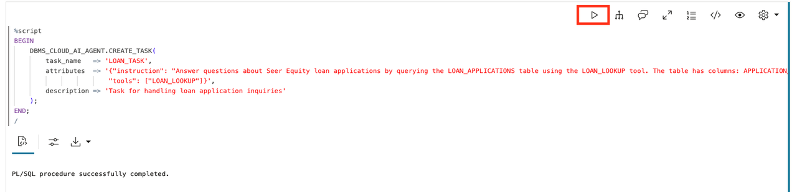

4. Create the team.

    A **team** is the container that brings everything together. It assigns agents to tasks and defines how they coordinate. The `process` attribute determines how work flows, "sequential" means agents work one after another (in this case we only have one agent). You interact with the team, and the team orchestrates which agent handles your request using which task.

    > This command is already in your notebook—just click the play button (▶) to run it.

    ```sql
    <copy>
    BEGIN
        DBMS_CLOUD_AI_AGENT.CREATE_TEAM(
            team_name   => 'LOAN_TEAM',
            attributes  => '{"agents": [{"name": "LOAN_AGENT", "task": "LOAN_TASK"}],
                            "process": "sequential"}',
            description => 'Team for loan application inquiries'
        );
    END;
    /
    </copy>
    ```

    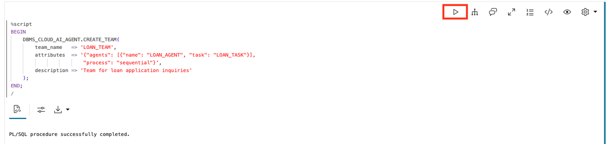

5. Verify everything is created.

    > This command is already in your notebook—just click the play button (▶) to run it.

    ```sql
    <copy>
    SELECT tool_name, status FROM USER_AI_AGENT_TOOLS WHERE tool_name = 'LOAN_LOOKUP';
    SELECT agent_name, status FROM USER_AI_AGENTS WHERE agent_name = 'LOAN_AGENT';
    SELECT task_name, status FROM USER_AI_AGENT_TASKS WHERE task_name = 'LOAN_TASK';
    SELECT agent_team_name, status FROM USER_AI_AGENT_TEAMS WHERE agent_team_name = 'LOAN_TEAM';
    </copy>
    ```

    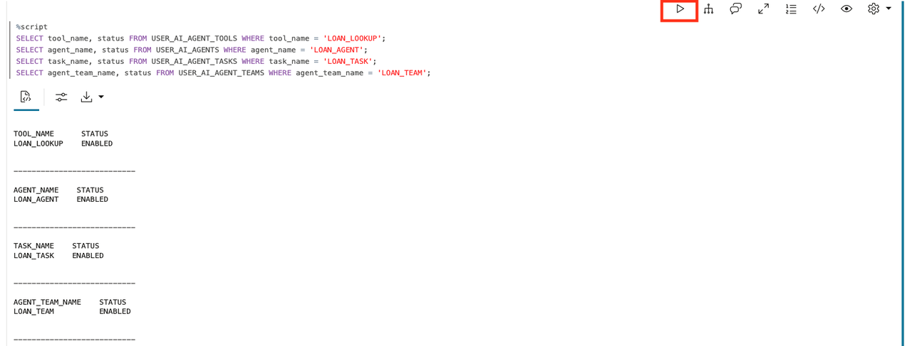

## Task 5: See the Agent in Action

Now let's see the difference between an agent and a chatbot.

1. Set the team for your session.

    > This command is already in your notebook—just click the play button (▶) to run it.

    ```sql
    <copy>
    EXEC DBMS_CLOUD_AI_AGENT.SET_TEAM('LOAN_TEAM');
    </copy>
    ```

    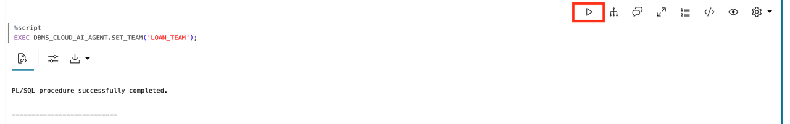

2. Ask about a specific loan application.

    **This is the key moment.** The agent doesn't explain *how* to check loan status. It actually queries the loan_applications table and tells you the answer.

    > This command is already in your notebook—just click the play button (▶) to run it.

    ```sql
    <copy>
    SELECT AI AGENT What is the status of loan application LOAN-12345;
    </copy>
    ```

    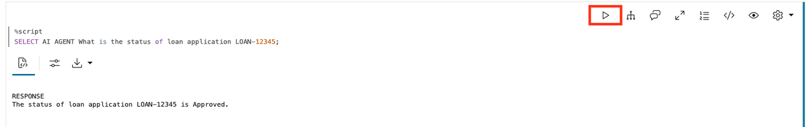

3. Ask about another application.

    > This command is already in your notebook—just click the play button (▶) to run it.

    ```sql
    <copy>
    SELECT AI AGENT How much did James Wilson apply for;
    </copy>
    ```

    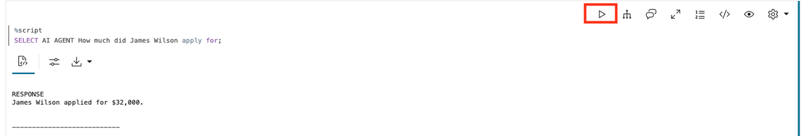

4. Ask a question that requires reasoning over data.

    > This command is already in your notebook—just click the play button (▶) to run it.

    ```sql
    <copy>
    SELECT AI AGENT Which loan applications are still pending or under review;
    </copy>
    ```

    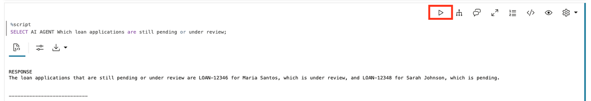

## Task 6: See What Happened Behind the Scenes

The agent used a tool to get real answers. Let's see the evidence.

1. Check the tool execution history.

    > This command is already in your notebook—just click the play button (▶) to run it.

    ```sql
    <copy>
    SELECT 
        tool_name,
        TO_CHAR(start_date, 'HH24:MI:SS') as called_at,
        SUBSTR(output, 1, 60) as result
    FROM USER_AI_AGENT_TOOL_HISTORY
    ORDER BY start_date DESC
    FETCH FIRST 5 ROWS ONLY;
    </copy>
    ```

    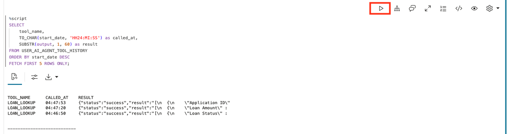

2. Check the team execution history.

    > This command is already in your notebook—just click the play button (▶) to run it.

    ```sql
    <copy>
    SELECT 
        team_name,
        TO_CHAR(start_date, 'HH24:MI:SS') as started,
        state
    FROM USER_AI_AGENT_TEAM_HISTORY
    ORDER BY start_date DESC
    FETCH FIRST 5 ROWS ONLY;
    </copy>
    ```

    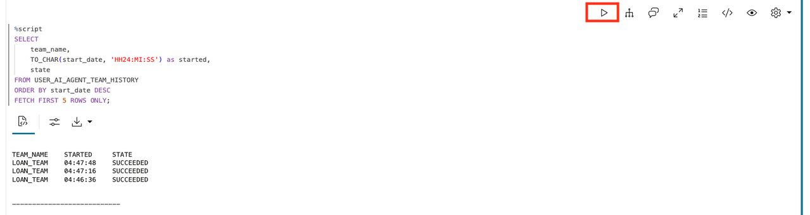

## Task 7: The Chatbot vs Agent Difference

**A chatbot would say:**

> "To check the status of a loan application, you would typically:
> 1. Log into the Seer Equity portal
> 2. Navigate to Application Status
> 3. Enter your application ID
> 4. View the current status"

**The agent said:**

> "Loan application LOAN-12345 for Alex Chen was submitted on January 2, 2025 for a $45,000 personal loan. Current status: Approved."

Same question. One explains the process. The other runs it.

That's what makes an agent an agent. It doesn't just know things. It *does* things. And that's exactly what Seer Equity's clients need.

## Summary

In this lab, you experienced the fundamental nature of AI agents:

* Created a loan applications table with descriptive comments for Select AI
* Added the table to your AI profile's `object_list`
* Built an agent with access to a SQL tool
* Watched it query real loan data to answer questions
* Saw the execution history proving it took action
* Understood the difference between explanation and execution

**Key takeaway:** An agent acts on your systems. A chatbot explains how you could act on your systems. That's the difference that matters for Seer Equity, and for your business.

## Learn More

* [`DBMS_CLOUD_AI_AGENT` Package](https://docs.oracle.com/en/cloud/paas/autonomous-database/serverless/adbsb/dbms-cloud-ai-agent-package.html)

## Acknowledgements

* **Author** - David Start
* **Last Updated By/Date** - David Start, January 2026

## Cleanup (Optional)

> This command is already in your notebook—just click the play button (▶) to run it.

```sql
<copy>
EXEC DBMS_CLOUD_AI_AGENT.DROP_TEAM('LOAN_TEAM', TRUE);
EXEC DBMS_CLOUD_AI_AGENT.DROP_TASK('LOAN_TASK', TRUE);
EXEC DBMS_CLOUD_AI_AGENT.DROP_AGENT('LOAN_AGENT', TRUE);
EXEC DBMS_CLOUD_AI_AGENT.DROP_TOOL('LOAN_LOOKUP', TRUE);
DROP TABLE loan_applications PURGE;
</copy>
```

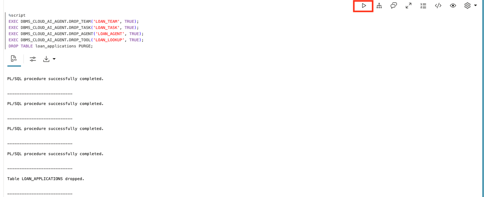
