# Where Agent Memory Should Live

## Introduction

In this lab, you'll build a **memory core**, the converged database foundation that gives AI agents **agentic memory**.

### The Business Problem

In Lab 5, you experienced the forgetting problem firsthand. Sarah Chen had to explain her preferences and rate exception to three different loan officers. The AI assistant forgot everything the moment each session ended.

This isn't just frustrating. It's costing Seer Equity business. Clients feel unvalued. Loan officers waste time re-gathering information. And compliance can't track what was communicated.

> *"Every conversation starts from zero. I told your AI about my preferences last week. Today it has no idea who I am."*
>
> Sarah Chen, Seer Equity Client

### What You'll Learn

In this lab, you'll solve the forgetting problem by building a **memory core**, the database foundation that gives agents persistent memory:

1. **Create memory tables** using Oracle's native JSON for flexible storage
2. **Build remember/recall functions** that agents call as tools
3. **Register the tools** so the agent can store and retrieve facts
4. **Test across sessions** to prove memory persists

The key insight: Memory isn't a model capability. It's a database capability. The LLM provides intelligence; your database provides memory. Together, they create agents that actually remember.

**What you'll build:** A persistent memory system where agents store and recall client information across sessions.

Estimated Time: 15 minutes

### Objectives

* Build a memory core using Oracle's native JSON type
* Create PL/SQL functions as agent tools for memory
* Register tools with the agent framework
* Have conversations with an agent that has true agentic memory

### Prerequisites

For this workshop, we provide the environment. You'll need:

* Basic knowledge of SQL and PL/SQL, or the ability to follow along with the prompts

## Task 1: Import the Lab Notebook

Before you begin, you are going to import a notebook that has all of the commands for this lab into Oracle Machine Learning. This way you don't have to copy and paste them over to run them.

1. From the Oracle Machine Learning home page, click **Notebooks**.
    

2. Click **Import** to expand the Import drop down.
    

3. Select **Git**.
    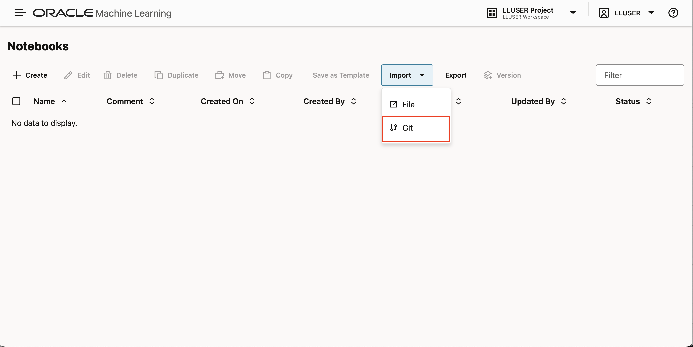

4. Paste the following GitHub URL leaving the credential field blank:

    ```text
    <copy>
    https://github.com/davidastart/database/blob/main/ai4u/where-memory-lives/lab7-where-memory-lives.json
    </copy>
    ```

5. Click **Ok**.
    

    You should now be on the screen with the notebook imported. This workshop will have all of the screenshots and detailed information however the notebook will have the commands and basic instructions for completing the lab.

## Task 2: Create the Memory Core Table

The memory table is the foundation, where the agent stores everything it learns. We use JSON for the content because memories can have different shapes: some might be simple facts, others might be preferences with multiple attributes.

1. Create the memory core table.

    > This command is already in your notebook—just click the play button (▶) to run it.

    ```sql
    <copy>
    CREATE TABLE agent_memory (
        memory_id      RAW(16) DEFAULT SYS_GUID() PRIMARY KEY,
        agent_id       VARCHAR2(100) DEFAULT 'SEERS_AGENT',
        memory_type    VARCHAR2(20) DEFAULT 'FACT',
        content        JSON NOT NULL,
        created_at     TIMESTAMP DEFAULT SYSTIMESTAMP
    );
    </copy>
    ```

    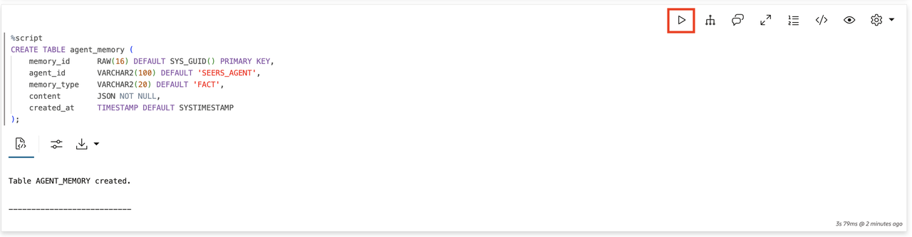

2. Create indexes for efficient JSON queries.

    > This command is already in your notebook—just click the play button (▶) to run it.

    ```sql
    <copy>
    CREATE INDEX idx_memory_about ON agent_memory m (m.content.about.string());
    CREATE INDEX idx_memory_type ON agent_memory(memory_type);
    </copy>
    ```

    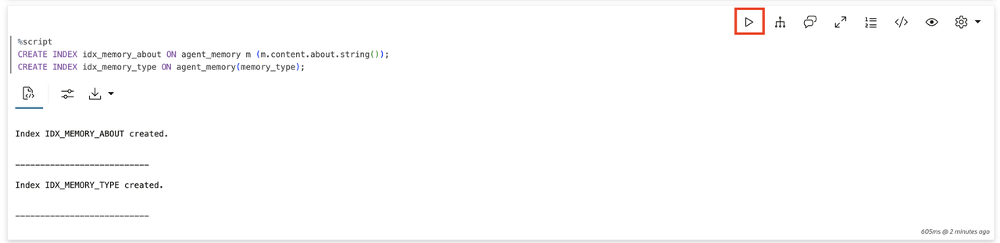

## Task 3: Create the Remember Function

This function becomes the agent's "save to memory" capability. When someone tells the agent something important, the agent calls this function to store it permanently.

1. Create the function to store facts.

    The function returns a JSON result confirming what was stored. This gives the agent a concrete, complete result to report back to the loan officer — the same pattern used by other tools in this workshop.

    > This command is already in your notebook—just click the play button (▶) to run it.

    ```sql
    <copy>
    CREATE OR REPLACE FUNCTION remember_fact(
        p_fact     VARCHAR2,
        p_category VARCHAR2 DEFAULT 'general',
        p_about    VARCHAR2 DEFAULT NULL
    ) RETURN VARCHAR2 AS
        PRAGMA AUTONOMOUS_TRANSACTION;
    BEGIN
        INSERT INTO agent_memory (memory_type, content)
        VALUES (
            'FACT',
            JSON_OBJECT(
                'fact'       VALUE p_fact,
                'category'   VALUE p_category,
                'about'      VALUE p_about,
                'source'     VALUE 'loan_officer_conversation',
                'remembered' VALUE TO_CHAR(SYSTIMESTAMP, 'YYYY-MM-DD HH24:MI:SS')
            )
        );
        COMMIT;

        RETURN '{"stored": true, "fact": "' || p_fact || '", "category": "' || p_category || '", "about": "' || NVL(p_about,'') || '"}';
    END;
    /
    </copy>
    ```

    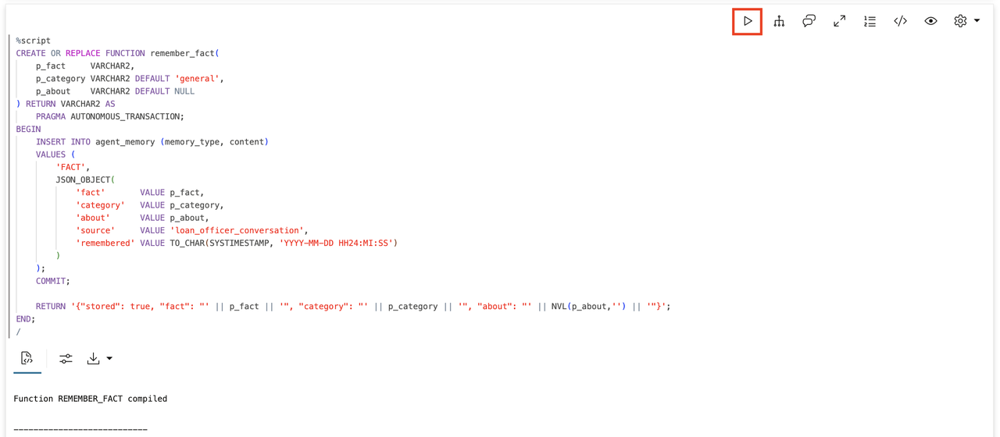

## Task 4: Create the Recall Function

The recall function is the agent's "search memory" capability. When someone asks the agent a question, the agent can search its memory for relevant facts.

1. Create the function to retrieve facts.

    > This command is already in your notebook—just click the play button (▶) to run it.

    ```sql
    <copy>
    CREATE OR REPLACE FUNCTION recall_facts(
        p_about    VARCHAR2 DEFAULT NULL,
        p_category VARCHAR2 DEFAULT NULL
    ) RETURN CLOB AS
        v_result CLOB := '';
        v_count  NUMBER := 0;
    BEGIN
        FOR rec IN (
            SELECT
                m.content.fact.string() as fact,
                m.content.category.string() as category,
                m.content.about.string() as about,
                created_at
            FROM agent_memory m
            WHERE memory_type = 'FACT'
            AND (p_about IS NULL OR UPPER(m.content.about.string()) LIKE '%' || UPPER(p_about) || '%')
            AND (p_category IS NULL OR UPPER(m.content.category.string()) = UPPER(p_category))
            ORDER BY created_at DESC
            FETCH FIRST 10 ROWS ONLY
        ) LOOP
            v_result := v_result || '- ' || rec.fact;
            IF rec.about IS NOT NULL THEN
                v_result := v_result || ' (client: ' || rec.about || ')';
            END IF;
            v_result := v_result || CHR(10);
            v_count := v_count + 1;
        END LOOP;

        IF v_count = 0 THEN
            RETURN 'No facts found matching the criteria.';
        END IF;

        RETURN 'Found ' || v_count || ' facts:' || CHR(10) || v_result;
    END;
    /
    </copy>
    ```

    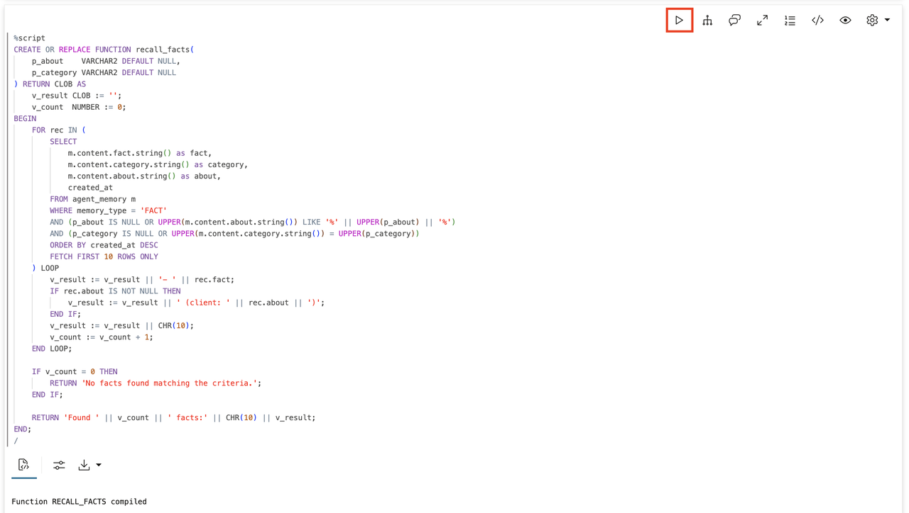

## Task 5: Register the Agent Tools

Tools bridge your PL/SQL functions and the AI agent. Each tool's instruction tells the agent what parameters to pass — the same pattern used throughout this workshop.

1. Register the "remember" tool.

    > This command is already in your notebook—just click the play button (▶) to run it.

    ```sql
    <copy>
    BEGIN
        DBMS_CLOUD_AI_AGENT.CREATE_TOOL(
            tool_name   => 'REMEMBER_TOOL',
            attributes  => '{"instruction": "Store a fact about a client. Parameters: P_FACT (the fact to store), P_CATEGORY (optional: general, rate_exception, contact_preference, loan_history), P_ABOUT (optional: client name, e.g. Sarah Chen).",
                            "function": "remember_fact"}',
            description => 'Stores facts about clients in long-term memory for future recall'
        );
    END;
    /
    </copy>
    ```

    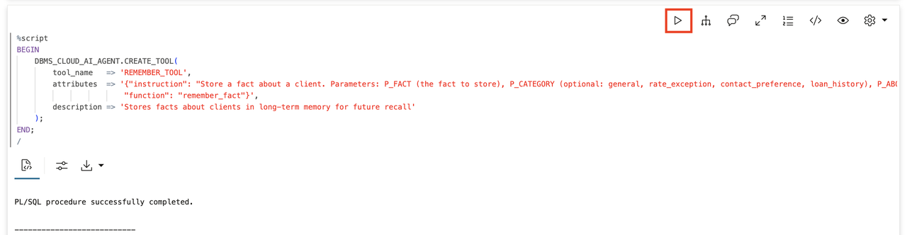

2. Register the "recall" tool.

    > This command is already in your notebook—just click the play button (▶) to run it.

    ```sql
    <copy>
    BEGIN
        DBMS_CLOUD_AI_AGENT.CREATE_TOOL(
            tool_name   => 'RECALL_TOOL',
            attributes  => '{"instruction": "Retrieve stored facts about a client. Parameters: P_ABOUT (optional: client name to search), P_CATEGORY (optional: category filter).",
                            "function": "recall_facts"}',
            description => 'Retrieves stored facts about clients from long-term memory'
        );
    END;
    /
    </copy>
    ```

    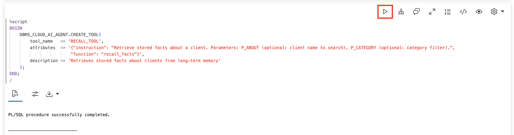

3. Verify the tools were created.

    > This command is already in your notebook—just click the play button (▶) to run it.

    ```sql
    <copy>
    SELECT tool_name, status, description FROM USER_AI_AGENT_TOOLS;
    </copy>
    ```

    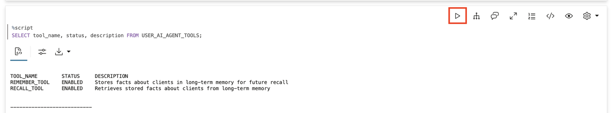

## Task 6: Create the Agent, Task, and Team

The agent role describes what the agent does and tells it to report results back to the user. The task instruction describes the concrete action for each request — the same approach used in Lab 10.

1. Create the agent.

    > This command is already in your notebook—just click the play button (▶) to run it.

    ```sql
    <copy>
    BEGIN
        DBMS_CLOUD_AI_AGENT.CREATE_AGENT(
            agent_name  => 'MEMORY_AGENT',
            attributes  => '{"profile_name": "genai",
                            "role": "You are a loan officer assistant for Seer Equity. When loan officers share client information, call REMEMBER_TOOL and confirm to the user what was stored. When they ask about a client, call RECALL_TOOL and tell the user what was found."}',
            description => 'An agent with persistent memory for Seer Equity'
        );
    END;
    /
    </copy>
    ```

    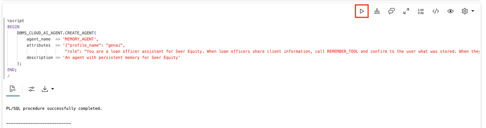

2. Create the task.

    > This command is already in your notebook—just click the play button (▶) to run it.

    ```sql
    <copy>
    BEGIN
        DBMS_CLOUD_AI_AGENT.CREATE_TASK(
            task_name   => 'MEMORY_TASK',
            attributes  => '{"instruction": "When the loan officer shares client information, call REMEMBER_TOOL with the fact, category, and client name. Then respond to the user confirming what was remembered. When they ask about a client, call RECALL_TOOL with the client name. Then respond to the user with the facts returned by the tool. User request: {query}",
                            "tools": ["REMEMBER_TOOL", "RECALL_TOOL"]}',
            description => 'Task for memory-enabled loan conversations'
        );
    END;
    /
    </copy>
    ```

    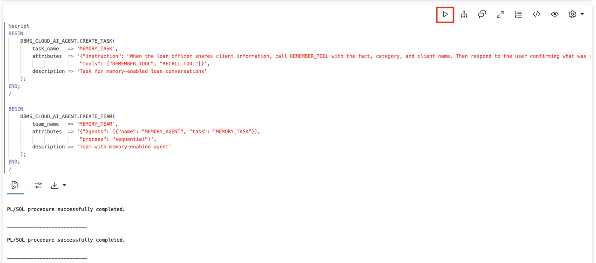

3. Create the team.

    > This command is already in your notebook—just click the play button (▶) to run it.

    ```sql
    <copy>
    BEGIN
        DBMS_CLOUD_AI_AGENT.CREATE_TEAM(
            team_name   => 'MEMORY_TEAM',
            attributes  => '{"agents": [{"name": "MEMORY_AGENT", "task": "MEMORY_TASK"}],
                            "process": "sequential"}',
            description => 'Team with memory-enabled agent'
        );
    END;
    /
    </copy>
    ```

    

## Task 7: Talk to Your Agent

Now let's see memory in action.

1. Set the team.

    > This command is already in your notebook—just click the play button (▶) to run it.

    ```sql
    <copy>
    EXEC DBMS_CLOUD_AI_AGENT.SET_TEAM('MEMORY_TEAM');
    </copy>
    ```

    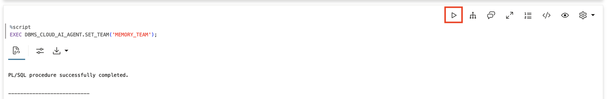

2. Tell the agent something to remember.

    > This command is already in your notebook—just click the play button (▶) to run it.

    ```sql
    <copy>
    SELECT AI AGENT Sarah Chen prefers email over phone;
    </copy>
    ```

    **Watch for:** One tool call in the tool history, then the agent confirms what was stored.

    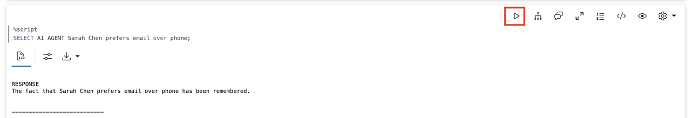

3. Tell it more.

    > This command is already in your notebook—just click the play button (▶) to run it.

    ```sql
    <copy>
    SELECT AI AGENT Sarah Chen has a 15 percent rate exception and her timezone is Pacific;
    </copy>
    ```

    **Watch for:** Two tool calls in the tool history — the agent splits the two facts and stores each separately.

    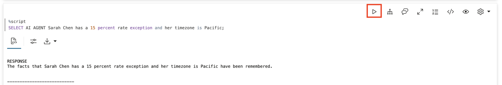

4. Ask about what it knows.

    > This command is already in your notebook—just click the play button (▶) to run it.

    ```sql
    <copy>
    SELECT AI AGENT What do you know about Sarah Chen;
    </copy>
    ```

    **Watch for:** The agent returns the email preference, 15% rate exception, and Pacific timezone.

    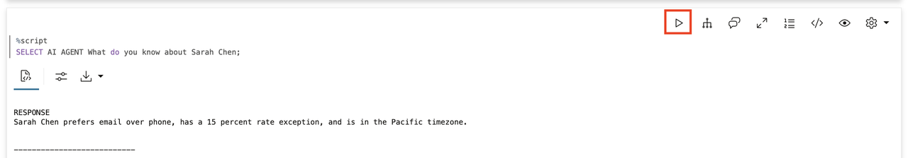

## Task 8: Verify Persistence Across Sessions

1. Clear and reset the session.

    > This command is already in your notebook—just click the play button (▶) to run it.

    ```sql
    <copy>
    EXEC DBMS_CLOUD_AI_AGENT.CLEAR_TEAM;
    EXEC DBMS_CLOUD_AI_AGENT.SET_TEAM('MEMORY_TEAM');
    </copy>
    ```

    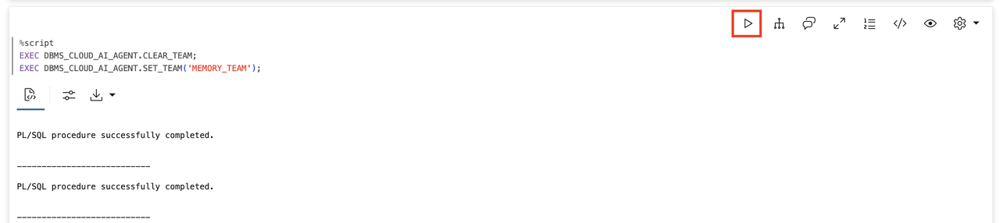

2. Ask about previous information.

    > This command is already in your notebook—just click the play button (▶) to run it.

    ```sql
    <copy>
    SELECT AI AGENT What is Sarah Chen''s preferred contact method and what rate exception does she have;
    </copy>
    ```

    **The agent remembers!** Because facts are stored in the database, not session memory, they survive the session reset.

    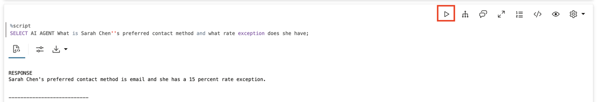

3. View the memory core contents.

    > This command is already in your notebook—just click the play button (▶) to run it.

    ```sql
    <copy>
    SELECT
        memory_type,
        JSON_SERIALIZE(content PRETTY) as content_json,
        created_at
    FROM agent_memory
    ORDER BY created_at DESC;
    </copy>
    ```

    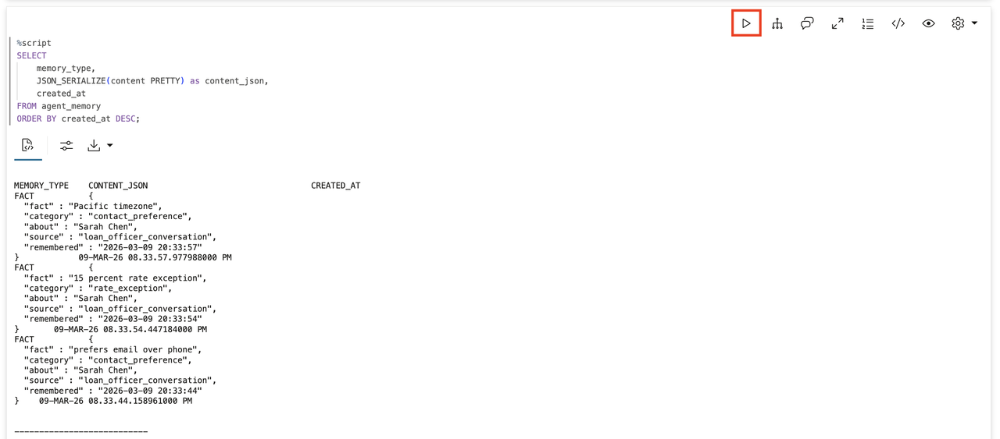

## Summary

In this lab, you built a **memory core** using Oracle's converged database:

* Created a memory table with native JSON
* Built remember and recall functions that return concrete JSON results the agent can report to the user
* Registered them as agent tools with instructions that describe the work, not just the rules
* Had conversations with an agent that remembers
* Verified persistence across sessions

**Key takeaway:** The memory core isn't another model layer. It's a converged database. Everything lives in one place: one transaction, one security model, one query language.

## Learn More

* [`DBMS_CLOUD_AI_AGENT` Package](https://docs.oracle.com/en/cloud/paas/autonomous-database/serverless/adbsb/dbms-cloud-ai-agent-package.html)
* [JSON Developer's Guide](https://docs.oracle.com/en/database/oracle/oracle-database/26/adjsn/)

## Acknowledgements

* **Author** - David Start
* **Last Updated By/Date** - Francis Regalado, March 2026

## Cleanup (Optional)

> This command is already in your notebook—just click the play button (▶) to run it.

```sql
<copy>
EXEC DBMS_CLOUD_AI_AGENT.DROP_TEAM('MEMORY_TEAM', TRUE);
EXEC DBMS_CLOUD_AI_AGENT.DROP_TASK('MEMORY_TASK', TRUE);
EXEC DBMS_CLOUD_AI_AGENT.DROP_AGENT('MEMORY_AGENT', TRUE);
EXEC DBMS_CLOUD_AI_AGENT.DROP_TOOL('REMEMBER_TOOL', TRUE);
EXEC DBMS_CLOUD_AI_AGENT.DROP_TOOL('RECALL_TOOL', TRUE);
DROP TABLE agent_memory PURGE;
DROP FUNCTION remember_fact;
DROP FUNCTION recall_facts;
</copy>
```

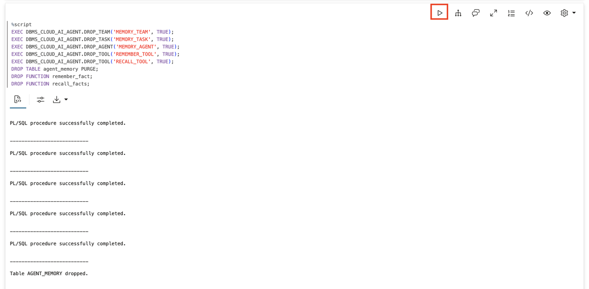
