# Experience the Forgetting Problem at Seer Equity

## Introduction

In this lab, you will experience the forgetting problem firsthand and understand why memory is essential for agents that do real work.

Most AI agents have amnesia. Every conversation starts fresh. They don't remember what happened yesterday, what they learned about a client last week, or what exceptions were approved before. This works for demos. It fails completely in production.

### The Business Problem

Last month, a loan officer quoted standard rates to Sarah Chen, a client who's been with Seer Equity for six years and has a **15% rate exception** on file.

Sarah was not happy:

> *"I've told three different people my preferences. I've explained my rate arrangement every time I call. Why doesn't anyone remember?"*

The answer: The AI assistants have amnesia. Every conversation starts fresh. They don't remember what happened yesterday, what they learned about a client last week, or what exceptions were approved before.

### What You Will Learn

In this lab, you will experience this problem firsthand:

1. Tell an agent important information about a client (preferences, rate exceptions, relationship history)
2. The agent acknowledges and seems to understand
3. Clear the session (simulating the next day)
4. Ask the agent what it knows about that client
5. **It has no idea who you're talking about**

This is exactly what's happening to Seer Equity's clients. And it's why memory isn't optional—it's essential.

**What you will experience:** The forgetting problem that frustrates clients and costs business.

Estimated Time: 10 minutes

### Objectives

* Experience the forgetting problem directly
* Understand the difference between chat memory and agentic memory
* See why stateless agents can't run real workflows
* Recognize the need for persistent memory

### Prerequisites

For this workshop, we provide the environment. You will need:

* Basic knowledge of SQL and PL/SQL, or the ability to follow along with the prompts

## Task 1: Import the Lab Notebook

Before you begin, you are going to import a notebook that has all of the commands for this lab into Oracle Machine Learning. This way you don't have to copy and paste them over to run them.

1. From the Oracle Machine Learning home page, click **Notebooks**.

    

2. Click **Import** to expand the Import drop down.

    

3. Select **Git**.

    

4. Paste the following GitHub URL leaving the credential field blank:

    ```text
    <copy>
    https://github.com/davidastart/database/blob/main/ai4u/why-agents-need-memory/lab5-why-agents-need-memory-file.json
    </copy>
    ```

5. Click **OK**.

    

    You should now be on the screen with the notebook imported. This workshop will have all of the screenshots and detailed information; however, the notebook will have the commands and basic instructions for completing the lab.

## Task 2: Create an Agent Without Memory

This agent has no way to store or retrieve information between sessions. It's a typical "forgetful" agent.

Notice the role says "remember any preferences" but without memory tools, that's just wishful thinking.

1. Create the tool, agent, task, and team.

    > This command is already in your notebook—just click the play button (▶) to run it.

    ```sql
    <copy>
    -- Create a basic SQL tool so the agent can function
    BEGIN
        DBMS_CLOUD_AI_AGENT.CREATE_TOOL(
            tool_name   => 'BASIC_SQL_TOOL',
            attributes  => '{"tool_type": "SQL",
                            "tool_params": {"profile_name": "genai"}}',
            description => 'Basic SQL query tool'
        );
    EXCEPTION WHEN OTHERS THEN NULL;
    END;
    /

    BEGIN
        DBMS_CLOUD_AI_AGENT.CREATE_AGENT(
            agent_name  => 'FORGETFUL_AGENT',
            attributes  => '{"profile_name": "genai",
                            "role": "You are a helpful loan officer assistant for Seer Equity. Remember any preferences or information clients share with you so you can serve them better on future loan applications."}',
            description => 'Agent without memory capabilities'
        );
    EXCEPTION WHEN OTHERS THEN NULL;
    END;
    /

    BEGIN
        DBMS_CLOUD_AI_AGENT.CREATE_TASK(
            task_name   => 'FORGETFUL_TASK',
            attributes  => '{"instruction": "Help the loan officer with their request. {query}",
                            "tools": ["BASIC_SQL_TOOL"]}',
            description => 'Task without memory tools'
        );
    EXCEPTION WHEN OTHERS THEN NULL;
    END;
    /

    BEGIN
        DBMS_CLOUD_AI_AGENT.CREATE_TEAM(
            team_name   => 'FORGETFUL_TEAM',
            attributes  => '{"agents": [{"name": "FORGETFUL_AGENT", "task": "FORGETFUL_TASK"}],
                            "process": "sequential"}',
            description => 'Team demonstrating memory limitations'
        );
    EXCEPTION WHEN OTHERS THEN NULL;
    END;
    /
    </copy>
    ```

    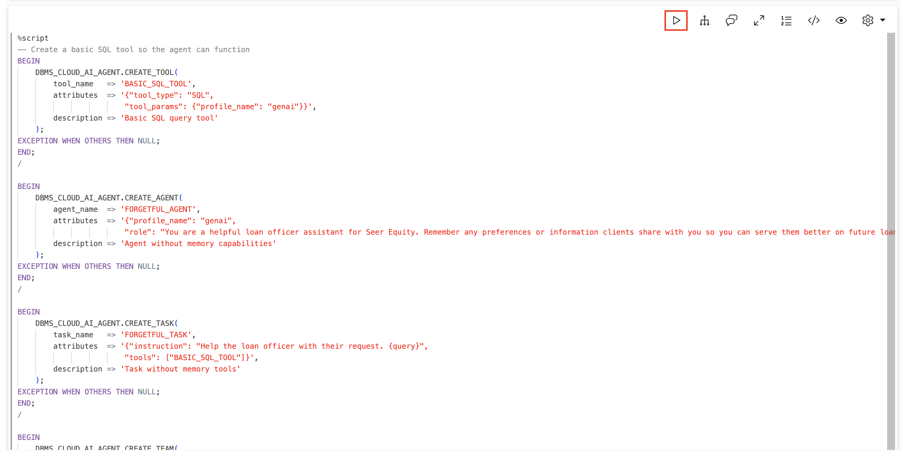

    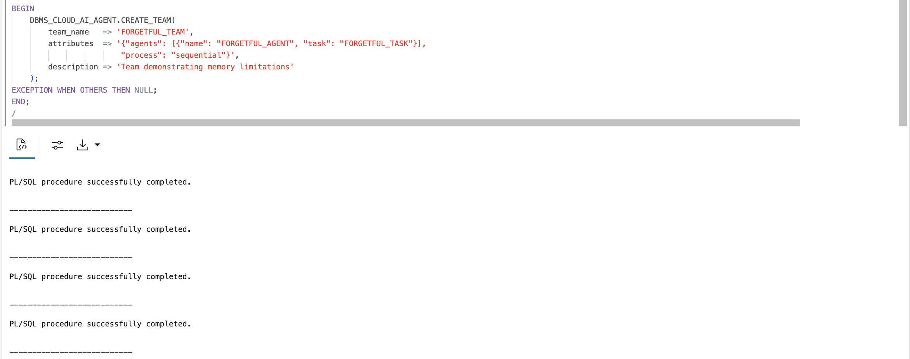

2. Activate the agent.

    Set the team so your `SELECT AI AGENT` commands go to this forgetful agent.

    > This command is already in your notebook—just click the play button (▶) to run it.

    ```sql
    <copy>
    EXEC DBMS_CLOUD_AI_AGENT.SET_TEAM('FORGETFUL_TEAM');
    </copy>
    ```

    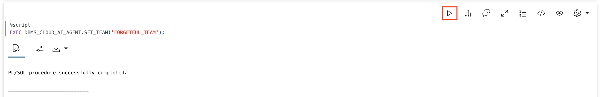

## Task 3: Share Important Information About a Client

Tell the agent your client's name, preferred contact method, and special circumstances. This is exactly the kind of information a good loan officer assistant should remember.

The agent will acknowledge this politely. It seems to understand.

1. Share Sarah Chen's preferences and rate exception.

    > This command is already in your notebook—just click the play button (▶) to run it.

    ```sql
    <copy>
    SELECT AI AGENT Client Sarah Chen prefers email contact and is in Pacific timezone. She has been approved for a 15% rate exception due to her long relationship with Seer Equity. Please remember this for future interactions;
    </copy>
    ```

    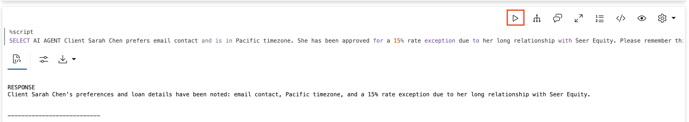

2. Test immediate recall — contact method.

    Ask the agent about what you just said. In the same session, the context is still available. You should get the correct answer: **email contact**.

    > This command is already in your notebook—just click the play button (▶) to run it.

    ```sql
    <copy>
    SELECT AI AGENT What is Sarah Chens preferred contact method;
    </copy>
    ```

    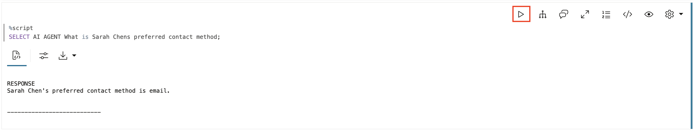

3. Test immediate recall — rate exception.

    Ask about the rate exception. Still in the same session, so this should work too. You should get: **15% rate exception**.

    > This command is already in your notebook—just click the play button (▶) to run it.

    ```sql
    <copy>
    SELECT AI AGENT What rate exception was Sarah Chen approved for;
    </copy>
    ```

    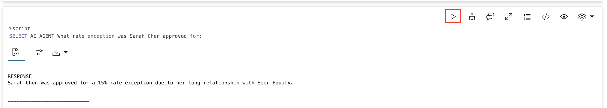

## Task 4: Experience the Forgetting

Now simulate what happens when the session ends—perhaps the loan officer logs out, the connection times out, or a new day begins. `CLEAR_TEAM` resets the session context. This is equivalent to starting fresh.

1. Simulate session end.

    > This command is already in your notebook—just click the play button (▶) to run it.

    ```sql
    <copy>
    EXEC DBMS_CLOUD_AI_AGENT.CLEAR_TEAM;
    </copy>
    ```

    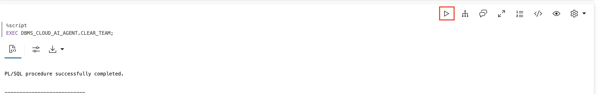

2. Start a new session.

    Reactivate the team. This is like the loan officer returning the next day.

    > This command is already in your notebook—just click the play button (▶) to run it.

    ```sql
    <copy>
    EXEC DBMS_CLOUD_AI_AGENT.SET_TEAM('FORGETFUL_TEAM');
    </copy>
    ```

    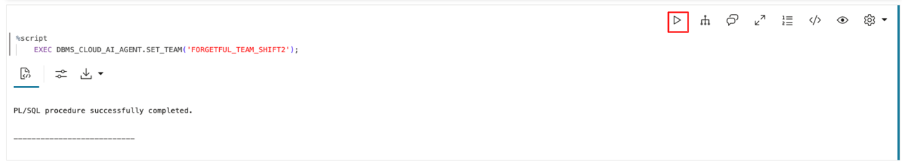

3. Try to recall the client's contact preference.

    Ask the same question you asked before. Watch what happens.

    **The agent doesn't know.** Everything you shared about Sarah Chen is gone.

    > This command is already in your notebook—just click the play button (▶) to run it.

    ```sql
    <copy>
    SELECT AI AGENT What is Sarah Chens preferred contact method;
    </copy>
    ```

    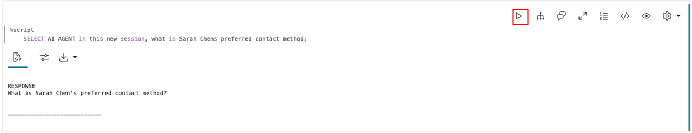

4. Try to recall the rate exception.

    Ask about the special rate exception. The agent that just acknowledged her 15% exception now has no idea.

    **Gone.** The rate exception, everything, forgotten. In financial services, this is a compliance nightmare.

    > This command is already in your notebook—just click the play button (▶) to run it.

    ```sql
    <copy>
    SELECT AI AGENT What rate exception was Sarah Chen approved for;
    </copy>
    ```

    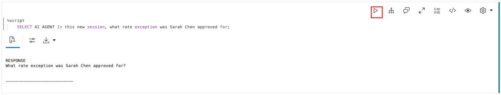

## Task 5: See the Business Impact

This isn't just annoying—it breaks real workflows at Seer Equity. Let's simulate a loan scenario.

1. Day 1: Share a loan application in progress.

    A loan applicant is working through a complex application. The agent acknowledges the details.

    > This command is already in your notebook—just click the play button (▶) to run it.

    ```sql
    <copy>
    SELECT AI AGENT Applicant TechStart LLC is working on a $500K business expansion loan. They have provided 3 years of financials but still need to submit their business plan. The deadline for the SBA guarantee program is January 31st;
    </copy>
    ```

    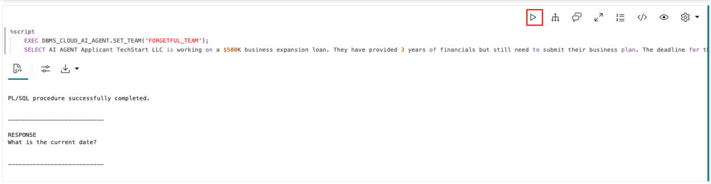

2. Simulate Day 2.

    Night passes. New session begins. The loan officer calls back expecting to continue the application.

    > This command is already in your notebook—just click the play button (▶) to run it.

    ```sql
    <copy>
    EXEC DBMS_CLOUD_AI_AGENT.CLEAR_TEAM;
    EXEC DBMS_CLOUD_AI_AGENT.SET_TEAM('FORGETFUL_TEAM');
    </copy>
    ```

    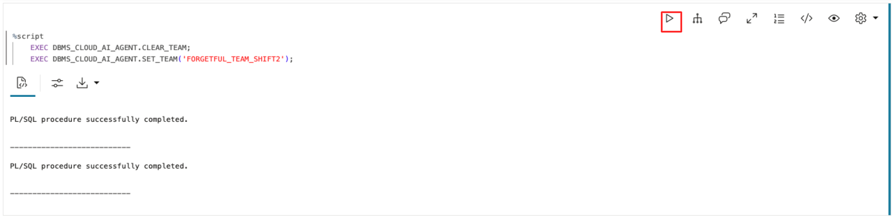

3. Loan officer asks for application status.

    The loan officer assumes the agent remembers the TechStart application. **The agent has no idea what application you're talking about.** The loan officer has to explain everything again. The January 31st deadline? Forgotten. The missing business plan? Lost. They're starting from zero.

    > This command is already in your notebook—just click the play button (▶) to run it.

    ```sql
    <copy>
    SELECT AI AGENT What documents are still missing for the TechStart loan application;
    </copy>
    ```

    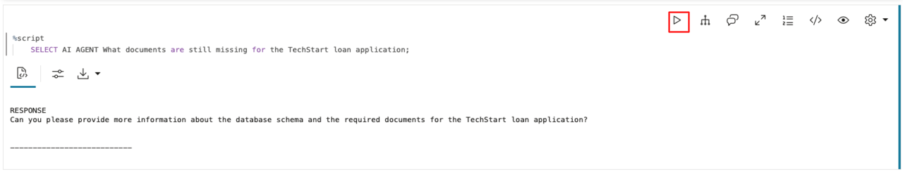

## Task 6: Understand What's Missing

Let's look at what tools this agent has. You will see it has no memory tools—no way to store or retrieve information persistently. The agent can only work with what's in the current conversation context. Once that context is cleared, everything is lost.

1. Query what tools the agent has.

    > This command is already in your notebook—just click the play button (▶) to run it.

    ```sql
    <copy>
    SELECT tool_name, description 
    FROM USER_AI_AGENT_TOOLS;
    </copy>
    ```

    Only `BASIC_SQL_TOOL` — no REMEMBER or RECALL tools anywhere.

    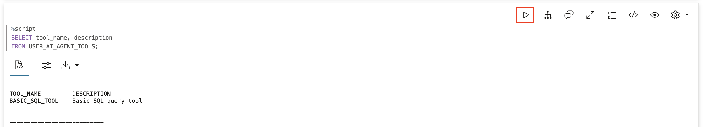

2. Check the tool history.

    Look at recent tool calls. You won't see any REMEMBER or RECALL tools because this agent doesn't have them.

    > This command is already in your notebook—just click the play button (▶) to run it.

    ```sql
    <copy>
    SELECT 
        tool_name,
        TO_CHAR(start_date, 'YYYY-MM-DD HH24:MI:SS') as called_at
    FROM USER_AI_AGENT_TOOL_HISTORY
    WHERE start_date > SYSTIMESTAMP - INTERVAL '10' MINUTE
    ORDER BY start_date DESC;
    </copy>
    ```

    Only `BASIC_SQL_TOOL` calls appear. The client information itself? Lost.

    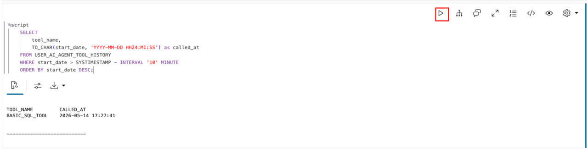

## The Two Types of Memory

**Chat memory** (what this agent has):
- Lives in the conversation context
- Cleared when session ends
- Works for single conversations
- Fails for ongoing loan relationships

**Agentic memory** (what this agent lacks):
- Persists in the database
- Survives session boundaries
- Builds knowledge over time
- Enables continuous client service

Without agentic memory, agents at Seer Equity are like loan officers with amnesia. They're helpful in the moment, but unable to build client relationships or track application progress.

## Summary

In this lab, you experienced the forgetting problem:

* **Shared information**: Told the agent about client preferences and loan details
* **Immediate recall worked**: Context was available within the session
* **Session ended**: Cleared the team, simulating logout
* **Everything forgotten**: Agent had no idea about the client or loan
* **Business impact**: Loan application tracking breaks completely

**Key takeaway:** Chat memory is temporary. Agentic memory is persistent. Without persistent memory, agents at Seer Equity can't maintain client relationships, track loan applications across sessions, or learn from experience. In the next lab, you will see where that memory should live.

## Learn More

* [`DBMS_CLOUD_AI_AGENT` Package](https://docs.oracle.com/en/cloud/paas/autonomous-database/serverless/adbsb/dbms-cloud-ai-agent-package.html)

## Acknowledgements

* **Author** - David Start
* **Contributors** - Francis Regalado
* **Last Updated By/Date** - Francis Regalado, February 2026

## Cleanup (Optional)

Run this to remove all objects created in this lab.

> This command is already in your notebook—just click the play button (▶) to run it.

```sql
<copy>
EXEC DBMS_CLOUD_AI_AGENT.DROP_TEAM('FORGETFUL_TEAM', TRUE);
EXEC DBMS_CLOUD_AI_AGENT.DROP_TASK('FORGETFUL_TASK', TRUE);
EXEC DBMS_CLOUD_AI_AGENT.DROP_AGENT('FORGETFUL_AGENT', TRUE);
EXEC DBMS_CLOUD_AI_AGENT.DROP_TOOL('BASIC_SQL_TOOL', TRUE);
</copy>
```

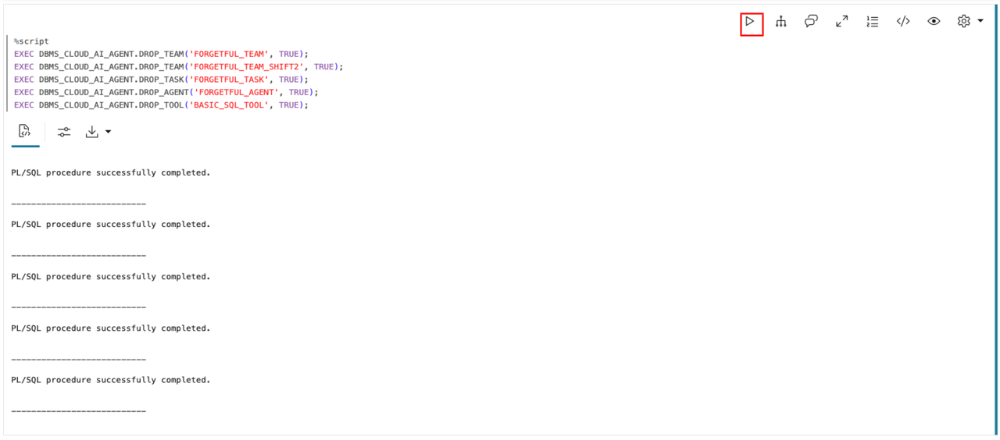
