# Provision an Autonomous Database and Validate Access

## Introduction

This lab walks you through provisioning an **Oracle Autonomous Database (ADB)** and validating access using **Database Actions** and **SQL Developer Web**.

Estimated Time: 15 minutes

### Objectives

In this lab, you will:
* Provision an Autonomous Database in Oracle Cloud Infrastructure
* Configure basic database settings
* Access Database Actions
* Run SQL scripts using SQL Developer Web
* Verify database objects and data

### Prerequisites

This lab assumes you have:
* An Oracle Cloud account with permissions to create Autonomous Databases
* Access to Oracle Cloud Console
* Basic familiarity with SQL Developer Web

---

## Task 1: Provision an Autonomous Database

1. Sign in to the Oracle Cloud Console. From the top-left corner, click the **Navigation menu**.

    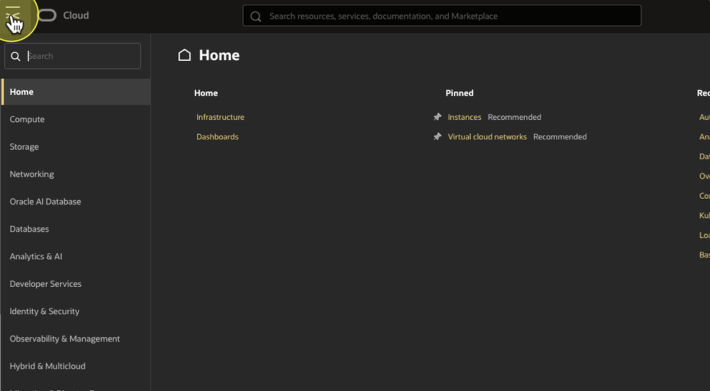

2. From the navigation menu, select **Oracle AI Database**.
    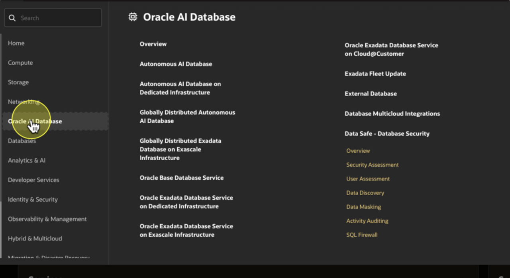


3. In the main content area, click **Autonomous AI Database**.
    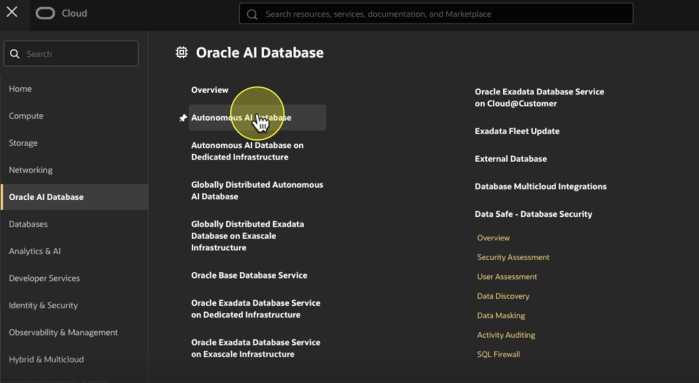


4. Click **Create Autonomous AI Database**.
    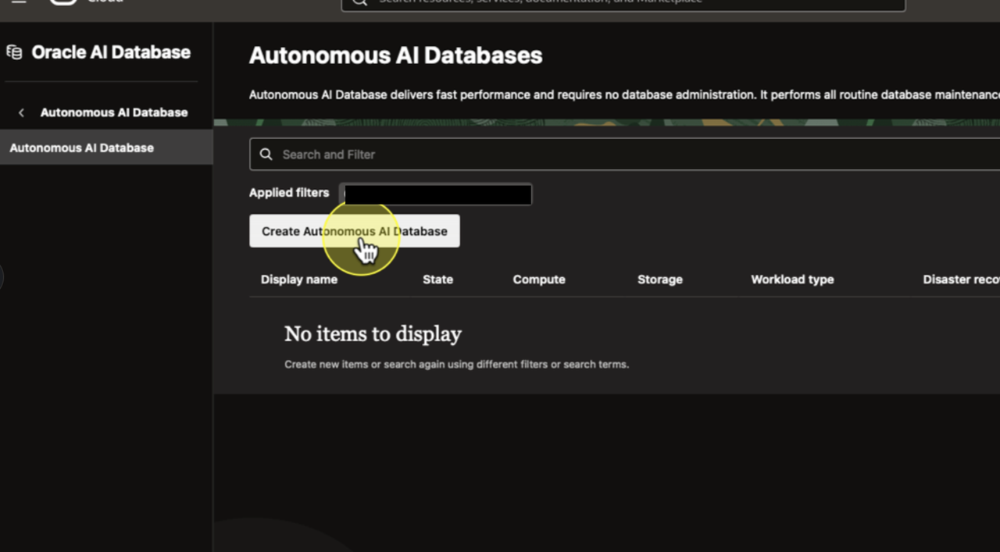


5. On the Create Autonomous Database page, provide the following information:
    * Display name (DBMS_Search_ADB)
    * Database name (dbmsSearchADB)
    * Workload type (Lakehouse is recommended for this lab)
    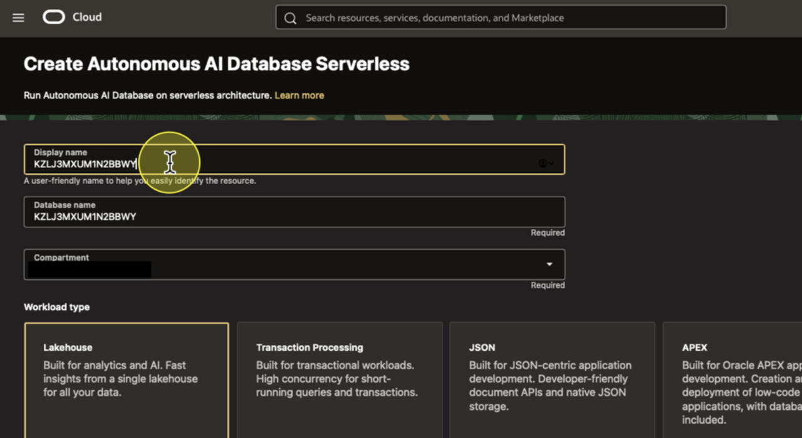


6. Under **Database configuration**, select the appropriate **Database Version** to 26ai.
    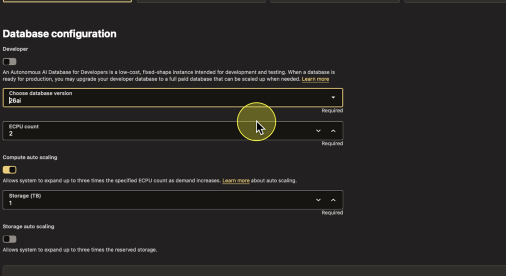


7. In the **Administrator credentials** section, enter and confirm the **ADMIN** password.

    > **Note:** Save this password. You will need it later in the lab.
    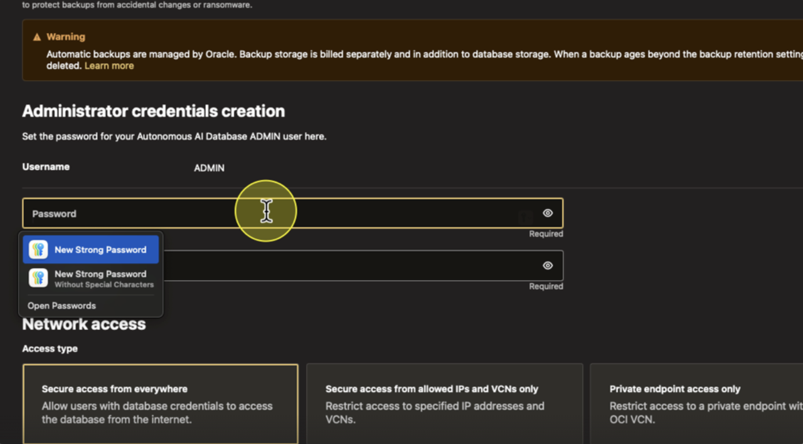

8. Click **Create**.

    Wait until the database status shows **Available** before continuing.
    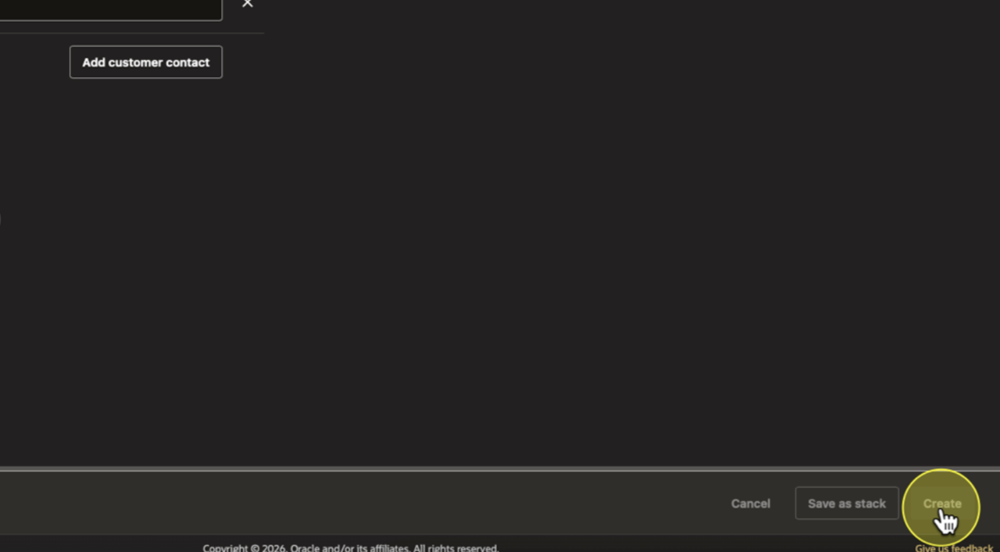

    ---

## Task 2: Access Database Actions

1. From the Autonomous Database details page, click **Database Actions**.

    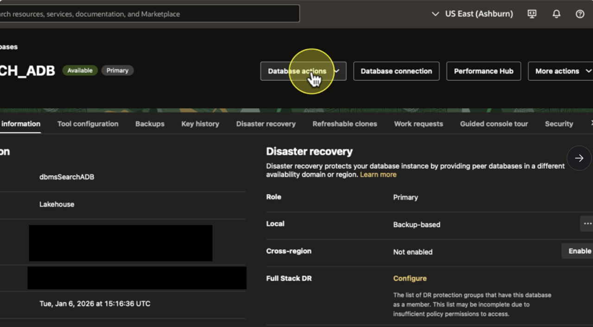

2. When prompted, log in using the **ADMIN** credentials you created earlier.

    ---

## Task 3: Run SQL Using SQL Developer Web
Past this schema using SQL Developer Web


1. From the Database Actions landing page, click **SQL** to open **SQL Developer Web**.
    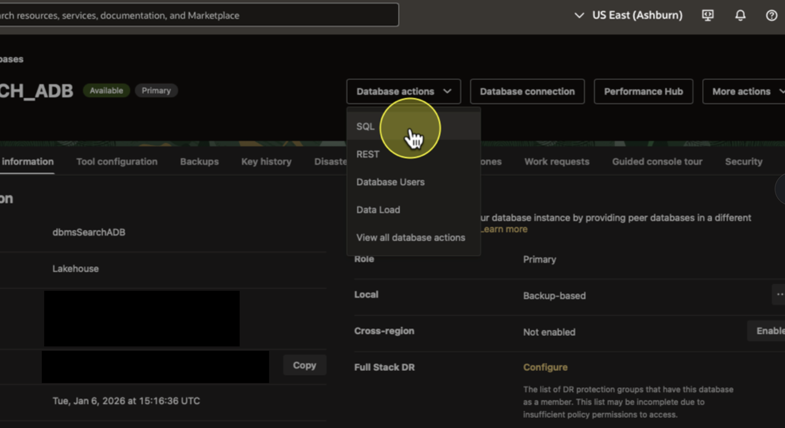

2. Paste the SQL script provided below for this lab into the SQL worksheet. (Note: We are creating the HR user changing the default password to "OracleDbmsSearch25!")
    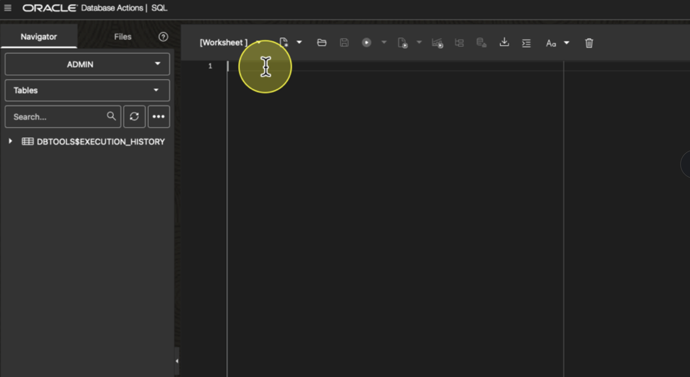

    <details>
        <summary><b>View full SQL Schema Script</b></summary>

        ```sql
    /* DROP HR USER IF IT EXISTS */
    BEGIN
      FOR r IN (SELECT username FROM all_users WHERE username = 'HR') LOOP
          EXECUTE IMMEDIATE 'DROP USER HR CASCADE';
      END LOOP;
    END;
    /

    /* VALIDATE TABLESPACE */
    DECLARE
      v_tbs_exists NUMBER := 0;
    BEGIN
      SELECT COUNT(1) INTO v_tbs_exists FROM DBA_TABLESPACES WHERE TABLESPACE_NAME = 'DATA';
      IF v_tbs_exists = 0 THEN
          RAISE_APPLICATION_ERROR(-20998, 'Error: the tablespace DATA does not exist!');
      END IF;
    END;
    /

    /* CREATE HR USER AND GRANT PERMISSIONS */
    CREATE USER hr IDENTIFIED BY "OracleDbmsSearch25!"
                  DEFAULT TABLESPACE DATA
                  QUOTA UNLIMITED ON DATA;

    GRANT CREATE MATERIALIZED VIEW, CREATE PROCEDURE, CREATE SEQUENCE, 
          CREATE SESSION, CREATE SYNONYM, CREATE TABLE, 
          CREATE TRIGGER, CREATE TYPE, CREATE VIEW TO hr;

    /* SET SESSION CONTEXT */
    ALTER SESSION SET CURRENT_SCHEMA = HR;
    ALTER SESSION SET NLS_LANGUAGE = American;
    ALTER SESSION SET NLS_TERRITORY = America;


    /* CREATE TABLES AND SEQUENCES ALL FOR HR SCHEMA */


    CREATE TABLE regions (
        region_id      NUMBER CONSTRAINT region_id_nn NOT NULL,
        region_name    VARCHAR2(25),
        CONSTRAINT reg_id_pk PRIMARY KEY (region_id)
    );

    CREATE TABLE countries (
        country_id      CHAR(2) CONSTRAINT country_id_nn NOT NULL,
        country_name    VARCHAR2(60),
        region_id       NUMBER,
        CONSTRAINT country_c_id_pk PRIMARY KEY (country_id)
    ) ORGANIZATION INDEX;

    ALTER TABLE countries ADD CONSTRAINT countr_reg_fk FOREIGN KEY (region_id) REFERENCES regions(region_id);

    CREATE TABLE locations (
        location_id    NUMBER(4),
        street_address VARCHAR2(40),
        postal_code    VARCHAR2(12),
        city           VARCHAR2(30) CONSTRAINT loc_city_nn NOT NULL,
        state_province VARCHAR2(25),
        country_id     CHAR(2),
        CONSTRAINT loc_id_pk PRIMARY KEY (location_id),
        CONSTRAINT loc_c_id_fk FOREIGN KEY (country_id) REFERENCES countries(country_id)
    );

    CREATE SEQUENCE locations_seq START WITH 3300 INCREMENT BY 100 MAXVALUE 9900 NOCACHE;

    CREATE TABLE departments (
        department_id    NUMBER(4),
        department_name  VARCHAR2(30) CONSTRAINT dept_name_nn NOT NULL,
        manager_id       NUMBER(6),
        location_id    NUMBER(4),
        CONSTRAINT dept_id_pk PRIMARY KEY (department_id),
        CONSTRAINT dept_loc_fk FOREIGN KEY (location_id) REFERENCES locations (location_id)
    );

    CREATE SEQUENCE departments_seq START WITH 280 INCREMENT BY 10 MAXVALUE 9990 NOCACHE;

    CREATE TABLE jobs (
        job_id         VARCHAR2(10),
        job_title      VARCHAR2(35) CONSTRAINT job_title_nn NOT NULL,
        min_salary     NUMBER(6),
        max_salary     NUMBER(6),
        CONSTRAINT job_id_pk PRIMARY KEY(job_id)
    );

    CREATE TABLE employees (
        employee_id    NUMBER(6),
        first_name     VARCHAR2(20),
        last_name      VARCHAR2(25) CONSTRAINT emp_last_name_nn NOT NULL,
        email          VARCHAR2(25) CONSTRAINT emp_email_nn NOT NULL,
        phone_number   VARCHAR2(20),
        hire_date      DATE CONSTRAINT emp_hire_date_nn NOT NULL,
        job_id         VARCHAR2(10) CONSTRAINT emp_job_nn NOT NULL,
        salary         NUMBER(8,2),
        commission_pct NUMBER(2,2),
        manager_id     NUMBER(6),
        department_id  NUMBER(4),
        CONSTRAINT emp_salary_min CHECK (salary > 0),
        CONSTRAINT emp_email_uk UNIQUE (email),
        CONSTRAINT emp_emp_id_pk PRIMARY KEY (employee_id),
        CONSTRAINT emp_dept_fk FOREIGN KEY (department_id) REFERENCES departments(department_id),
        CONSTRAINT emp_job_fk FOREIGN KEY (job_id) REFERENCES jobs(job_id),
        CONSTRAINT emp_manager_fk FOREIGN KEY (manager_id) REFERENCES employees(employee_id)
    );

    ALTER TABLE departments ADD CONSTRAINT dept_mgr_fk FOREIGN KEY (manager_id) REFERENCES employees (employee_id);

    CREATE SEQUENCE employees_seq START WITH 207 INCREMENT BY 1 NOCACHE;

    CREATE TABLE job_history (
        employee_id   NUMBER(6) CONSTRAINT jhist_employee_nn NOT NULL,
        start_date    DATE CONSTRAINT jhist_start_date_nn NOT NULL,
        end_date      DATE CONSTRAINT jhist_end_date_nn NOT NULL,
        job_id        VARCHAR2(10) CONSTRAINT jhist_job_nn NOT NULL,
        department_id NUMBER(4),
        CONSTRAINT jhist_emp_id_st_date_pk PRIMARY KEY (employee_id, start_date),
        CONSTRAINT jhist_job_fk FOREIGN KEY (job_id) REFERENCES jobs(job_id),
        CONSTRAINT jhist_emp_fk FOREIGN KEY (employee_id) REFERENCES employees(employee_id),
        CONSTRAINT jhist_dept_fk FOREIGN KEY (department_id) REFERENCES departments(department_id),
        CONSTRAINT jhist_date_interval CHECK (end_date > start_date)
    );

    /* POPULATE DATA */

    -- Disable circular constraint for loading
    ALTER TABLE departments DISABLE CONSTRAINT dept_mgr_fk;

    INSERT INTO regions VALUES (1, 'Europe');
    INSERT INTO regions VALUES (2, 'Americas');
    INSERT INTO regions VALUES (3, 'Asia');
    INSERT INTO regions VALUES (4, 'Middle East and Africa');

    INSERT INTO countries VALUES ('IT', 'Italy', 1);
    INSERT INTO countries VALUES ('JP', 'Japan', 3);
    INSERT INTO countries VALUES ('US', 'United States of America', 2);
    INSERT INTO countries VALUES ('CA', 'Canada', 2);
    INSERT INTO countries VALUES ('CN', 'China', 3);
    INSERT INTO countries VALUES ('IN', 'India', 3);
    INSERT INTO countries VALUES ('AU', 'Australia', 3);
    INSERT INTO countries VALUES ('ZW', 'Zimbabwe', 4);
    INSERT INTO countries VALUES ('SG', 'Singapore', 3);
    INSERT INTO countries VALUES ('UK', 'United Kingdom', 1);
    INSERT INTO countries VALUES ('FR', 'France', 1);
    INSERT INTO countries VALUES ('DE', 'Germany', 1);
    INSERT INTO countries VALUES ('ZM', 'Zambia', 4);
    INSERT INTO countries VALUES ('EG', 'Egypt', 4);
    INSERT INTO countries VALUES ('BR', 'Brazil', 2);
    INSERT INTO countries VALUES ('CH', 'Switzerland', 1);
    INSERT INTO countries VALUES ('NL', 'Netherlands', 1);
    INSERT INTO countries VALUES ('MX', 'Mexico', 2);
    INSERT INTO countries VALUES ('KW', 'Kuwait', 4);
    INSERT INTO countries VALUES ('IL', 'Israel', 4);
    INSERT INTO countries VALUES ('DK', 'Denmark', 1);
    INSERT INTO countries VALUES ('ML', 'Malaysia', 3);
    INSERT INTO countries VALUES ('NG', 'Nigeria', 4);
    INSERT INTO countries VALUES ('AR', 'Argentina', 2);
    INSERT INTO countries VALUES ('BE', 'Belgium', 1);

    INSERT INTO locations VALUES (1000, '1297 Via Cola di Rie', '00989', 'Roma', NULL, 'IT');
    INSERT INTO locations VALUES (1100, '93091 Calle della Testa', '10934', 'Venice', NULL, 'IT');
    INSERT INTO locations VALUES (1200, '2017 Shinjuku-ku', '1689', 'Tokyo', 'Tokyo Prefecture', 'JP');
    INSERT INTO locations VALUES (1400, '2014 Jabberwocky Rd', '26192', 'Southlake', 'Texas', 'US');
    INSERT INTO locations VALUES (1500, '2011 Interiors Blvd', '99236', 'South San Francisco', 'California', 'US');
    INSERT INTO locations VALUES (1700, '2004 Charade Rd', '98199', 'Seattle', 'Washington', 'US');
    INSERT INTO locations VALUES (1800, '147 Spadina Ave', 'M5V 2L7', 'Toronto', 'Ontario', 'CA');
    INSERT INTO locations VALUES (2400, '8204 Arthur St', NULL, 'London', NULL, 'UK');
    INSERT INTO locations VALUES (2500, 'The Oxford Science Park', 'OX9 9ZB', 'Oxford', 'Oxford', 'UK');
    INSERT INTO locations VALUES (2700, 'Schwanthalerstr. 7031', '80925', 'Munich', 'Bavaria', 'DE');

    INSERT INTO jobs VALUES ('AD_PRES', 'President', 20080, 40000);
    INSERT INTO jobs VALUES ('AD_VP', 'Administration Vice President', 15000, 30000);
    INSERT INTO jobs VALUES ('AD_ASST', 'Administration Assistant', 3000, 6000);
    INSERT INTO jobs VALUES ('FI_MGR', 'Finance Manager', 8200, 16000);
    INSERT INTO jobs VALUES ('FI_ACCOUNT', 'Accountant', 4200, 9000);
    INSERT INTO jobs VALUES ('AC_MGR', 'Accounting Manager', 8200, 16000);
    INSERT INTO jobs VALUES ('AC_ACCOUNT', 'Public Accountant', 4200, 9000);
    INSERT INTO jobs VALUES ('SA_MAN', 'Sales Manager', 10000, 20080);
    INSERT INTO jobs VALUES ('SA_REP', 'Sales Representative', 6000, 12008);
    INSERT INTO jobs VALUES ('ST_MAN', 'Stock Manager', 5500, 8500);
    INSERT INTO jobs VALUES ('ST_CLERK', 'Stock Clerk', 2008, 5000);
    INSERT INTO jobs VALUES ('IT_PROG', 'Programmer', 4000, 10000);
    INSERT INTO jobs VALUES ('MK_MAN', 'Marketing Manager', 9000, 15000);
    INSERT INTO jobs VALUES ('MK_REP', 'Marketing Representative', 4000, 9000);
    INSERT INTO jobs VALUES ('PU_MAN', 'Purchasing Manager', 8000, 15000);
    INSERT INTO jobs VALUES ('PU_CLERK', 'Purchasing Clerk', 2500, 5500);
    INSERT INTO jobs VALUES ('SH_CLERK', 'Shipping Clerk', 2500, 5500);

    INSERT INTO departments VALUES (10, 'Administration', 200, 1700);
    INSERT INTO departments VALUES (20, 'Marketing', 201, 1800);
    INSERT INTO departments VALUES (30, 'Purchasing', 114, 1700);
    INSERT INTO departments VALUES (50, 'Shipping', 121, 1500);
    INSERT INTO departments VALUES (60, 'IT', 103, 1400);
    INSERT INTO departments VALUES (80, 'Sales', 145, 2500);
    INSERT INTO departments VALUES (90, 'Executive', 100, 1700);
    INSERT INTO departments VALUES (110, 'Accounting', 205, 1700);

    INSERT INTO employees VALUES (100, 'Steven', 'King', 'SKING', '515.123.4567', TO_DATE('17-06-2003', 'dd-mm-yyyy'), 'AD_PRES', 24000, NULL, NULL, 90);
    INSERT INTO employees VALUES (101, 'Neena', 'Kochhar', 'NKOCHHAR', '515.123.4568', TO_DATE('21-09-2005', 'dd-mm-yyyy'), 'AD_VP', 17000, NULL, 100, 90);
    INSERT INTO employees VALUES (102, 'Lex', 'De Haan', 'LDEHAAN', '515.123.4569', TO_DATE('13-01-2001', 'dd-mm-yyyy'), 'AD_VP', 17000, NULL, 100, 90);
    INSERT INTO employees VALUES (103, 'Alexander', 'Hunold', 'AHUNOLD', '590.423.4567', TO_DATE('03-01-2006', 'dd-mm-yyyy'), 'IT_PROG', 9000, NULL, 102, 60);
    INSERT INTO employees VALUES (114, 'Den', 'Raphealy', 'DRAPHEAL', '515.127.4561', TO_DATE('07-12-2002', 'dd-mm-yyyy'), 'PU_MAN', 11000, NULL, NULL, 30);
    INSERT INTO employees VALUES (121, 'Adam', 'Fripp', 'AFRIPP', '650.123.2234', TO_DATE('10-04-2005', 'dd-mm-yyyy'), 'ST_MAN', 8200, NULL, 100, 50);
    INSERT INTO employees VALUES (145, 'Charles', 'Johnson', 'CJOHNSON', '011.44.1344.429268', TO_DATE('01-10-2004', 'dd-mm-yyyy'), 'SA_REP', 14000, .4, 100, 80);
    INSERT INTO employees VALUES (200, 'Jennifer', 'Whalen', 'JWHALEN', '515.123.4444', TO_DATE('17-09-2003', 'dd-mm-yyyy'), 'AD_ASST', 4400, NULL, 101, 10);
    INSERT INTO employees VALUES (201, 'Michael', 'Hartstein', 'MHARTSTE', '515.123.5555', TO_DATE('17-02-2004', 'dd-mm-yyyy'), 'MK_MAN', 13000, NULL, 100, 20);
    INSERT INTO employees VALUES (205, 'Shelley', 'Higgins', 'SHIGGINS', '515.123.8080', TO_DATE('07-06-2002', 'dd-mm-yyyy'), 'AC_MGR', 12008, NULL, 101, 110);

    -- Re-enable circular constraint
    ALTER TABLE departments ENABLE CONSTRAINT dept_mgr_fk;

    COMMIT;


    /* CREATE PROCEDURAL OBJECTS (PL/SQL) */


    CREATE OR REPLACE PROCEDURE secure_dml
    IS
    BEGIN
      IF TO_CHAR (SYSDATE, 'HH24:MI') NOT BETWEEN '08:00' AND '18:00'
            OR TO_CHAR (SYSDATE, 'DY') IN ('SAT', 'SUN') THEN
        RAISE_APPLICATION_ERROR (-20205, 
            'You may only make changes during normal office hours');
      END IF;
    END secure_dml;
    /

    CREATE OR REPLACE PROCEDURE add_job_history
      (  p_emp_id          job_history.employee_id%type
      , p_start_date      job_history.start_date%type
      , p_end_date        job_history.end_date%type
      , p_job_id          job_history.job_id%type
      , p_department_id   job_history.department_id%type 
      )
    IS
    BEGIN
      INSERT INTO job_history (employee_id, start_date, end_date, job_id, department_id)
        VALUES(p_emp_id, p_start_date, p_end_date, p_job_id, p_department_id);
    END add_job_history;
    /

    CREATE OR REPLACE TRIGGER update_job_history
      AFTER UPDATE OF job_id, department_id ON employees
      FOR EACH ROW
    BEGIN
      add_job_history(:old.employee_id, :old.hire_date, sysdate, :old.job_id, :old.department_id);
    END;
    /

    /* Installation Validation - Verify Table Row Counts */

    SELECT 'regions' AS "Table", 5 AS "expected_rows", COUNT(1) AS "actual_rows" 
      FROM hr.regions
    UNION ALL
    SELECT 'countries' AS "Table", 25 AS "expected_rows", COUNT(1) AS "actual_rows" 
      FROM hr.countries
    UNION ALL
    SELECT 'departments' AS "Table", 27 AS "expected_rows", COUNT(1) AS "actual_rows" 
      FROM hr.departments
    UNION ALL
    SELECT 'locations' AS "Table", 23 AS "expected_rows", COUNT(1) AS "actual_rows" 
      FROM hr.locations
    UNION ALL
    SELECT 'employees' AS "Table", 107 AS "expected_rows", COUNT(1) AS "actual_rows" 
      FROM hr.employees
    UNION ALL
    SELECT 'jobs' AS "Table", 19 AS "expected_rows", COUNT(1) AS "actual_rows" 
      FROM hr.jobs
    UNION ALL
    SELECT 'job_history' AS "Table", 10 AS "expected_rows", COUNT(1) AS "actual_rows" 
      FROM hr.job_history;

    /* HR Schema Installation Summary */
    COMMIT;

    /* Enable ORDS for HR Schema */
    BEGIN
        ORDS.ENABLE_SCHEMA(
            p_enabled             => TRUE,
            p_schema              => 'HR',
            p_url_mapping_type    => 'BASE_PATH',
            p_url_mapping_pattern => 'hr',
            p_auto_rest_auth      => FALSE
        );
        COMMIT;
    END;
    /
    ```

    </details>

3. Click **Run Script** or press **F5** to execute the script.
    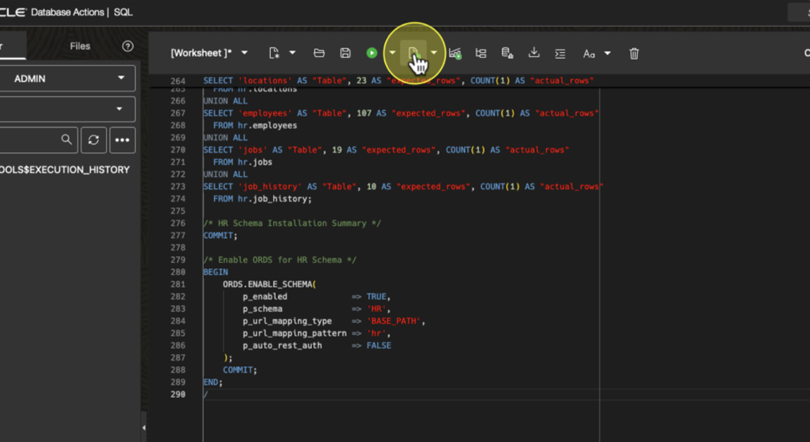

4. Verify that the script completes successfully and returns results without errors.
    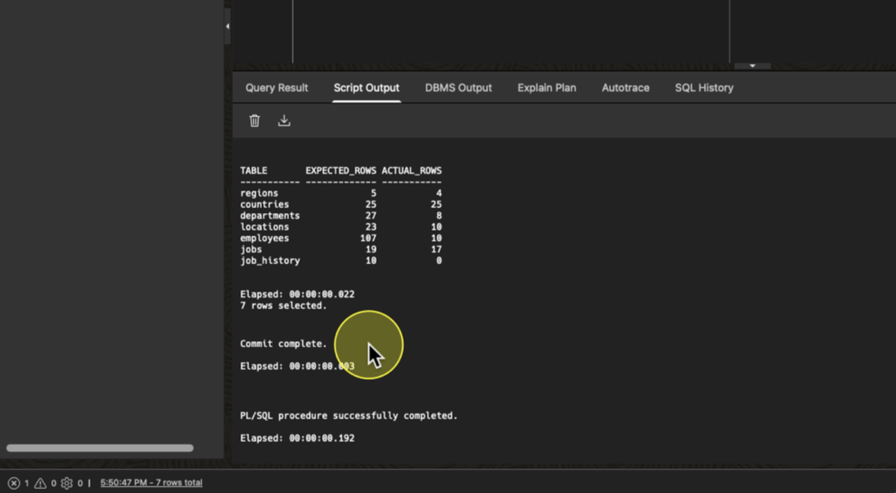

    ---

## Task 4: Switch User & Validate Tables and Data
1. Click the **ADMIN user menu** in the top-right corner and select **Sign Out**.
    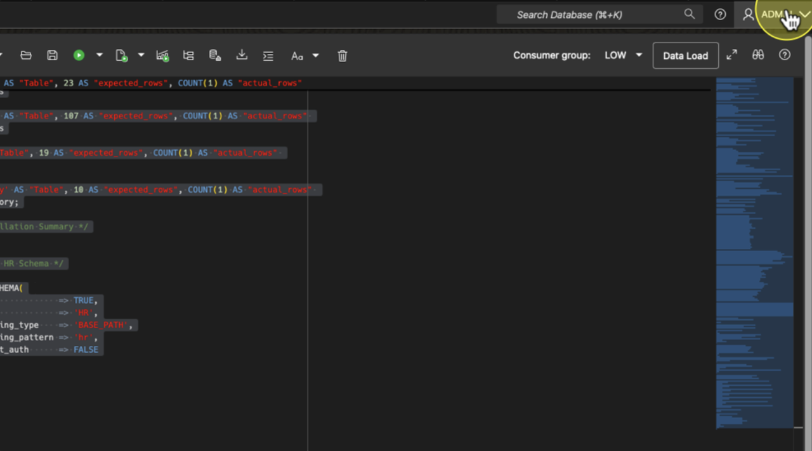
    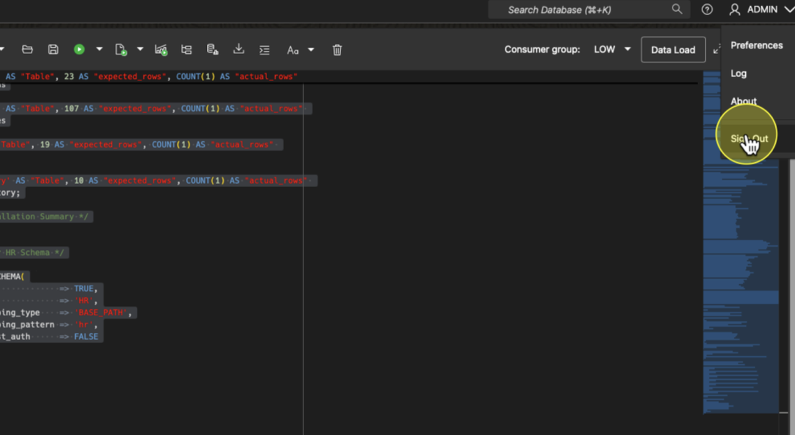

2. Sign back in using the **HR** user credentials provided for the lab. 
    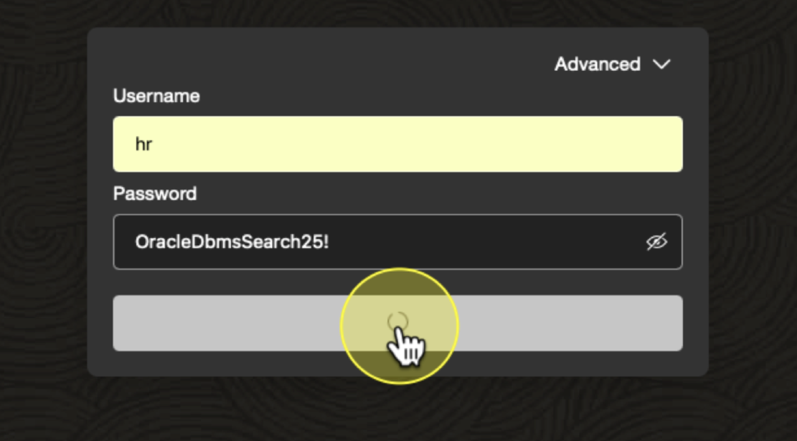

3. From SQL Developer Web, open the **SQL Worksheet selector**.
    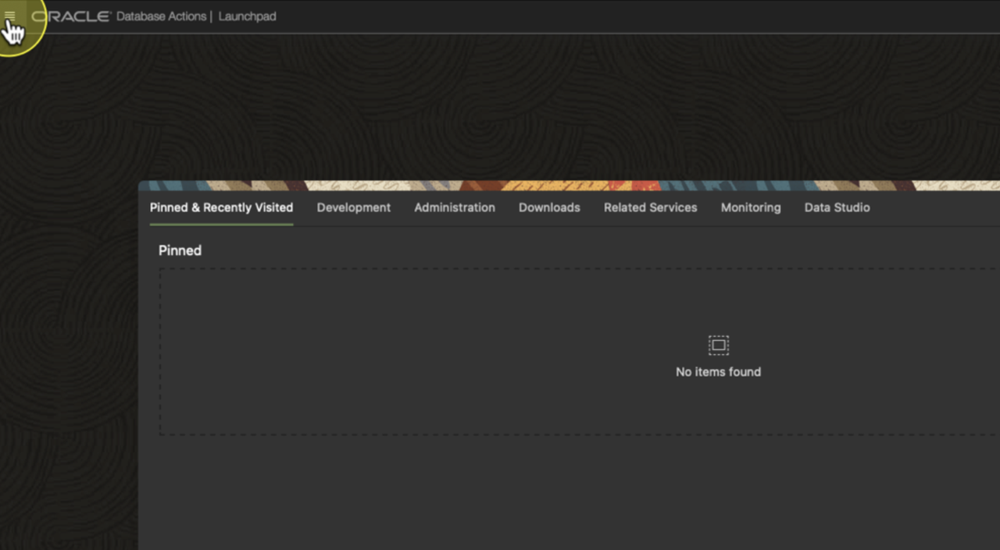

4. Navigate to **SQL Data**.
    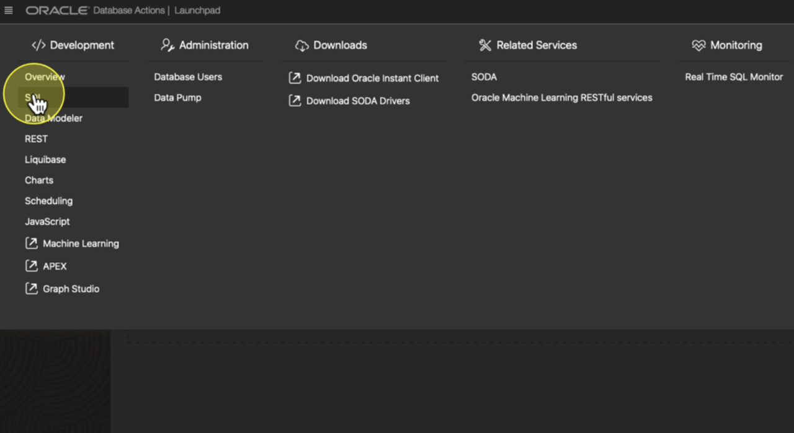

5. Click **Refresh** to display available tables.
    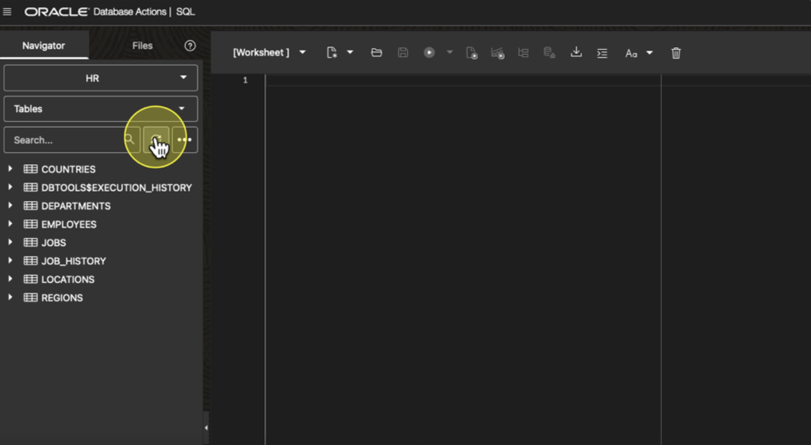

6. Confirm that the expected tables are present.

    ---

## Summary

In this lab, you successfully:
* Provisioned an Autonomous Database
* Accessed Database Actions
* Executed SQL scripts using SQL Developer Web
* Verified database objects and data

You are now ready to proceed to the next lab.

## Acknowledgements
* **Author** - Roger Ford
* **Last Updated By/Date** - Chance Trammell, Oscar Tepepan-Aviles, Janurary 2026
