# Application Continuity

## Introduction

This lab walks you through the use and functioning of Application Continuity.

Estimated Lab Time: 60 Minutes

Watch the video below for an overview of the Application Continuity lab
[](youtube:KkwxbwII3O4)


### Prerequisites
- An Oracle LiveLabs or Paid Oracle Cloud account
- Lab: Generate SSH Key
- Lab: Build a DB System
- Lab: Services


## Task 1:  Install Sample Program and configure services

1.  If you aren't already logged in to one of your cluster nodes, connect to a node using either Putty or MAC or Windows CYGWIN Emulator

**Note:** The initial lab on building the DB System has instructions on how to connect to either node using different methods.

2. Connect to the **oracle** user and download the sample program from the Object Store

    ````
    wget https://c4u04.objectstorage.us-ashburn-1.oci.customer-oci.com/p/l4bmfZVRGxWZUhBBzZU8ZUNJEJFmlZBUwjnj8YmQ735E9EXvOFb3OXVFeAm-AAy3/n/c4u04/b/livelabsfiles/o/labfiles/ACDemo_19c.zip
    ````
3. Unzip the ACDemo_19c.zip file
    ````
    cd /home/oracle
    unzip ACDemo_19c.zip
    ````
    The directory **acdemo** will be created with the following structure:

    ````
    unzip ACDemo_19c.zip
    Archive:  ACDemo_19c.zip
    creating: acdemo/
       creating: acdemo/classes/
       creating: acdemo/lib/
       creating: acdemo/src/
       creating: acdemo/win/
    inflating: README.txt
    inflating: SETUP_AC_TEST.sh
    ````
4. Set the execute bit **+x** on the SETUP\_AC\_TEST.sh script

    ````
    chmod +x SETUP_AC_TEST.sh
    ````
5. Run the script **SETUP\_AC\_TEST.sh**. You will be prompted for INPUTS. If a default value is shown, press **ENTER** to accept

    ````
    <copy>
    ./SETUP_AC_TEST.sh
    </copy>
    ````

    You will need to provide the password for the **SYSTEM** user - this is **"W3lc0m3#W3lc0m3#"** (without the quotation marks **" "**)
    Choose a name for your service. If this installation is not on the database tier many of the inputs will not have default values.

    On completion three services will be created
    **Note:** If services of the same name existed prior to running this script these services will have their original attributes - SETUP\_AC\_TEST does not attempt to modify them

   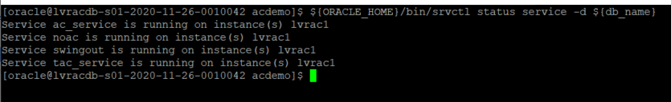

6. Make the **run** scripts executable

    ````
    <copy>
    cd /home/oracle/acdemo
    chmod +x run*
    chmod +x kill_session.sh
    </copy>
    ````
## Task 2:  Examine Service Attributes and Program Settings

Application Continuity (whether AC or TAC) is enabled by setting attributes on the database service. For JDBC applications the Replay Driver also has to be used.

1. Examine the services that have been created - identifying the AC attributes

    Identify your service names:
    ````
    <copy>
    srvctl status service -d `srvctl config database`
    </copy>
    ````
    You should see at least 3 services: **noac**, **tac_service**, and one you named yourself.

   

    Examine the service characteristics (replacing the service name in the command below for each service)

    **Note:** that the sample command below discovers the database name (if there is only 1 database on your system)

    ````
    srvctl config service -d  `srvctl config database` -s noac
    ````
   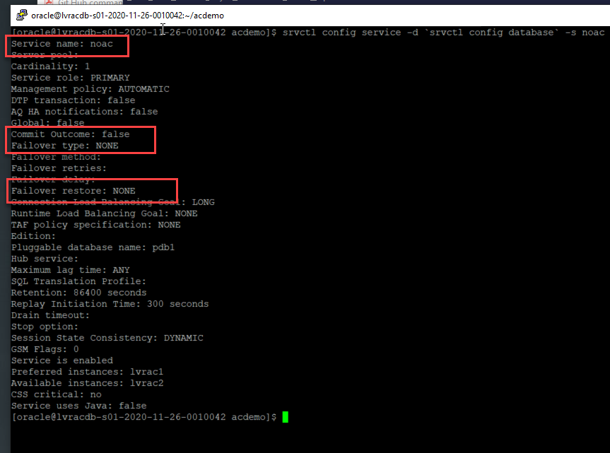

   The attributes **commit\_outcome**, **failovertype**, and **failover\_restore** are those that set whether AC is enabled or not. For the \"noac\" service AC is not enabled as commit_outcome is false and failovertype is NONE.

   For the service enabled for TAC, **tac_service**

    ````
    srvctl config service -d  `srvctl config database` -s tac_service
    ````

      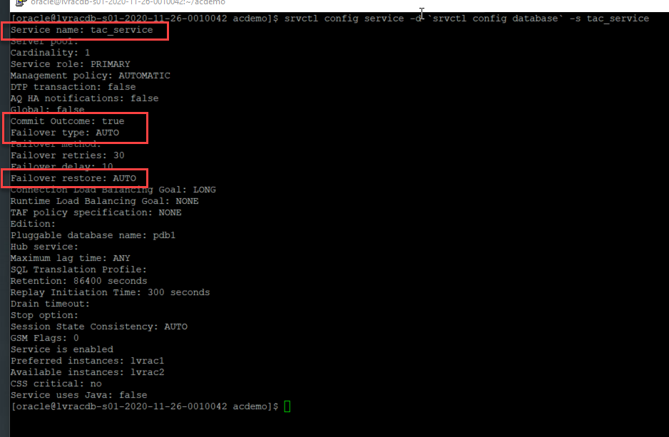

   To enable TAC **commit\_outcome** is TRUE, **failovertype** is set to AUTO, and **failover\_restore** is AUTO

   **Note:** The attributes failoverretry and failoverdelay are not required when RETRY\_COUNT and RETRY\_DELAY are set in the connect string\/URL as recommended

   Examine the setting for the AC-enabled service you created. You should see that commit\_outcome is TRUE, failovertype is TRANSACTION and failover\_restore is LEVEL1.

2. The sample program described
   The sample program is called **acdemo**
   There is an **acdemo/** directory in the *oracle* users home directory (if you unpacked the ZIP file here). The acdemo/ directory contains:

    ````
      classes/   
          acdemo/    <--- Compiled versions of the acdemo application classes
      lib/           <--- The JDBC libraries and the packaged acdemo classes in acdemo.jar
      src/
         acdemo/
            ACDemo.java             <-- main program file
            Worker.java             <-- worker threads that do the database operations
            PrintStatsThread.java   <--- Prints database stats periodically
            PrintACStatsThread.java <-- disabled, but would print client-side AC stats
      win/           <--- windows control scripts (under development)
      ac_noreplay.properties        <--- property file to configure ACDemo for no replay operations
      ac_replay.properties          <--- property file to configure ACDemo for AC replay operations      
      tac_replay.properties         <--- property file to configure ACDemo for TAC replay operations
      runreplay                     <--- shell script to start ACDemo using ac_replay.properties file
      runnoreplay                   <--- shell script to start ACDemo using ac_noreplay.properties file      
      runtacreplay                  <--- shell script to start ACDemo using ac_replay.properties file
      kill_session.sh               <--- shell script to kill database sessions connected to a named service
      build.xml                     <--- A buildfile for ANT (ANT not installed on these systems)
    ````

## Task 3:  NO Replay

1. Run the sample program with NO REPLAY enabled

   A key tenet of Application Continuity is that no application changes are required. We manage this sample application with a property file. We use a SHELL script to set the environment and select the property file that will produce a certain behaviour.

   Examine the ac\_noreplay.properties file to see that we are using a pooled datasource *oracle.jdbc.pool.OracleDataSource* but we have disabled FAN, *fastConnectionFailover=FALSE* and connection tests *validateConnectionOnBorrow=FALSE*. The URL uses the recommended format and connects to the service **noac**, which has no AC attributes set.

    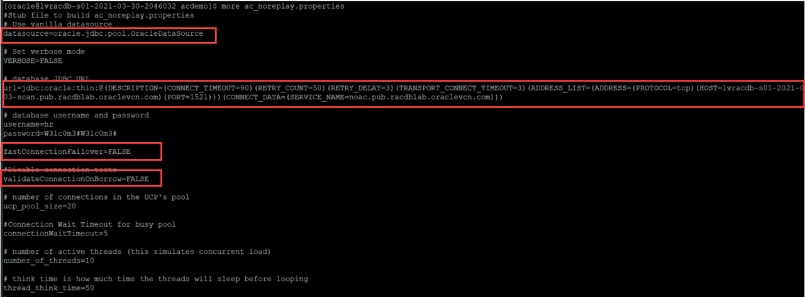   

    ````
    cd /home/oracle/acdemo
    ./runnoreplay
    ````
    The application will start, create a connection pool, and begin issuing transactions against the database.

    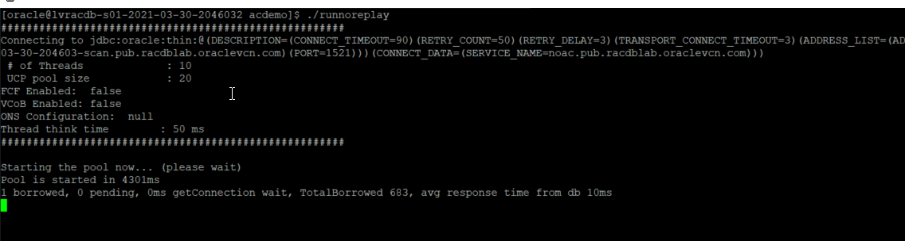   

2. Kill the instance or kill sessions attached to the database

    Identify the SMON process of the instance where the service noac is running and cause the instance to crash

    ````
    <copy>
    srvctl status service -d `srvctl config database` -s noac
    </copy>
    ````    

    This will return an instance name, for example:

    ````
    $ srvctl status service -d `srvctl config database` -s noac
        Service noac is running on instance(s) racHPNUY2
    ````
    The instance number (in this example "2") shows that the instance is running on node 2
    Connect to the node containing that instance

    ````
    $ srvctl status service -d `srvctl config database` -s noac
         Service noac is running on instance(s) racHPNUY2

    $ ps -ef | grep ora_smon
         root     39708     1  1 Mar30 ?        00:08:33 /u01/app/19.0.0.0/grid/bin/osysmond.bin
         grid     45180     1  0 Mar30 ?        00:00:00 asm_smon_+ASM2
         oracle   71378 75971  0 06:26 pts/0    00:00:00 grep --color=auto smon
         oracle   82842     1  0 Mar30 ?        00:00:04 ora_smon_racHPNUY2
    ````
    Get the process number of the ora\_smon\_<yourDBName><correctInstanceID> process - in this example **82842**
    Pass this process id to a kill -9 command

    ````
    kill -9 <process id>
    ````
    The application will see errors from the database and will fall in to its own error handling routines

    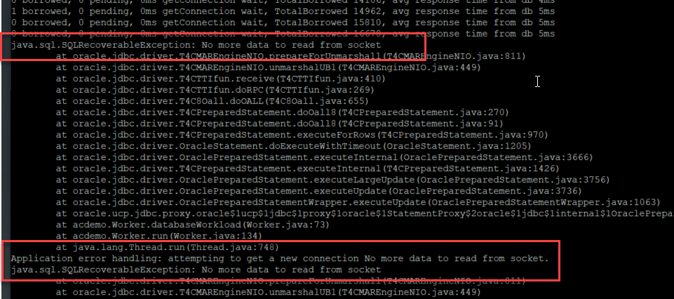      

    It can take some time for the system to correct and recover, but provided that the application does not time out, or has not reached some error thresholds (that the application sets for itself), connections can be re-established and activity recommence

    ````
    Application error handling: attempting to get a new connection No more data to read from socket.
    FCF information:
    0 borrowed, 10 pending, 0ms getConnection wait, TotalBorrowed 17281, avg response time from db 572786ms
    0 borrowed, 10 pending, 0ms getConnection wait, TotalBorrowed 17281
      Application driven connection retry succeeded
      Application driven connection retry succeeded
      Application driven connection retry succeeded
      Application driven connection retry succeeded
      Application driven connection retry succeeded
      Application driven connection retry succeeded
      Application driven connection retry succeeded
      Application driven connection retry succeeded
      Application driven connection retry succeeded
      Application driven connection retry succeeded
   10 borrowed, 0 pending, 4ms getConnection wait, TotalBorrowed 17450, avg response time from db 136ms
   10 borrowed, 0 pending, 4ms getConnection wait, TotalBorrowed 17758, avg response time from db 104ms
   2 borrowed, 0 pending, 4ms getConnection wait, TotalBorrowed 18353, avg response time from db 32ms
   2 borrowed, 0 pending, 4ms getConnection wait, TotalBorrowed 19163, avg response time from db 8ms
    ````
    There is also a script named kill_sessions.sh in the acdemo/ directory that can be used to forcibly kill the database sessions. This script takes the service name as an argument (as it needs to connect to the same instance as the application in order to identify the sessions)

    ````
    cd /home/oracle/acdemo
    ./kill_session.sh noac.pub.racdblab.oraclevcn.com
    ````
    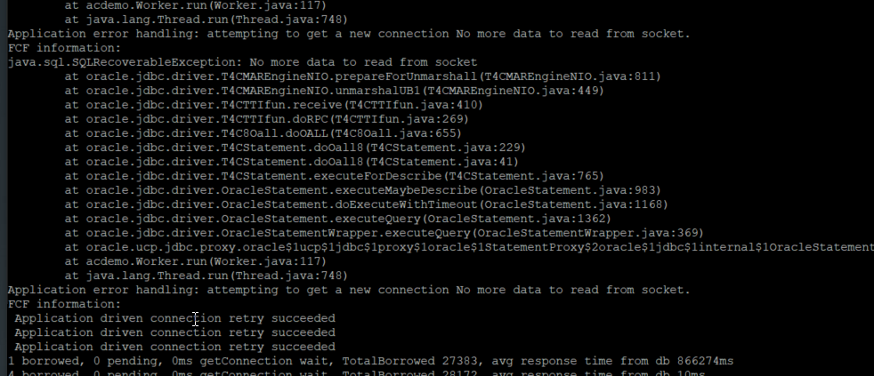  

## Task 4:  Application Continuity

1.  Examine the ac_replay.properties file to see that we are using a replay datasource *oracle.jdbc.replay.OracleDataSourceImpl* and we have enabled FAN, *fastConnectionFailover=TRUE* and connection tests *validateConnectionOnBorrow=TRUE*. The URL uses the recommended format and connects to the service you created previously, which has AC attributes set.

    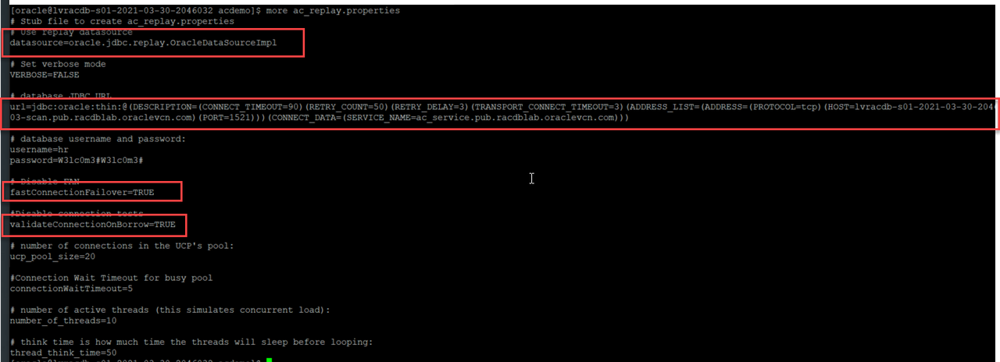   

    ````
    cd /home/oracle/acdemo
    ./runreplay
    ````
    The application will start, create a connection pool, and begin issuing transactions against the database using an AC-enabled service.
    Both FAN and connection tests are enabled

    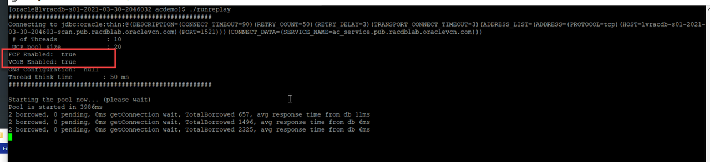  

**Note:** ONS is auto-configured. The "ONS Configuration" heading in the banner is only populated if ONS is manually configured [which is not recommended]

2. Crash the instance by killing SMON

    Substitute your AC service in the command below (in this example my AC-enabled service is named ac_service)

    ````
    srvctl status service -d `srvctl config database` -s ac_service
    ps -ef | grep ora_smon
    kill -9 mySMONPID
    ````
    For example:

    ````
    $ srvctl status service -d `srvctl config database` -s ac_service
             Service ac_service is running on instance(s) racHPNUY2
    $ ps -ef | grep ora_smon
          oracle   68325     1  0 07:52 ?        00:00:00 ora_smon_racHPNUY2
          oracle   99444 81136  0 08:19 pts/1    00:00:00 grep --color=auto ora_smon
    $ kill -9 68325
    ````

    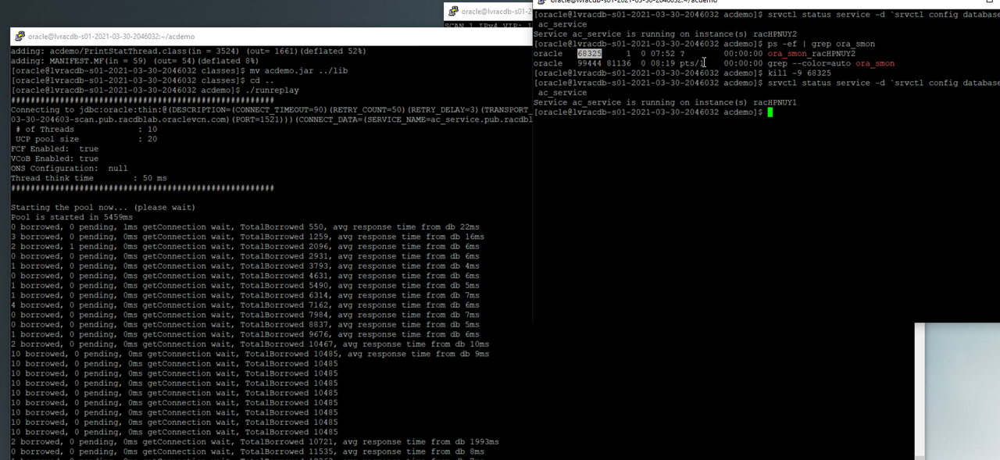

    No errors occur.
    Application Continuity traps the error(s), re-establishes connections at a surviving instance, and replays any uncommitted transactions.
    We do not progress in to any of the application's error handling routines

    ````
    2 borrowed, 0 pending, 0ms getConnection wait, TotalBorrowed 10467, avg response time from db 10ms
    10 borrowed, 0 pending, 0ms getConnection wait, TotalBorrowed 10485, avg response time from db 9ms
    10 borrowed, 0 pending, 0ms getConnection wait, TotalBorrowed 10485
    10 borrowed, 0 pending, 0ms getConnection wait, TotalBorrowed 10485
    10 borrowed, 0 pending, 0ms getConnection wait, TotalBorrowed 10485
    10 borrowed, 0 pending, 0ms getConnection wait, TotalBorrowed 10485
    10 borrowed, 0 pending, 0ms getConnection wait, TotalBorrowed 10485
    10 borrowed, 0 pending, 0ms getConnection wait, TotalBorrowed 10485
    10 borrowed, 0 pending, 0ms getConnection wait, TotalBorrowed 10485
    10 borrowed, 0 pending, 0ms getConnection wait, TotalBorrowed 10485
    2 borrowed, 0 pending, 0ms getConnection wait, TotalBorrowed 10721, avg response time from db 1993ms
    0 borrowed, 0 pending, 0ms getConnection wait, TotalBorrowed 11535, avg response time from db 8ms
    1 borrowed, 0 pending, 0ms getConnection wait, TotalBorrowed 12363, avg response time from db 7ms
    2 borrowed, 0 pending, 0ms getConnection wait, TotalBorrowed 13189, avg response time from db 7ms

    ````
    You should notice that there is a response time increase as services are failed over and connections re-established. But no errors.

## Task 5:  Transparent Application Continuity

1.  Examine the tac_replay.properties file to see that we are using a replay datasource *oracle.jdbc.replay.OracleDataSourceImpl* and we have enabled FAN, *fastConnectionFailover=TRUE* and connection tests *validateConnectionOnBorrow=TRUE*. The URL uses the recommended format and connects to the service you created previously, which has AC attributes set.

    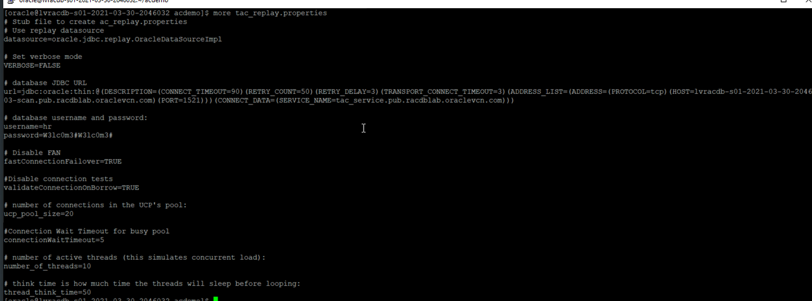   

     ````
     cd /home/oracle/acdemo
     ./runtacreplay
     ````
     The application will start, create a connection pool, and begin issuing transactions against the database using a TAC-enabled service.
     Both FAN and connection tests are enabled

       

    **Note:** ONS is auto-configured. The "ONS Configuration" heading in the banner is only populated if ONS is manually configured [which is not recommended]

2. Crash the instance by killing SMON

    Substitute your AC service in the command below (in this example my AC-enabled service is named ac_service)
    ````
    srvctl status service -d `srvctl config database` -s ac_service
    ps -ef | grep ora_smon
    kill -9 mySMONPID
    ````
    For example:

    ````
    $ srvctl status service -d `srvctl config database` -s tac_service
                        Service ac_service is running on instance(s) racHPNUY2

    $ ps -ef | grep ora_smon
                oracle   68325     1  0 07:52 ?        00:00:00 ora_smon_racHPNUY2
                oracle   99444 81136  0 08:19 pts/1    00:00:00 grep --color=auto ora_smon
    $ kill -9 68325
    ````

    

    No errors occur.
    Transparent Application Continuity traps the error(s), re-establishes connections at a surviving instance, and replays any uncommitted transactions.
    We do not progress in to any of the application's error handling routines

    ````
    $ ./runtacreplay
    ######################################################
    Connecting to jdbc:oracle:thin:@(DESCRIPTION=(CONNECT_TIMEOUT=90)(RETRY_COUNT=50)(RETRY_DELAY=3)(TRANSPORT_CONNECT_TIMEOUT=3)(ADDRESS_LIST=(ADDRESS=(PROTOCOL=tcp)(HOST=lvracdb-s01-2021-03-30-204603-scan.pub.racdblab.oraclevcn.com)(PORT=1521)))(CONNECT_DATA=(SERVICE_NAME=tac_service.pub.racdblab.oraclevcn.com)))
    # of Threads             : 10
    UCP pool size            : 20
    FCF Enabled:  true
    VCoB Enabled: true
    ONS Configuration:  null
    Thread think time        : 50 ms
    ######################################################

    Starting the pool now... (please wait)
    Pool is started in 4403ms
    6 borrowed, 2 pending, 0ms getConnection wait, TotalBorrowed 645, avg response time from db 15ms
    0 borrowed, 0 pending, 0ms getConnection wait, TotalBorrowed 1442, avg response time from db 9ms
    5 borrowed, 1 pending, 0ms getConnection wait, TotalBorrowed 2240, avg response time from db 9ms
    1 borrowed, 0 pending, 1ms getConnection wait, TotalBorrowed 2809, avg response time from db 29ms
    1 borrowed, 0 pending, 1ms getConnection wait, TotalBorrowed 3492, avg response time from db 18ms
    1 borrowed, 0 pending, 0ms getConnection wait, TotalBorrowed 4294, avg response time from db 9ms
    2 borrowed, 0 pending, 0ms getConnection wait, TotalBorrowed 5126, avg response time from db 7ms
    ````
    You should notice that there is a response time increase as services are failed over and connections re-established. But no errors.

3. Run the kill_session.sh script

    ````
    cd /home/oracle/acdemo
    ./kill_session.sh tac_service.pub.racdblab.oraclevcn.com
    ````
    ````
    SQL> SQL>
    'ALTERSYSTEMKILLSESSION'''||SID||','||SERIAL#||'''IMMEDIATE;'
    --------------------------------------------------------------------------------
    ALTER SYSTEM KILL SESSION '21,60564' IMMEDIATE;
    ALTER SYSTEM KILL SESSION '24,27022' IMMEDIATE;
    ALTER SYSTEM KILL SESSION '26,59121' IMMEDIATE;
    ALTER SYSTEM KILL SESSION '29,8643' IMMEDIATE;
    ALTER SYSTEM KILL SESSION '30,61221' IMMEDIATE;
    ALTER SYSTEM KILL SESSION '34,8113' IMMEDIATE;
    ALTER SYSTEM KILL SESSION '185,19980' IMMEDIATE;


    1 borrowed, 0 pending, 1ms getConnection wait, TotalBorrowed 2809, avg response time from db 29ms
    1 borrowed, 0 pending, 1ms getConnection wait, TotalBorrowed 3492, avg response time from db 18ms
    1 borrowed, 0 pending, 0ms getConnection wait, TotalBorrowed 4294, avg response time from db 9ms

    ````
4. TAC will protect applications that do, or do not use a connection pool

    Let's look at a SQL\*Plus example.

5. Connect to the database with SQL\*Plus as the HR user over the TAC-enabled service
    ````
    sqlplus hr/W3lc0m3#W3lc0m3#@"(DESCRIPTION=(CONNECT_TIMEOUT=90)(RETRY_COUNT=50)(RETRY_DELAY=3)(TRANSPORT_CONNECT_TIMEOUT=3)(ADDRESS_LIST=(ADDRESS=(PROTOCOL=tcp)(HOST=lvracdb-s01-2021-03-30-204603-scan.pub.racdblab.oraclevcn.com)(PORT=1521)))(CONNECT_DATA=(SERVICE_NAME=tac_service.pub.racdblab.oraclevcn.com)))"
    ````

    Update a row in the table EMP4AC.
    For example:

    ````
    select empno, ename  from emp4ac where rownum < 10;

         EMPNO ENAME
       ---------- ----------
        8504 Bob8504
        1785 Bob1785
        2998 Bob2998
        107 Bob107
        9988 Bob9988
        6277 Bob6277
        4121 Bob4121
        2459 Bob2459
        7770 Bob7770
       9 rows selected.

    update emp4ac set empno=9999 where empno=8504 and ename='Bob8504' and rownum < 10;
    ````
    From another terminal window run the kill_session.sh script against the TAC-enabled service

    ````
    kill_session.sh tac_service.pub.racdblab.oraclevcn.com
    ````

    An alter system kill session command will be run:

    ````
    ALTER SYSTEM KILL SESSION '190,9611' IMMEDIATE;

    ````
    What happens to the SQL*Plus session?

   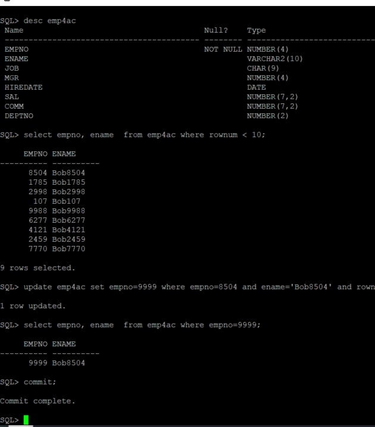

    Perform another update and commit

    ````
    SQL> update emp4ac set empno=8504 where empno=9999 and rownum <10;
        1 row updated.
    SQL> commit;
        Commit complete.
    SQL>
    ````

    Try the same procedure using the AC-enabled service

    ````
    SQL> select empno, ename  from emp4ac where rownum < 10;
     EMPNO ENAME
    ---------- ----------
      8504 Bob8504
      1785 Bob1785
      2998 Bob2998
       107 Bob107
      9988 Bob9988
      6277 Bob6277
      4121 Bob4121
      2459 Bob2459
      7770 Bob7770
         9 rows selected.
   SQL> update emp4ac set empno=9999 where empno=8504 and ename='Bob8504' and rownum < 10;
        1 row updated.
    SQL> commit;
       Commit complete.

    SQL>  select empno, ename  from emp4ac where rownum < 10;
     EMPNO ENAME
    ---------- ----------
      9999 Bob8504
      1785 Bob1785
      2998 Bob2998
       107 Bob107
      9988 Bob9988
      6277 Bob6277
      4121 Bob4121
      2459 Bob2459
      7770 Bob7770

    9 rows selected.
    SQL> update emp4ac set empno=8504 where empno=9999 and ename='Bob8504' and rownum < 10;
        1 row updated.
     SQL> commit;
    ERROR:
    ORA-41409: cannot replay committed transaction; failover cannot continue
    ````

    A COMMIT signals to application continuity to disable replay until the next request. For AC, this is typically a getConnection() call (from a pool). SQL*Plus is not pooled. TAC however, enables protection on the next call - hence protection continues.


You may now *proceed to the next lab*.  

## Appendix Troubleshooting Tips

### Issue 1 JNI ERROR

    

#### Fix for Issue #1
1.  Recompile and re-package ACDemo with the installed JDK
    ````
    cd /home/oracle/acdemo/src/acdemo  

    $ORACLE_HOME/jdk/bin/javac  -classpath ../../lib/ucp-19.10.0.0.jar:../../lib/ojdbc8-19.10.0.0.jar:../../lib/ons-19.10.0.0.jar:../../lib/oraclepki-19.10.0.0.jar:../..//lib/osdt_cert-19.10.0.0.jar:../../lib/osdt_core-19.10.0.0.jar:.  ACDemo.java Worker.java PrintStatThread.java  

    mv *.class ../classes/acdemo  

    cd ../classes  

    $ORACLE_HOME/jdk/bin/jar -cvf acdemo.jar acdemo ../MANIFEST.MF  

    mv acdemo.jar ../lib  
    ````
### Issue 2 Instance not restarting
    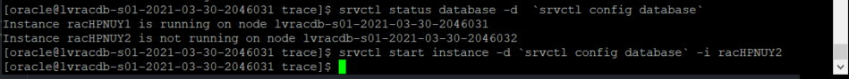

#### Fix for Issue #2
1. After crashing an instance a number of times (in a short period), it may not automatically restart. If you notice an instance down, manually restart it (this can lead to application timeouts on failover, as the instance may not start before the application abandons connection attempts)

    ````
    $ srvctl status database -d  `srvctl config database`
          Instance racHPNUY1 is running on node lvracdb-s01-2021-03-30-2046031
          Instance racHPNUY2 is not running on node lvracdb-s01-2021-03-30-2046032

    $ srvctl start instance -d `srvctl config database` -i racHPNUY2
    ````

## Acknowledgements
* **Authors** - Troy Anthony
* **Contributors** - Kay Malcolm
* **Last Updated By/Date** - Troy Anthony, April 2021
