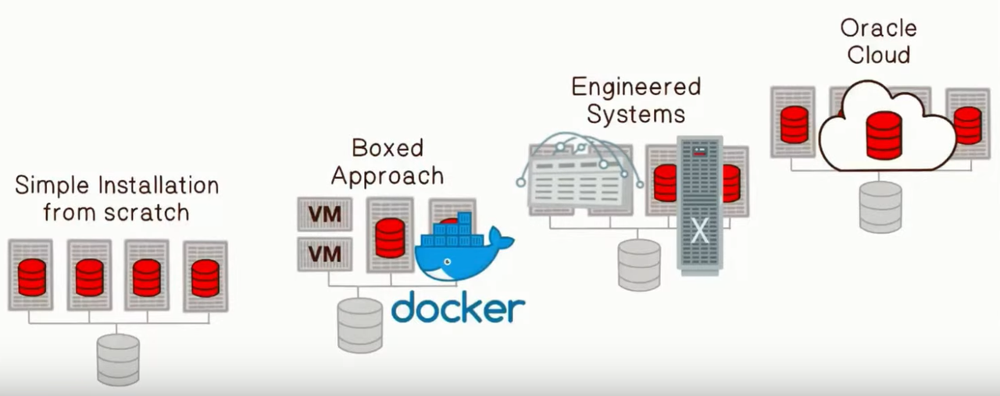
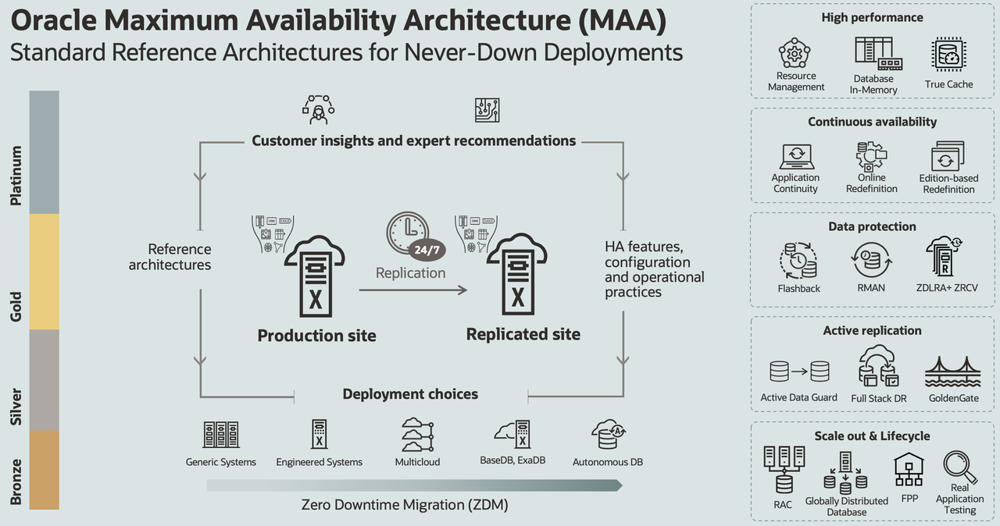

# Introduction

## Introduction to Application Continuity ##
Application Continuity (AC) is a feature available with the Oracle Real Application Clusters (RAC), Oracle RAC One Node and Oracle Active Data Guard options that masks outages from end users and applications by recovering the in-flight database sessions following recoverable outages. Application Continuity performs this recovery beneath the application so that the outage appears to the application as a slightly delayed execution.

Application Continuity improves the user experience for both planned maintenance and unplanned outages. Application Continuity enhances the fault tolerance of systems and applications that use an Oracle database.

Watch the video below for an overview of Oracle RAC.

### About this Workshop
Application Continuity is offered with Oracle Real Application Clusters, Oracle RAC One Node, and Oracle Active Data Guard. This workshop will use a RAC cluster as the basis for demonstrating the capabilities of Application Continuity.

In this workshop you will create a 2-node Oracle Real Application Clusters database in the Oracle Cloud.  Oracle Cloud Infrastructure offers 2-node RAC DB systems on virtual machines.

For more about Virtual DB systems, click [here](https://docs.cloud.oracle.com/en-us/iaas/Content/Database/Concepts/overview.htm).

On your RAC cluster you will define database services. One of these services will have attributes that support Application Continuity, the other will not. You will then configure a sample application to use the AC service and see the benefits AC provides the application. These benefits will be reinforced by running the same application against a service with no AC characteristics.

Optionally, you can examine FAN events, which form the basis for notifying applications when failures occur or when maintenance is due to start. FAN events play a role in outage detection and draining for maintenance.

### Workshop Objectives
- Build a DB System
- Services
- Application Continuity
- Fast Application Notification
Estimated Workshop Time:  2 hours

## More on Oracle Application Continuity

Oracle Application Continuity provides:
* Continuous availability for applications

## Application Continuity and MAA
Oracle MAA is a collection of architecture, configuration, and life cycle best practices and blueprints. It provides Oracle’s customers with valuable insights and expert recommendations which have been validated and tested working with enterprise customers. This is also an outcome of ongoing communication, with the community of database architects, software engineers, and database strategists, that helps Oracle develop a deep and complete understanding of various kinds of events that can affect availability or data integrity. Over the years, this led to the development and natural evolution of an array of availability reference architectures.

Application Continuity extends the MAA architecture to the application tier.

## More Information on Oracle Application Continuity

* [Visit the AC site on OTN](https://www.oracle.com/got/ac)

## Acknowledgements

- **Authors/Contributors** - Troy Anthony, Anil Nair
- **Last Updated By/Date** - Anil Nair, November 2024
