# Services

## Introduction
This lab walks you through the steps to demonstrate many of the capabilities of Oracle Database services.

Estimated Lab Time: 20 Minutes

Watch the video below for an overview of the Services lab
[](youtube:rPUFNMGCzDc)

### Prerequisites
- An Oracle LiveLabs or Paid Oracle Cloud account
- Lab: Generate SSH Key
- Lab: Build a DB System


### About Oracle Database services

Services represent groups of applications with common attributes, service level thresholds, and priorities. Application functions can be divided into workloads identified by services. You can also group work by type under services. For example, online users can use one service, while batch processing can use another and reporting can use yet another service to connect to the database.

A service can span one or more instances of an Oracle database, multiple databases in a global cluster, and a single instance can support multiple services.  The number of instances that are serving the service is transparent to the application. Services provide a single system image to manage competing applications, and allow each workload to be managed as a single unit.

Response time and CPU consumption metrics, performance and resource statistics, wait events, threshold based alerts, and performance indexes are maintained by the Automatic Workload Repository automatically for all services.  Service, module and action tags are used to identify operations within a service at the server. (MODULE and ACTION are set by the application) End to end monitoring enables aggregation and tracing at Service, Module and Action levels to identify the high load operations. Oracle Enterprise Manager administers the service quality thresholds for response time and CPU consumption, monitors the top services, and provides drill down to the top modules and top actions per service.

Connect time routing and runtime routing algorithms balance the workload across the instances offering a service. RAC use services to enable uninterrupted database operations. Planned operations are supported through interfaces that allow the relocation or disabling/enabling of services.

Application Continuity is set as an attribute of a service.

Oracle recommends that all users who share a service have the same service level requirements. You can define specific characteristics for services and each service can represent a separate unit of work. There are many options that you can take advantage of when using services. Although you do not have to implement these options, using them helps optimize application operation and performance.

For more information on Oracle Database Services visit [http://www.oracle.com/goto/ac](http://www.oracle.com/goto/ac)

 [](https://youtu.be/dIMgaujSydQ)

## Task 1: Login and Identify Database and Instance names
You should have already identified your database name and instance name.  Each place in this lab where you see replacename make sure you use your correct instance and database names.
1.  If you aren't already logged in to the Oracle Cloud, open up a web browser and re-login to Oracle Cloud.
2.  Once you are logged in, open up a 2nd webbrowser tab.
3.  Start Cloudshell in each.  Maximize both cloudshell instances.

    *Note:* You can also use Putty or MAC Cygwin if you chose those formats in the earlier lab.  
    

4.  Connect to node 1 as the *opc* user (you identified the IP address of node 1 in the Build DB System lab).

    ````
    ssh -i ~/.ssh/sshkeyname opc@<<Node 1 Public IP Address>>
    ````
    

5. Repeat this step for node 2.

    ````
    ssh -i ~/.ssh/sshkeyname opc@<<Node 2 Public IP Address>>
    ps -ef | grep pmon
    ````
      

6. Run the command to determine your database name and additional information about your cluster on **node 1**.  Run this as the *grid* user.

    ````
    <copy>
    sudo su - grid
    crsctl stat res -t
    </copy>
    ````
    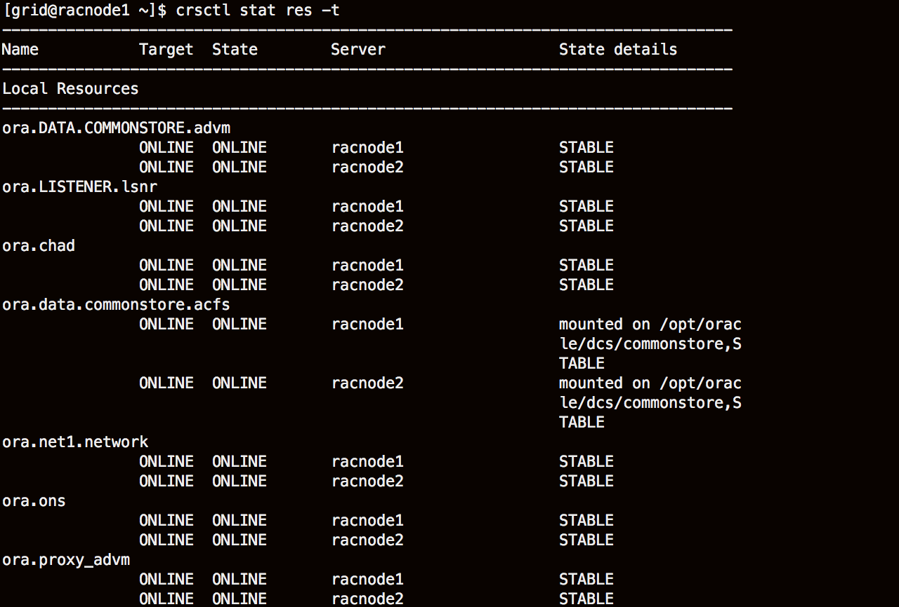

    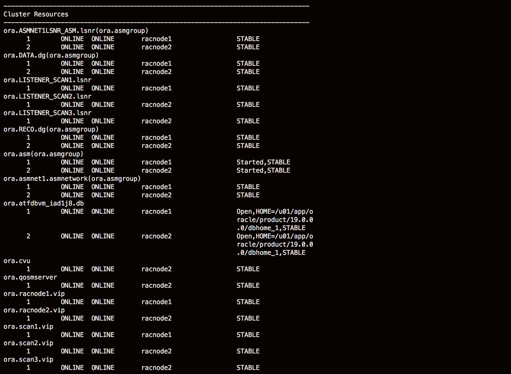

7. Find your database name in the *Cluster Resources* section with the *.db*.  Jot this information down, you will need it for this lab.

    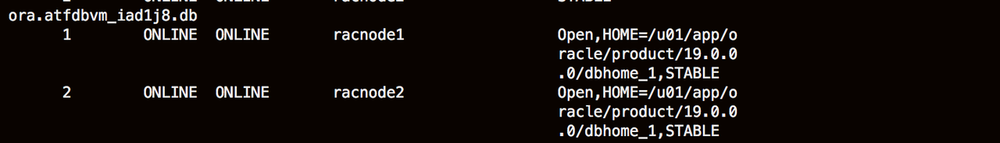

## Task 2:  Create a Service

**NOTE** For simplicity we will often use the EZConnect syntax to specify connect strings to the database:

user/password@**//hostname:port/servicename**       

EZConnect does not support all service characteristics. A fully specified URL or TNS Connect String is required for Application Continuity and other service characteristics.  

1.  Create a new service **svctest** with *instance1* as a **preferred** instance and *instance2* as an **available instance**. This means that the service will normally run on the *instance1* but will failover to *instance2* if the first instance becomes unavailable.  Run this on node 1.

    *Note:* Remember to replace all instances of *aTFdbVm_replacename* with the database name you identified in Step 1.

    ````
    <copy>
    exit
    sudo su - oracle
    srvctl add service -d aTFdbVm_replacename -s svctest -preferred aTFdbVm1_replacename -available aTFdbVm2_replacename -pdb pdb1
    srvctl start service -d aTFdbVm_replacename -s svctest
    </copy>
    ````
    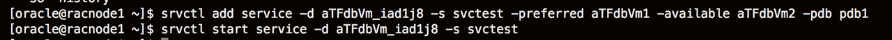

2. Examine where the service is running by using **lsnrctl** to check the SCAN listener or a local listener on each node. **srvctl** will also show you where the service is running.

    ````
    <copy>
    srvctl status service -d aTFdbVm_replacename -s svctest
    </copy>
    ````
    

3.  Use the lsnrctl utility to list the services on both **node 1** and **node 2** as the *grid* user.
    ````
    <copy>
    ORACLE_HOME=/u01/app/19.0.0.0/grid
    $ORACLE_HOME/bin/lsnrctl services
    </copy>
    ````
    
    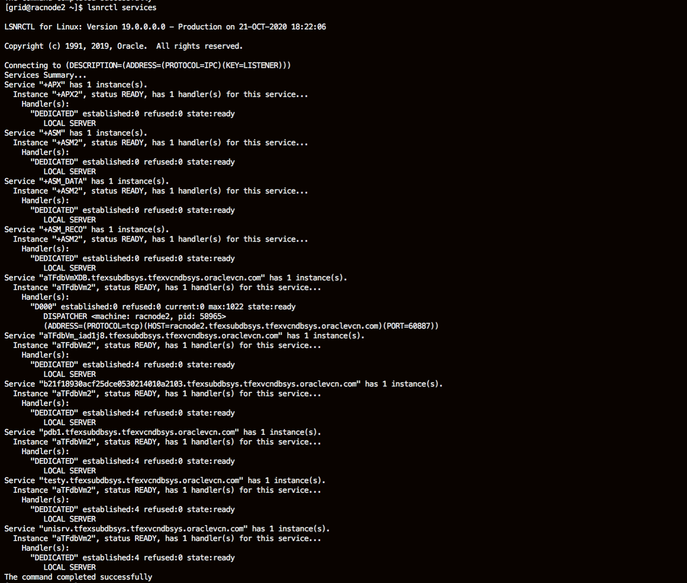


    Note that this service is only active on one instance at a time, so both **local** listeners will not include an entry for this service. In the example shown here, the listener on racnode2 would **not** have an entry for **Service "svctest.pub.racdblab.oraclevcn.com"*

4.  Any of the SCAN listeners will show where the service is offered. Note that SCAN Listeners run from the GI HOME so you have to change the ORACLE_HOME environment variable in order to view the information about the SCAN Listeners.  Run the lsnrctl command below on **node 2** as the *grid*.

    ````
    <copy>
    export ORACLE_HOME=/u01/app/19.0.0.0/grid
    $ORACLE_HOME/bin/lsnrctl service LISTENER_SCAN2
    </copy>
    ````
    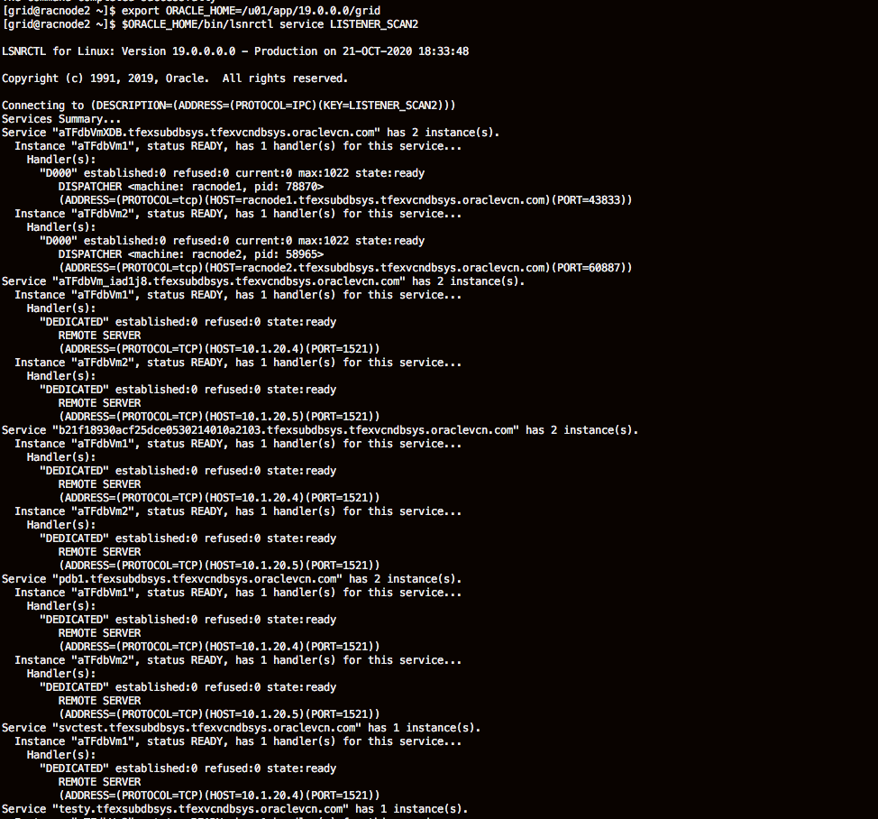

5. Repeat it on **node 1** as well.

    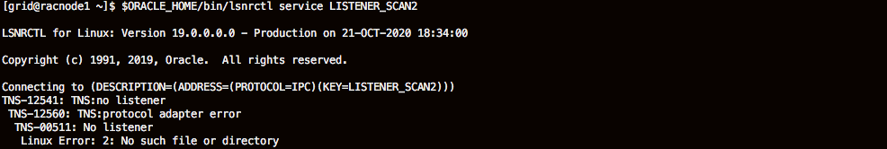


## Task 3: Service Failover

1. Cause the service to fail over. After identifying which instance the service is being offered on, kill that instance by removing the SMON process at the operating system level.  Run this on **node 1**

    ````
    <copy>
    ps -ef | grep ora_smon
    </copy>
    ````
    This will show the SMON process id of your database  
    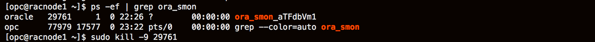
    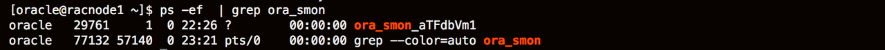


2. In this example the process ID is 585689, which I can pass to the **kill -9 <process id>** command.  Identify your process id and issue the kill command as the *oracle* user

    ````
    sudo kill -9 ######
    ````

    This will cause the instance to fail, any connections to the database on this instance would be lost. The CRS component of Grid Infrastructure would detect the instance failure, and immediately start the service on an **available** instance (based on the service definition). CRS would then restart the database instance.

3. Rerun the *srvctl status service* command and notice that the service has failed over to the other instance:

    ````
    <copy>
    srvctl status service -d aTFdbVm_replacename -s svctest
    </copy>
    ````

    Depending on where your service was running beforehand, you will notice something similar to

    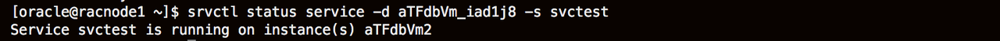

4. Manually relocate the service. Open a connection (with SQL*Plus) to the instance where the service is running. Use the SCAN address and the domain qualified service name in the format:

    ````
    **sqlplus user/password@//SCAN Address Name/service-name**
    ````
5. Connect via sqlplus and replace the password with the password you chose for your cluster.

    ````
     sqlplus system/W3lc0m3#W3lc0m3#@//racnode-scan.tfexsubdbsys.tfexvcndbsys.oraclevcn.com/svctest.tfexsubdbsys.tfexvcndbsys.oraclevcn.com
    ````
    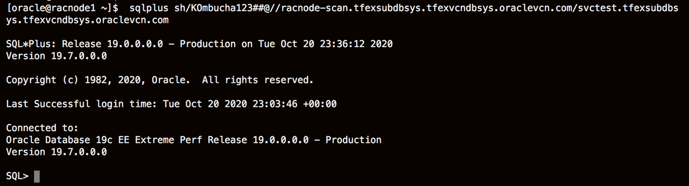


6. Using a different cloud shell window (connected to either node) open a SQL*Plus connection as SYS to the PDB associated with this service

    ````
    sqlplus sys/W3lc0m3#W3lc0m3#@//racnode-scan.tfexsubdbsys.tfexvcndbsys.oraclevcn.com/pdb1.tfexsubdbsys.tfexvcndbsys.oraclevcn.com as sysdba
    ````
    and run the following SQL statement

    ````
    <copy>
    set wrap off
    col service_name format  a20
    select inst_id, service_name, count(*) from gv$session where service_name = 'svctest' group by inst_id, service_name;
    </copy>
    ````
    This statement will show you the instance this service is running and the number of open connections on this service.

    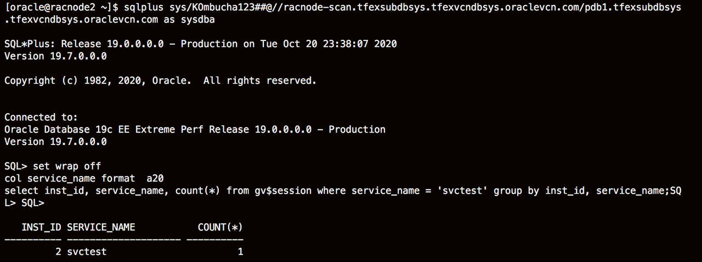


7. Relocate the service using srvctl.  Execute the command on **node 2**

    ````
    <copy>
     srvctl relocate service -d aTFdbVm_replacename -s svctest -oldinst aTFdbVm2 -newinst aTFdbVm1
    </copy>
    ````
    which will move the service from one instance to another:

    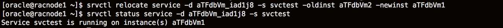

    Re-examine the v$session information:

    ````

    SQL> /
    INST_ID     SERVICE_NAME         COUNT(*)
    ---------- -------------------- ----------
       1         svctest                1
    ````
    It has not changed.
    The relocate service command will not disconnect active sessions unless a force option (**-force**) is specified. A stop service command will allow a drain timeout to be specified to allow applications to complete their work during the drain interval.

## Task 4: Services configured for Application Continuity

FAN, connection identifier, TAC, AC, switchover, consumer groups, and many other features and operations are predicated on the use of services. Do not use the default database service (the service created automatically with the same name as the database or PDB) as this service cannot be disabled, relocated, or restricted and so has no high availability support. The services you use are associated with a specific primary or standby role in a Data Guard environment. Do not use the initialization parameter *service_names* for application usage.

**Note:** If you need to find your database name run the command:

````
<copy>
srvctl config database
````

1. Attributes set on the service enable applications to use Application Continuity. Create a service, setting the attributes **failover\_restore**, **commit\_outcome**, and **failovertype** for **Application Continuity (AC)**. Replace the values for "-d", "-s", "-preferred" and "-available" with those of your system.

    ````
    <copy>
    srvctl add service -d (addDatabaseName) -s (myServiceName) -commit_outcome TRUE -failovertype TRANSACTION -failover_restore LEVEL1 -preferred (YourInstance1) -available (YourInstance2) -pdb pdb1 -clbgoal LONG -rlbgoal NONE
    ````
2. Create a service named **noac** with no AC settings

    ````
    <copy>
    srvctl add service -d (addDatabaseName) -s noac -commit_outcome FALSE -failovertype NONE -failover_restore NONE -preferred (YourInstance1) -available (YourInstance2) -pdb pdb1 -clbgoal LONG -rlbgoal NONE
    ````
3. Start both services   
    ````
    <copy>
    srvctl start service -d (addDatabaseName) -s noac
    srvctl start service -d (addDatabaseName) -s (myServiceName)
    ````

    The two services you have just created (one named **noac** and another you named) will be used in the next lab.

You may now *proceed to the next lab*.  

## Acknowledgements
* **Authors** - Troy Anthony
* **Contributors** - Kay Malcolm, Kamryn Vinson
* **Last Updated By/Date** - Kamryn Vinson, April 2021
