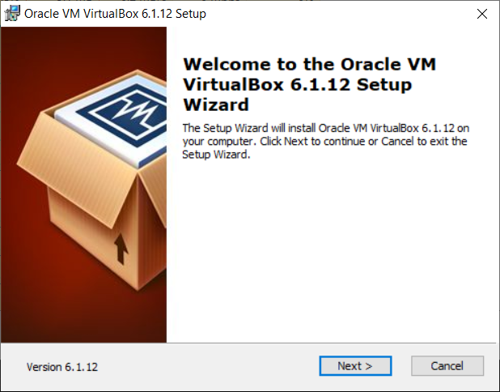
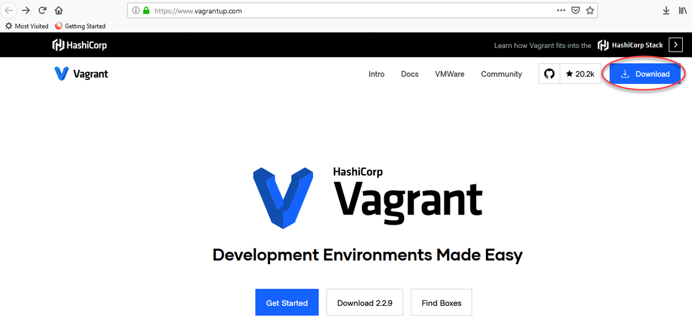
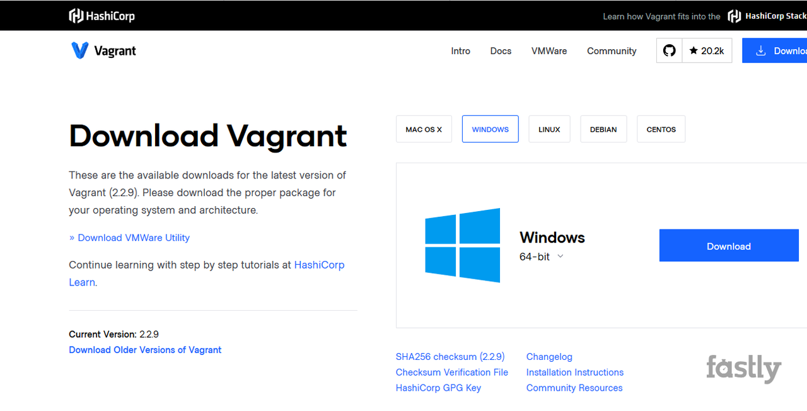
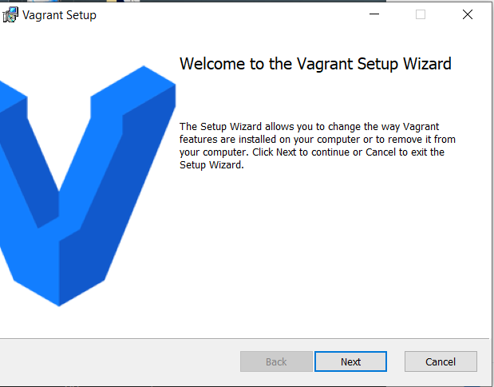

# Setup - LiveLabs#

## Introduction
This lab will show you how to setup a GI cluster and RAC database on your laptop using Oracle Virtual Box.  

**PLEASE READ:**  *If you already have a RAC cluster (running the 19c Image) configured, bypass this step.*
**PLEASE READ:**  *You will need a minimum of 16GB memory and 100GB of disk space to install the cluster and database. The ability to install new software is required*

## Task 1: Install VirtualBox
The latest release of VirtualBox is version 6.1.12.

1.  Open a browser and access the VirtualBox Downloads page:  
- [VirtualBox Downloads](https://www.virtualbox.org/wiki/Downloads) - Select the installation appropriate to your operating system

2.  Save in your downloads folder.

3.  Open the installer

    

4.  Select the defaults and install VirtualBox
5.  Install the **extensionPack** when asked


## Task 2: Install **HashiCorp Vagrant**
The current version of Vagrant is 2.2.9

1.  Install HashiCorp Vagrant.

- [Vagrant Download](https://www.vagrantup.com) - Select the Download button at the top, right corner

    

2.  Choose the version appropriate for your operating system and press Download again:

    

3.  Save the file in your Downloads folder

4. Open the Vagrant Setup Wizard and install vagrant

    

## Task 3: Clone the RAC Vagrant project from github

1. Create a directory to house the RAC vagrant project

````
mkdir C:\myVagrantFiles
````
2. Change in to this directory and clone the github directory

````
cd C:\myVagrantFiles
git clone https://github.com/oracle/vagrant-projects.git
````
3. The **git clone** command will create files under the directory you run it from **C:\myVagrantFiles**
Change directory to the **OracleRAC** directory

````
cd C:\myVagrantFiles\vagrant-projects\OracleRAC
dir
````
You should see the following files:
````
Directory of C:\Work_files\Work_Data\vagrantLabs\vagrant-projects\OracleRAC

15/07/2020  05:57 PM    <DIR>          .
15/07/2020  05:57 PM    <DIR>          ..
08/07/2020  08:44 AM                21 .gitattributes
08/07/2020  08:44 AM                59 .gitignore
09/07/2020  04:43 PM    <DIR>          .vagrant
09/07/2020  05:22 PM    <DIR>          config
08/07/2020  08:44 AM    <DIR>          images
08/07/2020  10:01 AM    <DIR>          ORCL_software
08/07/2020  08:44 AM            11,387 README.md
09/07/2020  06:06 PM    <DIR>          scripts
08/07/2020  08:44 AM    <DIR>          userscripts
08/07/2020  08:44 AM            24,334 Vagrantfile
````

4. Download the Oracle Database 19c Release and Grid Infrastructure 19c Release from OTN and place in the **ORCL_Software** directory beneath **OracleRAC**

- [Oracle Software Downloads](https://www.oracle.com/technetwork/database/enterprise-edition/downloads/index.html) - Select the installation appropriate to your operating system

- [Oracle Database 19c for Linux x86-64](https://www.oracle.com/database/technologies/oracle-database-software-downloads.html#license-lightbox)    
The latest version of Oracle Database 19c for Linux x86-64 is **LINUX.X64_193000_db_home.zip**

- [Oracle Database 19c Grid Infrastructure for Linux x86-64](https://www.oracle.com/database/technologies/oracle19c-linux-downloads.html#license-lightbox)
The latest version of Grid Infrastructure for Linux x86-64 is **LINUX.X64_193000_grid_home.zip**

5. Verify the parameter settings in the file **.\OracleRAC\config\vagrant.yml**

The file **vagrant.yml** contains the parameters used by Vagrant to configure the VirtualBox nodes. The file will be similar to the following:

````
# -----------------------------------------------
# vagrant.yml for VirtualBox
# -----------------------------------------------
node1:
  vm_name: node1
  mem_size: 8192
  cpus: 2
  public_ip:  192.168.56.111
  vip_ip:     192.168.56.112
  private_ip: 192.168.200.111
  u01_disk: ./node1_u01.vdi

node2:
  vm_name: node2
  mem_size: 8192
  cpus: 2
  public_ip:  192.168.56.121
  vip_ip:     192.168.56.122
  private_ip: 192.168.200.122
  u01_disk: ./node2_u01.vdi

shared:
  prefix_name:   vgt-ol7-rac
  # ---------------------------------------------
  domain:   localdomain
  scan_ip1: 192.168.56.115
  scan_ip2: 192.168.56.116
  scan_ip3: 192.168.56.117
  # ---------------------------------------------
  non_rotational: 'on'
  # ---------------------------------------------
  asm_disk_path:
  asm_disk_num:   4
  asm_disk_size: 20
  p1_ratio:      80
  # ---------------------------------------------

env:
  provider: virtualbox
  # ---------------------------------------------
  gi_software:     LINUX.X64_193000_grid_home.zip
  db_software:     LINUX.X64_193000_db_home.zip
  # ---------------------------------------------
  root_password:   welcome1
  grid_password:   welcome1
  oracle_password: welcome1
  sys_password:    welcome1
  pdb_password:    welcome1
  # ---------------------------------------------
  ora_languages:   en,en_GB
  # ---------------------------------------------
  nomgmtdb:        true
  orestart:        false
  # ---------------------------------------------
  db_name:         DB193H1
  pdb_name:        PDB1
  db_type:         RAC
  cdb:             false
  # ---------------------------------------------
````
**Note:** the file shipped contains configuration settings for two providers, libvirt and virtualbox. Remove all settings related to libvirt, or comment these lines by placing a hash value "\#" as the first character in each line.

Many of these parameters are customizable, but they can be left as the sample values if you are not sure about changing them.
The parameters that you **MUST** validate are:

* **provider**: must be set to **virtualbox** for this setup
* **gi_software**: must be the name of the Grid Infrastructure Release 19c file downloaded from OTN (and placed in ORCL_Software directory)
* **db_software**: must be the name of the Oracle Database Release 19c file downloaded from OTN (and placed in ORCL_Software directory)
* **mem_size**: If you have 16GB of memory on your laptop this must be no more than **6144** This must be set on each node **NOTE**: values less than 6144 may prevent GI or DB from starting
* **db_type**: Oracle RDBMS type: set to **RAC** for this example. Supported values are RAC, RACONE, SI (single Instance)
* **cdb**: Oracle RDBMS database created as container (true or false). Set to TRUE for this example

The following values can be changed:
* **prefix_name**: VM Guest prefix name (the GI cluster name will be: <prefix_name>-c')
* **db_name**: Oracle RDBMS database name
* **pdb_name**: Oracle RDBMS pluggable database name
* **cdb**: Oracle RDBMS database created as container (true or false). Set to TRUE for this example


## Task 3a: Connect to your instance

Based on your laptop config, choose the appropriate step to connect to your instance.  

NOTE:  You cannot connect while on VPN or in the Oracle office on clear-corporate (choose clear-internet).  Also, the ssh-daemon is disable for the first 5 minutes or so while the instance is processing.  If you are unable to connect and sure you have a valid key, wait a few minutes and try again.

### Connecting via MAC or Windows CYGWIN Emulator
1.  Go to Compute -> Instance and select the instance you created (make sure you choose the correct compartment)
2.  On the instance homepage, find the Public IP address for your instance.

1.  Open up a terminal (MAC) or cygwin emulator as the opc user.  Enter yes when prompted.

    ````
    ssh -i ~/.ssh/optionskey opc@<Your Compute Instance Public IP Address>
    ````
    

3.  Continue to [Step 5b-Run the Setup Scripts](#Step:  5b-run-the-setup-scripts)

### Connecting via Windows

1.  Open up putty and create a new connection.

    ````
    ssh -i ~/.ssh/optionskey opc@<Your Compute Instance Public IP Address>
    ````
    

2.  Enter a name for the session and click **Save**.

    

3. Click **Connection** > **Data** in the left navigation pane and set the Auto-login username to root.

4. Click **Connection** > **SSH** > **Auth** in the left navigation pane and configure the SSH private key to use by clicking Browse under Private key file for authentication.

5. Navigate to the location where you saved your SSH private key file, select the file, and click Open.  NOTE:  You cannot connect while on VPN or in the Oracle office on clear-corporate (choose clear-internet).

    

6. The file path for the SSH private key file now displays in the Private key file for authentication field.

7. Click Session in the left navigation pane, then click Save in the Load, save or delete a stored session Step.

8. Click Open to begin your session with the instance.


## Acknowledgements

- **Author** - Troy Anthony, DB Product Management
- **Vagrant architecture** - Ruggero Citon, RAC Pack MAA, Cloud Innovation and Solution Engineering Team
- **Last Updated By/Date** - Troy Anthony, DB Product Management, August 2020

