# Setup - RAC DB System in LiveLabs#

## Introduction
This lab will show you how to login to the cloud and setup your environment using Oracle Resource Manager.  

**PLEASE READ:**  *If you already have a RAC DB System (running the DB19c Image) configured, go directly to Step 3b run it, skip Step 3c, then run Step 3d.*

## Task 1: Login and Create Stack using Resource Manager
You will be using Terraform to create your database environment.

1.  Click on the link below to download the zip file you need to build your environment.  

**Needs to be modified to real link in LiveLabs env**

- [db_system_rac_tf.zip](https://objectstorage.us-ashburn-1.oraclecloud.com/p/VEKec7t0mGwBkJX92Jn0nMptuXIlEpJ5XJA-A6C9PymRgY2LhKbjWqHeB5rVBbaV/n/c4u04/b/livelabsfiles/o/data-management-library-files/db_system_rac_tf.zip) - Packaged terraform DB system creation script

2.  Save in your local downloads folder.

3.  Open up the hamburger menu in the left hand corner.  Choose **Resource Manager > Stacks**.   Choose the compartment from your email, click the  **Create Stack** button

    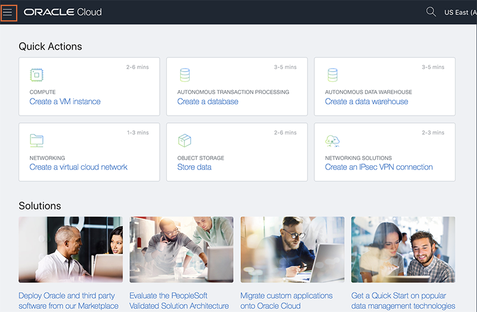

    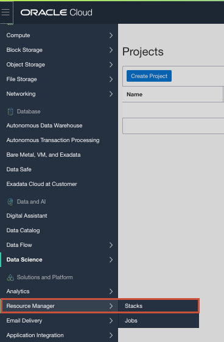

    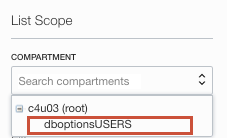

    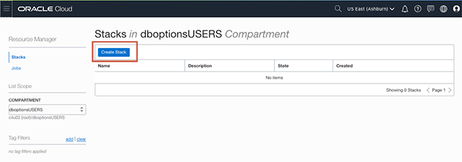

4.  Select **My Configuration**, choose the **.ZIP FILE** button, click the **Browse** link and select the zip file (db_system_rac_tf.zip) that you downloaded. Click **Select**.

    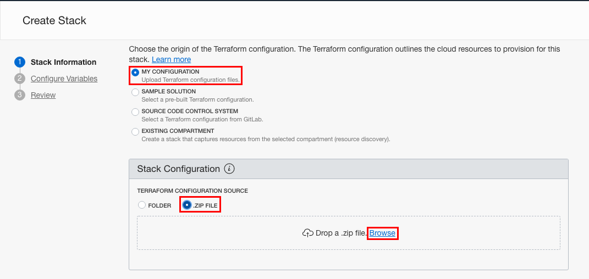


    Enter the following information and accept all the defaults

    - **Network Name**:  If a VCN has already been created select **Existing VCN**, otherwise choose **New network components will be created**.

    - **Resource Name prefix**:  Enter the initials of your name (first name and last name) to prefix all resources, so that they can be easily identified

    - **Compartment**:  Select the Compartment indicated in the email you received

    - **System Availability Domain**: Enter 1, 2, or 3 based on your last name.  (A-J -> 1, K - M -> 2, N-Z -> 3)

    - **Database Edition**: For a 2=node RAC system the database edition must be **Oracle Database Extreme Performance**

    -  **Database Admin Password**: Create a password for the **SYS** user

    - **Database Name**: Give your database a name

    - **Database Workload**: OLTP provides a configuration for mixed workloads

    - **Oracle Database Version**: Choose the latest version

    - **Host Name**: Give a name to your system hosts

    - **System Node Shape**: A minimum of VM\.Standard2\.4 is required (or choose EM\.Standard2\.4)

    - **SSH Public Key**: Paste the public key you created

    - **Cluster Name**: Provide a cluster name. The name must begin with a letter and contain only letters (a-z and A-Z), numbers (0-9) and hyphens (-). The cluster name can be no longer than 11 characters and is not case sensitive.

    - **Display Name**: A non-unique, display name for the DB system. An Oracle Cloud Identifier (OCID) uniquely identifies the DB system.

7.  Click **Next**.

    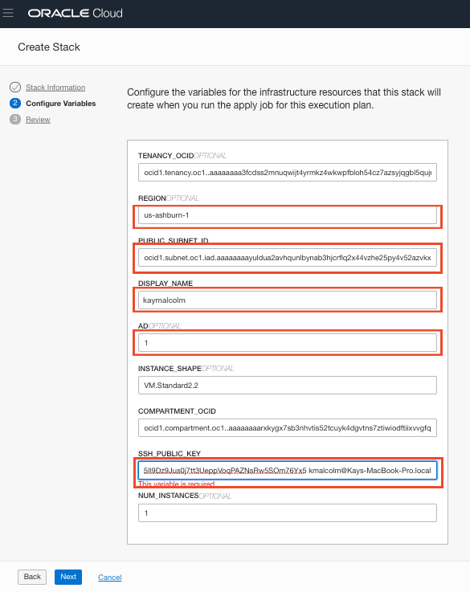

    Enter the following information. Some information may already be pre-populated.  Do not change the pre-populated info.  You will be updating Public Subnet, Display Name, AD (Availability Domain) and SSH Key.

    **Public Subnet ID**:  Enter the subnet ID based on your region.   The subnets are provided in Email 2

    **Display Name:** Enter your firstname and lastname and the day you were born (do not enter any special characters here, including periods, it may mess up the configuration)

    **AD**: Enter 1, 2, or 3 based on your last name.  (A-J -> 1, K - M -> 2, N-Z -> 3)

    **SSH Public Key**:  Paste the public key you created in the earlier step (it should be one line)

8. Click **Next**.

    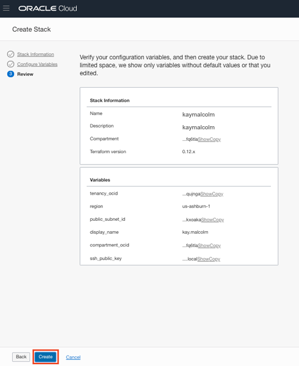

9.  Your stack has now been created!  Now to create your environment.  If you get an error about an invalid DNS label, go back to your Display Name, please do not enter ANY special characters or spaces.  It will fail.

    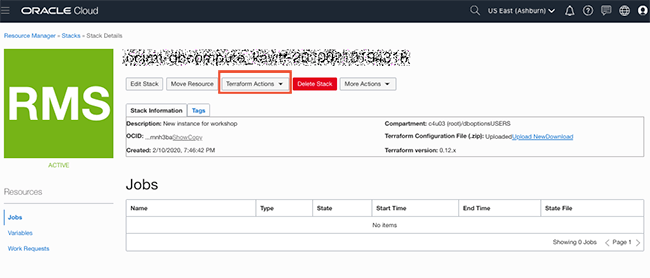


## Task 2: Terraform Plan and Apply
When using Resource Manager to deploy an environment, execute a terraform **plan** and **apply**.  Let's do that now.

1.  [OPTIONAL]Click **Terraform Actions** -> **Plan** to validate your configuration.  This takes about a minute, please be patient.

    

    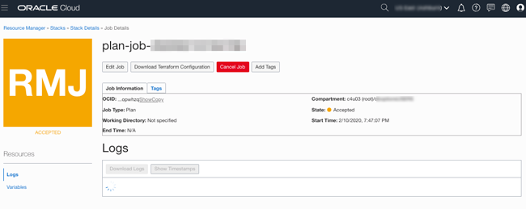

    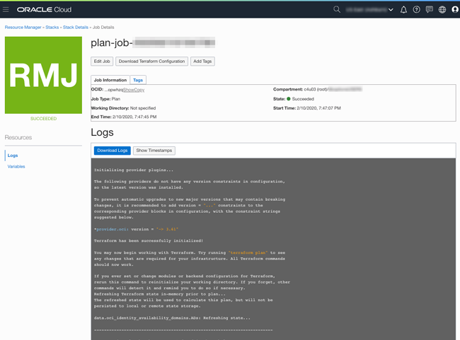

2.  At the top of your page, click on **Stack Details**.  Click the button, **Terraform Actions** -> **Apply**.  This will create your instance and install Oracle 19c.
    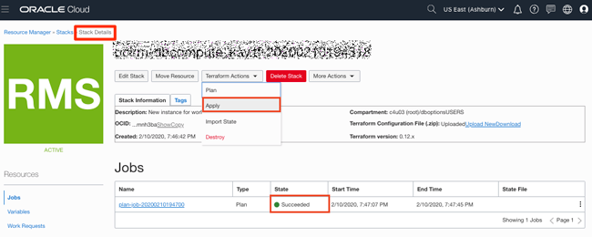

    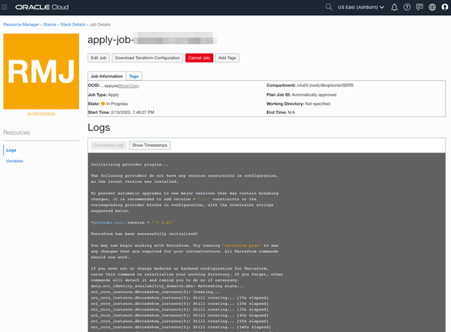

3.  Once this job succeeds, your environment is created!  Time to login to your instance to finish the configuration.


## Task 3a: Connect to your instance

Based on your laptop config, choose the appropriate step to connect to your instance.  

NOTE:  You cannot connect while on VPN or in the Oracle office on clear-corporate (choose clear-internet).  Also, the ssh-daemon is disable for the first 5 minutes or so while the instance is processing.  If you are unable to connect and sure you have a valid key, wait a few minutes and try again.

### Connecting via MAC or Windows CYGWIN Emulator
1.  Go to Compute -> Instance and select the instance you created (make sure you choose the correct compartment)
2.  On the instance homepage, find the Public IP address for your instance.

1.  Open up a terminal (MAC) or cygwin emulator as the opc user.  Enter yes when prompted.

    ````
    ssh -i ~/.ssh/optionskey opc@<Your Compute Instance Public IP Address>
    ````
    

3.  Continue to [Step 5b-Run the Setup Scripts](#Step:  5b-run-the-setup-scripts)

### Connecting via Windows

1.  Open up putty and create a new connection.

    ````
    ssh -i ~/.ssh/optionskey opc@<Your Compute Instance Public IP Address>
    ````
    

2.  Enter a name for the session and click **Save**.

    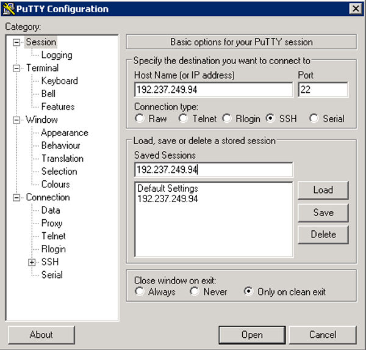

3. Click **Connection** > **Data** in the left navigation pane and set the Auto-login username to root.

4. Click **Connection** > **SSH** > **Auth** in the left navigation pane and configure the SSH private key to use by clicking Browse under Private key file for authentication.

5. Navigate to the location where you saved your SSH private key file, select the file, and click Open.  NOTE:  You cannot connect while on VPN or in the Oracle office on clear-corporate (choose clear-internet).

    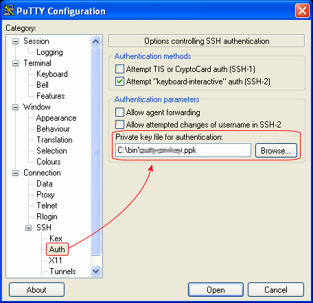

6. The file path for the SSH private key file now displays in the Private key file for authentication field.

7. Click Session in the left navigation pane, then click Save in the Load, save or delete a stored session Step.

8. Click Open to begin your session with the instance.


## Task 3b: Download the Setup Scripts

1.  Copy the following commands into your terminal.  These commands download the files needed to run the lab.

    Note: If you are running in windows using putty, ensure your Session Timeout is set to greater than 0

    ````
    cd /home/opc/
    wget https://objectstorage/racscripts.zip
    unzip racscripts.zip; chmod +x *.sh
    /home/opc/setuprac.sh
    ````

## Task 3c: Run Setup Scripts
If this is a new compute instance, run the following script to configure the 19c database.  Copy the following commands into your terminal.  This script runs in the background so you should be able to exit out while it's running, it takes approximately 25 minutes to run.  

Note: If you are running in windows using putty, ensure your Session Timeout is set to greater than 0

1. Run the command below to configure the database.
    ````
    nohup /home/opc/setupdb.sh &> setupdb.out&
    ````
2.  To check the status of the script above run the command below.  This script takes about 30 minutes to complete.  You can also use the unix **jobs** command to see if the script is still running.

    ````
    tail -f /home/opc/setupdb.out
    ````
## Task 3d: Run the Multitenant Setup Scripts
The setupcdb.sh takes 60 minutes to run and is also setup to run in the background.

1.  Once the database software has been configured, run the script to create the container databases and pluggable databases needed for the Multitenant lab.

     ````
    nohup /home/opc/setupcontainers.sh &> setupcontainers.out&
    ````

2.   To check on the progress of this script, enter the command below.  This script takes about 60 minutes to complete.  Note:  Ignore the [WARNING] [DBT-06208] that occur in the 2nd script.

    ````
    tail -f /home/opc/setupcontainers.out
    ````

Congratulations!  Now you have the environment to run the RAC labs.   

## Acknowledgements

- **Author** - Troy Anthony, DB Product Management
- **Last Updated By/Date** - Troy Anthony, August 2020

