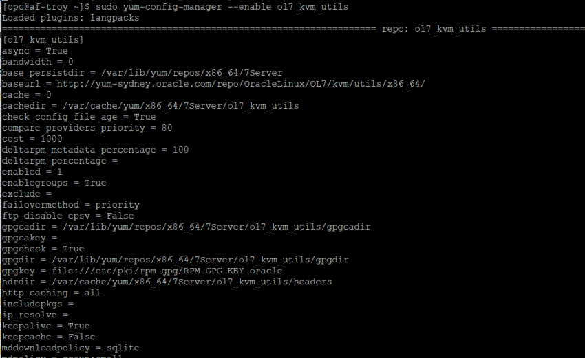

# Setup - LiveLabs#

## Introduction
This lab will show you how to setup a GI cluster and RAC database on your Cloud instance using **libvrt** to virtualize your instance. You will use a pre-built vagrantfile stored on GitHub that will configure and build a 2-node cluster and a RAC database.

**PLEASE READ:**  *If you already have a cluster and RAC database (running the 19c Image) configured, bypass this step.*

## Task 1: Build a Compute Instance using the KVM Marketplace image

1. Log in to the Oracle Cloud Console

2. Select the **Oracle Linux KVM Image** from Oracle Marketplace. Ensure you have chosen the appropriate **Compartment** and click **Launch Instance**
    

3. Click **Show Shape, Network and Storage Options** and choose an **Availability Domain**
    

4. Do not choose a **Bare Metal** configuration. Select **Change Shape** to choose a VM Standard 2.x configuration:
    

5. In the section **Add SSH Keys**: Paste a **Public Key**     
    

6. Click **Create**

## Task 2: Add a Block Volume

The Grid Infrastructure cluster and RAC database you create later will require approximately 80 GB of shared disk. We will create a block device and attach it to the compute instance.

1. Open the **Block Storage** - **Boot Volume** menu
    

2. Click **Create Block Volume**
       

3. Add a **Name** (for example *Vagrant_KVM_Storage*) and select your **Compartment**

4. Ensure you select the same **Availability Domain** as the Compute Instance you have just created. Select **Custom** for **Size and Performance** and create a **90 GB** Volume
       

## Task 3: Attach Block Volume to Compute Instance   

1. Navigate to the Compute Instance you created in **Step 1**

    

2. Select your instance by clicking on its name

3. Under **Resources** (at bottom of screen), select **Attached Block Volumes** and then press **Attach Block Volume**
    

4. Choose **Let Oracle Cloud Infrastructure Choose the Best Attachment Type**. Select the **Select Volume** radio button and then choose the Block Volume you have just created.
        

5. Ensure **READWRITE** is selected and press **Attach**

6. If the volume is attached **Paravirtualised** device **go to Step 4 Configure Disk**

If the Block Volume has been attached via an ISCSI interface you need to run ISCSI commands in a terminal window on your compute instance. The commands are described in the additional menu of the Block Volume:
      

### Connecting via MAC or Windows CYGWIN Emulator
1.  Go to Compute -> Instance and select the instance you created (make sure you choose the correct compartment)
2.  On the instance homepage, find the Public IP addresss for your instance.

3.  Open up a terminal (MAC) or cygwin emulator as the opc user.  Enter yes when prompted.

````
ssh -i ~/.ssh/optionskey opc@<Your Compute Instance Public IP Address>
````
      

### Connecting via Windows

1.  Open up putty and create a new connection.

````
ssh -i ~/.ssh/optionskey opc@<Your Compute Instance Public IP Address>
````
      

2.  Enter a name for the session and click **Save**.

    

3. Click **Connection** > **Data** in the left navigation pane and set the Auto-login username to root.

4. Click **Connection** > **SSH** > **Auth** in the left navigation pane and configure the SSH private key to use by clicking Browse under Private key file for authentication.

5. Navigate to the location where you saved your SSH private key file, select the file, and click Open.  NOTE:  You cannot connect while on VPN or in the Oracle office on clear-corporate (choose clear-internet).

      

6. The file path for the SSH private key file now displays in the Private key file for authentication field.

7. Click Session in the left navigation pane, then click Save in the Load, save or delete a stored session Step.

8. Click Open to begin your session with the instance.

Once connected to the Compute Instance connect to the ISCSI device.
The specific commands for the Block Volume you just created can be copied from the OIC console (as described in the additional menu). Each Block Volume has an **IP Address and Port** and a **Volume IQN**. The commands you need to run are:
````
sudo iscsiadm -m node -o new -T <Volume IQN> -p <Volume IP>:<Volume Port>
sudo iscsiadm -m node -o update -T <Volume IQN> -n node.startup -v automatic
sudo iscsiadm -m node -T <Volume IQN> -p <Volume IP>:<Volume Port>
````
    

The **iscsiadm -m node -o new** command will return similar to:
````
New iSCSI node [tcp:[hw=,ip=,net_if=,iscsi_if=default] 169.254.2.2,3260,-1 iqn.2015-12.com.oracleiaas:dfd20a2f-a216-4f07-8526-77225a06e063] added
````
If successful, the last two commands will just return to the prompt.

## Task 4: Configure disk
Ensure you have a terminal open on your Compute Instance (see commands in previous step)

1. If your volume attached as a paravitualised device you can run these steps immediately. If your volume has an ISCSI interface you must connect to the device first as shown in **Step 3**

2. To get a list of all attached ISCSI devices run the command:
````
sudo fdisk -l
````
Your device will have the name (if all defaults chosen):
ISCSI - /dev/sdb
Paravirtualised - /dev/oracleoci/oraclevdb

3. Partition the disk:
````
sudo fdisk /dev/oracleoci/oraclevdb
````
This will open the disk partitioning utility
Type **n** for new partition, **p** for primary partition, **Enter** for default partition number (10, **Enter** to accept default start sector [2048], and **Enter** to accept end sector (whole disk). Type **w** to write the new partition table and quit.

````
Command (m for help): n
Partition type:
   p   primary (0 primary, 0 extended, 4 free)
   e   extended
Select (default p): p
Partition number (1-4, default 1):
First sector (2048-188743679, default 2048):
Using default value 2048
Last sector, +sectors or +size{K,M,G} (2048-188743679, default 188743679):
Using default value 188743679
Partition 1 of type Linux and of size 90 GiB is set

Command (m for help): p

Disk /dev/oracleoci/oraclevdb: 96.6 GB, 96636764160 bytes, 188743680 sectors
Units = sectors of 1 * 512 = 512 bytes
Sector size (logical/physical): 512 bytes / 4096 bytes
I/O size (minimum/optimal): 4096 bytes / 1048576 bytes
Disk label type: dos
Disk identifier: 0xa971558f

                   Device Boot      Start         End      Blocks   Id  System
/dev/oracleoci/oraclevdb1            2048   188743679    94370816   83  Linux

Command (m for help): w
The partition table has been altered!

Calling ioctl() to re-read partition table.
Syncing disks.
````
4. Create a mount point.
````
sudo mkdir /oradiskvdb1
````
5. Update **/etc/fstab**

Add the following line to the /etc/fstab file (use **sudo vi /etc/fstab**)
````
/dev/oracleoci/oraclevdb1   /oradiskvdb1    ext3    defaults,_netdev,noatime  0
````
6. Mount the device
````
sudo mount /dev/oracleoci/oraclevdb1 /oradiskvdb1
````
7. Verify the device is mounted under the mount point
````
<copy>
ls -al /oradiskvdb1
df -k /oradiskvdb1
</copy>
````
which will show similar to:

````
[opc@kvmtest OracleRAC]$ ls -al /oradiskvdb1
total 24
drwxr-xr-x.  3 root root  4096 Jul 28 06:45 .
dr-xr-xr-x. 18 root root  4096 Jul 28 06:48 ..
drwx------.  2 root root 16384 Jul 28 06:45 lost+found

[opc@kvmtest OracleRAC]$ df -k /oradiskvdb1
Filesystem     1K-blocks  Used Available Use% Mounted on
/dev/sdb1       92759032 57164  87983328   1% /oradiskvdb1
````
## Task 5: Install libvrt

1.  On Oracle Linux 7 enable the *ol7_kvm_utils* channel to get the recent version of the packages:

````
<copy>
sudo yum-config-manager --enable ol7_kvm_utils
</copy>
````  
    

2. Install the **Virtualization Host** packages:

````
<copy>
sudo yum group install "Virtualization Host"
</copy>
````  
    

3. After installing the packages restart the **libvirt** service and add the **opc** user to the **libvirt group**
````
<copy>
sudo systemctl enable --now libvirtd
sudo usermod -a -G libvirt opc
</copy>
````  
4. Log out and login to enable the group change for the opc user!
    

    

## Task 6: Install **Hashicorp Vagrant**

The current version of Vagrant is 2.2.9

1. Install **Hashicorp Vagrant**

````
<copy>
sudo yum install https://releases.hashicorp.com/vagrant/2.2.9/vagrant_2.2.9_x86_64.rpm
</copy>
````     
    

2. Install libraries needed by the plugin

````
<copy>
sudo yum install libxslt-devel libxml2-devel libvirt-devel libguestfs-tools-c ruby-devel gcc make
</copy>
````     
    

3.  As **opc** user (non-root user) install the **Vagrant plugin**

````
<copy>
vagrant plugin install vagrant-libvirt
</copy>
````     
    

## Task 7: Install Git and clone the pre-built repository

1. Install Git

````
<copy>
sudo yum install git
</copy>
````     
    

2. Make sure you are in the **opc home directory** (\/home\/opc)

3. Clone the repository at  "oracle\/vagrant-projects"

````
<copy>
git clone https://github.com/oracle/vagrant-projects.git
</copy>
````     
      

This will create a directory named **vagrant-projects\/OracleRAC**

````
[opc@af-troy ~]$ ls -ald vagrant-projects/OracleRAC
drwxrwxr-x. 7 opc opc 4096 Jul 27 06:21 vagrant-projects/OracleRAC
````
      

## Task 8: Install the Oracle Grid Infrastructure and Database software and configure the cluster and database through Vagrant

1. Download the oracle software into the directory \/home\/opc\/vagrant-projects\/OracleRAC\/ORCL_software:

````
cd /home/opc/vagrant-projects/OracleRAC/OCL_software
````

2. Download Database and Grid Infrastructure software from OTN (the 19.3 RU versions are named **LINUX.X64_193000_grid_home.zip**  and **LINUX.X64_193000_db_home.zip** )

Oracle software is available at https://www.oracle.com/database/technologies/oracle19c-linux-downloads.html

      
      

**Note:** to use **wget** to install Oracle software, start a download of the appropriate file, accept the click-through license conditions and then pause the download and copy the URL containing your authentication token:

3. Accept the license conditions and click **Download**

      

4. Satisfy any login requirements and then select **Save File**

      

5. Open the Download Manager (example shown using Firefox) and **copy** the download link containing your **AuthParam** token:

      

**Note:** Pause the download unless you want this file elsewhere (it will not be used in the remainder of this lab)

6. Return to your Linux terminal (from **1.** above) and enter the **Download Link** you just copied into a **wget** command:

For example:
````
wget https://download.oracle.com/otn/linux/oracle19c/190000/LINUX.X64_193000_db_home.zip?AuthParam=1595832212_009089128610f6c
````
    

7. Repeat steps 2-6 for the Grid Infrastructure file (LINUX.X64_193000_gi_home.zip)

    

8. Rename the files to **LINUX.X64_193000_grid_home.zip** and **LINUX.X64_193000_grid_home.zip** if the names still contain the AuthParam designation

For example:
````
mv 'LINUX.X64_193000_grid_home.zip?AuthParam=1595833382_b4705' LINUX.X64_193000_grid_home.zip
````
9. Verify the parameter settings in the file **.\OracleRAC\config\vagrant.yml**

The file **vagrant.yml** contains the parameters used by Vagrant to configure the nodes using libvirt. The file will be similar to the following for the KVM\/libvirt provider:

````
# -----------------------------------------------
# vagrant.yml for libVirt
# -----------------------------------------------
node1:
  vm_name: node1
  mem_size: 8192
  cpus: 2
  public_ip:  192.168.125.111
  vip_ip:     192.168.125.112
  private_ip: 192.168.200.111
  storage_pool_name: Vagrant_KVM_Storage

node2:
  vm_name: node2
  mem_size: 8192
  cpus: 2
  public_ip:  192.168.125.121
  vip_ip:     192.168.125.122
  private_ip: 192.168.200.122
  storage_pool_name: Vagrant_KVM_Storage

shared:
  prefix_name:   vgt-ol7-rac
  # ---------------------------------------------
  domain:   localdomain
  scan_ip1:      192.168.125.115
  scan_ip2:      192.168.125.116
  scan_ip3:      192.168.125.117
  # ---------------------------------------------
  asm_disk_num:   4
  asm_disk_size: 20
  p1_ratio:      80
  storage_pool_name: Vagrant_KVM_Storage
  # ---------------------------------------------

env:
  provider: libvirt
  # ---------------------------------------------
  gi_software:     LINUX.X64_193000_grid_home.zip
  db_software:     LINUX.X64_193000_db_home.zip
  # ---------------------------------------------
  root_password:   welcome1
  grid_password:   welcome1
  oracle_password: welcome1
  sys_password:    welcome1
  pdb_password:    welcome1
  # ---------------------------------------------
  ora_languages:   en,en_GB
  # ---------------------------------------------
  nomgmtdb:        true
  orestart:        false
  # ---------------------------------------------
  db_name:         DB193H1
  pdb_name:        PDB1
  db_type:         RAC
  cdb:             true
````
**Note:** the file shipped contains configuration settings for two providers, libvirt and virtualbox. Remove all settings related to virtualbox, or comment these lines by placing a hash value "\#" as the first character in each line.

Many of these parameters are customizable, but they can be left as the sample values if you are not sure about changing them.
The parameters that you **MUST** validate are:

* **provider**: must be set to **libvirt** for this setup
* **gi_software**: must be the name of the Grid Infrastructure Release 19c file downloaded from OTN (and placed in ORCL_Software directory)
* **db_software**: must be the name of the Oracle Database Release 19c file downloaded from OTN (and placed in ORCL_Software directory)
* **mem_size**: A minimum of **6144** GB of memory per node is required. This must be set on each node **NOTE**: values less than 6144 may prevent GI or DB from starting
* **db_type**: Oracle RDBMS type: set to **RAC** for this example. Supported values are RAC, RACONE, SI (single Instance)
* **cdb**: Oracle RDBMS database created as container (true or false). Set to **TRUE** for this example
* **storage_pool_name**: Storage pool name as created with virsh

The following values can be changed:
* **prefix_name**: VM Guest prefix name (the GI cluster name will be: <prefix_name>-c')
* **db_name**: Oracle RDBMS database name
* **pdb_name**: Oracle RDBMS pluggable database name
* **cdb**: Oracle RDBMS database created as container (true or false). Set to **TRUE** for this example

## Task 9: Configure the Storage pool using virsh

**virsh** is a command line interface tool for managing guests and the hypervisor. The virsh tool is built on the libvirt management API.

1. Connect to virsh
````
virsh -c qemu:///system
````
2. Enter the following commands at the **virsh #** prompt
````
pool-define-as Vagrant_KVM_Storage dir --target /oradiskvdb1
pool-start Vagrant_KVM_Storage
pool-autostart Vagrant_KVM_Storage
````
The *target* is the mount point defined for the disk
The name, *Vagrant_KVM_Storage* corresponds to the name **storage_pool_name** defined in the **vagrant.yml** file

The following responses should appear:
````
[opc@kvmtest OracleRAC]$ virsh -c qemu:///system
Welcome to virsh, the virtualization interactive terminal.

Type:  'help' for help with commands
    'quit' to quit

virsh # pool-define-as Vagrant_KVM_Storage dir --target /oradiskvdb1
  Pool Vagrant_KVM_Storage defined

virsh # pool-start Vagrant_KVM_Storage
  Pool Vagrant_KVM_Storage started

virsh # pool-autostart Vagrant_KVM_Storage
   Pool Vagrant_KVM_Storage marked as autostarted

virsh # quit
````

## Task 10: Connect to your instance and build your cluster and RAC database
From the terminal on your Compute Instance enter the commands:

````
cd /home/opc/vagrant-projects/OracleRAC
vagrant up
````
A 2-node GI cluster containing a RAC database will be built according to the configuration details specified in the vagrant.yml file.

Successful run of the **vagrant up** command will show:
````
node1: -----------------------------------------------------------------
node1: INFO: 2020-07-29 07:24:12: Database Status
node1: -----------------------------------------------------------------
node1: Instance DB193H11 is running on node node1
node1: Instance DB193H12 is running on node node2
node1: -----------------------------------------------------------------------------------
node1: SUCCESS: 2020-07-29 07:24:18: Oracle RAC on Vagrant has been created successfully!
node1: -----------------------------------------------------------------------------------
node1: -----------------------------------------------------------------
node1: INFO: 2020-07-29 07:24:18: Running user-defined post-setup scripts
node1: -----------------------------------------------------------------
````

## Task 11: Connect to one of the GI Nodes
From your compute instance you can connect to either of the GI nodes (node1 or node2)

1. Use SSH to connect to a GI node
````
ssh oracle@
````
    

## Acknowledgements

- **Author** - Troy Anthony, DB Product Management
- **Vagrant architecture** - Ruggero Citon, RAC Pack MAA, Cloud Innovation and Solution Engineering Team
- **Last Updated By/Date** - Troy Anthony, DB Product Management, July 2020
